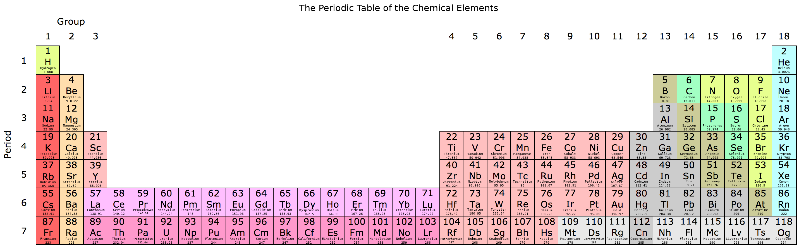

# Biology Basics

The purpose of this site is to explore biology and the things that make up biology. Feel free to [suggest corrections or additions][issues]. You may follow updates to this page using [an RSS feed](https://github.com/freeradical13/freeradical13.github.io/commits/master/index.md.atom).

# Big History

The [universe][] is at least 13.7 billion years old and more than 100 billion [light years][] in [diameter][].

We live on [Earth][] which is part of a [solar system][] with a [star][] called the [Sun][]. Earth and its star formed about 4.5 billion years ago. Earth's solar system is part of the [Milky Way galaxy][], which is at least 12 billion years old, contains over 100 billion stars and 100 billion [planets][], and is over 100,000 light years in diameter (or about 0.0001% of the size of the universe).

There are over 100 billion [galaxies][] in the universe.

# Basics

1. This page assumes basic knowledge of [math][], [algebra][], [geometry][], and [scientific notation][].
1. A [unit of measurement][] followed by a letter in parentheses - for example, "mass (m)" - defines a letter (in this example, "m") which represents that measurement in equations. For example, in the equation <code>F=m×a</code>, mass is represented by the letter "m".

# Matter

The universe is made of [matter][] which is something that has [mass][] (m) and takes up a position in [space][].

Examples of matter are [protons][], [neutrons][], and [electrons][]. Protons and neutrons each have a mass of about 1.6×10−27 [kilograms][] (kg), whereas electrons have a much smaller mass of about 9.1×10−31 kg. [Protons][proton radius] and [neutrons][neutron radius] each have a [radius][] of about 0.8×10−15 [meters][] (m), whereas electrons have a radius of less than [1.0×10−22][electron radius] m.

An [object][] is a collection of matter. An object has an [inertia][], meaning:

1. An object at rest will stay at rest unless a [force][] (F) is applied to push or pull it, and
2. An object in motion will stay in motion unless a force is applied to push or pull it.

The [speed][] of an object is a description of its movement which is the [rate][] at which its position in space changes over a [distance][] over a period of [time][] ([e.g.][for example] moving at 13 meters per [second][] (s), or 13 m/s).

The [velocity][] (v) of an object is a description of both its speed and its [direction][] in space (e.g. moving at 13 m/s _down_).

The [acceleration][] (a) of an object is the rate at which its velocity changes over a period of time (e.g. accelerating at 13 m/s over 1 second down, or 13 m/s2 down).

The [momentum][] (p) of an object, or its "quantity of motion", is its mass multiplied by its velocity (<code>p=m×v</code>).

If the mass of an object is constant, the force acting on it is the [rate of change][derivative] of its momentum over time (<code>F=dp/dt</code>); or, substituting momentum for acceleration and simplifying, its mass multiplied by its acceleration (<code>F=m×a</code>). The unit of force is the [newton][] (N).

When objects touch each other, the [perpendicular][] force their surfaces apply is called the [normal force][] (Fn), and any [parallel][] forces are called [frictional forces][] (Ff).

When an object A exerts a force on another object B, then object B exerts an [equal and opposite force][force third law] on object A.

# Electric Charge

[Electric charge][] is the property of some forms of matter to create an [electromagnetic field][] which applies a positive or negative force on other electrically charged matter, proportional to the distance between them. The magnitude of the force (named the electrostatic force) is calculated with [Coulomb's law][] (<code>F=ke×((q1×q2)/r2)</code>) which is [Coulomb's constant][] (ke) multiplied by the magnitudes of the two charges involved (q1 and q2) and divided by the square of the distance between the two objects (r2). This equation means that positive charges repel other positive charges, negative charges repel other negative charges, and positive charges attract negative charges (and vice versa).

Examples of electrically charged matter are protons, which are positively charged, and electrons, which are negatively charged. Protons and electrons have the same magnitude [elementary electric charge][], denoted 1e and -1e, respectively. Neutrons have no charge (electrically neutral).

An electromagnetic field creates [electromagnetic radiation][] which is a [wave][] of its force traveling (radiating) through space. A wave represents something that repeats over time at a [frequency][] which is how often it repeats (a cycle) per unit time (e.g. one cycle per second). If the unit of time is one second, the unit of frequency is [Hertz][] (Hz). [Wavelength][] is the distance the wave covers over one cycle. The maximum speed of electromagntic radiation occurs in space without matter (a [vacuum][]) at the [speed of light][] (c), or approximately 3×108 m/s. The speed of light is the maximum speed that any matter may move.

# Energy

[Energy][] (E) is the amount of work one object performs on, or transfers to, another object. Energy is often measured in [joules][] (J). One joule may be defined as <code>J=N×m</code> or a force of one Newton acting on an object in the direction of its motion for one meter.

Energy is either [kinetic energy][] if an object is in motion (in most simple cases expressed as <code>(m×v2)/2</code>); or, [potential energy][], which may be thought of as stored energy.

Energy may [neither be created nor destroyed][conservation of energy], but only transformed. Mass may be converted to energy and vice versa through the [mass-energy equivalence][] equation (<code>E=m×c2</code>).

# Pressure and Temperature

[Pressure][] (P) is the normal force per unit area (A) applied to an object or <code>P=Fn/A</code>, often measured in [Pascals][] (Pa) (in N/m2). An object under pressure has potential energy.

[Atmospheric pressure][] is the pressure of a planet's atmosphere (e.g. the pressure of [air][]) on an object. The mass of air in the Earth's atmosphere [decreases expontentially with altitude][earth air pressure] so the atmospheric pressure reduces expontentially as an object rises above [sea level][].

Another unit of pressure is the [atmosphere][atm] (atm) which is the pressure on Earth at sea level and it's equivalent to 101,325 Pa.

[Temperature][] is a measure of the average kinetic energy of a set of objects. [Absolute zero][] is the coldest state at which an object has minimal movement; however, practically, it may be assumed that all objects have some movement (or [vibration][]) and thus some non-zero temperature.

Temperature or heat is either measured in [degrees][] (°) of change on the scale of [Celsius][] (°C) or [Fahrenheit][] (°F), or in absolute terms on the scale of [Kelvin][] (K).

Roughly, the scale of celsius is defined with 0°C being when water freezes at 1 atm, 100°C when water boils at 1 atm, and absolute zero is -273.15°C. The scale of fahrenheit is defined with 32°F being when water freezes at 1 atm, 212°F when water boils at 1 atm, and absolute zero is -459.67°F. Originally, the Kelvin scale was defined relative to Celsius, but is now defined as pressure invariant, with 0 as absolute zero, and 273.16K when water reaches its [triple point][]. Kelvin was designed so that an increase of one Kelvin is equal to an increase of 1°C.

The [lowest recorded surface temperature][temperature comparison] on Earth is <code>184K / -89.2°C / -128.6°F</code>, the highest <code>331K / 58°C / 136.4°F</code>, and the average <code>288K / 15°C / 59°F</code>.

If two objects touch with a path permeable to heat, then, all else being equal, the hotter object heats the cooler object through [thermal conduction][] (and [thermal convection][] in the case of fluids and gases) until they (or at least their touching surfaces) reach [thermal equilibrium][].

All matter continuously emits some of its energy as heat through [thermal radiation][].

# Atoms

[Atoms][] are made of some number of [nucleons][] - at least one proton and zero or more neutrons - in the atom's [nucleus][], and some number of [electrons][] orbiting the nucleus in [shells][electron shells]. Shells are subdivided into [subshells][electron subshells]. Subshells are subdivided into [orbitals][].

If an atom has an equal number of protons and electrons, then it is neutral. If an atom has an unequal number of protons and electrons, then it is [ionized][ion] (if more protons - positively charged - then it's called a cation, and if more electrons - negatively charged - an anion).

The number of nucleons is considered the [atomic mass number][atomic mass] (an atom's electrons' masses generally aren't considered because they're so much relatively lighter than the nucleons' masses).

The number of neutrons defines the element's [isotope][] which is represented as the element name followed by its atomic mass number (e.g. carbon-14), so the number of neutrons may be deduced from the isotope name by subtracting the number of protons.

There are four main [states of matter][]: solid, liquid, gas, and plasma.

The number of protons is considered the [atomic number][] and categorizes the atom in a class called a [chemical element][] (e.g. carbon is the chemical element class for any atom which has 6 protons). Chemical elements and their reactions are the basis of chemistry.

# Chemistry

## The Periodic Table of Elements

The [periodic table][] is a way to organize and understand the chemical elements based on observed patterns. The elements are ordered by atomic number (number of protons) from left to right, and starting again at the left when going down.

[][periodic table image]

<a href="https://en.wikipedia.org/wiki/File:32-column_periodic_table-a.png">Based on an image by Sandbh</a>

The main reason for describing elements in such a way has to do with [electron configuration][] patterns and the behaviors they may cause (described later).

Rows are called periods and describe a new electron shell which accumulates on top of any previous periods' shells. This outermost shell is known as the [valence shell][] which generally contains the [valence electrons][] that may be reactive (ionized elements complicate this picture since they contain one less electron and effectively drop down a shell - for example, the Lithium cation - but the table is a conceptual starting point from neutral atoms).

Columns are called groups and generally group by the number of valence electrons, and thus generally group by similar behavior.

Each electron shell in an atom has a maximum number of electrons (<code>2×Shell_Number2</code>) before the next shell starts. Each shell has a distinct [energy level][] and is broken down into subshells which have a maximum number of electrons before the next subshell starts. Each subshell is broken down into orbitals of [up to 2 electrons][orbitalmax2e] each. Electron configurations are represented by the accumulation of subshells up to the total number of electrons, with each subshell described by the shell number, followed by the subshell name, followed by the number of electrons in that subshell in a superscript. The subshell names are:

* s: For groups 1 and 2 (or group 18 for Helium) only, at most 2 electrons.
* p: Starting at period 2, for groups 13-18 only, at most 6 electrons.
* d: Starting at period 4, for groups 3-12 only, at most 10 electrons.
* f: Starting at period 6, in between groups 3 and 4 only, at most 14 electrons.
* [...]

Examples of electron configurations for the first 11 neutral elements:

<pre>
Hydrogen (1):  1s1
Helium (2):    1s2
Lithium (3):   1s2 2s1
Beryllium (4): 1s2 2s2
Boron (5):     1s2 2s2 2p1
Carbon (6):    1s2 2s2 2p2
Nitrogen (7):  1s2 2s2 2p3
Oxygen (8):    1s2 2s2 2p4
Florine (9):   1s2 2s2 2p5
Neon (10):     1s2 2s2 2p6
Sodium (11):   1s2 2s2 2p6 3s1
[...]
</pre>

Instead of writing the full details of long electron configurations, a common practice is to start with the previous group 18 element in [brackets] followed by the rest of the element's electron configuration. For example, Sodium (element #11) may be written as [Ne] 3s1.

When d and f orbitals are filled, they backfill the previous shell. For example, Scandium's (element #21) electron configuration is [Ar] 4s2 3d1.

The valence electrons that tend to cause an atom to chemically react are those electrons with the highest energies (the farthest distances from the nucleus) and are usually those in the valence shell. The exceptions are elements with d or f orbitals because even though those backfill the previous, non-valence shell, they may have higher energies than the s orbital electrons of the valence shell; however, these energies decrease moving right on a period, so the number of these valence electrons is limited.

Generally, atoms tend to be chemically reactive when their valence electrons do not complete their valence shell and thus the atom is unstable. For example, Hydrogen is unstable because it wants one more electron to complete its shell. All elements above period 1 generally want 8 electrons in their valance shell and this heuristic is called the [octet rule][]. Atoms tend to gain, shed, or share pairs of electrons as needed to reach a full and stable set of valence electrons. This is one of the most important aspects of chemistry and means that groups have generally similar behaviors since they're generally grouped by the number of valence electrons. There are 18 numbered and 6 named groups for convenience:

* Group #1: [Alkali metals][] - Highly reactive because they want to lose an electron to drop to the previous period's full set of valence electrons. Hydrogen is more complicated - it doesn't want to lose an electron since that will leave an empty valence shell, but it tends to want another electron to complete its shell.
* Group #2: [Alkaline earth metals][] - Somewhat reactive because they want to lose two electrons to drop to the previous period's full set of valence electrons.
* Group #15: [Pnictogens][]
* Group #16: [Chalcogens][] - Somewhat reactive because they want to gain two electrons or share pairs of electrons to fill their set of valance electrons.
* Group #17: [Halogens][] - Highly reactive because they want to gain an electron or share a pair of electrons to fill their set of of valence electrons.
* Group #18: [Noble gases][] - Generally not chemically reactive ([inert][]) because the set of valence electrons is full.

The size of an atom increases from top to bottom as electron shells are added; however, moving left to right, the size of an atom decreases as the additional protons draw in the electrons.

[Ionization energy][] (or cationization energy) is the amount of energy needed to remove an electron from an element (and form a cation). Energy is required to remove the electron because the electron is attracted to its proton(s). Following from the octet rule, ionization energy is lowest on the left of the table because those elements want to lose electron(s) to achieve a full set of valence electrons, and [ionization energy generally increases from left to right][ionization energy increases right] as additional protons add more pull to the electrons. Ionization energy decreases from top to bottom because valence electrons are farther from the protons (to which they're attracted) and thus the electrons are easier to peel off.

[Electron affinity][] (or anionization energy) is either:

1. The amount of energy released when an electron is added to an incomplete set of valence electrons. Energy is released because any time an electron drops into a new orbital, it releases electromagnetic radiation energy in the form of a photon. Or,
1. The amount of energy spent adding an electron to create a new subshell or adding an electron to a subshell which only has a single electron in each of its orbital pairs (e.g. Nitrogen). Energy is needed to overcome the last subshell's stability.

Generally, electron affinity increases from left to right (except for those with stable last subshells) because right-most elements want additional electrons to achieve stability.

Most elements are [metals][] (although only two are named metal groups): they are on the left side of the periodic table (excepting Hydrogen), have low ionization energies, low electron affinity, are highly electrically conductive, malleable, and generally solid at standard temperature.

[Nonmetals][] are the opposite of metals: they are on the right side of the table (with the exception of Hydrogen), have high ionization energies, high electron affinities, are not very electrically conductive, and they are often gases (e.g. Hydrogen, Helium, etc.), although some are brittle solids (e.g. Carbon).

There are a handful of [Metalloids][] which have properties of both metals and nonmetals and run down a diagonal in the p-block (e.g. Boron, Silicon, etc.).

# Big History (Continued)

After the [Big Bang][], the universe was mostly made of hydrogen, helium, and lithium (the first three elements), some of which combined into plasma stars held together by [gravity][]. At high enough temperatures inside stars, hydrogen atoms undergo [nuclear fusion][] where nuclei (and their protons and neutrons) combine to produce [helium][stellar nucleosynthesis]. As the hydrogen is used up to create helium, the star's temperature rises and allows for the fusion of [helium into carbon and oxygen][triple alpha process] and some neon and heavier elements. As the star temperature continues to increase, nuclear fusion produces elements [up to iron][heavy elements]. The remaining elements in the universe were produced by [certain stars' s-processes][s process] and [stars' explosions in a supernova or collapses into a black hole or neutron star][r process].

# Chemistry (Continued)

A [molecule][] is a set of two or more atoms held together by a [chemical bond][] because the molecule is more [stable][molecule stability] with that bond. Types of bonds:

1. An [ionic bond][] occurs when one atom transfers electron(s) to another, creating a cation and anion, which may then cause attraction of the oppositely charged ions.
1. A [covalent bond][] occurs when atoms share one or more pairs of electrons in their valence shells.

[Electronegativity][] is the tendency of an atom to attract electrons to its valence shell. It follows from the octet rule that atoms increase in electronegativity from left to right. Electronegativity decreases from top to bottom because the valence shell is farther away from the positively charged nucleus. Electropositivity is the opposite of electronegativity.

In summary, although with various exceptions, the broad trends of atomic size, ionization energy, electron affinity and metallic character may be visualized as:

[][periodic trends image]

## Organic Chemistry

An [organic compound][] is a molecule that has carbon.

# Biology

Biology is the [study of life][biology history]. The definition of life is [controversial][definition of life].

# History of Life

Oceans formed on Earth about [4.4 billion years ago][history of oceans].

# Cells

A [cell][] is a set of atoms encapsulated in a [membrane][], mostly filled with water. For example, a medium-sized E. coli cell has about [35 billion atoms][atoms in e coli] and a human body has about [1027 atoms][atoms in human body].

An [organism][] is a set of one or more cells.

# Feedback

[Ask a Question or Contribute][issues]

# Methodology/Meta

* Every time I "context switch" into this subject, I re-read the entire page before re-starting. Along with the process of writing itself, this seems to maximize retention.

[absolute zero]: https://en.wikipedia.org/wiki/Absolute_zero
[acceleration]: https://en.wikipedia.org/wiki/Acceleration
[air]: https://en.wikipedia.org/wiki/Atmosphere_of_Earth
[algebra]: https://www.youtube.com/watch?v=kpCJyQ2usJ4&list=PL7AF1C14AF1B05894
[alkali metals]: https://en.wikipedia.org/wiki/Alkali_metal
[alkaline earth metals]: https://en.wikipedia.org/wiki/Alkaline_earth_metal
[altitude]: https://en.wikipedia.org/wiki/Altitude
[atm]: https://en.wikipedia.org/wiki/Atmosphere_(unit)
[atmospheric pressure]: https://en.wikipedia.org/wiki/Atmospheric_pressure
[atomic mass]: https://en.wikipedia.org/wiki/Atomic_mass
[atomic number]: https://en.wikipedia.org/wiki/Atomic_number
[atoms]: https://en.wikipedia.org/wiki/Atoms
[atoms in e coli]: http://book.bionumbers.org/what-is-the-elemental-composition-of-a-cell/
[atoms in human body]: http://book.bionumbers.org/what-is-the-elemental-composition-of-a-cell/
[big bang]: https://en.wikipedia.org/wiki/Big_Bang
[biology history]: https://en.wikipedia.org/wiki/Biology#History
[biology numbers]: http://bionumbers.hms.harvard.edu/
[cell]: https://en.wikipedia.org/wiki/Cell_(biology)
[celsius]: https://en.wikipedia.org/wiki/Celsius
[chalcogens]: https://en.wikipedia.org/wiki/Chalcogen
[chemical bond]: https://en.wikipedia.org/wiki/Chemical_bond
[chemical element]: https://en.wikipedia.org/wiki/Chemical_element
[conservation of energy]: https://en.wikipedia.org/wiki/Conservation_of_energy
[coulomb's constant]: https://en.wikipedia.org/wiki/Coulomb%27s_constant
[coulomb's law]: https://en.wikipedia.org/wiki/Coulomb%27s_law
[covalent bond]: https://en.wikipedia.org/wiki/Covalent_bond
[definition of life]: https://en.wikipedia.org/wiki/Life
[degrees]: https://en.wikipedia.org/wiki/Degree_(temperature)
[derivative]: https://en.wikipedia.org/wiki/Leibniz%27s_notation
[diameter]: https://en.wikipedia.org/wiki/Diameter
[direction]: https://en.wikipedia.org/wiki/Relative_direction
[distance]: https://en.wikipedia.org/wiki/Distance
[earth]: https://en.wikipedia.org/wiki/Earth
[earth air pressure]: https://en.wikipedia.org/wiki/Atmosphere_of_Earth#Pressure_and_thickness
[electric charge]: https://en.wikipedia.org/wiki/Electric_charge
[electromagnetic field]: https://en.wikipedia.org/wiki/Electromagnetic_field
[electromagnetic radiation]: https://en.wikipedia.org/wiki/Electromagnetic_radiation
[electron affinity]: https://www.khanacademy.org/v/electron-affinity
[electron configuration]: https://en.wikipedia.org/wiki/Electron_configuration
[electron radius]: https://en.wikipedia.org/wiki/Electron#Fundamental_properties
[electron shells]: https://en.wikipedia.org/wiki/Electron_configuration
[electron subshells]: https://en.wikipedia.org/wiki/Electron_shell#Subshells
[electronegativity]: https://en.wikipedia.org/wiki/Electronegativity
[electrons]: https://en.wikipedia.org/wiki/Electron
[electrovalent bond]: https://en.wikipedia.org/wiki/Ionic_bonding
[elementary electric charge]: https://en.wikipedia.org/wiki/Elementary_charge
[elevation]: https://en.wikipedia.org/wiki/Elevation
[energy]: https://en.wikipedia.org/wiki/Energy
[energy level]: https://en.wikipedia.org/wiki/Energy_level
[entropy]: https://en.wikipedia.org/wiki/Introduction_to_entropy
[fahrenheit]: https://en.wikipedia.org/wiki/Fahrenheit
[for example]: https://en.wikipedia.org/wiki/List_of_Latin_phrases_(E)#exempli_gratia
[force]: https://en.wikipedia.org/wiki/Force
[force third law]: https://en.wikipedia.org/wiki/Force#Third_law
[frequency]: https://en.wikipedia.org/wiki/Frequency
[frictional forces]: https://en.wikipedia.org/wiki/Friction
[galaxies]: https://en.wikipedia.org/wiki/Galaxy
[geometry]: https://www.youtube.com/watch?v=WqzK3UAXaHs&list=PL26812DF9846578C3
[gravity]: https://en.wikipedia.org/wiki/Gravity
[halogens]: https://en.wikipedia.org/wiki/Halogen
[heavy elements]: https://en.wikipedia.org/wiki/Triple-alpha_process#Nucleosynthesis_of_heavy_elements
[hertz]: https://en.wikipedia.org/wiki/Hertz
[history of oceans]: https://en.wikipedia.org/wiki/Origin_of_water_on_Earth#Water_in_the_development_of_Earth
[id est]: https://en.wikipedia.org/wiki/List_of_Latin_phrases_(I)#id_est
[inert]: https://en.wikipedia.org/wiki/Chemically_inert
[inertia]: https://en.wikipedia.org/wiki/Inertia
[inversely proportional]: https://en.wikipedia.org/wiki/Proportionality_(mathematics)#Inverse_proportionality
[ion]: https://en.wikipedia.org/wiki/Ion
[ionic bond]: https://en.wikipedia.org/wiki/Ionic_bond
[ionization energy]: https://www.khanacademy.org/v/ionization-energy-trends
[ionization energy increases right]: https://www.khanacademy.org/v/period-trend-for-ionization-energy
[isotope]: https://en.wikipedia.org/wiki/Isotope
[issues]: https://github.com/freeradical13/freeradical13.github.io/issues
[joules]: https://en.wikipedia.org/wiki/Joule
[kelvin]: https://en.wikipedia.org/wiki/Kelvin
[kilograms]: https://en.wikipedia.org/wiki/Kilogram
[kinetic energy]: https://en.wikipedia.org/wiki/Kinetic_energy
[light]: https://en.wikipedia.org/wiki/Light
[light years]: https://en.wikipedia.org/wiki/Light-year
[magnitude]: https://en.wikipedia.org/wiki/Relative_direction
[mass]: https://en.wikipedia.org/wiki/Mass
[mass-energy equivalence]: https://en.wikipedia.org/wiki/Mass%E2%80%93energy_equivalence
[math]: https://www.youtube.com/watch?v=jxA8MffVmPs&list=PL50D1D09ABE9CE271
[matter]: https://en.wikipedia.org/wiki/Matter
[membrane]: https://en.wikipedia.org/wiki/Cell_membrane
[metals]: https://en.wikipedia.org/wiki/Metal
[metalloids]: https://en.wikipedia.org/wiki/Metalloid
[meters]: https://en.wikipedia.org/wiki/Metre
[molecule]: https://en.wikipedia.org/wiki/Molecule
[molecule stability]: https://en.wikipedia.org/wiki/Energy_level#Molecules
[momentum]: https://en.wikipedia.org/wiki/Momentum
[milky way galaxy]: https://en.wikipedia.org/wiki/Milky_Way
[neutron radius]: https://en.wikipedia.org/wiki/Neutron#Description
[neutrons]: https://en.wikipedia.org/wiki/Neutron
[newton]: https://en.wikipedia.org/wiki/Newton_(unit)
[noble gases]: https://en.wikipedia.org/wiki/Noble_gas
[nonmetals]: https://en.wikipedia.org/wiki/Nonmetal
[normal force]: https://en.wikipedia.org/wiki/Normal_force
[nuclear fusion]: https://en.wikipedia.org/wiki/Thermonuclear_fusion
[nucleons]: https://en.wikipedia.org/wiki/Nucleon
[nucleus]: https://en.wikipedia.org/wiki/Atomic_nucleus
[object]: https://en.wikipedia.org/wiki/Physical_body
[octet rule]: https://en.wikipedia.org/wiki/Octet_rule
[orbitalmax2e]: https://en.wikipedia.org/wiki/Electron_configuration#Shells_and_subshells
[orbitals]: https://en.wikipedia.org/wiki/Atomic_orbital
[organic compound]: https://en.wikipedia.org/wiki/Organic_compound
[organism]: https://en.wikipedia.org/wiki/Organism
[parallel]: https://en.wikipedia.org/wiki/Parallel_(geometry)
[pascals]: https://en.wikipedia.org/wiki/Parallel_(geometry)
[periodic table]: https://en.wikipedia.org/wiki/Periodic_table
[periodic table image]: images/32-column_periodic_table-a_modified.png
[periodic trends image]: https://commons.wikimedia.org/wiki/File:Periodic_trends.png
[perpendicular]: https://en.wikipedia.org/wiki/Perpendicular
[planets]: https://en.wikipedia.org/wiki/Planet
[pnictogens]: https://en.wikipedia.org/wiki/Pnictogen
[potential energy]: https://en.wikipedia.org/wiki/Potential_energy
[pressure]: https://en.wikipedia.org/wiki/Pressure
[proton radius]: https://en.wikipedia.org/wiki/Proton_radius_puzzle
[protons]: https://en.wikipedia.org/wiki/Proton
[r process]: https://en.wikipedia.org/wiki/R-process
[radius]: https://en.wikipedia.org/wiki/Radius
[rate]: https://en.wikipedia.org/wiki/Rate_(mathematics)
[s process]: https://en.wikipedia.org/wiki/S-process
[scientific notation]: https://www.youtube.com/watch?v=trdbaV4TaAo
[sea level]: https://en.wikipedia.org/wiki/Sea_level
[second]: https://en.wikipedia.org/wiki/Second
[solar system]: https://en.wikipedia.org/wiki/Solar_System
[space]: https://en.wikipedia.org/wiki/Space
[speed]: https://en.wikipedia.org/wiki/Speed
[speed of light]: https://en.wikipedia.org/wiki/Speed_of_light
[star]: https://en.wikipedia.org/wiki/Star
[states of matter]: https://en.wikipedia.org/wiki/State_of_matter
[stellar nucleosynthesis]: https://en.wikipedia.org/wiki/Stellar_nucleosynthesis
[sun]: https://en.wikipedia.org/wiki/Sun
[temperature]: https://en.wikipedia.org/wiki/Temperature
[temperature comparison]: https://en.wikipedia.org/wiki/Conversion_of_units_of_temperature
[thermal conduction]: https://en.wikipedia.org/wiki/Thermal_conduction
[thermal convection]: https://en.wikipedia.org/wiki/Convective_heat_transfer
[thermal equilibrium]: https://en.wikipedia.org/wiki/Thermal_equilibrium
[thermal radiation]: https://en.wikipedia.org/wiki/Thermal_radiation
[time]: https://en.wikipedia.org/wiki/Time
[triple alpha process]: https://en.wikipedia.org/wiki/Triple-alpha_process
[triple point]: https://en.wikipedia.org/wiki/Triple_point
[unit of measurement]: https://en.wikipedia.org/wiki/Units_of_measurement
[universe]: https://en.wikipedia.org/wiki/Universe
[vacuum]: https://en.wikipedia.org/wiki/Vacuum
[valence electrons]: https://en.wikipedia.org/wiki/Valence_electrons
[valence shell]: https://en.wikipedia.org/wiki/Electron_shell#Valence_shell
[velocity]: https://en.wikipedia.org/wiki/Velocity
[vibration]: https://en.wikipedia.org/wiki/Vibration
[wavelength]: https://en.wikipedia.org/wiki/Wavelength
[wave]: https://en.wikipedia.org/wiki/Wave
