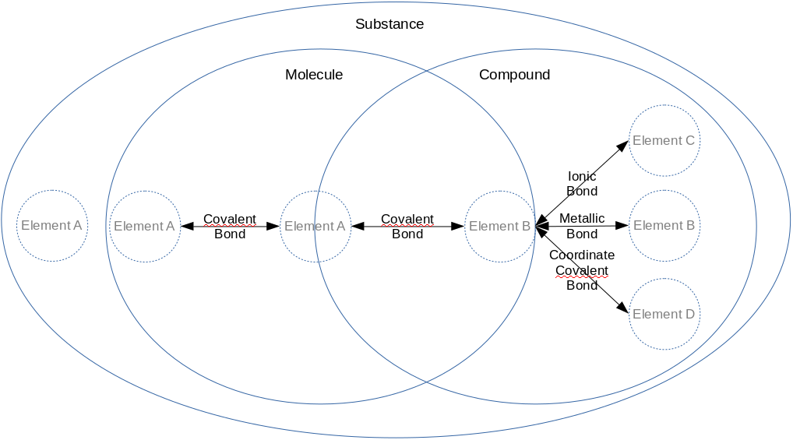
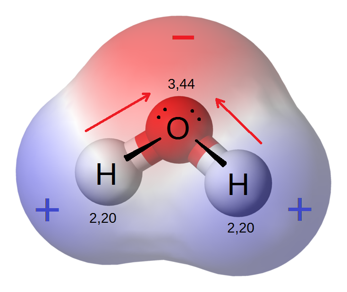

# Biology Basics

The purpose of this site is to explore biology and the things that make up biology. Feel free to [suggest corrections or additions][issues]. You may follow updates to this page using [this RSS feed](https://github.com/freeradical13/freeradical13.github.io/commits/master/index.md.atom) and [some RSS reader](https://en.wikipedia.org/wiki/Comparison_of_feed_aggregators#Operating_system_support).

# Big History

The [universe][] is at least 13.7 billion years old and more than 100 billion [light years][] in [diameter][].

We live on [Earth][] which is part of a [solar system][] with a [star][] called the [Sun][]. Earth and its star coalesced about [4.5 billion years ago][earth age]. Earth's solar system is part of the [Milky Way galaxy][], which is at least 12 billion years old, contains over 100 billion stars and 100 billion [planets][], and is over 100,000 light years in diameter (or about 0.0001% of the size of the universe).

There are over 100 billion [galaxies][] in the universe.

# Basics

This page assumes basic knowledge of [math][], [algebra][], [geometry][], and [scientific notation][].

# Matter

The universe is made of [matter][] which is something that has [mass][] (m) and takes up a position in [space][].

Examples of matter are [protons][], [neutrons][], and [electrons][]. Protons and neutrons each have a mass of about 1.6×10−27 [kilograms][] (kg), whereas electrons have a much smaller mass of about 9.1×10−31 kg. [Protons][proton radius] and [neutrons][neutron radius] each have a [radius][] of about 0.8×10−15 [meters][] (m), whereas electrons have a radius of less than [1.0×10−22][electron radius] m.

An [object][] (or [entity][]) is a collection of matter. An object has an [inertia][], meaning:

1. An object at rest will stay at rest unless a [force][] (F) is applied to push or pull it, and
2. An object in motion will stay in motion unless a force is applied to push or pull it.

The [speed][] of an object is a description of its movement and is the [rate][] at which its position in space changes over a [distance][] over a period of [time][] ([e.g.][for example] moving at 13 meters per [second][] (s), or 13 m/s).

The [velocity][] (v) of an object is a description of both its speed and its [direction][] in space (e.g. moving at 13 m/s _down_).

The [acceleration][] (a) of an object is the rate at which its velocity changes over a period of time (e.g. accelerating at 13 m/s over 1 second down, or 13 m/s2 down).

The [momentum][] (p) of an object, or its "quantity of motion", is its mass multiplied by its velocity (<code>p=m×v</code>).

If the mass of an object is constant, the force acting on it is the [rate of change][derivative] of its momentum over time (<code>F=dp/dt</code>); or, substituting momentum for acceleration and simplifying, its mass multiplied by its acceleration (<code>F=m×a</code>). The unit of force is the [newton][] (N).

When objects touch each other, the [perpendicular][] force their surfaces apply is called the [normal force][] (Fn), and any [parallel][] forces are called [frictional forces][] (Ff).

When an object A exerts a force on another object B, then object B exerts an [equal and opposite force][force third law] on object A.

# Electric Charge

[Electric charge][] is the property of some forms of matter to create an [electromagnetic field][] which applies a positive or negative force on other electrically charged matter, proportional to the distance between them. The magnitude of this force (named the electrostatic force) is calculated with [Coulomb's law][] (<code>F=ke×((q1×q2)/r2)</code>) which is [Coulomb's constant][] (ke) multiplied by the magnitudes of the two charges involved (q1 and q2) and divided by the square of the distance between the two objects (r2). This equation means that positive charges repel other positive charges, negative charges repel other negative charges, and positive charges attract negative charges (and vice versa). The unit of electric charge is the [Coulomb][] (C).

Examples of electrically charged matter are protons, which are positively charged, and electrons, which are negatively charged. Protons and electrons have the same magnitude [elementary electric charge][], denoted 1e and -1e, respectively. Neutrons have no charge (electrically neutral).

[Amperes][] (amps or A) are a measure of the flow of a certain number of elementary electric charges across a boundary in one second: <code>1 A = 1 C / 1 s</code>.

An electromagnetic field creates [electromagnetic radiation][] which is a [wave][] of its force traveling (radiating) through space. A wave represents something that repeats over time at a [frequency][] which is how often it repeats a cycle per unit time (e.g. one cycle per second). If the unit of time is one second, the unit of frequency is [Hertz][] (Hz). [Wavelength][] is the distance a wave covers over one cycle.

The [force carrier][] for electromagnetic radiation is a [photon][]. Photons are considered [particles][] (which may also refer to objects) even though photons are [massless][]. In a [vacuum][] (space without matter), photons travel at the [maximum speed of light][] (c), or approximately 3×108 m/s. [Light][] is simply electromagnetic radiation; although, colloquially, light usually refers to [visible light][] which is the subset of light that humans see (~390 to ~700nm wavelengths), where white is a combination of all colors and black is the lack of all colors. [Fluorescent][] substances absorb ultraviolet radiation (~10nm to ~400nm wavelengths) and emit visible light.

# Energy

[Energy][] (E) is the amount of work one object performs on, or transfers to, another object. Energy is often measured in [Joules][] (J). One joule may be defined as <code>J=N×m</code> or a force of one Newton acting on an object in the direction of its motion for one meter.

Energy is either [kinetic energy][] if an object is in motion (in most simple cases expressed as <code>(m×v2)/2</code>); or, [potential energy][], which may be thought of as stored energy.

Energy may [neither be created nor destroyed][conservation of energy], but only transformed. Mass may be converted to energy and vice versa through the [mass-energy equivalence][] equation (<code>E=m×c2</code>).

# Voltage

[Electric potential][] is the amount of energy needed to move a unit of positive charge in an electromagnetic field to another point without producing acceleration.

[Voltage][] (V) is the difference in electric potential between two points (i.e. the electric potential energy). Voltage is measured in Volts which are calculated using the potential energy divided by the charge, or <code>V = (N×m)/C</code>.

# Pressure and Temperature

[Pressure][] (P) is the normal force per unit area (A) applied to an object or <code>P=Fn/A</code>, often measured in [Pascals][] (Pa) (in N/m2). An object under pressure has potential energy.

[Atmospheric pressure][] is the pressure of a planet's atmosphere (e.g. the pressure of [air][]) on an object. The mass of air in the Earth's atmosphere [decreases expontentially with altitude][earth air pressure] so the atmospheric pressure decreases expontentially as an object rises above [sea level][].

Another unit of pressure is the [atmosphere][atm] (atm) which is the pressure on Earth at sea level and it's equivalent to 101,325 Pa.

[Heat][] (H) is a measure of the total quantity of kinetic energy. [Temperature][] is a measure of the average kinetic energy of a set of objects. [Absolute zero][] is the coldest state at which an object has minimal movement; however, practically, it may be assumed that all objects have some movement (or [vibration][]) and thus some non-zero temperature.

Temperature or heat is either measured in [degrees][] (°) of change on the scale of [Celsius][] (°C) or [Fahrenheit][] (°F), or in absolute terms on the scale of [Kelvin][] (K).

Roughly, the scale of celsius is defined with 0°C being when pure water freezes at 1 atm, 100°C when pure water boils at 1 atm, and absolute zero is -273.15°C. The scale of fahrenheit is defined with 32°F being when water freezes at 1 atm, 212°F when water boils at 1 atm, and absolute zero is -459.67°F. Originally, the Kelvin scale was defined relative to Celsius, but is now defined as pressure invariant, with 0 as absolute zero, and 273.16K when water reaches its [triple point][]. Kelvin was designed so that an increase of one Kelvin is equal to an increase of 1°C.

The [lowest recorded surface temperature][temperature comparison] on Earth is <code>184K / -89.2°C / -128.6°F</code>, the highest <code>331K / 58°C / 136.4°F</code>, and the average <code>288K / 15°C / 59°F</code>.

The [specific heat][] is the amount of heat that must be absorbed or lost for 1g to change its temperature by 1°C.

All matter above absolute zero temperature continuously emits some of its kinetic energy as photons of electromagnetic radiation called [thermal radiation][] or heat. The temperature determines the [emission spectrum][] of wavelengths of the electromagnetic radiation. Most matter may also absorb some of any incoming electromagnetic radiation.

If two objects touch with a path permeable to heat, then, all else being equal, the hotter object heats the cooler object through [thermal conduction][] (and [thermal convection][] in the case of fluids and gases) until they (or at least their touching surfaces) reach [thermal equilibrium][].

# Thermodynamics

There are four laws of thermodynamics (starting with the zeroth law):

<ol start="0">
  <li>If two systems A and B are in thermal equilibrium with a third system C, then A and B are in thermal equilibrium.</li>
  <li>Energy may be neither created nor destroyed, but only transformed.</li>
  <li>Energy transformation in a closed system increases entropy.</li>
  <li>Entropy approaches 0 as the temperature of a closed system approaches 0 Kelvin.</li>
</ol>

[Entropy][] is a measure of disorder in a system.

# Atoms

[Atoms][] are made of at least one proton and zero or more neutrons in the atom's [nucleus][] (both protons and neutrons may be called [nucleons][]), and zero or more [electrons][] orbiting the nucleus in [electron shells][]. Electron shells are also called [energy levels][energy level] because the shell number represents the relative potential energy of electrons in that shell. As electrons are in shells farther from the nuclear proton(s), their potential energies increase because of the additional potential electrostatic force. Therefore, an electron moving to a shell closer to the nucleus must lose energy (e.g. heat) and an electron moving to a shell farther away must absorb energy (e.g. light). Shells are subdivided into [subshells][electron subshells], and subshells are subdivided into [orbitals][] (discussed later).

The number of nucleons is considered the [atomic mass number][] (A) since an atom's electrons' masses are so much relatively lighter than the nucleons' masses.

The number of protons is considered the [atomic number][] (Z) and categorizes the atom in a class called a [chemical element][] (e.g. Carbon is the chemical element class for any atom which has 6 protons; an atom is an instance of the chemical element). The atomic number of a chemical element is sometimes placed in a subscript to the left of the element symbol; for example, 6C, although this is redundant because the symbol C implies Z. Chemical elements and their reactions are the basis of chemistry.

The number of neutrons defines the element's [isotope][] which is represented as the element name followed by its atomic mass number (e.g. Carbon-14), so the number of neutrons may be deduced from the isotope name by subtracting the number of protons. An isotope may be abbreviated with the atomic mass number in a superscript to the left of the element symbol; for example, 14C for Carbon-14.

[Atomic mass][] (mA) is measured in [unified atomic mass units][] (u or amu), also known as daltons (Da) and 1u is approximately the mass of a nucleon. For various reasons, 1u is defined more strictly as <code>1/12th</code> of the mass of a Carbon-12 atom. [Relative atomic mass][] (Ar) is the [weighted average mass][weighted arithmetic mean] of a set of atoms. [Standard atomic weight][] (Ar,std) is Ar on Earth, reflecting the weighted average of isotope masses of an element on Earth.

If an atom has an equal number of protons and electrons, then it is electrically neutral. If an atom has an unequal number of protons and electrons, then it is [ionized][ion]. If an atom has more protons than electrons, then it's positively electrically charged, called a cation, and symbolized as E+ (where E is the element symbol, discussed below). If an atom has more electrons than protons, then it's negatively electrically charged, called an anion, and symbolized as E-. If the ion is more than one electron away from the neutral element, then the + or - is preceded by that number, e.g. E2+.

# Chemistry

## The Periodic Table of Elements

There are 118 known chemical elements, 92 of which have been observed naturally, the rest synthesized, and only four elements (Carbon, Oxygen, Hydrogen, and Nitrogen) make up about 96% of a human's mass, with another 21 required in small amounts (mostly Calcium, Phosphorus, Potassium, Sulfur, Sodium, Chlorine, and Magnesium) ([Campbell & Reece, 2002, pg. 27][campbell & reece, 2002]).

The [periodic table][] is a way to organize and understand the chemical elements based on observed patterns. The elements are ordered by atomic number Z from left to right, and starting again at the left when going down.

Within each square, the atomic number is at the top, followed by the element's symbol, followed by the element name, followed by its standard atomic weight (Ar,std):

[][periodic table image]

<a href="https://en.wikipedia.org/wiki/File:32-column_periodic_table-a.png">Based on an image by Sandbh</a>

The main reason for describing elements in such a way has to do with [electron configuration][] patterns and the behaviors they may cause (described later).

Rows are called periods and describe a new electron shell which accumulates on top of any previous periods' shells. This outermost shell is known as the [valence shell][] which generally contains the [valence electrons][] that may be reactive (some ionized elements complicate this picture since they contain one less electron and effectively drop down a shell - for example, the Lithium cation - but the table is a conceptual starting point from neutral atoms).

Columns are called groups and generally group by the number of valence electrons, and thus generally group by similar behavior.

Each electron shell in an atom has a maximum number of electrons (<code>2×ShellNumber2</code>) before the next shell starts. Each shell has a distinct energy level and is broken down into subshells which have a maximum number of electrons before the next subshell starts. Each subshell is broken down into orbitals of [up to 2 electrons][orbitalmax2e] each. Additional electrons fill empty orbitals in a sub-shell before pairing up with an electron in an existing orbital. A full orbital is called an [electron pair][]. A [lone pair][] of electrons is a filled valence orbital of two electrons that are not shared with another atom (sometimes noted with a <code>:</code>). Electron configurations are represented by the accumulation of subshells up to the total number of electrons, with each subshell described by the shell number, followed by the subshell name, followed by the number of electrons in that subshell in a superscript. The subshell names are:

* s: For groups 1 and 2 (or group 18 for Helium) only, at most 2 electrons.
* p: Starting at period 2, for groups 13-18 only, at most 6 electrons.
* d: Starting at period 4, for groups 3-12 only, at most 10 electrons.
* f: Starting at period 6, in between groups 3 and 4 only, at most 14 electrons.
* [...]

Examples of electron configurations for the first 11 neutral elements:

<pre>
Hydrogen (1):  1s1
Helium (2):    1s2
Lithium (3):   1s2 2s1
Beryllium (4): 1s2 2s2
Boron (5):     1s2 2s2 2p1
Carbon (6):    1s2 2s2 2p2
Nitrogen (7):  1s2 2s2 2p3
Oxygen (8):    1s2 2s2 2p4
Florine (9):   1s2 2s2 2p5
Neon (10):     1s2 2s2 2p6
Sodium (11):   1s2 2s2 2p6 3s1
[...]
</pre>

Instead of writing the full details of long electron configurations, a common practice is to start with the previous group 18 element in [brackets] followed by the rest of the element's electron configuration. For example, Sodium (element #11) may be written as [Ne] 3s1.

When d and f orbitals are filled, they backfill the previous shell. For example, Scandium's (element #21) electron configuration is [Ar] 4s2 3d1.

The electrons that tend to cause an atom to chemically react are those electrons with the highest energies (the farthest distances from the nucleus) and are usually those in the valence shell. The exceptions are elements with d or f orbitals because even though those backfill the previous, non-valence shell, they may have higher energies than the s orbital electrons of the valence shell; however, these energies decrease moving right on a period, so the number of these valence electrons is limited.

Generally, atoms tend to be chemically reactive when their valence electrons do not complete their valence shell and thus the atom is unstable (high energy). All elements above period 1 generally want 8 electrons in their valance shell and this heuristic is called the [octet rule][]. Atoms tend to gain, shed, or share pairs of electrons as needed to reach a full and stable (low energy) set of valence electrons. This is one of the most important aspects of chemistry and means that groups have generally similar behaviors since they're generally grouped by the number of valence electrons. There are 18 numbered and 6 named groups for convenience:

* Group #1: [Alkali metals][] - Highly reactive because they want to lose an electron to drop to the previous period's full set of valence electrons.
* Group #2: [Alkaline earth metals][] - Somewhat reactive because they want to lose two electrons to drop to the previous period's full set of valence electrons.
* Group #15: [Pnictogens][]
* Group #16: [Chalcogens][] - Somewhat reactive because they want to gain two electrons or share pairs of electrons to fill their set of valance electrons.
* Group #17: [Halogens][] - Highly reactive because they want to gain an electron or share a pair of electrons to fill their set of of valence electrons.
* Group #18: [Noble gases][] - Generally not chemically reactive ([inert][]) because the set of valence electrons is full.

The radius of an atom increases from top to bottom as electron shells are added; however, moving left to right, the radius of an atom decreases as the additional protons draw in the additional electrons.

[Ionization energy][] (or cationization energy) is the amount of energy needed to remove an electron from an element (and form a cation). Energy is required to remove the electron because the electron is attracted to its element's proton(s). Following from the octet rule, ionization energy is lowest on the left of the table because those elements want to lose electron(s) to achieve a full set of valence electrons, and [ionization energy generally increases from left to right][ionization energy increases right] as additional protons add more pull to the electrons. Ionization energy decreases from top to bottom because valence electrons are farther from the protons (to which they're attracted) and thus the electrons are easier to peel off.

[Electron affinity][] (or anionization energy) is either:

1. The amount of energy released when an electron is added to an incomplete set of valence electrons. Energy is released because any time an electron drops into a new orbital, it causes the release of electromagnetic radiation energy in the form of a photon. Or,
1. The amount of energy spent adding an electron to create a new subshell or adding an electron to a subshell which only has a single electron in each of its orbital pairs (e.g. Nitrogen). Energy is needed to overcome the last subshell's stability.

Generally, electron affinity increases from left to right (except for those with stable last subshells) because right-most elements want additional electrons to achieve stability.

[Electronegativity][] is the tendency of an atom to attract electrons to its valence shell (closely related to electron affinity). It follows from the octet rule that atoms increase in electronegativity from left to right. Electronegativity decreases from top to bottom because the valence shell is farther away from the positively charged nucleus and thus there's less pull to bring in additional electrons. Electropositivity is the opposite of electronegativity.

Most elements are [metals][] (although there are only two named metal groups): they are toward the left side of the periodic table (with the exception of Hydrogen), have low ionization energies, low electron affinity, are highly [electrically conductive][], [ductile][], and generally solid at standard temperature.

[Nonmetals][] are the opposite of metals: they are toward the right side of the table, have high ionization energies, high electron affinities, are not very electrically conductive, and they are often gases (e.g. Hydrogen, Helium, etc.), although some may be solids (e.g. Carbon).

There are a handful of [Metalloids][] which have properties of both metals and nonmetals and run down a diagonal in the p-block (e.g. Boron, Silicon, etc.).

A [transition metal][] is any element with a partially filled d sub-shell (groups 3-11).

In summary, although with various exceptions, the broad trends of atomic size, ionization energy, electron affinity and metallic character may be visualized as:

[][periodic trends image]

# Big History (Continued)

After the [Big Bang][], the universe was mostly made of hydrogen, helium, and lithium (the first three elements), some of which combined into plasma stars held together by [gravity][]. At high enough temperatures inside stars, hydrogen atoms undergo [nuclear fusion][] where nuclei (and their protons and neutrons) combine to produce [helium][stellar nucleosynthesis]. As the hydrogen is used up to create helium, the star's temperature rises and allows for the fusion of [helium into carbon and oxygen][triple alpha process] and some neon and heavier elements. As the star temperature continues to increase, nuclear fusion produces elements [up to iron][heavy elements]. The remaining elements in the universe were produced by [certain stars' s-processes][s process] and [stars' explosions in a supernova or collapses into a black hole or neutron star][r process], although elements may be transformed from one element into another under certain conditions.

# Chemistry (Continued)

Two or more atoms may be held together by [chemical bond]. The major types of bonds are:

1. A [covalent bond][] defines a [molecule][] and occurs when atoms share one or more pairs of electrons in their valence shells. For example, Hydrogen wants to gain an electron and Oxygen wants to gain two electrons, so it's common for two Hydrogens to each share their electron with one of the valence electrons in the Oxygen to form an Oxygen bonded with two Hydrogens, or water. A molecule is considered a [chemical compound][] if it's made of more than one type of element. The strongest form of a covalent bond is a [sigma bond][] (σ bond). Another, weaker form of a covalent bond is a [pi bond][] (π bond).
1. A [coordinate covalent bond][] (or dative bond) defines a covalent bond in which one atom donates both electrons to the bond. Such bonds form a coordination complex. An example is a metal cation which has a coordinate covalent bond to an atom with a lone pair (also called a [ligand][]).
1. An [ionic bond][] defines an [ionic compound][] or [salt][] when one atom transfers electron(s) to another, creating a cation and anion, which then causes electrostatic attraction of the oppositely charged ions. For example, the alkali metal Sodium (Na) wants to lose an electron, and the halogen Chlorine (Cl) wants to gain an electron, so Na may give its electron to Cl, thus making Na+ and Cl- and then those two ions may bond due to the electrostatic force, forming NaCl (otherwise known as table salt).
1. A [metallic bond][] amongst positively charged metal cations in a sea of shared electrons.

A [chemical substance][] is a set of one or more elements, molecules or compounds of the same composition (i.e. "pure"). A substance cannot be separated through physical means other than breaking chemical bonds (interpret the [venn diagram][] by the location of the bond arrows):

A [mixture][] is a combination of different substances. A mixture is [homogenous][homogenous mixture] if its substances have the same proportions throughout (e.g. air), or otherwise [heterogeneous][heterogeneous mixture].

A [molecular entity][] is a single instance of a part or whole of a molecule, such as an atom, ion, or molecule. A set of identical molecular entities (in other words, a class of molecular entities) is a [chemical species][]. For example, a single water molecule is a molecular entity, but all the instances of a water molecule in some context is a chemical species. Relatedly, an [elementary entity][] is similar to a molecular entity but may also be an electron, particle, or group of particles.

A [free radical][] is a substance with at least one unpaired valence electron (e.g. a halogen), making it highly chemically reactive.

A substance may be described in many ways, all of which may represent either an entity or a species:

1. A [molecular formula][] describes the number of atoms of each element in each molecule in a subscript to the right of the element symbol (or 1 if the subscript is omitted). For example, the molecule H2O represents two Hydrogen atoms bonded with one Oxygen atom.
1. An [empirical formula][] is the molecular formula with the ratios of elements reduced to the simplest form. For example, a molecule of [Benzene][] has a molecular formula of C6H6, but the empirical formula is CH.
1. A [trivial][trivial name] or [retained name][]; for example, Water represents H2O (in the case of water, the molecular and empirical formulas are the same).
1. Various [structural formulas][] that describe the two-dimensional (2D) or three-dimensional (3D) structure of the molecule. For example, a covalent bond is represented with a long dash (–) such as <code>H–O–H</code> for H2O. As another example, a double covalent bond is represented with a double dash (=) such as <code>O=C=O</code> for CO2.
    1. [Wedge-hash diagrams][wedge-dash diagrams] (or wedge-dash diagrams or Natta projections): The filled wedge is projected toward the viewer (in front of the page). The dashed wedge is projected away from the viewer (behind the page).
    1. [Fischer projections][]
    1. [Unspecified stereochemistry][]: Wavy single bonds are unknown or unspecified stereochemistry. [Stereochemistry][] is the study of substances with the same formula but with different positions of atoms in space that cannot be rotated around a single bond to match each other (discussed in detail later).
    1. [Skeletal formulas][]
1. An ionic compound name with a set of element names with any cation first. The anion in such a salt takes the suffix [-ide][ide suffix]. For example, NaCl is Sodium Chloride.
    1. If the cation is a transition metal, then it may be followed by roman numerals in parentheses ([type-I compounds][], [type-II compounds][] or [type-III compounds][]) which represents the net positive charge of that cation; for example, Iron(III) Oxide is Fe2O3 because the III means that Iron is Fe3+ and gave 3 extra electrons, and since each Oxygen atom needs two electrons, there should be two Iron atoms, making 6 extra electrons, which means there are three Oxygen atoms, each taking 2 of those 6 extra electrons.
1. If a molecule is ionic and contains Oxygen, suffixes may be used to differeniate between the same compound but with a different number of Oxygens: The [-ate][ate suffix] suffix is used on the most common molecule, the [-ite][ite suffix] suffix is used with one less Oxygen than the -ate molecule, the [hypo-][hypo prefix] prefix along with the -ite suffix is used with two less Oxygens, and the [per-][per prefix] prefix is used with one more Oxygen. For example, Chlorate is ClO3-, Chlorite is ClO2-, Hypochlorite is ClO-, and Perchlorate is ClO4-.

When substances of different electronegativities are bonded, electrons will tend to be drawn closer to the atoms with higher electronegativities, thus leading to positive or negative [partial charges][chemical polarity] ([δ][greek delta]+ or δ-, respectively), creating a polarized (or polar) bond. For example, in the water molecule, Oxygen is more electronegative than the Hydrogens, so there's a partial negative charge at the end of the Oxygen away from the two Hydrogens, and partial positive charges on the opposite ends of the Hydrogens:

[][polar water molecule]

[Oxidation states][] are a conceptualizatized simplification of covalent bonds as ionic bonds. Oxidation states assume full hogging of electrons in a polar molecule. For example, in water, Oxygen would have an oxidation state of -2 since it hogs both Hydrogens' electrons, and each Hydrogen would have an oxidation state of +1.

Reduction is the process of gaining electrons. Oxidation is the process of losing electrons. The atom losing the electrons is said to be oxidized (even if by something other than Oxygen; the term originates from Oxygen's high electronegativity), i.e. losing electrons, and the atoms doing the oxidation are said to be reduced by the other elements, i.e. reducing the electrons of the oxidized atoms. This is called a [redox][] (reduction and oxidation) reaction because both occur. Oxidation frequently involves gaining an Oxygen or losing a Hydrogen. Reduction frequently involves losing an Oxygen or gaining a Hydrogen. A simple example of a redox reaction is Na and Cl creating Na+ and Cl-. An electron loses potential energy as part of reduction because it moves towards a more electronegative atom, and this energy is released and can be harvested by surroundings.

[Intermolecular forces][] describe attraction and repulsion forces between substances and are relatively weaker than intramolecular forces:

1. [Dipole-dipole forces][] occur when the opposite partial charges of the [dipoles][] of two polar molecules (or different parts of a large molecule) attract each other. For example, two water molecules have a dipole-dipole interaction between the partial negative end of the Oxygen of one molecule and the partial positives of the Hydrogens of the other molecule. When this interaction occurs with Hydrogren, this may be called Hydrogen bonding since it's the strongest form of dipole-dipole interaction.
1. [Van der Waals forces][]
    1. [London dispersion forces][] occur transiently at short distances as electrons happen to be in parts of their orbitals which create partial charges and create temporary dipole-dipole interactions.

## States of Matter

[Volume][] is a quantity of three-dimensional space measured in m3. [Density][] is mass per unit volume. [Relative density][] is a ratio of densities. [Specific gravity][] is a relative density which is relative to some reference substance such as water. 

In general, matter exists in one of [four states][state of matter]:

* [Solid][]: Matter which has fixed volume and fixed shape, with its components close together and fixed in place. In equations, solid substances may be suffixed with (s).
* [Liquid][]: Matter which has fixed volume and variable shape to fit its container, with its components close together but not fixed in place. In equations, liquid substances may be suffixed with (l).
* [Gas][]: Matter which has variable volume and variable shape, both to fit its container, and its components are neither close together nor fixed in place. In equations, gas substances may be suffixed with (g).
* [Plasma][]: Matter which has variable volume and variable shape, but also contains a large number of ions or electrons moving freely.

## Moles

A [mole][] (mol) is defined as the number of elementary entities in a substance as there are atoms in 12g of 12C. Moles are essentially a way to convert between amus and grams. There are ~6.022140857×1023 ([Avogadro constant][]) atoms in 12g of 12C. Therefore, <code>1 mol 12C = 12g</code>.

Since 1u is 1/12th the mass of one 12C atom, then <code>1 mol 1u = 1g</code>; therefore, <code>1 mol of isotope mAE ~= mA grams</code>. If a substance doesn't refer to a particular isotope, then standard atomic weight (Ar,std) is generally used instead of mA. [Molecular mass][] is simply the sum of atomic masses of a molecule.

For example, Ar,std of H is 1.008, and Ar,std of O is 15.999, so <code>1 mol H2O ~= (1.008×2)g + 15.999g ~= 18.015g</code>. The [molar mass][] (M) of a substance is simply this relationship in terms of g/mol, so M(H2O) ~= 18.015 g/mol.

## Chemical Reactions

A [chemical reaction][] occurs any time a chemical bond is created or broken. A [chemical equation][] describes a reaction with [reagents][] (or reactants) on the left-hand side of the equation which yields (→) the [product(s)][chemical reaction product] of the chemical reaction on the right-hand side of the equation (an [adduct][] is a type of product where there are no products other than the adduct product). For example, the chemical equation for the reaction of molecular hydrogen and molecular oxygen plus input energy (E) yields water and output energy E':

<code>2H2 + O2 + E → 2H2O + E'</code>

Enthalpy is the heat transferred during a constant pressure process. An [endothermic reaction][] occurs when the system absorbs heat energy (positive ΔH) from its surroundings. An [exothermic reaction][] occurs when the system releases energy (negative ΔH).

A reagent which is attracted to electrons is called an [electrophile][] (i.e. a lewis acid). A [nucleophile][] is a reagent which donates electrons (i.e. a lewis base) to an [electrophile][].

A chemical equation must be balanced using [stoichiometry][] because the total number of atoms of each element must be the same on both sides.  A stoichiometric coefficient to the left of a substance represents the number of substances or moles of that substance in the chemical reaction.

Chemical reactions may also be [reversible][reversible reaction] and go in both directions, signified by a double arrow (⇌), always tending towards reaching dynamic [chemical equilibrium][] where the rates of reactions in both directions are equal. For example:

<code>HCO3- + H+ ⇌ H2CO3</code>

In a reversible chemical reaction such as <code>aA + bB ⇌ cC + dD</code>, the [equilibrium constant][] (keq) measures the extent to which reagents are converted to products and equals ([C]c × [D]d) / ([A]a × [B]b), ignoring the solvent and any solids, where the a, b, c, and d coefficients are the mole ratios. Given that molarity depends on temperature, keq is a function of temperature. This constant describes the relative proportions of concentrations of reagents and products at equilibrium.

[Gibbs free energy][] (G) measures the work that a system can do (<code>ΔG = ΔH - T×ΔS</code> where ΔS is the change in entropy). If the change in G (ΔG) for a chemical reaction at a temperature T is known, Keq can be calculated as <code>ΔG = -R×T×ln(Keq)</code>.

Reactions that don't require input energy are called [spontaneous][spontaneous reactions] or [exergonic][] (negative ΔG, meaning that the products store less energy than the reagents and thus the reaction favors the products spontaneously without input energy), although they don't necessarily occur rapidly.

Reactions that require input energy are [endergonic][] (positive ΔG):

<pre>
      Endergonic Reaction
   ⎪
 E ⎪
 n ⎪           ____
 e ⎪          /    \________ 
 r ⎪         /      products 
 g ⎪________/
 y ⎪reagents
   ⎪________________________ 

             Time
</pre>

A coupled reaction is when the energy released by an exergonic reaction drives an endergonic reaction.

Given a balanced chemical equation and the relationship of moles to atomic weights, and a mass of one substance, composition stoichiometry may be used to determine the mass of other substances in the equation. [For example][example composition stoichiometry], in the following equation:

<code>Fe2O3 + 2Al → Al2O3 + 2Fe</code>

If we know there are 85g of Fe2O3, since each of those molecules is about 160u, Fe2O3 is about 160g/mol, so first convert 85g to moles using [dimensional analysis][] by multiplying by 1mol/160g to cancel the g, and therefore, 85g divided by 160g/mol is 0.53 mols. Since there are two moles of Al for every 1 mole of Fe2O3, <code>2×0.53 = 1.06 mols</code> of Al would be needed to react with all of the Fe2O3. Given Al's atomic weight is about 27u, 1 mole is about 27g, so <code>1.06×27 = 28.62g</code> of Al would be needed to react with all of the Fe2O3.

[Le Chatelier's principle][] (or the equilibrium law) states that the reaction tends towards equilibrium even after any changes to concentration, temperature, volume, or pressure (thus why it's called dynamic equilibrium):

* If the temperature increases in an endothermic reaction, the system will favor the forward reaction.
* If the temperature decreases in an exothermic reation, the forward reaction will be favored to match the previous temperature.
* If the concentration of a substance increases, the reaction will favor the other side, decreasing the concentration of the subtance, and increasing the concentration(s) of the other side.
* If the concentration of a substance decreases, the reaction will favor the side of the decrease, increasing the concentration of the substance, and decreasing the concentration(s) of the other side.
* If volume decreases, concentrations will increase, so the reaction will favor the side that generates more total moles (i.e. creating more of the side that's more likely to react).
* If volume increases, concentrations will decrease, so the reaction will favor the side that has fewer total moles (i.e. creating more of the side that's less likely to react).

## Water

Liquid water is a particularly imporant molecule. Since it's a polar molecule, it has a tendency to create hydrogen bonds with nearby water molecules (or other ions or dipoles). This phenomenon is called [cohesion][]. Water also has a greater [surface tension][] (how difficult it is to stretch or break the surface of a liquid).

A [calorie][] (cal) is the amount of heat energy it takes to raise the temperature of 1g of water by 1°C (conversely, the amount of heat energy released when 1g of water is cooled by 1°C). 1 calorie also equals 4.184 J (conversely, <code>1 J = 0.239 cal</code>). Therefore, the specific heat of water is 1 cal per 1g per °C.

Relative to other substances, water has a high specific heat, meaning that it will change its temperature less when it absorbs or loses an amount of heat.

Substances that are ionic or polar are [hydrophilic][] meaning that they have a high affinity for water. Substances that are non-ionic and non-polar are [hydrophobic][] meaning that they have a low affinity for water. Substances that are [amphipathic][] have both hydrophobic and hydrophilic regions.

## Solutions

A [solution][] is a homogenous mixture with [solute(s)][solute] dissolved into a [solvent][] (the largest proportion substance). A solvent is often a liquid and if such a liquid is water, the solution is referred to as an [aqueous solution][] (in equations, sometimes denoted with <code>(aq)</code>). A [suspension][] is a heterogenous mixture where one substance eventually settles, whereas [colloids][] are heterogenous mixtures that don't settle ([emulsions][] are colloids of liquids).

A [litre][] (L) is a unit of volume equal to <code>1m3/1000</code>. [1 litre of water][water L kg] is approximately 1 kg under standard conditions (e.g. 25°C).

The amount of a substance is usually measured in mass, moles or volume (e.g. 1g of salt in water). The [concentration][] of substance A mixed into substance B is the amount of substance A divided by the total volume of substance B. [Molarity][] (or molar concentration) (M) is the number of moles of a solute per liter of solution, abbreviated with square brackets around the solute (e.g. [Cl-]). [Molality][] is the number of moles of solute per kg of solvent.

A [hypertonic][] solution has a higher concentration of a solute compared to another solution. A [hypotonic][] solution has a lower concentration of a solute compared to another solution. An [isotonic][] solution has the same concentration of a solute compared to another solution. Like a dynamic equilibrium in chemical reactions, even in an isotonic solution, solvent and solution may move back and forth, but the rates of movement are equalized.

In solution, molecules naturally diffuse from areas of higher concentration to areas of lower concentration if possible. This is called moving down or with the concentration gradient. [Osmosis][] is a particular type of diffusion which creates an osmotic gradient of a solvent from a hypotonic area to a hypertonic area because the concentration of the solvent is lower in the hypertonic area. [Osmotic Pressure][] is the minimum pressure which needs to be applied to a solution to prevent the inflow of solvent across a membrane. An [osmole][] is the number of moles of a solute that contribute to the osmotic pressure of a solution that contribute to osmotic pressure. [Osmolarity][] is the number of osmoles of solute per liter of solution, with the difference from molarity being that some substances dissolve in solution and don't affect osmotic pressure.

## Acids and Bases

[Protium][] is the most common isotope of Hydrogen on Earth with one proton and zero neutrons (1H). [Deuterium][] is an isotope of Hydrogen with one proton and one neutron (2H). A [hydron][] is a cationic Hydrogen with 0 electrons (1 or 2H+). A [hydride][] is an anionic Hydrogen. A protium hydron (1H+) is often just called a proton since it's just a proton with no neutrons nor electrons.

[Hydroxide][] is the anionic molecule OH-. [Hydronium][] is the cationic molecule H3O+.

There are multiple ways to define acids and bases:

1. A [Brønsted-Lowry acid][brønsted-lowry] is a substance capable of donating a proton. A [Brønsted-Lowry base][brønsted-lowry] is a substance with a lone pair of electrons capable of accepting a proton (or indirectly, a substance that dissociates into hydroxide ions which then accepts the protons). A [conjugate acid][] is the product that accepted protons (because it can then give that proton back in the reverse direction), and a conjugate base is the product that donated protons. For example, water is [amphoteric][] meaning it can be either an acid or a base.
1. A [Lewis acid][lewis acids and bases] is a substance that has an empty electron orbital and may accept an electron pair. For example, <code>H+</code> has an empty electron orbital. A [Lewis base][lewis acids and bases] is a substance that has a lone pair of electrons not involved in bonding that it may donate.
1. An [Arrhenius acid][arrhenius] is a substance that tends to react in an aqueous solution to increase the concentration of protons (which tend to create hydronium). For [example][example arrhenius acid], <code>HCl(aq) + H2O(l) ⇌ Cl-(aq) + H3O+(aq)</code>. An [Arrhenius base][arrhenius] is a substance that tends to react in an aqueous solution to increase the concentration of hydroxide. For [example][example arrhenius acid], <code>NaOH(aq) + H2O(l) → Na+(aq) + H3O+(aq)</code>.

The Arrhenius definition is limited to aqueous solutions whereas the Brønsted-Lowry and Lewis definitions are more general.

A substance that is basic is also sometimes referred to as [alkaline or an alkali][alkali].

A strong acid or base dissociates completely in aqueous solution (→), whereas a weak acid or base dissociates partially (⇌).

A substance that is acidic in a neutral solution will have an overall negative charge. A substance that is basic in a neutral solution will have an overall positive charge.

A small proportion of water molecules in liquid water will tend to [autoionize][water autoionization] and form hydronium and hydroxide ions (<code>H2O + H2O ⇌ H3O+ + OH−</code>). For pure water, at the equilibrium point under standard conditions (i.e. 25°C), [H+] = [H3O-] = 10-7 M.

The [pH scale][] is a way to describe how acidic or basic a mixture is without using exponents, and it's just the [cologarithm][] of molarity: <code>pX = -log [X]</code>. pH is the cologarithm of H+ and describes how acidic the mixture is. Conversely, pOH is the cologarithm of OH- and describes how basic the mixture is. When <code>pH = pOH</code> (in other words, <code>[H+] = [OH-]</code>), the mixture is described as neutral. Mixtures with <code>[H+] > [OH-]</code> are acidic. Mixtures with <code>[H+] < [OH-]</code> are basic. In any mixture, <code>[H+]×[OH-] = 10-14</code> (in other words, <code>pH + pOH = 14</code>). As the molarity of protons increases (e.g. stomach acid is between ~10-1.5 to ~10-3.5), the pH value decreases and thus acidity increases. Therefore, mixtures with a pH below 7 are acidic and basic above 7.

A [buffer][] is a substance that minimizes changes to pH by accepting protons when in excess and donating protons when in deficit. Generally, a buffer is a molecule with both an acid and a base, and its equilibrium constant controls its behavior in buffering the mixture. For example, carbonic acid yields a bicarbonate ion and a proton: <code>H2CO3 ⇌ HCO3- + H+</code>.

## Three-Dimensional Structure

The size and structure of a substance is key to the way it functions because of the implied likelihoods of chemical reactions with other substances. A commonly used phrase is that structure implies function.

Although substance structures are often described by molecular, empirical, or two-dimensional formulas for simplicity, actual substance structures are three-dimensional.

[Isomers][] are substances that have the some molecular formula but different structures.

[Structural isomers][] differ in their covalent arrangements. For example, [butane][] (C4H8) is:

<pre>
  H H H H
  | | | |
H–C–C–C–C–H
  | | | |
  H H H H
</pre>

Whereas isobutane (also C4H8) is:

<pre>
  H–C–H
  H ⎪ H
  | ⎪ |
H–C–C–C–H
  | | |
  H H H
</pre>

[Geometric isomers][] (or cis-trans isomers) have the same covalent arrangements but differ in spatial arrangements. For example, the following two molecules are geometric isomers of each other. If the Xs are on the same side, it's a cis isomer, and if they're on opposite sides, a trans isomer:

<pre>
H     H
 \   /
  C=C
 /   \
X     X

H     X
 \   /
  C=C
 /   \
X     H
</pre>

A [chiral][] substance may have one of two, mirror-image configurations, each of which is called an [enantiomer][] which are geometric isomers which cannot be superimposed on each other and this can have functional implications. The two forms are designated L and D isomers (L-form and D-form) from the Latin for left and right ([levo][levorotatory] and [dextro][dextrorotatory]). [R and S configurations][] can describe substances with multiple chiral carbons.

[Conformations][] are isomers in which the difference between molecules is rotation around a single bond and does not depend on different bonding.

## Common Molecules

[Ammonia][] is NH3. It has three covalent bonds with Hydrogen which leaves one lone electron pair (because there are 5 total valence electrons: 2s2 + 2s3). This lone electron pair makes it a base because it can accept protons. Ammonia is also polar because Nitrogen is much more electronegative than Hydrogen, but also because the shape of Ammonia is pyramidal. If it was planar, the dipoles would cancel out, but the lone pair pushes the other Hydrogens out into a pyramidal structure.

A [tetrahydride][] is a group 14 element (e.g. C, Si, Ge, Sn, Pb, etc.) which is saturated with hydrogens (e.g. CH4). Tetrahydrides are considered non-polar.

## Organic Chemistry

An [organic compound][] is an ambiguous term that describes a compound that contains Carbon and is related to [organisms][]. An organism is an object with the properties of [life][]. The definition of life is [controversial][definition of life]. The physicist [Erwin Schrödinger][] proposed that the key element of life is the [fight against entropy][].

The original definition of organic was loose because Carbon Dioxide (<code>CO2</code>) is considered inorganic even though it contains Carbon and is produced by some organisms. In addition, organic compounds may be synthesized outside of organisms. The modern definition of organic retains these ambiguities, but in general, most Carbon-based compounds are considered organic (with exceptions such as CO2 sustained for historical reasons). Carbon has four unpaired valence electrons and can create bonds in four different, equally spaced directions, allowing for a wide variety of compounds. Other elements can form 4 or more bonds but they are larger which limits their permutations.

[Hydrocarbons][] are organic molecules composed of Carbon and Hydrogen atoms. The electronegativities between Hydrogen and Carbon are close enough (2.2 and 2.55, respectively, on the [Pauling scale][]) that [hydrocarbons are generally considered non-polar][hydrocarbons non-polar] and therefore generally hydrophobic.

Hydrocarbons are either [aromatic][] (also known as arenes) or [aliphatic][] (also known as non-aromatic). Aromatics have cyclic (in alternating single and double covalent bonds), planar arrangements (such as Benzene) and thus are very stable and unreactive, whereas most aliphatics are [acyclic][] and less stable. Only some aromatic substances have pleasant smells.

A [saturated hydrocarbon][] has no double or triple bonds (i.e. it's saturated with the maximum number of Hydrogens). An [unsaturated hydrocarbon][] has double or triple bonds between Carbons.

It is common to omit Carbons and Hydrogens in structural formulas for simplicity. For example, the structural formula for Cyclohexane (C6H12) is a ring:

<pre>
  H   H
   \ /
H   C   H
 \ / \ /
  C   C
 /⎪   ⎪\
H ⎪   ⎪ H
H ⎪   ⎪ H
 \⎪   ⎪/
  C   C
 / \ / \
H   C   H
   / \
  H   H
</pre>

This can be simplified into a simple hexagon where each vertex is an implied Carbon atom with two Hydrogens:

<pre>
⬡
</pre>

Similarly for structures with double covalent bonds, the ring can be simplified with double lines. For example, the structural formula for Benzene (C6H6) is a ring:

<pre>
    H
    |
    C
   / ⑊
H–C   C–H
  ║   ⎪
H–C   C–H
   \ ⫽
    C
    |
    H
</pre>

This can be simplified into the following hexagon with three double bonds where each vertex is an implied Carbon atom with one Hydrogen:

<pre>
⌬
</pre>

### Naming Organic Compounds

[Greek letters][] are sometimes used in numbered names (in the same way that some numbered lists use <code>a, b, c, ...</code>). The first 10 Greek letters are (lower case followed by upper case):

1. Alpha: α Α
1. Beta: β Β
1. Gamma: γ Γ
1. Delta: δ Δ
1. Epsilon: ε Ε
1. Zeta: ζ Ζ
1. Eta: η Η
1. Theta: θ Θ
1. Iota: ι Ι
1. Kappa: κ Κ

The longest linear covalently bonded chain ([carbon skeleton][]) of Hydrocarbons may be called a [backbone chain][] (or main chain) from which the rest of the molecule builds off of. Any other smaller branches (in place of Hydrogens for the branch points) are called [side chains][], [substituents][], or pendant chains.

Any part of a molecule may be omitted and represented with the letter R (or R', R'', etc. if there are multiple substitutable parts), meaning remainder.

A [moiety][] is a part of a molecule which is a common pattern of atoms that may be found in many other molecules.

The [-yl][radical suffix] suffix is used for free radicals or moieties (with an unpaired valence electron) that can be side chains substituting for a single Hydrogen on a backbone. The [-ylidene][radical suffix] suffix is the same but when substituting two Hydrogens on the backbone for a double bond. The [-ylidyne][radical suffix] is when substituting three Hydrogens on the backbone for a triple bond.

An [alkane][] is an acyclic, unbranched saturated hydrocarbon. An example is [Methane][] which is CH4 and is the main component of [natural gas][]. A straight-chain (non-branched) alkane has the suffix [-ane][alkane suffix].

An [alkene][] (or olefin) is an unsaturated alkane with at least one C=C double bond. An [alkyne][] is an unsaturated alkane with at least one C≡C triple bond. The [position of the double or triple bond][unsaturated hydrocarbon] is written at the start of the name or before the -ene or -yne suffix. If there are more than one such bonds, the positions are comma separated (e.g. 2,4-pentadiene). A substance that's both an alkene and alkyne has the suffix -enyne.

An [alkyl][] is an alkane without one Hydrogen.

The number of Carbons in a backbone chain may be thought of as the size of the alkane and gives it a [prefix][alkane prefixes]:

* 1: Meth-
* 2: Eth-
* 3: Prop-
* 4: But-
* 5: Pent-
* 6: Hex-
* 7: Hept-
* 8: Oct-
* 9: Non-
* 10: Dec-
* 11: Undec-
* 12: Dodec-
* 13: Tridec-
* 14: Tetradec-
* 15: Pentadec-
* 16: Hexadec-
* 17: Heptadec-
* 18: Octadec-
* 20: Eicos-
* 22: Docos-
* 23: Tricosa-
* 24: Tetracos-
* 26: Hexacos-
* 28: Octacos-
* 30: Triacont-
* 32: Dotriacont-
* 33: Tritriacont-
* 34: Tetratriacont-
* 35: Pentatriacont-
* 40: Tetracont-
* 50: Pentacont-
* 60: Hexacont-
* 70: Heptacont-
* 80: Octacont-
* 90: Nonacont-
* 100: Hect-

An [aryl][] is an aromatic hydrocarbon minus one Hydrogen such as a [phenyl][] (a Benzene minus one Hydrogen).

[Naming an organic compound][]:

* An alkane with branched groups is prefixed with the position of the Carbon where the branch occurs, followed by a prefix for the branched group, followed by the name of the alkane chain.
* If there are multiple branches, the number prefix is a comma-separated list and the branch prefix is prefixed with di-, tri-, tetra-, etc. for the number of groups.
* If the multiple branches are different types of groups, they're ordered in alphabetical order.
* For alkenes and alkynes, the position(s) of the double or triple bonds are a comma separated list infixed in the name, and a prefix of di-, tri- etcs before the final prefix.
* Prefix cis- or trans- if needing to describe the isomerism.

### Functional Groups

The moieties of an organic molecule that are most commonly involved in chemical reactions are called [functional groups][]. When discussing functional groups, a convention is sometimes used which describes their molecular formulas without internal bond symbols, and the group is prefixed or suffixed by a dash depending on where the functional group bonds to the rest of the compound. Common functional groups:

1. [Hydroxyl][] (<code>R–OH</code>): Oxygen covalently bonded to a Hydrogen (<code>O–H</code>) and the Oxygen is covalently bonded to the compound. The highly electronegative Oxygen causes that part of the compound to be hydrophilic. Compounds with the only functional group being a hydroxyl group are called Alcohols and may be suffixed with [-ol][alcohol suffix]. This functional group is hydrophilic.

    For example, [Ethanol][] is the drug in alcoholic beverages:
    
    <pre>
      H H
      | |
    H–C–C–O–H
      | |
      H H</pre>
1. [Carbonyl][] (<code>R–CO</code>): Oxygen double-covalently bonded to a Carbon (<code>C=O</code>) which is covalently bonded to any two other atoms.
1. [Acyl][] (<code>R–CO</code>): A type of carbonyl in which R is an alkyl or aryl. If the carbonyl/acyl is at the end of a chain, the group is called an [aldehyde][]; otherwise, it's called a [ketone][]. This functional group is hydrophilic.
1. [Methyl][] (<code>R–CH3</code>): A Carbon single bonded to three Hydrogens. Adding such a functional group makes the molecule methylated.
1. [Acetyl][] (<code>R–CH3CO</code>): An acyl covalently bonded to a methyl and the remainder.
1. [Carboxyl][] (<code>R–COOH</code>): A Carbon acting (i.e. not part of the backbone) in both an Acyl and Hydroxyl. Also called Carboxylic Acids (or organic acids). The reason carboxyls tend to be acidic whereas hydroxyls tend not to be is because there are two highly electronegative Oxygens near the Hydrogen in a carboxyl. This functional group is hydrophilic.
1. [Amino][] (<code>R–NH2</code>): Two Hydrogens covalently bonded to a Nitrogen (<code>H–N–H</code>) which is covalently bonded to the compound. Also called [Amines][]. An amino group often acts as a base because the Nitrogen has one unpaired valence electron willing to be shared with a Hydrogen proton. Compounds that have both amino and carboxyl functional groups are called amino acids. This functional group is hydrophilic.
1. [Sulfhydryl][] (<code>R–SH</code>): A sulfhydride (Sulfer bonded to a Hydrogen) which is covalently bonded to the compound. Also called [thiols][]. This functional group is hydrophilic.
1. [Phosphate][] (<code>R–OPO32-</code>): A Phosphorus double-covalently bonded to an Oxygen and three Carbonyl side chains (<code>O=P–(O)3</code>). Also called [Organophosphates][] (or organic phosphates). This functional group is hydrophilic and anionic. Confers the ability to react with water to release energy. Adding or removing a phosphate group are phosphorylation and dephosphorylation, respectively.
1. [Ester][] (<code>RCOOR′</code>): A product of a reaction between an acid (e.g. carboxylic acid) and an alcohol in which the ester bond forms where two hydroxyl groups (one from each) are replaced with a Carbonyl that bonds the two. Usually suffixed with [-oate][ester suffix].

The first Carbon to which a functional group is attached is called the [1-Carbon][] or the α-Carbon. If there are multiple functional groups, generally the 1-Carbon refers to the functional group responsible for the name of the molecule.

If functional groups are on the same side of the carbon chain, they are called [cis-][cis-trans isomerisms] (often represented as E), whereas [trans-][cis-trans isomerisms] are on opposed sides (often represented as Z). In general, such groups contain double bonds.

### Macromolecules

A [polymer][] is a chain-like molecule made of repeating parts called [monomers][] connected by covalent bonds. The process of creating polymers from monomers is called [polymerization][]. A monomer is simply an organic molecule that can undergo polymerization. A [homopolymer][] is created from just one type of monomer, whereas [copolymers][] may be created from more than one type of monomer. [Oligomers][] are polymers of a small, fixed number of monomers (e.g. [dimers][], [trimers][], [tetramers][], etc.).

Polymers (and some non-polymers) are assembled through a process called [dehydration synthesis][] (or [condensation reaction][] or Zimmer's hydrogenesis) in which a Hydrogen on one end of one monomer and a Hydroxyl on the other end of the other monomer combine to form water and break away, leaving the remaining monomers to covalently bond. Dehydration synthesis requires energy input. [Hydrolysis][] is the opposite reaction ([lysis][] is Greek for the word break) and produces energy. The verb is to hydrolyze.

A [macromolecule][] is a large molecule, often a large polymer.

# Biology

Biology (or life science) is the [study of life][biology history].

A [biomolecule][] is generally an organic molecule that's related to some biological process, often a biomacromolecule but also small molecules.

General terms:

* [Facultative][]: optional.
* [Obligate][]: obligatory; necessary.
* [Ligands][biochemical ligand]: Biochemical ligands describe substances that bind to larger biomolecules to create a coordination complex to help with a biological function (often through a change in conformation of the biomolecule).

## Carbohydrates

[Carbohydrates][] (or saccharides) are biomacromolecules made of a hydrocarbon backbone with a Carbonyl group and some number of Hydroxyl groups. Carbohydrates may also be called sugars (sacchar is Greek for sugar) although there is also a non-biochemistry term of table sugar which refers to Sucrose, a particular type of carbohydrate, which is different from the more general biochemistry term. Carbohydrates have the suffix [-ose][sugar suffix].

### Monosaccharides

[Monosaccharides][] are carbohydrates made of a single sugar molecule with a Carbonyl and multiple Hydroxyl groups (usually D-form isomers). Also called simple sugars. Sugars vary in the location of their Carbonyl group, the length of the backbone (3-7 Carbons) and their spatial arrangement. Trioses: 3 Carbon sugars. Pentoses: 5 Carbon sugars. Hexoses: 6 Carbon sugars. If the Carbonyl is at the end of the backbone, it's an aldose; otherwise, a ketose.

One of the most common sugars used by organisms for energy is [Glucose][] which is a hexose aldose. It has the linear arrangement:

<pre>
 H   O
  \ ⫽
   C
   ⎪
 H–C–OH
   ⎪
HO–C–H
   ⎪
 H–C–OH
   ⎪
 H–C–OH
   ⎪
 H–C–OH
   ⎪
   H
</pre>

In aqueous solution, sugars tend to form rings called [pyranoses][] (or, more rarely, furanoses) when the carbonyl and hydroxyl in the sugar create a [hemiacetal][] or hemiketal group (if the carbonyl is an aldehyde or ketone, respectively). In Glucose, the Carbons are numbered starting with the top Carbon (with the Carbonyl) as 1. These numbers are used to describe where bonds occur between multiple monosaccharides. The emphasized edges indicate that we're looking at the ring edge-on, and the other non-ring bonds lie above or below the plane of the ring. There are two ring isomers of Glucose depending on where the Hydroxyl is. The α-Glucose ring is:

<pre>
    CH2OH
    ⎪     O
    /‾‾‾‾‾\
 H /⎪      \ H
 ⎪/ H       \⎪
 ⎪\         /⎪
HO \ OH  H / OH
    \⎪___⎪/
     ⎪   ⎪
     H   OH
</pre>

The β-Glucose ring is:

<pre>
    CH2OH
    ⎪     O
    /‾‾‾‾‾\
 H /⎪      \ OH
 ⎪/ H       \⎪
 ⎪\         /⎪
HO \ OH  H / H
    \⎪___⎪/
     ⎪   ⎪
     H   OH
</pre>

In the above Glucose ring structures, the convention is that the rightmost Carbon is the 1-Carbon and the numbering continues clockwise.

[Galactose][] is an isomer of Glucose with a change at the 4-Carbon:

<pre>
 H   O
  \ ⫽
   C
   ⎪
 H–C–OH
   ⎪
HO–C–H
   ⎪
HO–C–H
   ⎪
 H–C–OH
   ⎪
 H–C–OH
   ⎪
   H
</pre>

[Fructose][] is another monosaccharide often of the following isomer:

<pre>
CH2OH
⎪    O
⎪ /     \ OH
⎪/       \⎪
⎪\ H   OH/⎪
⎪ \⎪___⎪/ ⎪
⎪  ⎪   ⎪  CH2OH
H OH   H
</pre>

In the above Fructose ring structure, the convention is that the bottom-right most Carbon is the 1-Carbon followed by the Carbon above it, and then clockwise around the ring.

### Disaccharides

[Disaccharides][] are carbohydrates made of Two monosaccharides through a covalent bond called a glycosidic linkage. Also called double sugars.

Common disaccharides:

* [Maltose][] which is Glucose bonded to Glucose.
* [Sucrose][] (or table sugar) which is Glucose bonded to Fructose.

### Polysaccharides

[Polysaccharides][] are carbohydrate polymers made of multiple sugars with glycosidic linkages.

[Storage polysaccharides][] are used by organisms to store energy for future breakdown and use. [Starch][] is a storage polysaccharide made of α-Glucose monomers ([amylose][] being an unbranched starch, and [amylopectin][] being branched). Glycogen is like amylopectin but even more branched.

[Structural polysaccharides][] are used by organisms to build strong structural material. [Cellulose][] and [Chitin][] (like Cellulose but with an Amino group) are structural polysaccharides made of β-Glucose monomers (and unbranched because of the β-Glucose glycosidic bonds). Parallel strands may hydrogen-bond between the Hydrogens and Hydroxyls with other strands to form [microfibrils][].

## Lipids

[Lipids][] are a broad category of biomolecules which are mostly hydrocarbons and are only soluble in non-polar solvents (i.e. hydrophobic). Lipids are not polymers because although they form with dehydration synthesis, any repeating subunits of lipids are not directly bonded in a chain.

### Glycerides

[Glycerides][] are lipids with an ester bond between Glycerol and one or more fatty acids. The ester bond is made with dehydration synthesis.

[Glycerol][] (or glycerine or glycerin) is an alcohol with a 3 Carbon backbone and 3 Hydroxyls:

<pre>
   H
   ⎪
 H–C–OH
   ⎪
 H–C–OH
   ⎪
 H–C–OH
   ⎪
   H
</pre>

A [fatty acid][] is an aliphatic hydrocarbon (either saturated or unsaturated) with a Carboxyl and with a (usually) 12- to 18 Carbon backbone:

<pre>
OH   O       OH   O
  \ ⫽          \ ⫽
   C            C
    \           ⎪
   H–C–H        C 
    /          ⫽ 
 H–C–H        C
 [...]      [...]
   ⎪         / \
   H        H   H
</pre>

A zigzag form suggests the actual tetrahydral (in the case of a saturated fatty acid) or double covalent bond kinks (in the case of an unsaturated fatty acid) 3D orientations of the bonds. Saturated fatty acids can pack more tightly because of the flexibility of the single bonds compared to double bonds in unsaturated fatty acids (and thus saturated fatty acids tend to be more solid at room temperature). An oil is mostly made of unsaturated fatty acids. A hydrogenated oil means that unsaturated fatty acids were converted to saturated fatty acids. Most double bonds in fatty acids are of the cis- isomeric form but trans fatty acids are of the trans- isomeric form.

Monounsaturated fatty acids have a single double bond whereas polyunsaturated fatty acids have two or more double bonds.

A [fat][] is a triglyceride (or triacylglyceride) with one Glycerol and three fatty acids.

### Phospholipids

[Phospholipids][] are lipids made of a [Diglyceride][] and the third Hydroxyl of the Glycerol is bonded to a Phosphate group which has a negative charge. Another polar molecule such as Choline is sometimes bonded to the Phosphate. This forms a molecule which has a hydrophobic "tail" made of the fatty acids and a hyrophilic "head" made of the Phosphate.

When added to water, phospholipids form a bilayer with two hydrophilic sides opposite each other and then hydrophilic fatty acids in between.

### Steroids

[Steroids][] are lipids made of four fused hydrocarbon rings and various functional groups.

<pre>
      /\ /\
     |  |__|
 /\ / \/
|  |  |
 \/ ⑊/
</pre>

[Cholesterol][] is a key steroid. Free cholesterol does not have fatty acids bonded. A cholesterol ester is a cholesterol with ester bonds to fatty acids.

Another steroid is [Vitamin D][] which is made from Cholesterol.

### Waxes

[Waxes][] are similar to Glycerides except that the Glycerol backbone is longer (usually 12 to 32 Carbons).

## Proteins

[Proteins][] are biomacromolecule polymers made of one or more polypeptides. A [polypeptide][] is an unbranched chain of [peptides][]. A peptide is a polymer of two or more amino acid monomers bonded through covalent bonds called peptide bonds (or amide bonds).

An [amino acid][] is a 1 Carbon backbone with an amino group, a carboxyl group, a Hydrogen, and one of 21 side chains. Amino acids are all of the L enantiomer form. Amino acids may be grouped by properties of their side chain (with single- and three-letter abbreviations):

Hydrophobic:

* Glycine (G/Gly)
* Alanine (A/Ala)
* Valine (V/Val)
* Leucine (L/Leu)
* Isoleucine (I/Iso)
* Methionine (M/Met)
* Phenylalanine (F/Phe)
* Tryptophan (W/Trp)
* Proline (P/Pro)

Hydrophilic:

* Serine (S/Ser)
* Threonine (T/Thr)
* Cysteine (C/Cys)
* Tyrosine (Y/Tyr)
* Asparagine (N/Asn)
* Glutamine (Q/Gln)
* Selenocysteine (U/Sec)

Hydrophilic + Acidic (negatively charged):

* Aspartic acid (D/Asp)
* Glutamic acid (E/Glu)

Hydrophilic + Basic (positively charged):

* Lysine (K/Lys)
* Arginine (R/Arg)
* Histidine (H/His)
* Pyrrolysine (O/Pyl)

Amino acids may bond when a Carboxyl group from one and an Amino group from another perform a dehydration synthesis to form a peptide bond. One end of the polypeptide has an amino group which is called the N-terminus and the other end has a Carboxyl group which is called the C-terminus. Generally, amino acids are written and read starting at the N-terminus. The polypeptide backbone is the bonded amino acids without taking into account the side chains.

Proteins are either globular (roughly spherical) or fibrous (long and thread-like). Globular proteins generally have polar side chains on the outside and are thus water soluable. Fibrous proteins are not water soluble.

Proteins may be bound to lipids to create lipoproteins, to sugars to create glycoproteins, etc.

The [primary structure][] of a protein is its linear sequence of amino acids.

The [secondary structure][] of a protein describes initial folding and coiling and is driven by Hydrogen bonding between the polypeptide backbone. Within the polypeptide backbone, the Oxygen in the Carbonyl has a partial negative charge and the Hydrogen in the Amino has a partial positive charge. One secondary structure is the [α helix][] which is a cylindrical coil backbone (with side chains projecting outwards) held together by Hydrogen bonding between every fourth amino acid (between a Hydrogen in an amino group and an Oxygen in a carbonyl group). Another secondary structure is the planar [β pleated sheet][] in which segments (β strands) of the polypeptide are parallel and held together by Hydrogen bonding between parallel or antiparallel strands.

The [tertiary structure][] of a protein is driven by interactions between the amino acid side chains rather than the polypeptide backbone. As a polypeptide forms in water, amino acids with hydrophobic side chains tend to cluster in the core of the protein. [Disulfide bridges][] may form where the Sulfurs in two Cysteine amino acids covalently bond. Ionic bonds may form between the negatively charged Oxygen in the Carboxyl of one amino acid and the positively charged NH3+ of a Lysine.

If a protein is made of more than one polypeptide (dimer for two polypeptides, trimer for three, and tetramer for four), the [quaternary structure][] of a protein is driven by the interactions between the polypeptides.

A protein's shape depends on pH, salt concentration, temperature and other factors. Denaturation due to such factors breaks the weaker secondary, tertiary, and/or quaternary structures and may make the protein biologically inactive (i.e. unraveled). Excessively high fevers may be fatal because proteins may denature.

### Enzymes

Most [enzymes][] are proteins that increase the rate of (catalyze) certain chemical reactions by reducing [activation energy][] for a reaction, although the free energy (ΔG) of the reaction and position and direction of equilibrium are not affected (only the speed at which equilibrium is reached). The target reagents are called [substrates][] which bind to the enzyme's [active sites][]. Non-active site portions of enzymes are called [allosteric sites][] where products or inhibitors may bind. Negative feedback is where products bind to an enzyme's allosteric sites to stop catalysis. Enzymes are often named for their substrate(s) along with the [-ase suffix][ase suffix].

There are 6 broad groups of enzymes (the first number is an enzyme's unique [Enzyme Commission Number][]):

1. [Oxidoreductases][]: Catalyze a redox reaction.
1. [Transferases][]: Transfer a functional group from one molecule to another.
1. [Hydrolases][]: Break down a molecule with hydrolysis.
1. [Lyases][]: Break down a molecule by means other than hydrolysis or oxidation.
1. [Isomerases][]: Convert a molecule from one isomer to another.
1. [Ligases][]: Join two large molecules, often with hydrolysis.

A [cofactor][] is an inorganic metal ion or organic coenzyme which facilitates catalysis. [Coenzymes][] are organic molecules either covalently bound as prosthetic groups or loosely bound as cosubstrates. An [apoenzyme][] (or apoprotein) is an enzyme missing a required cofactor. A [holoenzyme][] is an active form of an enzyme with its cofactors.

The rate of enzyme-catalyzed reactions reaches a [maximum reaction rate][enzyme maximum rate] called Vmax when all enzymes are saturated with substrates.

The [Michaelis-Menten Equation][] describes the relationship between the reaction rate between substrate and enzyme (v [velocity]) and substrate concentration for many types of enzymes: <code>v = (Vmax×v0) / (v0 + Km)</code>, where v0 is the [initial velocity][] at the beginning of enzyme introduction. Km is the [Michaelis-Menten constant][] which is the concentration of substrate at which velocity is half of Vmax. Km is the affinity of an enzyme for its substrate: the smaller the Km, the higher the affinity. Vmax is dependent on enzyme concentration whereas Km is not. The fraction of occupied active sites is <code>[Substrate] / ([Substrate] + Km)</code>.

A [Lineweaver-Burk Reciprocal Plot][] may be used to calculate Vmax by taking the reciprocals of all substrate concentration and reaction rate values and taking the reciprocal of the y-intercept, and calculate Km by taking the negative reciprocal of the x-intercept.

Enzyme inhibitors reduce catalysis. An [irreversible inhibitor][] covalently bonds to an active site. There are four types of reversible inhibitors:

1. [Competitive Inhibition][] (inhibitor competing to bind to the enzyme): molecules structurally similar to substrates bind at or near the active site, blocking substrates. Vmax stays constant because sufficient substrate could outcompete the inhibitor, but Km increases because affinity is lower. In [allosteric competitive inhibition][], the substrate and inhibitor compete to bind to the enzyme except that the inhibitor binds to an allosteric site, changing the conformation, and disallowing binding of the substrate.
1. [Non-competitive Inhibition][] (inhibitor not competing to bind to the enzyme): molecules that bind to allosteric sites which changes the active site conformations to reduce catalysis. Vmax decreases because the inhibitors will bind to the allosteric sites, effectively decreasing the number of available enzymes regardless of the amount of substrate, although Km stays the same because the rate of reaction between enzyme and substrate is the same.
1. [Uncompetitive Inhibition][] (inhibitor does not bind to the enzyme): molecules that bind to the enzyme-substrate complex to reduce catalysis. Vmax and Km decrease.
1. [Mixed inhibition][]: mix of competitive and uncompetitive. Vmax decreases, but Km increases or decreases.

A sequence of enzyme-mediated reactions contains a [rate-determining step][] which is the slowest step and which regulates the pathway.

[Regulatory enzymes][] have a quaternary structure which causes a [sigmoid][non-michaelis-menten kinetics] (s-shaped) kinetic behavior instead of the Michaelis-Menten curve. An [allosteric enzyme][] is a regulatory enzyme with quaternary structure that has multiple active sites and the binding of a substrate in one active site increases the chances of binding other substrates at the other active sites.

In an [allosteric modulator][], a positive or negative modulator (or effector) non-covalently bonds to allosteric sites. In the concerted (or symmetry) model, all enzymes' polypeptide chains are either relaxed or tense together, whereas in the sequential model, chains may be in different states, altering the active site. A homotropic allosteric modulator is a substrate which binds to an active site which causes a change in another active site.

A [zymogen][] (or proenzyme) is an inactive enzyme (with the -ogen suffix) which requires [proteolysis][] (often by protease enzymes) to become activated.

[Kinases][] catalyze [phosphorylation][]. [Phosphatases][] catalyze dephosphorylation using hydrolysis.

## Nucleic Acids

[Nucleic acids][] (or polynucleotides) are biomacromolecule polymers made of nucleotide monomers. A [nucleotide][] is made of a [nucleoside][] and one to three Phosphate groups. A [nucleoside][] is made of a Nitrogen-containing, [nitrogenous base][] and a five-Carbon pentose sugar. The Nitrogenous molecules are called bases because the Nitrogen atoms tend to take up H+ from solution, thus acting as bases. There are five Nitrogenous bases:

* Group: [Pyrimidines][] (one ring)
  * Cytosine (C)
  * Thymine (T)
  * Uracil (U)
* Group: [Purines][] (two fused rings)
  * Adenine (A)
  * Guanine (G)

The pentose sugar is either [Ribose][] or [Deoxyribose][] (a Ribose without an Oxygen at the 2'-Carbon). The Carbon numbers in the sugar have a [prime symbol][] (') as compared to the Carbons in the Nitrogenous base.

Nucleotides are linked with a dehydration synthesis between a Phosphate group and the 3' Hydroxyl of the sugar, creating a covalent bond called a [phosphodiester bond][]. These repeating linkages create the [sugar-phosphate backbone][] which is negatively charged. One end of the backbone has a Phosphate group attached to the 5'-Carbon of a sugar and the other end has a Hydroxyl group attached to the 3'-Carbon of a sugar, and these are referred to as the [5'][5'-end] and [3'][3'-end] ends, respectively.

[Deoxyribonucleic acid][] (DNA) is a nucleic acid that may only have A, C, T, or G Nitrogenous bases. [Ribonucleic acid][] (RNA) is a nucleic acid that may only have A, C, U, or G Nitrogenous bases. DNA and RNA are negatively charged because of the phosphate groups.

Adenine may only pair with Thymine (or Uracil in RNA), and Cytosine may only pair with Guanine. These are called complementary bases.

### RNA

RNA usually has a single polynucleotide strand; however, base pairing may still occur within the strand to create a particular geometric structure, and in some cases, double-stranded RNA ([dsRNA][]) may form.

RNA is less stable than DNA because it may undergo [base catalysis][] where the Hydrogen in the additional Hydroxyl group that RNA has at the 2' Carbon can cleave off to attach to another chemical base, leaving Oxygen which may bond with a Phosphate in a neighboring phosphodiester bond and break the RNA backbone.

[Ribozymes][] are enzymatic RNA. In general, RNA does not self-replicate although [RNA Self-Replication][] is possible.

### DNA

DNA has two polynucleotide strands that together create a double helix structure. The two strands run in [antiparallel][] (opposite) directions: starting from one end of the molecule, one strand starts at 5' and the other strands starts at 3'. The sugar-phosphate backbones are on the outside of the helix, and the Nitrogenous bases are paired through Hydrogen bonds on the inside (2 for A-T and 3 for C-G).

A [plasmid][] is a (usually) circular form of double-stranded DNA.

#### DNA Replication

1. DNA replication starts with [Helicases][] that unwind the two DNA molecules at a unique DNA sequence called an [origin of replication][] creating two replication forks (sometimes called a bubble). Replication occurs in both directions on both DNA molecules which are called template strands used for the creation of two new DNA strands.
1. [Single-Strand Binding Proteins][] bind to each DNA molecule to keep the pair from re-binding.
1. [Topoisomerase][] acts on both ends of the still-paired molecules ahead of each replication fork to stabilize and prepare for future unwinding by Helicase.
1. [Primase][] synthesizes a small, complementary RNA strand called a [Primer][] to a DNA template strand.
1. Depending on the organism, multiple different types of [DNA Polymerase][] along with a protein called a [Sliding Clamp][] participate in reading a template strand of DNA in the 3' to 5' direction to continuously add complementary nucleotides to the 3' end of the new strand (starting from the Primer) which is called the [leading strand][]. The rate of addition is about [50-500 nucleotides per second][campbell urry et al 11th pg 324].
1. In the other direction from the origin of replication on each strand, the strand cannot be elongated in the 5' to 3' direction, so instead the remainder of each new molecule (called the [lagging strand][]) is built in pieces called [Okazaki Fragments][] using Primase to create RNA Primers and DNA Polymerase to add complementary nucleotides. The strand is called a lagging strand because it lags the leading strand in time as it needs the replication fork of the opposite strand to open up space for replication
1. As each Okazaki Fragment runs into the next fragment, the RNA Primer is replaced with nucleotides using another type of DNA Polymerase. The sugar-phosphate backbones of the adjoining Okazaki Fragments are combined using a [DNA Ligase][].

#### DNA Repair

There are mechanisms to repair various types of DNA damage.

Examples of damage:

* DNA replication may pair the wrong nucleotides.
* Ultraviolet light photons (UVB and UVC) may cause two consecutive pyrimidine bases (TT or CC) to create an unneeded covalent bond called a [pyrimidine dimer][] (most commonly a thymine dimer) because of the less stable single ring bases than purines. The additional covalent bond can disrupt replication.

Types of repair:

* [Nucleotide Excision Repair][] (or [Base Excision Repair][]) fixes a wrongly paired nucleotide in one strand such as pyrimidine dimers or an error caused during replication ([Mismatch Repair][]) by removing the wrong bases using [Nuclease][] (which can break DNA bonds) and then using DNA polymerase to recreate the removed portion from the complementary strand and the sugar-phosphate backbone is bonded with DNA Ligase.
* In some organisms, light-activated [Photolyases][] break pyrimidine dimer bonds.
* [DNA Mismatch Repair][] fixes wrongly inserted, deleted or mismatched bases created during DNA replication.

### Genes

A [gene][] is a sequence of Nitrogenous bases in a DNA or RNA molecule which provides the instructions for creating a sequence of amino acids and ultimately proteins. A [genome][] is the set of all genes in an organism.

A genome may be made up of one or more DNA or RNA molecules called [chromosomes][] (either linear or circular), and zero or more double-stranded DNA molecules called plasmids. Chromosomes contain the genes necessary for life under normal conditions and replicate together, whereas plasmids contain additional genes besides those of the required chromosomes and may or may not replicate with chromosomal DNA.

Chromosomes may be coiled into a condensed area using [histone][] proteins. Each part of the chromosome that wraps twice around eight histones (two H2A, two H2B, two H3, and two H4) is called a [nucleosome][] (and related H1 and H5 linker histones).

A chromosome and any histones is called [Chromatin][].

Genes are [heritable][] if they are passed from one organism to another.

## Organisms

An organism is an object with the properties of life.

A [species][] is a somewhat ambiguous term that describes a group of closely related organisms across time and space, and species are generally differentiated by groups of organisms that may breed with each other. A [population][] is a group of organisms of the same species in the same area. A [community][] is a group of populations of different species. A [metapopulation][] is a group of populations of the same species in some area that may immigrate and emmigrate between each other.

An [autotroph][] (or producer) is a self-feeding organism and produces its own organic compounds needed for survival (also called nutrition or food) from simple elementary entities and chemicals from its environment. A [heterotroph][] (or consumer) cannot produce its own food so it must consume autotrophs or their products. A [mixotroph][] can be either autotrophic and/or heterotrophic.

A character is a feature (e.g. color) of an organism. If a character has multiple variants across a group of organisms, a particular variant (e.g. blue color) is called a [trait][].

A [phenotype][] is the set of all traits of an organism. A trait is based on the underlying gene(s) (the [genotype][]) and environmental factors that produced it. Different genotypes may produce the same phenotype, and equivalent genotypes may produce different phenotypes. A [haplotype][] is a set of genes that tend to be inherited together.

The phenotype for a trait most commonly observed in a species is called the [wild type][].

An organism is [haploid][] if it has one instance of each chromosome. An organism is [diploid][] if it has two instances of each chromosome. An organism is [polyploid][] if it has three or more instances of each chromosome. Matching chromosomes in diploids and polyploids with the same number of genes are called [homologs][] (or homologous chromosomes). The number and appearance of chromosomes is called an organism's [karyotype][].

### Phylogeny

[Phylogeny][] is the study of the historical relationships between organisms and placement into a [taxonomy][]. A taxonomy is broken down into a tree of groups called [taxa][] (singular taxon). The top-most taxa (called [domains][]) are Prokaryotes and Euykaryotes. Prokaryotes are subdivided into Archaea and Bacteria. Eukaryotes include a membrane-bound nucleus containing their chromosomes and have membrane-bound organelles, whereas prokaryotes have free-floating chromosomes.

Below the domain is the [kingdom][]. One common split of the Eukarya domain is into the kingdoms: Animals, Plants, Fungi, and Protista. Kingdoms are divided into [Phyla][] (singular phylum) based on features such as common traits and genetic relatedness. Phyla are divided into classes. [Classes][] are divided into orders. [Orders][] are divided into families. [Families][] are divided into genera (singular genus). [Genera][] are divided into species. The official name of an organism (or [binomial nomenclature][]) is the name of the genus followed by the name of the species.

Since all organisms have common descent, this top-down organization is called the [tree of life][]. A [monophyletic group][] (or [clade][]) includes all the descendants of a common ancestor. A [paraphyletic group][] is a monophyletic group that excludes some subsets of the total monophyletic group. A [polyphyletic group][] shares traits but does not share a common ancestor. A lineage that diverges early in the history of a group is a [basal taxon][].

Both prokaryotes and eukaryotes are made of cells.

### Cells

A [cell][] is a set of atoms encapsulated in a phospholipid bilayer [cell membrane][] (or plasma membrane or cytoplasmic membrane) that surrounds the [cytoplasm][] (or protoplasm) which is everything inside the membrane (excluding any cellular nucleus) and includes a negatively charged aqueous solution called [cytosol][]. The area inside the membrane is called intracellular and the area outside is extracellular.

A cell includes a [cytoskeleton][] which is a network of microfilament and microtubule proteins which provide scaffolding for the cell structure and other functions. [Microfilaments][] are long chains of [Actin][] proteins of about 7nm in diameter. [Microtubules][] are tubular structures made of [tubulin][] protein of about 25nm in diameter and they are bipolar with two different types of ends. Some cells contain [intermediate filament][] (IF) which are long chains of proteins of about 10nm in diameter (thus intermediate between microfilaments and microtubules). The outer cytoplasmic layer of a cell is called the [cortex][].

Cell motility is the ability of cell parts to move or for the whole cell to change location. Cell motility is accomplished through the interaction of the cytoskeleton and [motor proteins][] such as [dyneins][] within the main body of the cell, or cytoplasmic-filled projections called [pseudopodia][].

A process within a cell that occurs at intervals of approximately 24 hours is called a [circadian rhythm][].

[Stem cells][] are types of cells that can [differentiate][] into various types of different cells for different functions. Stem cells have different levels of [potency][stem cell potency] which describes the types of cells they may differentiate into.

#### Ribosomes

[Ribosomes][] are structures in the cytoplasm involved in protein synthesis. Ribosomes are made of various proteins and RNA called ribosomal RNA ([rRNA][]). There are usually [thousands of ribosomes in a cell][campbell urry et al 11th pg 349].

#### Metabolism

[Metabolism][] is the sum of all chemical reactions that take place in an organism. [Catabolism][] breaks down bonds in organic molecules to harvest energy. [Anabolism][] synthesizes organic molecules using energy (substances are bonded and heat is released).

[Homeostasis][] is a mechanism that uses metabolism to keep certain factors in particular ranges if possible, such as temperature (thermoregulation), solute concentrations ([osmoregulation][]), pH, etc. The sum of all energy used in a time period is called the [metabolic rate][]. [Torpor][] is a state of minimized activity and metabolism. [Hibernation][] is long-term torpor. An [osmoconformer][] is always [isoosmotic][] with its surroundings whereas an osmoregulator regulates osmolarity by excreting excess water or taking in in water if needed. [Anhydrobiosis][] is a reduced metabolic state when there is insufficient water.

[Adenosine Triphosphate][] (ATP) is a coenzyme that powers endergonic reactions and thus most cellular work. ATP is often called the currency of energy in cells. ATP is a ribose nucleotide, an Adenine base, and three phosphates. The phosphate chain is linked with phosphoanhydride bonds which have a large -ΔG with hydrolysis and are therefore "high energy" bonds. The three phosphates are negatively charged and repel each other, so the terminal phosphate may be easily transferred to another molecule (leaving Adenosine Diphosphate or ADP). This hydrolysis releases ~7.3 kcal/mol (1 kcal/mol ~= 4.2 kJ/mol) which can drive endergonic reactions. An average cell produces (and recycles) about [109 ATP/s][atp per second].

[Guanosine Triphosphate][] (GTP) is similar to ATP and may either be used directly like ATP, or phosphorylated into ATP using [Nucleoside-diphosphate Kinases][] (NDPKs).

[Nicotinamide adenine dinucleotide][] (NAD) is one of the major electron carriers in cells. NAD is two ribose nucleotides (one with an adenine base and one with a nicotinamide base) bonded at their phosphates. Oxidized NAD is NAD+ and reduced NAD is NADH. In other pathways, NAD may also be phosphorylated to NADP+ and reduced to NADPH.

[Flavin adenine dinucleotide][] (FAD) is another major electron carrier in cells. FAD is two nucleotides (one with an adenine base and one with a flavin base) bonded at their phosphates. Oxidized FAD is FAD and reduced FAD is FADH2.

#### Membranes

[Membranes][] are selectively permeable, generally only allowing small or nonpolar molecules through. This is due to the hydrophobic fatty acids on the inside of the membrane. A cavity enclosed by a membrane may be called a [lumen][]. The voltage across a membrane (called the [membrane potential][]) is typically about -50 to -200 mV, with the negative meaning that the inside of the cell is negatively charged.

Membranes usually have carbohydrates bonded to the outside for various functions (called the [glycocalyx][]), either bonded to lipids ([glycolipids][]) or proteins ([glycoproteins][]).

A [vesicle][] is a small sac with a membrane used for functions such as transportation.

[Transport proteins][] (or channel proteins) span the membrane to allow in certain substances in a process called [facilitated diffusion][] (or passive transport), or active transport. For example, [aquaporins][] allow water to across the membrane.

[Active transport][] is the movement of molecules up their concentration gradient using energy such as ATP:

* [Ion channels][] (or [ion transporters][] or ion pumps) create electrochemical gradients that let in cations since otherwise they cannot get in due to the negatively charged cytoplasm.
    * [Ligand-gated ion channels][] open or close in response to bound ligands on the extracellular side.
    * A [sodium-potassium pump][] exchanges 3 Na+ from the inside of the cell for 2 K+ from the outside of the cell, thus pumping a net one positive charge out of the cytoplasm and decreasing the membrane potential. This type of pump is called an [electrogenic pump][].
    * A [proton pump][] is an electrogenic pump which pumps H+ out of a cell.

The decreased membrane potential created by an electrogenic pump creates potential energy which is used by transport proteins called [cotransports][] to perform various functions when the ions flow back down their concentration gradient.

[Endocytosis][] occurs when the membrane invaginates, creating a pocket into which extracellular material falls into and then the membrane forms around that material, allowing it to be brought inside as a vesicle.

[Exocytosis][] occurs when a vesicle merges with the membrane (e.g. with a [porosome][]) and then the material is pushed into the extracellular space.

A cell in a hypertonic solution will lose water which leads to contraction of the cell called [crenation][] and may lead to the membrane breaking down in a process called [plasmolysis][].

#### Flagella

[Flagella][] are protrusions from a membrane that act to move a cell.

#### Electron Transport Chain

An [Electron Transport Chain][] uses redox reactions to pass electrons through a series of carriers (mostly proteins) that are progressively more electronegative. Carriers include [cytochromes][] which are heme-containing proteins. A [heme][] is a coordination complex with an Iron atom. An electron transport chain breaks the transfer of electrons into a series of smaller steps to harness energy in a controlled way, creating molecules such as ATP, and heat.

#### Chemiosmosis

[Chemiosmosis][] is the diffusion of ions across a membrane. A key example of chemiosmosis is the generation of ATP:

1. An electron transport chain pumps H+ cations across a membrane against the ions' concentration gradients.
1. The H+ cations want to move back across the membrane down their concentration gradient. This potential energy is called the proton motive force.
1. The enzymatic complex ATP synthase in the membrane uses the diffusion of H+ cations through it to drive phosphorylation of ADP into ATP:
    1. H+ cations enter a channel called the [Stator][].
    1. H+ cations enter binding sites within a rotor which spins in the membrane.
    1. After one turn, the H+ cations pass through another channel in the Stator and through the membrane.
    1. Spinning of the rotor causes a rod attached to the rotor to spin.
    1. The rod is attached to a Knob which is also connected to the Stator.
    1. Catalytic sites in the Knob produce ATP from ADP + P.

#### Cellular Respiration

[Cellular respiration][] is the process of catabolizing chemical bonds in substances such as carbohydrates, lipids, and proteins using enzymes and transferring the energy to ATP (and heat) through redox reactions. Aerobic respiration uses Oxygen as the oxidizing reagent, and Anaerobic respiration uses another chemical.

#### Glycolysis

[Glycolysis][] is an exergonic reaction in the cytosol that uses enzymes to break down Glucose using 2NAD+ and 2ATP into two molecules of 3-Carbon Pyruvate, two additional molecules of ATP, two molecules of NADH, 2H2 and 2H+. Glycolysis occurs as part of both aerobic and anaerobic respiration.

Steps of glycolysis:

1. [Hexokinase][] uses ATP to phosphorylate Glucose into Glucose 6-Phosphate, with ADP as a byproduct.
1. Phosphoglucoisomerase converts Glucose 6-Phosphate to [Fructose 6-Phosphate][].
1. Phosphofructokinase uses ATP to phosphorylate Fructose 6-Phosphate into [Fructose 1,6-Biphosphate][].
1. [Aldolase][] cleaves Fructose 1,6-biphosphate into two 3-Carbon sugars: Glyceraldehyde 3-Phosphate (G3P or GA3P) and Dihydroxyacetone Phosphate (DHAP).
1. Triose Phosphate Dehydrogenase removes two Hydrogens from two G3Ps, transferring one electron and one H onto NAD+ to make NADH, and an H+ is released into the cytosol. The energy from this redox reaction is also used to phosphorylate G3P to form [1,3-Biphosphoglycerate][].
1. Phosphoglycerokinase dephosphorylates 1,3-Biphosphogylcerate to 3-Phosphoglycerate and creates ATP. This is called [substrate-level phosphorylation][].
1. Phosphoglyceromutase relocates the P to create [2-Phosphoglycerate][].
1. Enolase removes water from 2-Phosphoglycerate, leaving Phosphoenolpyruvate ([PEP][]).
1. Pyruvate kinase dephosphorylates PEP into Pyruvate and creates ATP through substrate-level phosphorylation.

In summary:

1. Enzymes convert Glucose into ATP, NADH, and G3P.
1. NADH runs an electron transport chain which converts G3P to PEP and water.
1. PEP is converted into Pyruvate and ATP.

The basic formula is: <code>Glucose (C6H12O6) + 2ATP + 2NAD+ → 2 Pyruvate + 2H2O + 4ATP + 2NADH + 2H+</code>.

One glucose molecule creates a net 2 ATP molecules.

Next, respiration may continue into either Aerobic respiration with Oxygen (Krebs cycle) or Anaerobic respiration without Oxygen (Fermentation).

#### Citric Acid Cycle

The Citric Acid Cycle (or Krebs cycle or Tricarboxylic Acid Cycle [TCA Cycle]) is a part of aerobic respiration which uses Acetyl CoA to produce GTP or ATP, NADH, FADH2, and CO2.

First, [Pyruvate Oxidation][] occurs when Pyruvate is oxidized into Acetyl CoA:

1. Pyruvate's carboxyl group is oxidized and converted into CO2.
1. The remaining 2-Carbon molecule is oxidized to create NADH.
1. The Sulfer-containing Coenzyme A ([CoA][]) is attached to the 2-Carbon molecule forming Acetyl Coenzyme A ([Acetyl CoA][]).

Next, the [Citric Acid Cycle][] starts which generates ATP, 2NADH, FADH2, and 2CO2 per cycle:

1. The 2-Carbon acetyl group is removed from Acetyl CoA (leaving CoA-SH) and transferred to Oxaloacetate to form [Citrate][] which is an ionized form of citric acid (thus the name of the cycle).
1. Citrate is converted into [Isocitrate][] while removing one water molecule and adding another.
1. Isocitrate is oxidized to reduce NAD+ into NADH, and broken into [α-Ketoglutarate][] and CO2.
1. α-Ketoglutarate is broken into [Succinyl CoA][] and CO2 and Succinyl CoA is oxidized to reduce NAD+ into NADH.
1. The CoA is replaced with a Phosphate group which then phosphorylates GDP to GTP (and sometimes transformed into ATP), and leaving [Succinate][].
1. Succinate is oxidized of two H to produce [Fumarate][] and reduce FAD into FADH2.
1. Water is added to Fumarate to create [Malate][].
1. Malate is oxidized to reduce NAD+ into NADH and leaving [Oxaloacetate][].

In summary:

1. Pyruvate is converted into Acetyl CoA.
1. Acetyl CoA combines with Oxaloacetate to create the citric acid Citrate.
1. The citric acid cycle turns the Citrate into 3NADH, FADH2, GTP (or ATP), 2CO2, and back to Oxaloacetate for the next cycle.

The basic formula is: <code>Pyruvate + CoA → Acetyl CoA + CO2 + NADH</code> and <code>Acetyl CoA + Oxaloacetate → 3NADH + FADH2 + GTP (or ATP) + 2CO2 + Oxaloacetate + CoA-SH</code>.

One glucose molecule creates a net 2 ATP molecules.

Next, the NADH and FADH2 drive ATP production in the Respiratory Chain.

#### Respiratory Chain

The [Respiratory Chain][] uses the electron carriers NADH and FADH2 produced by Glycolysis and the Citric Acid Cycle to drive an electron transport chain that generates ATP. The electron transport chain is made of Complexes I through IV in the membrane, each of which are made of various proteins and prosthetic groups made of cofactors and coenzymes.

Steps of the Respiratory Chain:

1. NADH transfers electrons to [Complex I][]: flavoprotein [FMN][] (named because of its flavin mononucleotide) followed by an iron-sulfur protein FeS. Complex I also accepts a surrounding H+ and pumps it across the membrane up its concentration gradient using part of the energy of passing on an electron.
1. FeS transfers electrons to the non-protein Ubiquinone (Q or [Coenzyme Q10][coenzyme q10] or CoQ).
    1. In addition, FADH2 transfers electrons to [Complex II][] into FeS which also feeds Q. Complex II does not span the membrane, so H+ cations are not pumped across the membrane.
1. Q transfers electrons into [Complex III][] into the protein Cytochrome b (Cyt b), followed by FeS, followed by Cyt c1. Complex III also accepts a surrounding H+ and pumps it across the membrane up its concentration gradient using part of the energy of passing on an electron.
1. Cyt c1 transfers electrons into Cyt c, and then into [Complex IV][] into Cyt a, and then Cyt a3. Complex IV also accepts a surrounding H+ and pumps it across the membrane up its concentration gradient using part of the energy of passing on an electron.
1. Cyt a3 transfers electrons into a highly negative electron acceptor. In [Oxidative Phosphorylation][] during aerobic respiration, molecular Oxygen O2 is split into O, accepts the electrons, and bonds with H+ to form water. In anaerobic respiration, an example of an electron acceptor is a Sulfate ion (SO42-) which does the same as Oxygen but instead of water produces Hydrogen Sulfide (H2S).

In summary:

1. NADH and FADH2 drive an electron transport chain across four membrane complexes.
1. Complexes I, III, and IV pump H+ cations from their surroundings across the membrane as part of passing on electrons.
1. The electron transport chain ends by depositing electrons into electronegative species such as Oxygen (in the case of aerobic respiration) which then forms water, or Sulfate (in the case of anaerobic respiration) which then forms Hydrogen Sulfide.
1. ATP synthase uses chemiosmosis to generate ATP.

One glucose molecule creates a net 26 to 28 ATP molecules.

#### Fermentation

[Fermentation][] is the process of reducing Pyruvate and oxidizing NADH to form NAD+ which allows for another round of Glycolysis to produce 2 more ATP and NADH. Fermentation may occur in place of aerobic respiration when there is insufficient Oxygen.

[Lactic acid fermentation][] produces two molecules of Lactate (or Lactic acid). The middle Carbonyl in Pyruvate is reduced to a Hydroxyl (from an NADH) to form Lactate and NAD+ (catalyzed by Lactate Dehydrogenase).

[Alcoholic fermentation][] also reduces Pyruvate and produces two Ethanol and two CO2 molecules as waste products. First, two Pyruvate molecules are converted into two molecules of Acetylaldehyde (catalyzed by Pyruvate Decarboxylase) and CO2. Then the two Acetylaldehydes are converted into two Ethanol (catalyzed by Alcoholic Dehydrogenase).

#### Photosynthesis

[Photosynthesis][] uses light energy, water, and CO2 to synthesize organic compounds such as sugars. The reaction is endergonic and light provides the needed energy.

The basic formula for photosynthesis is: <code>6CO2 + 12H2O + Light energy → C6H12O6 + 6O2 + 6H2O</code>

Steps of photosynthesis:

1. Light reactions:
    1. Substances that absorb certain wavelengths of light (photons) are called [pigments][] (or photopigments), and unabsorbed wavelengths are reflected giving the substance a color to observers (a black pigment means all wavelengths were absorbed; a white pigment means none were absorbed). Most pigments absorb everything except for green, giving photosynthetic organisms their green color to observers. [Chlorophyll][] molecules contain pigments such as chlorophyll a (blue green pigment), chlorophyll b (olive green pigment), and [carotenoids][] (yellow, orange, or red pigment), which absorb different wavelengths.
    1. Chlorophyll and proteins combine in the into [photosystems][]. A photon strikes a chlorophyll molecule and this energy is passed through multiple chlorophyll molecules in the light-harvesting complex until reaching a pair of chlorophyll molecules in the [reaction-center complex][] where the electron is delivered to an electron acceptor in a redox reaction. The two different kinds of photosystems are [Photosystem II][] (or P680 for the 680nm red pigment at which absorption is best) and Photosystem I (or P700), named in order of discovery, although Photosystem II partly drives Photosystem I.
        1. As the electron acceptor is reduced, an enzyme catalyzes the splitting of H2O, recharging the electrons in the pair of chlorophyll molecules that gave their electrons to the electron acceptor, H+ protons accumulate, and O bonds with another O and releases as O2.
    1. The electron acceptor passes its electron through an electron transport chain to Photosystem I using Plastoquinone ([Pq][]), a cytochrome complex, and the protein Plastgocyanin (Pc). This energy is used to pump H+ across a membrane, creating a proton gradient which is used to make ATP through chemiosmosis ([photophosphorylation][]).
    1. The electrons continue to [Photosystem I][] and excite its reaction-center complex chlorophyll pair to reduce its electron acceptor. Photosystem I also absorbs light to energize its chlorophyll electrons.
    1. The electron acceptor passes its electron through an electron transport chain into the protein Ferredoxin ([Fd][]).
    1. The enzyme [NADP+ reductase][nadp reductase] catalyzes the transfer of electrons from Fd to NADP+, along with an H+ to create NADPH.
1. The [Calvin Cycle][] (or dark reactions or light-independent reactions) is an anabolic process using energy that builds carbohydrates from smaller molecules.
    1. The [carbon fixation][] step is when three molecules of CO2 attach to 5-Carbon sugars called Ribulose Biphosphate ([RuBP][]). The enzyme catalyzing these reactions is RuBP Carboxylase-Oxygenase ([RuBisCO][]). These reactions create 6-Carbon molecules which quickly break up into two molecules of 3-Phosphogylcerate. This is the most common process and is called [C3 Carbon fixation][c3 carbon fixation] because of these initial, 3-Carbon products.
    1. The [3-Phosphogylcerate][] molecules are phosphorylated by ATP, becoming 1,3-Biphosphoglycerate.
    1. NADPH reduces and dephosphorylates 1,3-Biphosphogylcerate to become Glyceraldehyde 3-Phosphate ([G3P][]) which is a 3-Carbon sugar.
    1. ATP is used to convert five molecules of G3P into three molecules of RuBP, and one molecule of G3P leaves the cycle. Two molecules of G3P combine to form Glucose.

#### Gluconeogenesis

[Gluconeogenesis][] is the process of anabolizing Glucose from non-Carbohydrate substances such as Pyruvate, Glycerol, Lactate, and some Amino Acids. It is effectively the opposite of Glycolysis. The whole process uses 2 ATP, 2 GTP, and 1 NADH. Glucose may also be formed by catabolizing polysaccharides such as Starch and Glycogen.

#### Lipogenesis

[Lipogenesis][] is the process of converting excess carbohydrates into fat.

If there is excess Citrate that can't be processed in the Citric Acid Cycle, then Citrate is converted back into Acetyl-CoA and ultimately into the fatty acid [Palmitic Acid][]:

1. Citrate is converted back into Acetyl-CoA.
1. Acetyl-CoA is converted into Malonyl-CoA.
1. Malonyl-CoA is converted into Malonyl-ACP.
1. Malonyl-ACP is converted into Acetoacetyl-ACP.
1. Acetoacetyl-ACP is converted into D-3-Hydroxybutyryl-ACP.
1. D-3-Hydroxybutyryl-ACP is converted into Trans-2-Butenoyl-ACP.
1. Trans-2-Butenoyl-ACP is converted into Butyryl-ACP.
1. Butyryl-ACP is converted into Palmitoyl-ACP.
1. Palmitoyl-ACP is converted into Palmitic Acid.

The Palmitic Acid is released into the cytosol where it is esterified to Glycerol. 

#### Cell Division

Both prokyarotic and eukaryotic cells perform [cell division][] to replicate themselves under the right conditions. The process of [Mitosis][] duplicates DNA and the process of [Cytokinesis][] (or, alternatively, the creation of a [Cell Plate][] in some organisms) divides the cytoplasm into two cells. When the result of mitosis is a new organism, the process is called [Asexual Reproduction][] (or [Parthenogenesis][]).

Some cells cycle through one of a few states called a [cell cycle][]:

1. [G0 phase][g0 phase]: No growth.
1. Interphase:
    1. [G1 phase][g1] (G for Growth): Cell grows.
    1. [S phase][] (S for Synthesis): Cell grows. The chromatin is duplicated into a lightly packed arrangement ([euchromatin][]).
    1. [G2 phase ][g2] (G for Growth): Cell grows. The [centrosome][] organelle (sometimes including two [centrioles][] inside) duplicates outside of the nucleus.
1. [M phase][] (M for Mitosis): Cell divides
    1. [Prophase][]: Chromatin becomes more tightly coiled ([heterochromatin][]). Each matching pair of duplicated chromosomes attach to their clone at a [centromere][] which is a set of matching bases that bond to each other using [cohesin][] proteins. These paired chromosomes are called a [chromatid][] (or sister chromatid pair). A [mitotic spindle][], made of microtubule fibers, begins to form from each [centrosome][], with shorter microtubules called [asters][], and the two centrosomes move away from each other.
    1. [Prometaphase][]: The nuclear envelope fragments and centrosome microtubules connect to [kinetochores][] which are protein structures connected to centromeres.
    1. [Metaphase][]: Centrosomes arrange at the opposite ends of the cell and the chromosomes arrange in the middle in between the centrosomes.
    1. [Anaphase][]: The chromatid separate into individual chromatin and each chromatin is pulled towards one centrosome as its kinetochore shrinks.
    1. [Telophase][]: Nuclei form around the separated chromatin, microtubules are broken down, and chromatin become less tightly coiled. Mitosis is complete. Cytokinesis begins (or a cell plate is formed in plants).

In some cases, cells may perform many rounds of DNA replication in Interphase without entering M phase and thus creating large [Polytene chromosomes][] of many duplicated chromatids.

The cell cycle is driven by [cyclin-dependent kinases][] (CDKs) when attached to proteins called [cyclin][]. Cyclin concentration rises during S and G2 phases and falls during M phase. Movement between states in the cell cycle may be inhibited at particular [cell cycle checkpoints][] including:

* G1 checkpoint: If a cell does not receive a signal at the G1 checkpoint to continue, it exits the cell cycle into the G0 phase and does not reproduce.
* G2 checkpoint: [Maturation-promoting factor][] (MPF) is a cyclin-CDK complex which triggers the cell's passage into M phase after enough cyclin is present from the S and G2 phases. During anaphase, MPF switches itself off through a process that destroys its cyclin and the cell enters the G1 phase.
* [M Checkpoint][] (or Spindle Checkpoint): Mitosis pauses during metaphase as long as any chromosome kinetochores are not attached to spindle fibers at the metaphase plate.
* [DNA Damage Checkpoints][]: At the G1/S and G2/M transitions, and during the S phase, these checkpoints pause the cell cycle until any DNA damage is repaired.

A [growth factor][] is a protein that stimulates cells to exit the G0 phase. Growth factor may be inhibited in [density-dependent inhibition][] when cell-surface proteins bind to each other in a crowded space. Growth factor may be released when bound to a stabilizing substance ([anchorage dependence][]).

##### Meiosis

[Meiosis][] of one cell occurs through two rounds of cell division (meiosis I and [meiosis II][]) to create four haploid cells called [gametes][]. Gametes combine into one cell called a [zygote][] through a process called [fertilization][] (or conception). In [Sexual Reproduction][], gametes from two different organisms combine to create the zygote. When an organism contains both gamete and non-gamete cells, the gamete cells are part of the [germline][] whereas the non-gamete cells are called [somatic][] cells. In some organisms, the organism is usually in a diploid state and the only haploid state is the unicellular zygote.

In some organisms, a diploid organism called a [sporophyte][] creates haploid [spores][] (or zoospores) which divide mitotically into a multicellular haploid organism called a [gametophyte][]. Gametes of the gametophytes then fertilize to create a diploid zygote which forms the next sporophyte. This process is called [alternation of generations][] when both haploid and diploid stages are multicellular.

###### Meiosis I

[Meiosis I][] is similar to Mitosis which creates two child diploid cells, except that for each set of four homologous DNA molecules created during DNA replication (i.e. two pairs of sister chromatids), two of the nonsister chromatids are broken at particular loci, and the two homologous sister chromatid pairs (four DNA molecules) are joined together at the points of broken DNA called [chiasmata][] into a [synaptonemal complex][] during the process of [synapsis][]. When the chiasmata are broken down to split the chromatids in Anaphase I, chromosomal crossover of genes may occur to produce [recombinant chromosomes][].

### Genetics (Continued)

[Genetics][] is the study of genes and heredity.

An [allele][] is one variant of a gene which may create a different phenotype.

Some sets of chromosomes have a differing set of genes such as [allosomes][] (or sex chromosomes) and are only partly homologous. Allosomes differentiate male from female [sexes][]. [Males][] (♂) produce small gametes ([sperm][] or pollen), and [females][] (♀) produce large gametes ([ova][] or egg cells or [oocytes][]). The male and female gametes are combined (mate) in sexual reproduction. Organisms that produce both are [hermaphrodites][]. All chromosomes other than allosomes are called [autosomes][].

When one organism asexually reproduces or multiple organisms sexually reproduce, the original organisms are called parents and the new organism(s) are called [offspring][] (or children or brood or progeny).

A [locus][] is a fixed position of a gene on homologs. If the alleles at a locus are the same, the locus is [homozygous][]; otherwise, [heterozygous][]. In a heterozygous locus, one allele may be [dominant][] over the other [recessive][] allele meaning that it masks the expression of the recessive allele in the phenotype. [Complete dominance][] masks a recessive allele completely in the phenotype. [Incomplete dominance][] may create an intermediate phenotype expressing both alleles. [Co-dominance][] occurs when both alleles are distinctly expressed in the phenotype. A dominant allele is denoted with an uppercase letter and a recessive allele with a lowercase letter.

In [pleiotropy][], one gene has more than one phenotypic effect.

In [epistasis][], one gene's phenotype expression effects (e.g. masks) another gene's phenotype expression.

In [polygenic inheritance][], multiple genes have some additive phenotypic effect.

A [true-breeding][] organism (or purebreed) is homozygous for certain genes. The sexual mating of two different purebreeds is called [hybridization][] (or crossbreeding) in which case the parents are called the P generation (parental), the hybrid children are the [F1 generation][f1 generation] (first filial), and the children of those children are the [F2 generation][f2 generation]. A [test cross][] is an organism with a homozygous recessive trait which may be crossbred with another organism with a different trait in its phenotypte to see if that other organism is homozygous or heterozygous for the dominant trait.

When crossbreeding two purebreeds (one with the dominant alleles and one with the recessive alleles) to analyze one trait, the children are called [monohybrids][]. When crossbreeding purebreeds to analyze two different traits, the children are called [dihybrids][]. The [law of independent assortment][] states that each pair of alleles on different chromosomes segregates independently amongst children.

A [nondisjunction][] occurs if homologous chromosomes both go into one cell in Meiosis I, or sister chromatids both go into one cell in Mitosis or Meiosis II. A resulting zygote has an abnormal number of chromosomes and in a condition called [aneuploidy][]. If a resulting zygote is missing one chromosome, it's called [monosomic][], and if it has one extra, [trisomic][].

There are various types of [chromosome abnormalities][] that may lead to problems or death:

* [Chromosome Deletions][]
* [Chromosome Insertions][]: Cut-and-paste from one part of a chromosome to another.
* [Chromosome Duplications][]
* [Chromosome Translocations][]: A part of a chromosome is transferred to another chromosome.
* [Chromosome Inversions][]: A part of a chromosome breaks off, turns upside down, and reattaches.

[Short Tandem Repeats][] (STRs) are repeating nucleotide sequences at particular locii that vary in length across organisms of the same species.

Homologous genes between two species are [orthologous][] if they came from an ancestor species. Homologous genes are [paralogous][] if they came from gene duplication within a species.

[Horizontal Gene Transfer][] is the movement of genetic material other than from parents to children.

A [Pedigree Chart][] may be used to visualize phenotypes across generations where circles represent females, squares represent males, and individuals that have the phenotype under investigation are colored in. If a phenotype is shown in approximately half of males and females, it is autosomal, and if it appears mostly in men, it is allosomal. If a phenotype skips a generation, it is recessive.

[Linkage Disequilibrium][] is a condition in which multiple alleles of different genes in genotypes of a population exhibit non-random associations (e.g. haplotype genetic association, as a result of mating behavior, etc.).

[Intragenomic Conflict][] is evolutionary competition between genes within the same genome.

#### Hardy-Weinberg Equilibrium

Given frequencies of two alleles in a diploid population, the [Hardy-Weinberg Principle][] may be used to predict the genotypes of offspring assuming random sexual reproduction, a large population, no mutations, and other conditions. If the observed genotypes of offspring match predictions, then it may be inferred that the gene frequencies are not changing (i.e. they're in Hardy-Weinberg Equilibrium):

* Given two allele frequencies called p and q (i.e. <code>P(p)</code> and <code>P(q)</code>), the sum of frequencies must be 1: <code>p + q = 1</code>
* Each gamete has probabilities p and q of having said alleles.
* Assuming random union of gametes into zygotes, the probability of two p alleles is p2, the probability of two q alleles is q2, and the probability of one p and one q allele is 2pq (from <code>(p + q)2</code>).
* The sum of frequencies of the offspring must be 1: <code>p2 + 2pq + q2 = 1</code>

### Protein Synthesis

[Protein synthesis][]:

1. At a sequence of nucleotides called the [Promoter][], [RNA Polymerase][] attaches and splits double-stranded DNA to perform transcription of genes into proteins. One promoter may transcribe one or more genes. In eukaryotic cells, certain proteins must first bind to a part of the Promotor called the [TATA Box][] before RNA polymerase may bind.
1. [Transcription][]: RNA polymerase goes from the 3' to the 5' end of one DNA strand and adds to the 3' end of a new RNA molecule called [pre-messenger RNA][] (pre-mRNA, or the [primary transcript][], or heterogeneous nuclear RNA, or [hnRNA][]). The name of the DNA strand is the [template strand][], or [antisense strand][dna sense], or [negative strand][]. Since the pre-mRNA nucleotides are complementary to the template strand, they effectively represent the complementary DNA strand which is called the [coding strand][], or [sense strand][dna sense], or [positive strand][], or [non-template strand][]. This is because the "sense" of the new pre-mRNA molecule reflects the sequence of bases in the sense or coding strand. By convention, a gene is described by its coding strand. Transcription proceeds at about [50 nucleotides per second][campbell urry et al 11th pg 344]. Transcription ends at a [terminator][].
1. In eukaryotes:
    1. Once RNA polymerase II transcribes the [polyadenylation signal sequence][] (AAUAAA), proteins bind and cut the transcript to finish the pre-mRNA. An enzyme adds a Guanine nucleotide to the 5' end of the pre-mRNA, bound through a triphosphate, called the [5' cap][]. An enzyme adds 50-250 additional adenine nucleotides to the 3' end of the pre-mRNA, called the [poly-A tail][].
    1. The pre-mRNA is made of sets of nucleotides called [exons][] (to be expressed) which are needed for translation, and [introns][] (intervening sequences) which are not. A complex called a [spliceosome][] made out of proteins and [snRNA][] ribozymes cuts out the introns and connects the exons together, creating the final mRNA. [Untranslated regions][] (UTRs) after the 5' cap and before the poly-A tail are also left in the mRNA. A single gene may code for multiple proteins because of [Alternative RNA Splicing][] depending on which segments are treated as exons.
1. [Translation][]: mRNA arrives at a free ribosome in the cytosol. A set of three nucleotides defines a [codon][] which translates to an amino acid. Translation begins at an AUG codon (Methionine). As the ribosome moves over the mRNA molecule in the 5' to 3' direction, a transfer RNA ([tRNA][]) with a matching codon (called an [anticodon][]) attaches its matching amino acid to the new polypeptide chain at the Carboxyl end using rRNA. Translation stops at a stop codon UAG, UAA, or UGA using a [release factor][].
    1. [Aminoacyl-tRNA Synthetases][] use ATP to create a tRNA and amino acid pair.
    1. A tRNA exits the ribosome at the [E-site][].
    1. A tRNA bound to the ribosome at the [P-site][] adds its amino acid to the new polypeptide chain and moves to the E-site.
    1. A tRNA and amino acid pair for the next codon binds to the ribosome at the [A-site][] (A for aminoacyl) and moves to the P-site when the other tRNA moves from the P-site to the E-site.
    1. If multiple ribosomes use a single mRNA in sequence, this complex is called a polyribosome (or [polysome][]).

### Gene Expression

[Gene Expression][] describes when and why genes are used to create gene products such as proteins. 

An [operator][] is a part of a promoter (or in some cases, right after the promotor) which, if bound to by a [repressor][] protein, inactivates the promoter and transcription of its gene(s). A molecule called a [corepressor][] binds to the repressor to activate it to bind to the operator. The complex containing the promoter, operator, and gene(s) is called the [operon][]. The genes in an operon are expressed together.

A [repressible operon][] is usually on, unless turned off by a repressor. An [inducible operon][] is usually off (because the repressor binds easily to the operator without a corepressor), unless turned on by an [inducer][] which deactivates the repressor.

An [activator][] is a protein that binds to the promoter to stimulate gene transcription by increasing the affinity of RNA Polymerase to the promoter.

All cells in an organism have the same genome (mostly, although some cells may have mutations), but only certain genes are expressed in different types of cells in a process called [differential gene expression][]. Histones in a nucleosome have amino acid tails to which various functional groups may be attached.

When histone tails are unacetylated or methylated, the nucleosomes stay compacted and are unavailable for expression. When [histone tails are acetylated][], the nucleosomes become uncompacted and are available for expression.

In [DNA Methylation][], when certain bases are methylated on the DNA itself, expression may be inhibited. The methylation of genes may be replicated in mitosis or meiosis.

A [constitutive gene][] is transcribed continually. A facultative gene is only transcribed when needed.

A [transcription factor][] is a protein that controls the rate of gene transcription through activators and/or repressors. In eukaryotes, transcription factors may bind to one or more [control elements][] (such as [enhancers][]) of a gene which are non-coding DNA sequences that may exist upstream of the promotor and impact activity on the promoter through mediator proteins.

DNA may also transcribe non-protein-coding RNA called [noncoding RNA][] (ncRNA) including [microRNA][] (miRNA) and [small interfering RNA][] (siRNA) which may inhibit mRNA translation. Another type of ncRNA called [long noncoding RNA][] (lncRNA) has functions such as deactivating the second X chromosome in females.

### Mutations

Changes to the genetic code of a cell are called [mutations][]. If a mutation occurs due to physical or chemical means other than due to errors in DNA replication, such as a pyrimidine dimer, the agent is called a [mutagen][].

A [point mutation][] is a mutation of a single nucleotide pair at a particular locus. Types of mutations:

* A [nucleotide-pair substitution][] is a point mutation where one nucleotide pair is changed for another.
* A [frameshift mutation][] occurs when a number of nucleotide pairs that's not a multiple of three are inserted or deleted.

A single nucleotide base-pair where variation is found at a particular locus in at least 1% of a population of similar organisms is called a [Single Nucleotide Polymorphism][] (SNP).

A [silent mutation][] occurs when the new codon codes for the same amino acid. A [missense mutation][] mutation occurs when the new codon codes for a different amino acid. A [nonsense mutation][] occurs when the new codon is a stop codon.

### DNA Self-Modification

DNA may modify itself (e.g. cut-and-paste or copy-and-paste) through transposable elements: retrotransposons and DNA transposons.

[Retrotransposons][] are DNA sequences that use reverse transcription to copy-and-paste themselves in DNA. [Reverse Transcription][] is the use of [Reverse Transcriptase][] to create double-stranded DNA from RNA.

[DNA Transposons][] are DNA sequences that use [Transposase][] to cut-and-paste themselves in DNA.

### Other DNA Behaviors

[Restriction enzymes][] (or restriction endonucleases) detect particular sequences of DNA and cut the DNA into pieces at any such sequences (called [restriction sites][]). 

### Epigenetics

[Epigenetics][] is the study of heritable phenotype changes with causes other than changes to the DNA sequence such as methylation of histones on chromatin.

In some cases called [genomic imprinting][], there may be a difference in gene expression of a heterozygous allele on an autosomal chromosome depending on whether it came from the paternal or maternal chromosome (even though the DNA sequence would be the same in both cases).

### Gene Therapy

[Gene Therapy][] is the insertion of genes into somatic cells to change their function.

[Transgenes][] are similar to gene therapy but introduced into zygotes and the resulting organisms are called [Genetically Modified Organisms][] (GMOs).

### Evolution

[Evolution][] is the change of gene frequencies in a population over time. These changes may occur due to gene mutation, sexual reproduction, gene duplication, etc.

The theory of [natural selection][] is that organisms that have characteristics best adapted for an environment (where the environment includes predators, selection by mates, [artifical selection][] by other species such as humans, etc.) are more likely to gather resources, survive, and reproduce (quantified as [Evolutionary Fitness][]), thus passing on their genotypes to offspring. These valuable traits are called [adaptations][].

[Genetic Drift][] is evolution of certain alleles over others due to random chance (the smaller the population, the more likely). One type of genetic drift is the [Founder Effect][] when a small part of a population becomes isolated from the larger population (e.g. on an island - this often also leads to the creation of multiple species, called [allopatric speciation][] as opposed to [sympatric speciation][] in the same geographical area). Another type of genetic drift is the [Bottleneck Effect][] where a population has a significant decline due to some bottleneck such as a fire.

[Gene Flow][] occurs when a new allele is introduced into a population from another population.

[Homology][] (or homologous structures) is evidence of the existence of shared ancestry between a pair of structures, or genes, in different taxa due to descent with modification from a common ancestor. [Convergent evolution][] is the independent evolution of similar traits and the traits are called analogous rather than homologous.

[Stabilizing selection][] eliminates phenotypes at the extremes of a population characteristic. [Directional selection][] favors one extreme of a population characteristic. [Disruptive selection][] (or diversifying selection) favors both extremes of a population characteristic while selecting against the average.

[Sexual Selection][] is a type of natural selection where individuals of one sex with certain characteristics are more likely to obtain mates than other individuals of the same sex. In [Intrasexual Selection][], organisms of the same sex compete for mates of the opposite sex. In [Intersexual Selection][], one sex (usually females) chooses the members of the opposite sex to mate with. Sexual selection may lead to [Sexual Dimorphism][] which describes differences in characteristics between males and females.

In [Frequency-Dependent Selection][], the frequency of an allele fluctuates depending on the frequency of other alleles within the same species or in other species.

In [Heterozygote Advantage][], organisms with two or more alleles at a locus are selected at a higher rate.

A [Hybrid Zone][] is a geographical area in which multiple species are more likely to reproduce (creating hybrids). [Reinforcement][] is the process of increasing reproductive barriers between species in the case that hybrids are less fit than parents.

[Allopolyploidy][] occurs when gametes of two different diploid species overcome sexual barriers and form a haploid zygote with non-homologus chromosomes. This zygote may develop into a mature organism through mitosis although it cannot reproduce sexually because meiosis requires paired chromosomes. However, nondisjunctions during mitosis may create a duplicated cell which has homologous chromosomes which will allow meiosis and subsequent sexual reproduction.

### Proteomics

[Proteomics][] is the study of proteins. The entire set of proteins expressed by a genome is called a [proteome][].

### Prokaryotes

[Prokaryotes][] are composed of a phospholipid bilayer cell membrane. In most prokaryotes, this membrane is surrounded by a stronger, [peptidoglycan cell wall][] made of sugars and polypeptides. The cytoplasm includes an area not enclosed with a membrane called the [nucleoid][] which contains the DNA, generally arranged into plasmids. Prokaryotes may have flagella used for locomotion and sensing.

Most prokaryotes are capable of [taxis][] which is movement toward or away a stimulus. [Chemotaxis][] is taxis with a chemical stimulus.

Prokaryotes may have [fimbriae][] which are shorter than flagella and allow for sticking to surroundings.

[Pili][] (or sex pili; singular pilus) are appendages that pull cells together for DNA transfer.

#### Bacteria

[Bacteria][] are prokaryotes with a peptidoglycan cell wall, an inner membrane, a possible outer membrane of lipopolysaccharides, and a further outer [capsule][] of polysaccharides or proteins. Bacteria have one or more DNA chromosomes (e.g. [Vibrio][] has two, although with some [debate about multiple bacterial chromosomes][debate multiple bacteria chromosomes]). Some bacteria have additional DNA plasmids.

A Gram Stain may be used to differentiate bacteria based on their cell wall thickness. [Gram-positive][] bacteria have a thick layer of peptidoglycan and stain as dark violet. [Gram-negative][] bacteria have a thin layer of peptidoglycan and an additional outer layer of lipopolysaccharides and stain as pink or red.

[Bacterial Flagella][] use a motor, hook, and filament.

Bacteria asexually reproduce through [binary fission][] (similar to mitosis although there's no mitotic spindle). Binary fission may be initiated when DNA begins to replicate at an origin of replication.

Some bacteria may form [endospores][] when there is a lack of nutrients which are a copy of its genome surrounded by keratin and peptidoglycan and the endospore pauses metabolism until nutrients are present again.

One bacterium may transfer some genes to another bacterium through various types of horizontal gene transfer:

1. [Transformation][] occurs when one bacterium dies and pieces of DNA may be released for uptake by other living bacteria in a state which is ready to take up new genes (this can be simulated by shocking bacteria with certain chemicals, electrical pulses, or heat shock followed by an ice bath).
1. [Conjugation][] is the transfer of genes between a bacterium with [F-Factor][] (or fertility factor) which is a part of the donating cell genome and another bacterium through direct contact through a mating bridge. The donor cell is called the [F+ Cell][f+ cell] if the genes are in a plasmid and the F-Factor genes are transferred to the target cell (or F- cell) or the donor cell is called an [Hfr Cell][] if the F-Factor is part of the main chromosome and the F-Factor is used to perform the conjugation but the actual transfer of genes is from another part of the chromosome that tags along with the F-Factor to the F- cell.
1. [Transduction][] occurs when a virus infects a bacterium and when copies of that phage end up in another bacterium, they may take with them some of the original bacterium's DNA.
1. [Transposition][] is the movement of DNA segments (transposons) between chromosomes and plasmids across cells.

[Quorum sensing][] occurs when one bacterium releases a signal molecule to communicate with other bacteria to detect and respond to bacteria population density.

[Cyanobacteria][] are bacteria that obtain energy through photosynthesis.

Some groups of bacteria coordinate metabolism in groups called [biofilms][]. For example, Anabaena is a cyanobacteria which produces O2 as a product of photosynthesis, but this inactivates nitrogen fixation, so specialized cells called [Heterocysts][] perform nitrogen fixation in biofilms next to the photosynthetic cells.

An average [E. coli cell has about 35 billion atoms][atoms in e coli].

[Antibiotics][] are substances which kill bacteria:

* [Penicillin][] (and others in the β-Lactam family of antibiotics) acts as an irreversible competitive inhibitor on DD-transpeptidase which disallows it from building peptidoglycan cell walls which inhibits binary fission and causes bacterial death because natural cell wall destruction is not balanced with new cross-linking.
* [Streptomycin][] kills the bacteria that cause Tuberculosis by binding to bacterial ribosomes (but not host eukaryotic ribosomes) and interfering with protein synthesis.

Some bacteria have resistance to some antibiotics with [R Plasmids][] (resistance plasmids) that code for genes to resist such antibiotics.

#### Archaea

[Archaea][] are prokaryotes without a peptidoglycan cell wall and have genetic similarities to eukaryotes which distinguishes them from bacteria.

Archaea include [extremophiles][] that exist in conditions which hurt most other organisms. [Extreme Halophiles][] live in high salt environments. [Extreme Thermophiles][] live in high temperature environments.

[Methanogens][] are archaea that release methane as a by-product.

### Eukaryotes

[Eukaryotes][] are single or multi-cellular organisms that have a nucleus containing chromosomes. Some have an additional cell wall like prokaryotes.

Eukaryotic cells include [organelles][] floating in the cytoplasm which provide various functions and are themselves contained in phospholipid bilayers. All of the organelles together are called the [endomembrane system][].

#### Cell Nucleus

The [cell nucleus][] is the largest organelle and contains the DNA. The cell nucleus is surrounded by the nuclear envelope which has a double membrane and nuclear pores for communication with the rest of the cell.

The [nuclear lamina][] is an array of protein filaments that maintain the shape of the nucleus.

The [nucleolus][] within the nucleus is made of fibers and DNA and where Ribosomes and rRNA are made.

In linear chromosomes such as those in Eukaryotes, the RNA Primer on the last Okazaki Fragment of the lagging strand cannot be replaced with DNA because there's no 3' end of another Okazaki Fragment to which DNA Polymerase can add nucleotides. Due to this, Eukaryotic have repetitive, non-protein coding nucleotide sequences of TTAGGG on each end of each chromosome called [telomeres][] which are shortened during each replication. [Telomerase][] may be used to extend telomeres such as for germ cells.

#### Eukaryotic Flagella

[Eukaryotic flagella][] are anchored into the membrane with a [basal body][] made out of microtubules.

#### Endoplasmic Reticulum

The [endoplasmic reticulum][] (ER) is a network of membrane-enclosed spaces next to the nucleus. The area inside the membrane is called the lumen. The rough endoplasmic reticulum has ribosomes on the outside of its membrane and is involved in some protein synthesis. The smooth endoplasmic reticulum does not have ribosomes on the outside of its membrane and is involved in lipid synthesis and detoxification.

If a protein is planned to be [secreted][protein secretion] through the cell membrane, a [signal recognition particle][] (or SRP), which is a protein-RNA complex, binds to a short chain of amino acids at the N-terminus of the newly synthesized protein called the [signal peptide][] as it is being generated by a free ribosome. The SRP binding pauses translation and moves the polypeptide, SRP, ribosome and mRNA complex to the rough endoplasmic reticulum to finish translation inside the rough ER lumen.

#### Golgi Apparatus

The [golgi apparatus][] is a stack of membrane-enclosed sacs called [cisternae][]. Stacks closer to the ER are called the cis cisternae, and stacks closer to the cell membrane are called trans cisternae. When the ER synthesizes a protein, it's placed in a [transport vesicle][] which exits from the outside of the ER. These vesicles pass to and fuse with the cis cisternae. The cis cisternae then modifies and repackages the proteins and passes them on through the next layers of the golgi apparatus. Once the protein reaches the trans cisternae, proteins are sorted for their final destination.

#### Lysosomes

[Lysosomes][] use hydrolytic enzymes to break down proteins, carbohydrates, and nucleic acids. Lysosomes have an acidic pH of 5.

Material may be first sorted inside [endosomes][] before being processed by the lysosomes.

#### Peroxisomes

[Peroxisomes][] use oxidative enzymes that catalyze reactions in which Hydrogen Peroxide is produced or degraded. Peroxisomes also break fats down into molecules for fuel.

#### Vacuoles

[Vacuoles][] are membrane-enclosed sacs used to store waste products and help maintain structure.

#### Cilia

[Cilia][] are protrusions from a cell membrane that participate in sensing stimuli.

#### Anatomy

[Anatomy][] is the study of the structure of organisms. [Physiology][] is the study of biological function, often a consequence of anatomy.

A [tissue][] is the smallest collections of similar cells that carry out a particular function, along with an [extracellular matrix][] that provides support for the tissue. The extracellular matrix is created by [fibroblast cells][]. [Integrin][] proteins on cell membranes bind to glycoproteins such as [fibronectin][] in the extracellular matrix.

An [organ][] is a collection of tissues with similar function.

A tract is a series of connected organs.

A [lobe][] is a clearly visible division or extension of an organ.

[Keratin][] is a strong protein like Chitin that creates various structures in organisms.

#### Morphogenesis

[Morphogenesis][] is the process that causes an organism to develop its shape such as the organized spatial distribution of cells during embryonic development.

A [homeobox][] is a DNA sequence found within genes that encodes transcription factors related to morphogenesis. [Homeosis][] is the transformation of one organ into another from mutation or misexpression of homeotic genes (genes with a homeobox).

[Heterochrony][] is an evolutionary change in the rate or timing of various events in an organism's development.

[Paedomorphosis][] is the retaining of certain features of a child into a sexually mature age.

#### Energy Generation

Mitochondria and chloroplasts are organelles that generate the majority of usable energy in eukaryotes. The [endosymbiotic theory][] (or symbiogenesis) is the idea that prokaryotic cells that resembled mitochondria and chloroplasts [fused][mitochondrial symbiogenesis] with protoeukaryotes to provide energy and received nutrients and protection in return. Both mitochondria and chloroplasts have their own DNA plasmids and ribosomes, although most of their proteins are created by the enclosing cell and imported.

#### Mitochondria

[Mitochondria][] are the site of aerobic respiration. Mitochondria have an outer and inner phospholipid bilayer membrane with the space in between called the intermembrane space. The area inside the inner membrane is called the [mitochondrial matrix][]. The inner membrane is heavily folded to increase surface area into structures called [cristae][].

Mitochondria have their own DNA called [mtDNA][] which is passed down from the mother in the case of sexual reproduction. Mitochondria reproduce through binary fission like bacteria.

#### Hormones

[Hormones][] are an intercellular communication mechanism over long distances and made of chemical signals that are part of the [endocrine system][] which synthesizes and circulates such hormones, or simply primary messengers in cases where there is no endocrine system (such as in plants). Hormones are proteins, steroids, or amines. Amine Hormones are made from a single amino acid. Protein Hormones and most Amine Hormones are hydrophilic. Steroids and some Amine Hormones are hydrophobic.

Steroid hormones diffuse across the lipid membrane and bind to receptors in the cytosol or nucleus.

[Tropic Hormones][] are hormones created in one endocrine organ but their target is another endocrine organ rather than a total body effect.

#### Paracrine Signals

[Paracrine Signals][] are intercellular communication over shorter distances than hormones.

#### Autocrine Signals

[Autocrine Signals][] are secreted molecules which trigger a response on the cells that secrete them.

[Prostaglandins][] are either paracrine or autocrine signals which promote inflammation and the sensation of pain in response to injury.

#### Immune System

The [immune system][] in an organism is a defense system against [pathogens][] (or germs) which are organisms that may cause various types of damage. The immune system includes the [innate immune system][] (or non-specific immune system) which has particular defenses against particular types of pathogens.

Non-pathogenic damage may be caused by:

* [Poisons][] are chemical pathogens that may cause damage.
    * [Toxins][] are poisons produced by living cells.
        * [Venoms][] are toxins delivered by injection.

Examples of poisons:

* [Cyanide][] interferes with the electron transport chain by binding to cytochromes.

#### Fungi

[Fungi][] (singular fungus) are a kingdom of uni- or multi-cellular eukaryotic organisms which are heterotrophs and have cell walls made of chitin. Fungi include yeasts, molds, and mushrooms. Fingi break down organic material and recycle nutrients. [Yeasts][] are single-celled fungi.

Most fungi spend most of their life as haploid organisms with a brief diploid period after fertilization which quickly transitions via meiosis back to a haploid organism.

Multi-cellular fungi form a network of tiny filaments called [hyphae][] which form tubular cell walls around the membranes of fungi cells. Hyphae are divided by walls called [septa][] (singular septum) unless the fungi are [coenocytic][]. Hyphae form an object called [mycelium][] which invades the material the fungi is eating.

Many fungi reproduce both sexually and asexually. Two mycelia may merge into a [plasmogamy][] which shares two nuclei called [heterokaryon][] in a structure called a [zygosporangium][] or combine more fully into a [dikaryotic][], multi-nuclei cell. In the process of [karyogamy][], the two haploid nuclei fuse into diploid cells.

A [lichen][] is a grouping of many photosynthetic organisms within a fungal hyphae.

Infection of an organism by a parasitic fungus is called [mycosis][].

Fungi and plants may combine to form [mycorrhizae][] in which fungi supply nutrients (e.g. Phosphorous), minerals, and some antibiotics to plants and plants supply sugar to the fungi. Branching hyphae called [arbuscules][] allow the fungi to exchange nutrients with plant hosts.

#### Algae

[Algae][] are photosynthetic eukaryotic autotrophs which lack roots, stems or leaves, so they're not considered plants. Most algae spend most of their life as haploid organisms with a brief diploid period after fertilization which quickly transitions via meiosis back to a haploid organism.

#### Plants

[Plants][] are photosynthetic eukaryotic autotrophs although they do not include algae. Plants have a cell wall made of cellulose. [Plants evolved from][] freshwater multicellular algae.

Plants have alternation of generations and they are [embryophytes][] which use embroys to nurture young sporophytes within the gametophyte.

Plants are also called [land plants][] (or [terrestrial plants][]) because they live on or are closely related to [land][] which is a solid surface of the Earth not covered in water. Plants usually require soil for survival.

[Soil][] is a part of land that usually has nutrients, minerals, water, gases, and organic matter. Soil forms from the weathering of rock, the remains of dead organisms (called [humus][]), and other organic material. [Topsoil][] is the uppermost layer of soil that has the highest concentration of organic matter. The most fertile topsoils are called [loams][]. [Vegetation][] is a group of plants that cover soil.

Plant [roots][] are organs that lie below soil and absorb water and minerals and anchor the plant into the soil. [Taproots][] have a single root extension into the soil while others are branched. Some roots have root hairs to increase surface area to acquire resources. Others without root hairs have a symbiotic relationship with attached bacteria to increase surface area to acquire resources. Rooted plants help an area avoid [erosion][] which is the removal of soil due to physical processes. Roots use [cation exchange][] by acidifying the solution with H+ which displaces mineral cations in the soil which the roots then absorb. [Phytoremediation][] is the use of certain plants (e.g. alpine pennycress) that extract harmful minerals for disposal.

Plant [shoots][] are everything above ground. The plant [stem][] lies above the soil (in general) and supports photosynthetic organs. Growth mostly occurs at the terminal tip called the [apical bud][]. An [axillary bud][] may create a lateral branch, thorn, or flower.

[Branches][] are stem-like appendages that grow from the stem and hold leaves to the light and transport water and nutrients between the roots and leaves.

Plant [leaves][] are organs that project from branches and perform photosynthesis. The lower epidermis of leaves includes [stomata][] (singular stoma) which are openings that allow diffusion of Carbon Dioxide, Oxygen, and water vapor into and out of the leaf. The arrangement of leaves on a stem is called [phyllotaxy][].

[Guard cells][] open stomata during the day to allow in Carbon Dioxide for photosynthesis and close at night to limit transpiration which is the process of water evaporation in plants. Water in a leaf exerts pressure called [turgor pressure][] causing the swelling or clamping down of the stomata to regulate their size. The guard cell includes blue-light receptors which open Potassium ion channels when exposed to blue-light in the day and let in Potassium ions and thus water flows into the guard cells to follow its osmotic gradient.

Everything in cytosol in all the cells and the plasmodesmata is called the [symplast][]. Everything that's living in the cell, including the plasma membrane, is called the [protoplast][] which is a superset of the symplast. Everything external to the cell membranes is called the [apoplast][].

Covering the epidermis, plants have a [cuticle][] which is made of wax and other polymers to prevent excessive water loss.

Plant sporophytes have organs called [sporangia][] that produce spores from diploid cells called [sporocytes][]. Leaves that have sporangia are called [sporophylls][] (groups of which may be called sori or strobili). [Homosporous][] plants have one type of sporophyll that produces a bisexual gametophyte whereas [heterosporous][] plants are split into those that produce female versus male gametophytes ([megasporangia][] and [microsporangia][], respectively). Heterosporous seeded plants have tissues called [integument][] that protects their megasporangium with the whole structure called the [ovule][]. A microsporangium produces a microspore which develops into [pollen][] that includes the gametophyte and an enclosure. The transfer of pollen to the ovule is called [pollination][].

Plant gametophytes have organs called [gametangia][] (female [archegonia][] and male [antheridia][]) which produce gametes that fertilize in the archegonia.

[Phototropism][] is the directional growth of plants towards light.

[Vascular plants][] (tracheophytes) have vascular tissues ([steles][]) which propagate resources to the entire plant, allowing for very large plants. These vascular tissues include xylem and thinner-walled phloem. In some cases, stele is a combination of xylem and phloem whereas in others, they are separate. Xylem and phloem transport liquid and dissolved substances (collectively called [sap][]) using [bulk flow][] from higher to lower pressure independent of solute concentration (as in osmosis). Vascular plants have a dominant sporophyte generation.

[Transpiration][] creates negative pressure which drives additional water uptake and bulk flow of sap upwards (using hydrogen bonding to create water cohesion) through the vascular system. Areas with a lot of nutrients create an osmotic pressure for water to enter and thus allow for the "long-range" diffusion of nutrients.

The [xylem][] transports most water and minerals in sap from the roots to the shoots using [tracheid cells][] and [vessel element cells][] which have walls strengthened with the polymer [lignin][]. In a mature xylem, both cell types are dead even as they function. At night, when there is little transpiration, root cells continue to pump in ions into the xylem which lowers the water potential pressure, which leads to water pumping in due to osmosis, which generates [root pressure][] to push sap up the xylem. If root pressure pushes sap faster than the rate of transpiration, this results in [guttation][] which is the excretion of water droplets on plant leaves, although this should not be confused with [dew][] which is condensed atmospheric moisture.

The [Phloem][] has cells arranged in tubes that transport sugars, amino acids, and other organic products from the leaves to where they are needed or stored. Phloem sap can flow in both directions. This transportation is called [Translocation][]. Sap travels through conduits in the phloem called [Sieve-Tube Elements][] connected through plasmodesmata to [Companion Cells][] (which provide the nucleus and ribosomes for the sieve tube elements) and supported by [Bast Fibers][].

The soil immediately surrounding roots is called the [Rhizosphere][] and may contain rhizobacteria which are bacteria that live in the rhizosphere. [Endophytes][] are rhizobacteria or fungi that live between plant cells. Nitrogen is an important macronutrient for plants taken up during the [Nitrogen Cycle][] and it comes from [Rhizobacteria][] which use [Nitrogen Fixation][] to convert Nitrogen gas from the air (N2) into Ammonia (NH3) which combines with H+ in the soil to form Ammonium (NH4), or Nitrogen from humus directly into Ammonium. Ammonium may be taken up directly by plant roots, or it may be further processed by Nitrifying bacteria into Nitrite (NO2-) which is then processed by other nitrifying bacteria into Nitrate (NO3-) which is taken up by plant roots. Weathering of rock and lightning striking Nitrogen gas may also create Nitrate which is taken up by plant roots. Nitrate may by converted into Ammonium in the plant root, or sent up the xylem and converted into Ammonium near where it's needed. Ammonium absorbed from soil is also taken up the xylem. [Crop rotation][] usually involves periodically planting legumes with rhizobacteria called Rhizobium which are particularly good at increasing Nitrogen concentration in the soil.

Plants have undifferentiated tissues called [meristems][] which contain stem cells that can divide and differentiate, allowing for indeterminate growth to increase the root and shoot ends of the plant through [apical meristems][] (called [primary growth][]). Any tissues that are neither vascular nor epidermal are called [Ground Tissue][] ([Parenchyma][] cells in soft tissues, [Collenchyma][] cells for structure in new growth, and [Sclerenchyma][] cells as the main structural support). Ground tissue internal to the vascular tissue is called [Pith][]. Primary growth results in the following tissues: [Protoderm][] (which develops into the epidermis), [Procambium][] (which develops the vascular primary xylem and phloem tissues surrounded by the [Pericycle][] which is surrounded by the [Endodermis][]), and [Ground Meristem][] (which develops into the [Cortex][plant cortex] between the endodermis and epidermis).

Woody plants also have growth in thickness (called [secondary growth][]) through [lateral meristems][] called the vascular cambium and cork cambium. The [vascular cambium][] is the main lateral growth layer where vascular tissue is added called secondary xylem (or [Wood][]) to the outside of the primary xylem, and secondary phloem to the inside of the primary phloem. [Bark][] is all tissue external to the vascular cambium. The part of bark that replaces the epidermis with tougher [periderm][] is called the [cork cambrium][] which laterally grows [Cork][] cells.

The [Casparian Strip][] is a strip within endodermis cells in the root made of suberin - a waxy, hydrophobic substance - which blocks the entrance of water and minerals from the epidermis of root hairs through the apoplast; instead, they must detour through the symplast which only allows in certain substances.

Some vascular plants use [seeds][] which are packages of nutrients, an embryo, and a protective covering. The first round of mitosis of a plant zygote creates the [terminal cell][] which will create most of the embryo and the [basal cell][] which creates a structure of cells called the [suspensor][] which anchors to the endosperm and parent plant to exchange nutrients. The [cotyledons][] (which will nourish the embryo) form from the proembryo created by the apical terminal cells. A seed embryo is attached to the Plumule which includes Cotyledons, the [Hypocotyl][] (the embryonic axis) which terminates in the [Radicle][] (or embryonic root), the [Epicotyl][] (above the Hypocotyl), and in some plants, shoots are sheathed in Coleoptiles, and roots are sheathed in Coleorhizas. The process of absorbing water and breaking a period of dormancy of a seed is called [germination][] which is started by [imhibition][] that uptakes water because the seed is so dry. A seed is broken and starts germination depending on various conditions such as environmental cues and most seeds can last up to a few years. Seed-based plants have a dependent gametophyte generation in which the gametophyte is dependent for survival on the parent sporophyte.

Vascular plants that do not produce seeds are either lycophytes or monilophytes.

[Angiosperms][] (or flowering plants) have flowering seeds whereas [gymnosperms][] have naked seeds. Most angiosperms are hermaphrodites and some may self-pollinate. Gymnosperms that create cones are called conifers.

A [flower][] on an angiosperm is made of [sepals][] which enclose the flower before it opens, [petals][] which are colored leaves that attract pollinators, [stamens][] (made of a stalk called a [filament][]) which produce the microsporangium (and thus pollen) in a sac called the [anther][] at the end of the filament, [carpels][] which produce the megasporandium (and thus ovule) with a [stigma][] that receives pollen which leads to the [style][] that leads to the ovary through the [micropyle][] that contains the female gametophyte (a single carpel is a [pistil][]). After fertilization into a sporophyte and cotyledon (initial root and leaves), the mature ovary develops into [fruits][] (with seeds) which protect the seed and aid in its dispersal. In the process of [double fertilization][], another sperm produces an additional triploid cell which turns into [endosperm][] that nourishes the embryo. A [vegetable][] is any edible part of a plant which is not the fruit.

Nonvascular plants are called [bryophytes][] including [mosses][], [liverworts][], and [hornworts][].

[Microphylls][] are leaves with no vascular branching and [megaphylls][] have high vascular branching.

[Monocots][] are flowering plants that have one cotyledon in the embryo, and leaves that are narrow with veins that run parallel to the length of the leaf.

[Eudicots][] are flowering plants that have two cotyledons in the embryo, and leaves that are broad with veins arranged in a net.

The [ABC Model of Flower Development][] describes how three genes in meristems lead to the four types of flower organs (A genes in the outer sepals and petals, B genes in the middle petals and stamens, and C genes in the inner stamens and carpels). Sepals arise where only A genes are active. Petals arise where only A and B genes are active. Stamens arise where only B and C genes are active. Carpels arise where only C genes are active.

An [epiphyte][] is a plant that grows on another plant, gathering resources independently. Parasitic plants are like epiphytes except they extract resources from the host plant.

[Etiolation][] is the process of executing morphological changes in response to a lack of light. As light becomes available (e.g. to stems that break through the top layer of soil), the process of de-etiolation (or greening) executes different morphological changes to complete maturation.

[Photoperiodism][] is the ability to act differently based on the length of a day (thus detecting the season of the year). [Short-day plants][] flower when the length of night in a day is longer than a threshold. [Long-day plants][] flower when the length of night in a day is shorter than a threshold. [Day-neutral plants][]' flowering is unaffected by the length of light in a day.

Some plants require certain temperature thresholds before flowering and this may be induced through a process called [vernalization][].

Some plants respond to the effects of gravity through the process of [gravitropism][] which detects the settling of cytoplasmic components called statoliths.

Some plants respond to mechanical stimuli such as wind through the process of [thigmotropism][].

A vegetable 

##### Chloroplasts

Mitochondria-like organelles in plants and algae are called [Plastids][] and have their own DNA like mitochondria. [Chloroplasts][] are plastids that act as the site of photosynthesis. In chloroplasts, the outer membrane is not used as part of ATP synthesis like in mitochondria but is a relic of endosymbiosis.

Within the inner membrane, in the fluid called the [stroma][], chloroplasts are further divided into membraned sacs called [thylakoids][] which are arranged into stacks called [grana][] (a single stack being a granum). Chlorophyll molecules in the thylakoid membranes absorb light and the Calvin Cycle uses that energy to synthesize organic compounds.

Plants have leaves which include [mesophyll cells][] that contain chloroplasts (the mesophyll cells on the top of the leaves exposed to the most sunlight are [Palisade Cells][]). Mesophyll cells have [both chloroplasts and mitochondria][]. Between the mesophyll cells and the vascular system (e.g. phloem) are protective [Bundle-Sheath Cells][]. Sugars from photosynthesis flow from mesophyll cells into bundle-sheath cells into phloem parenchyma, then into companion cells (using an active transport that needs ATP as part of [Phloem Loading][]) and finally into the sieve-tube elements in the phloem. The [Pressure Flow Hypothesis][] proposes that in some plants, loading sugars into phloem causes osmosis of water from nearby xylem thus creating a water pressure potential gradient and the rest of the phloem and the sugars are pressured into flowing towards destinations that have lower sugar concentrations.

An alternative and less common method of Carbon fixation is [C4 Carbon fixation][c4 carbon fixation] which creates 4-Carbon products (instead of 3-Carbon products) in the Calvin Cycle using [PEP Carboxylase][]. C4 plants finish the Calvin cycle in the chloroplasts of bundle-sheath cells instead of mesophyll cells and concentrate more CO2 around RuBisCO to increase RuBisCO's fixation efficiency. Although this process is more efficient, it also uses more energy.

Some plants in arid conditions are called [xerophytes][] and use [Crassulacean Acid Metabolism][] (or CAM) as opposed to C3 or C4 in which stomata open during the night and fix Carbon into vacuoles which are used during the day in the Calvin Cycle.

##### Plant Hormones

Under conditions of little water (e.g. drought), [Abscisic Acid][] (ABA) is produced by roots and leaves to signal guard cells to close stomata to reduce transpiration.

[Auxin][] stimulates stem elongation by stimulating cell wall proton pumps which lowers the pH inside the cell and the acidification activates Expansins which break down parts of the cell wall that inhibit growth, and additional ion uptake from the Auxin creates a hyperosmotic cell which brings in more water and the cell wall flexibility and increased turgor pressure elongates the cell.

[Cytokinins][] (usually made of Adenine) stimulate cell division and differentiation in shoots and roots.

[Gibberellins][] stimulate stem elongation, fruit growth and seed germination.

[Ethylene][] promotes ripening of fruits and a response to stress to strengthen the stem and/or grow horizontally to avoid obstacles.

[Brassinosteroids][] promote cell expansion and division in shoots.

[Jasmonates][] regulate fruit ripening, floral development, and more.

[Strigolactones][] promote seed germination.

##### Plant Immune System

Plants recognize [Pathogen-Associated Molecular Patterns][] (PAMPs) which lead to a chain of defensive events such as the production of phytoalexins.

[Effector-Triggered Immunity][] deals with pathogens that avoid detection by PAMPs (through the use of effectors that block PAMP perception) by defensive genes that are stimulated by the effectors. Effector-trigger immunity initiates the hypersensitive response which leads to localized cell death near the infection site. Systemic Acquired Resistance occurs as a plant-wide expression of defensive genes through signaling molecules such as Salicylic Acid.

#### Cell Communication

[Tight junctions][] connect the outside of two cells together using various proteins to create a seal.

[Desmosomes][] connect the outside of two cells together using intermediate filaments made of keratin.

[Gap junctions][] directly connect cytoplasms of two cells to allow exchange of some substances.

In plants, [Plasmodesmata][] directly connect cytoplasms of two cells in a way like gap junctions, but allowing even more through. Actin proteins contribute to a circular flow or cytoplasm called [cytoplasmic streaming][]. The remaining area between plant cells is called the [middle lamella][] made of polysaccharides called [pectins][].

##### Signaling Pathways

A [signaling pathway][] (or signaling cascade, or biochemical cascade) is a series of chemical reactions initiated by an external stimulus (or first messenger) such as a non-steroid hormone or other ligand which cannot cross the cell membrane but binds to a membrane receptor. The first messenger bound to the membrane receptor signals second mesengers which drive the process of [signal transduction][] that triggers effectors to take action inside the cell. [Cytokines][] are proteins that are first messengers.

Common transmembrane receptors:

* [G Protein-Coupled Receptors][] (GPCRs) couple with a signaling molecule that binds to the GPCR on the outside of the cell, and a G protein in the cytoplasm (activated with GTP), after which the G protein and GTP complex unbinds from the GPCR and binds to a transmembrane enzyme such as Adenylyl Cyclase to activate it and signal a second messenger.
* [Receptor Tyrosine Kinases][] (RTKs) couple with a signaling molecule that binds to the RTK on the outside of the cell which leads to coupling with neighboring RTKs which activates tyrosine kinases in the cytoplasm (with ATP) that signal second messengers that bind to the phosphorylated receptors.

[Second messengers][] are either proteins or:

* [Cyclic AMP][] (or cAMP) which activates the effector [Protein Kinase A][] (PKA). [Adenylyl Cyclase][] transmits a signal by converting ATP to cAMP, often activated by a G Protein.
* [1,2-diacylglycerol][] (or DAG) activates the effector [Protein Kinase C][] (PKC).
* [Inositol trisphosphate][] (or inositol 1,4,5-trisphosphate or IP3) which can travel through the cytoplasm to the endoplasmic reticulum to stimulate the release of Ca2+ inside the cytosol.
* [Ca2+ ions][calcium second messenger] which can cause muscle contraction.

[Scaffolding proteins][] bind to a transmembrane receptor and multiple relay proteins together to increase the speed of signal transduction.

#### Epithelial Tissue

[Epithelial tissue][] lines the surface of organs, some inner cavities in organs, and the outside of the body. The main type of cell in epithelium is the epithelial cell.

In some organisms, the outside of the body forms a tissue called Skin which is made of the outermost [epidermis][], the inner [dermis][], and the innermost [subcutaneous tissue][] (or [hypodermis][]). In some organisms, the skin is part of the [integumentary system][] which also includes hair and nails.

[Transport Epithelia][] are layers of cells that move solutes in different directions to help with osmoregulation.

#### Connective Tissue

[Connective tissues][] (or fibrous tissues) are found between other tissue types and provide various functions such as structural support. Connective tissues are made of fibers, a gel-like substance called [ground substance][], and various cells. The fibers include elastic fibers and collagen. [Elastic fibers][] are bundles of [Elastin][] and Microfibril proteins. [Collagen][] is a structural protein embedded in a network of [proteoglycans][] made of proteins and carbohydrates.

[Bone][] is a strong and rigid mineralized connective tissue made by bone-forming cells called osteoblasts which deposit calcium, magnesium, and phosphate ions into a solidified matrix. [Ligaments][] connect bones at joints.

[Cartilage][] is a strong yet flexible material that contains fibers made of collagen embedded in a carbohydrate-protein complex called chondroitin sulfate. Cartilage is excreted by cells called chondrocytes.

#### Circulatory System

The [Circulatory System][] (or cardiovascular system) transports nutrients, Oxygen, CO2, hormones, waste and more throughout an organism using blood (in a closed circulatory system) or hemolymph (in an open circulatory system) through tubes called vessels.

#### Blood

[Blood][] is a liquid that includes blood plasma, glucose, proteins, clotting factors, electrolytes, hormones, O2, CO2, hormones, waste, and more. [Blood plasma][] is everything in the extracellular matrix of blood cells. [Blood serum][] is everything in blood except for blood cells and clotting factors. Normal blood pH is about 7.4.

##### Blood Cells

Blood cells are secreted in the bone marrow from stem cells and may be red blood cells, white blood cells or platelets.

[Red Blood Cells][] (or [erythrocytes][], or RBCs) lack a nucleus and most organelles and deliver O2 to cells in the body.

[Platelets][] (or [thrombocytes][]) lack a nucleus and help with forming blood clots in response to injury. A blood clot that blocks the flow of blood in a vessel is called a [thrombus][].

Erythrocytes and thrombocytes lack mitochondria and generate ATP through anaerobic respiration.

[White Blood Cells][] (or [leukocytes][], or WBCs) have a nucleus and are the cells of the immune system.

##### Blood Vessels

[Blood vessels][] are either arteries, capillaries, or veins. The inner walls of blood vessels are lined with [Endothelial Cells][].

[Arteries][] carry blood away from the heart to organs. Within organs, arteries branch into smell vessels called [arterioles][]. Arterioles pass blood to [capillaries][] which are very small, porous blood vessels that perform the exchange of gases and other chemicals between blood and cells. The ends of capillaries converge into venules which converge into [veins][] that carry blood back to the heart.

A blood vessel contains a lumen surrounded by a single layer of endothelial cells. Blood pressure in vessels may be regulated by changing the diameter of vessels. [Vasoconstriction][] increases blood pressure by reducing the diameter by constricting muscle cells around the vessel. [Vasodilation][] decreases blood pressure by increasing the diameter of blood vessels ([dilation][]) by relaxing muscle cells around the vessel.

#### Lymphatic System

All the fluid outside of cells is called [extracellular fluid][]. The majority of extracellular fluid is called [interstitial fluid][], and the rest is blood plasma, and some other fluids.

The [Lymphatic System][] is a part of the Circulatory System which has an alternative set of vessels called [lymphatic vessels][] which transport a fluid called lymph, although lymph is not circulated by pumping of the heart.

[Lymph][] is interstitial fluid collected by the lymphatic vessels so that it may be transported to [lymph nodes][] where it is cleaned and mixed back into the blood. Some of lymph is blood that diffused across blood vessel walls.

#### Heart

The [heart][] is an organ that pumps blood through the circulatory system. The combination of the heart and blood vessels is called the [Cardiovascular System][].

Hearts contain two or more chambers. Chambers that receive blood in are called [atria][] and chambers that pump blood out are called [ventricles][]. [Systemic Circulation][] carries oxygenated blood from the heart to the body. [Pulmonary Circulation][] carries deoxygenated blood from the heart to the lungs. The major steps of heart function are:

* Contraction of the right ventricle pumps blood to the lungs via [Pulmonary Arteries][] where blood loads O2 and unloads CO2.
* Oxygenated blood returns from the lungs via the [Pulmonary Veins][] into the left atrium and then the left ventricle and then out through the artery called the [aorta][].
* After the arteries and veins weave through the body, de-oxygenated blood from the head, neck and forelimbs flows into a vein called the [Superior Vena Cava][] which feeds back into the right atrium, and de-oxygenated blood from the trunk and hind limbs flows into a vein called the [Inferior Vena Cava][] which feeds back into the right atrium.

When the heart muscles contract ([systole][]), the heart pumps blood. The blood pressue at the time of the systole is called the systolic pressure. A [pulse][] is the rhythmic bulging of the artery walls during systole.

When the heart muscles relax ([diastole][]), the heart chambers are filled with blood. The blood pressure at the time of the diastole is called the diastolic pressure.

[Hypertension][] is higher blood pressure than average. The systole and diastole refer to the blood pressure of systemic circulation. The blood pressures of pulmonary circulation and venous and arterial pressures are much smaller than that of systemic circulation.

One cycle (or beat) of contractions and relaxation is a [cardiac cycle][]. The cardiac output is the volume of blood pumped by a ventricle per minute. The heart rate is the number of cycles per minute. The stroke volume is the volume of blood pumped per cycle.

Valves prevent backflow in the wrong direction. [Atrioventricular Valves][] lie between each atrium and ventricle and inhibit blood from flowing from the ventricles into the atria. [Semilunar Valves][] lie at the two ventricle exits and inhibit blood from flowing backflow from the arteries into the ventricles.

A set of cells in the right atrium called the pacemaker (or [Sinoatrial Node][]) set the rate and timing when cardiac muscles contract together (coupled through gap junctions). Impulses from the sinoatrial node are delayed at the [Atrioventricular Node][] to allow emptying of the atria completely before passing the signals on through bundle branches and Purkinje fibres throughout the rest of the heart.

An [electrocardiogram][] (or ECG, or EKG) graphs electrical current over time measuring cardiac muscle electrical impulses as they reach the skin via body fluids.

[Arteriosclerosis][] is the thickening, hardening and loss of elasticity of the walls of arteries.

[Atherosclerosis][] is a type of arteriosclerosis where the blood vessel lumen accumulates fatty deposits called plaques. Ruptured plaques may cause a thrombus which leads to the damage or death of cardiac muscle cells called a heart attack (or [myocardial infarction][]) or the damage or death of neurons called a stroke.

#### Neurons

[Neurons][] (or nerve cells) are electrically excitable cells that receive, process, and transmit information through electrical and chemical signals. A [ganglion][] is a cluster of neurons.

[Nervous tissue][] is a tissue of neurons along with [glial cells][] (or glia) which assist signal propagation and provide nutrients to neurons.

[Dendrites][] are protrusions from neurons which receive signals near the main neuron cell body.

An [axon][] is an extension of the neuron which transmits signals.

[Nerves][] are bundles of axons.

Nervous tissue is the main component of the [Central Nervous System][] which is made of a brain and spinal cord. The central nervous system includes the [Motor System][] which carries signals to skeletal muscles to perform movement.

The [Peripheral Nervous System][] includes nervous tissue besides the brain and spinal cord. The [Autonomic Nervous System][] regulates various muscles and is generally involuntary. The autonomic nervous system is further divided into the sympathetic nervous system, parasympathetic nervous system, and enteric nervous system. The [Sympathetic Nervous System][] contributes to arousal and energy generation in a fight-or-flight response. The [Parasympathetic Nervous System][] contributes to the opposite, contributing to calming and returning to self-maintenance. The [Enteric Nervous System][] contributes to regulation of the digestive tract, pancreas, and gallbladder.

There are a few major types of neurons:

* Sensory Neurons transmit information about external stimuli.
* [Interneurons][] form local circuits within a brain or ganglion.
* Motor Neurons transmit signals to muscle cells to cause contraction and movement.

When a neuron is not signaling, it has a [Resting Potential][] (measured in millivolts) since the inside of a neuron is negatively charged due to higher concentrations of K+ inside (and a different higher concentration of Na+ outside) which creates a voltage across the membrane. Sodium-Potassium Pumps use ATP to actively pump two K+ in and three Na+ out against their concentration gradients. There are Potassium channels which are always open to allow K+ ions to diffuse out of the cell to maintain the resting potential. There are Sodium channels which are mostly closed so that few Na+ ions diffuse into the cell. This combination of diffusions creates the resting potential. At the resting potential, even though some ion channels are always or partly open, the chemical gradient doesn't reach equilibrium because there's an oposing electrical gradient created by the build-up of charge; for example, as K+ ions flow out of the cell, the additional negative charge inside the cell has an attractive pull on the remaining K+ ions inside the cell. Each ion thus has an [Equilibrium Potential][] (Eion). The Nernst Equation models the equilibrium potential of a membrane permeable to a single ion with net charge 1+ at 37°C as <code>Eion = 62mV×(log(concentration(ionoutside) / concentration(ioninside)))</code>

Some of the ion channels in a neuron are [Voltage-Gated Ion Channels][] which open or close in response to a change in membrane voltage thus allowing diffusion of certain ions down their concentration gradients and thus causing a change in the membrane voltage. [Hyperpolarization][] occurs when the inside of the neuron becomes more negative. [Depolarization][] occurs when the inside of the neuron becomes more positive.

A temporary shift in the polarization of the membrane is called a [Graded Potential][] which is proportional to stimulus strength.

If a stimulus depolarizes the voltage past a certain threshold, a larger change in voltage than a graded potential occurs called the [Action Potential][] as voltage-gated Sodium channels open, letting Na+ ions into the cell resulting in further depolarization. The increased depolarization leads to additional Sodium channels opening, and thus further depolarization while most Potassium voltage-gated ion channels stay closed. The maximum voltage is constant and dependent on the composition of the Sodium ion channels in the membrane, thus the voltage magnitude of an action potential is independent of the stimulus strength (i.e. an action potential is binary: it either reaches the threshold and initiates or it doesn't). After a certain point, voltage-gated sodium ion channels close and potassium channels open thus bringing the voltage back down. During this phase called the [Refractory Period][], the sodium channels are inactivated so that a second signal cannot simulataneously affect the neuron. Because of the inactivated sodium channels, the current can only move in one direction, thus a series of action potentials moves a signal along an axon as Sodium and Potassium voltage-gated ion channels open and close sequentially. Stimulus signal strength causes repeated, sequential firings of action potentials and the larger the stimulus, the more frequent the firings.

For some axons, glial cells called [Oligodendrocytes][] in the central nervous system and [Schwann Cells][] in the peripheral nervous system produce electrical insulation around axons called [Myelin Sheaths][]. In such myelinated axons, voltage-gated sodium channels are only in between the myelinated sections, in areas called [Nodes of Ranvier][], thus signals travel faster because the action potential simply passes down the myelinated portions to the next node of ranvier in a process called Saltatory Conduction.

In [Synaptic Signaling][], signals pass between neurons through electrical or chemical [Synapses][] across short gaps called [Synaptic Clefts][]. In chemical synapses, neurons excrete [Neurotransmitters][] which diffuse across to trigger target neurons. As an action potential arrives at the presynaptic membrane of the signaling cell, depolarization opens voltage-gated ion channels that let in Ca2+ from the outside which cause vesicles to release neurotransmitters to the target cells. At the target dendrites, [Ligand-Gated Ion Channels][] are opened by the neurotransmitters to allow Na+ and K+ to diffuse to depolarize the membrane to create an [Excitatory Postsynaptic Potential][], or to allow K+ and Cl- to diffuse to hyperpolarize to create an [Inhibitory Postsynaptic Potential][]. In the process of [Summation][], postsynaptic potentials in rapid succession may combine to exceed the action potential threshold at the integration center called the [Axon Hillock][] to start another action potential. Some neurotransmitters activate G protein-coupled receptors which activate a signal cascade that opens and closes ion channels.

Example neurotransmitters include:

* [Acetylcholine][] participates in muscle stimulation, memory formation, and learning.
* Amino acids that may act as neurotransmitters such as [Glutamate][] which participates in long-term memory formation, and in some organisms function in the role of acetylcholine.
* [Biogenic Amines][] which are synthesized from amino acids such as Dopamine and Serotonin.
* [Neuropeptides][] which are short peptides that may act as neurotransmitters such as Endorphins that decrease pain perception.
* Gases that may act as neurotransmitters such as Nitric Oxide (NO).

In Neuroendocrine Signaling, neurons called [Neurosecretory Cells][] excrete [Neurohormones][] which diffuse into the bloodstream.

#### Brain

A [brain][] is an organ composed of nervous tissue that controls the rest of the organism. A [spinal cord][] is a tubular bundle of nervous tissue used to send and receive information to and from the brain. A brain is made of three regions: The [Forebrain][] which contains the Cerebrum and Olfactory Bulb, the [Midbrain][] which coordinates routing sensory input, and the [Hindbrain][] which contains the Cerebellum and controls involuntary activities.

The [cerebrum][] (partly for voluntary thoughts and memories) is made of two parts called the left and right [cerebral hemispheres][] which are connected by a bundle of nerves called the [corpus callosum][]. Each hemisphere is composed of outer layers of [grey matter][] called a [cerebral cortex][] and inner layers of [white matter][]. The upper surface of the cerebrum is called the [pallium][] and some organisms have a more advanced pallium called the [neocortex][] (partly for language).

Grey matter is different from white matter in that grey matter contains more cell bodies and fewer myelinated axons (which causes the whiteness).

Each cerebral hemisphere is made of parts called the [frontal lobe][] (partly for dopamine processing), [parietal lobe][] (partly for integrating sensory information), [occipital lobe][] (partly for visual processing), [temporal lobe][] (partly for visual memory), limbic lobe, and insular cortex (partly for consciousness). The [sulci][] are the grooves in the brain that increase surface area.

The cerebrum is attached to the [brainstem][] which connects to the spinal cord and is made of the [pons][] and the [medulla oblongata][] (partly regulating breathing, heart rate, and blood pressure).

Underneath the cerebrum and connected to the brainstem are other structures such as the [cerebellum][] (partly for [motor control][]), [thalamus][] (partly for relaying signals), pineal gland, [pituitary gland][] (partly to produce various hormones), and the limbic system.

The [Pineal Gland][] produces the hormone [Melatonin][] which regulates responses to light and the seasons, including sleep regulation.

[Oxytocin][] secreted by the Posterior Pituitary Gland contracts mammary gland cells to excrete milk and influences pair bonding and sexual activity.

[Prolactin][] secreted by the Anterior Pituitary Gland stimulates milk production.

[Melanocyte-Stimulating Hormone][] (or MSH) secreted by the Anterior Pituitary Gland functions in hunger, metabolism, and skin coloration.

The [limbic system][] (partly for emotions) is made of structures such as the [hypothalamus][] (partly to link the nervous and endocrine systems, including thermoregulation and control of circadian rhythm in the Suprachiasmatic Nucleus), [amygdala][] (partly for emotional responses), [hippocampus][] (partly for memory), [olfactory bulbs][] (partly for smell processing), and [basal ganglia][] (partly for voluntary motor control).

[Radial Glia][] are glial cells that form tracks along which new neurons migrate.

[Astrocytes][] are glial cells that facilitate information transfer, regulate ion concentrations, promote blood flow, and help form the blood-brain barrier. The [Blood-Brain Barrier][] is a mechanism that restricts certain substances from entering the central nervous system.

[Microglia][] are glia cells which are immune cells.

#### Muscle Tissue

[Muscle tissue][] is composed of muscle which contracts to produce force and motion. [Muscle][] is made of parallel [myocyte cells][] which contain the proteins actin and [myosin][] that slide past each other to produce contraction. In [Thin Filaments][] (similar to microfilaments), two strands of actin coil around each other. In [Thick Filaments][], myosin molecules are stacked on each other. Myocytes have parallel [Myofibrils][] which are bundles of thin and thick filaments made of repeating sections called [Sarcomeres][] which perform contractions, connected together at Z Lines, and surrounded by endoplasmic reticulum.

[Skeletal muscle][] (or striated muscle) is attached to bones by [tendons][] and is responsible for voluntary movements.

[Smooth muscle][] is responsible for involuntary body movements.

[Cardiac muscle][] performs contractions in the heart.

[Movement][] (or motion) is the contraction of many muscle cells together:

1. In a relaxed muscle, the myosin binding sites on actin are bound to long proteins running along-side actin made of [Tropomyosin][], and an ATP is bound to each projection on myosin called a myosin head.
1. An action potential in a motor neuron releases the neurotransmitter Acetylcholine which binds to receptors on the myocyte membrane and triggers an action potential down [Transverse Tubules][] (or T Tubules) in the myocyte. The action potential causes the myofibril endoplasmic reticulum (or [Sarcoplasmic Reticulum][]) to release Ca2+ ions which bind to [Troponin][] on tropomyosin which unbinds tropomyosin from the myosin binding sites on actin.
1. The myosin head hydrolyzes ATP to ADP and Phosphate which extends the myosin head and binds to actin which releases the ADP and Phosphate from the myosin head which causes the myosin head to bend back down and this pulls the actin filament (called the [Power Stroke][]).
1. The simultaneous contraction of the sarcomeres shortens the myofibrils and the entire muscle cell contracts.
1. ATP binds to the myosin head causing it to detach from actin and relax to its original position. As long as Ca2+ ions are present, the sequence repeats.
1. When the action potential stops, Ca2+ ions go back into the sarcoplasmic reticulum, the myosin binding sites on actin are blocked, and the actin filaments relax.

A [motor unit][] is a single motor neuron that controls a set of myocytes.

Action potential summation increases the frequency of contractions and when the rate exceeds a threshold, the tension is maximized in a contraction called [Tetanic Contraction][]. [Tonus][] is a partial sustained contraction in relaxed muscles. [Isometric contractions][] increase muscle tension without increasing muscle length. [Isotonic contractions][] change muscle length without changing muscle tension.

Powering repetitive contractions requires additional ATP by using stores of [Creatine Phosphate][] and Glycogen within the myocyte. Muscles that rely on aerobic respiration also have Oxygen-storing protein called [Myoglobin][].

[Fast-Twitch Fibers][] contract faster than Slow-Twitch Fibers because fast-twitch fibers have more sarcoplasmic reticulum.

Skeletal muscles cause movement with antagonistic contracting and relaxing muscles.

A hydroskeleton is made of fluid held under pressure in a closed body area with movement accomplished in the process called [peristalsis][] which is rhythmic muscle activity that changes the shape of the hydroskeleton.

#### Senses

[Senses][] are physical capacities that provide data about the world to the organism. A [Sensory Receptor][] in a sensory neuron cell detects a stimulus and opens or closes ion channels creating a voltage [Receptor Potential][] in a process called [Sensory Transduction][]. [Perception][] is the process in the brain of neurons processing the action potentials created by the sensory receptors.

[Sensory Amplification][] is the process of strengthening the sensory signal during transduction. [Sensory Adaptation][] is a decreased responsiveness of sensory receptors upon continued stimulation.

[Mechanoreceptors][] are sensory receptors that respond to pressure, touch, stretching, motion, and sound.

[Chemoreceptors][] are sensory receptors that respond to changes in solute concentrations and respond to certain molecules such as Glucose, Oxygen, Carbon Dioxide, and Amino Acids.

[Electromagnetic Receptors][] and [Photoreceptors][] are sensory receptors that respond to changes in electromagnetic energy.

[Thermoreceptors][] are sensory receptors that respond to changes in temperature.

[Nociceptors][] (or pain receptors) are sensory receptors that respond to extreme pressure, extreme temperature, and certain damaging chemicals.

##### Sensing Gravity

Gravity is sensed with mechanoreceptor organs called [Statocysts][] which include dense material called Statoliths inside which material settles on certain ciliated cells depending on the position of the organism.

##### Sensing Sound and Equilibrium

[Sound][] is a vibration that propagates as a wave of pressure through some substance such as air. An organ called an [Ear][] has mechanoreceptor neurons called [Hair Cells][] that transduce the pressure waves into signals in the brain. The outside of the ear is called the Pinna and sounds travel down the Auditory Canal until they are collected at the [Tympanic Membrane][] (or eardrum). Behind the eardrum is the Middle Ear where three small bones - the Malleus (or hammer), the Incus (or anvil), and the Stapes (or stirrup) - transmit sound to the Oval Window, and opens the [Eustachian Tube][] which equalizes pressure with the atmosphere. The bones in the middle ear transfer the sound waves to the inner ear which has fluid-filled chambers and the sounds go into the coiled cochlea bony chamber. The [Cochlea][] has two fluid-filled canals separated by a smaller duct. The floor of the cochlear duct has the [Organ of Corti][] which has the hair cells. Sound waves cause the membrane of the organ of corti to vibrate which bends hairs on the hair cells causing a release of a neurotransmitter across a synapse to sensory neurons.

The inner ear also has organs that sense body movement, position, and [balance][] (or equilibrium).

##### Sensing Light

Light is sensed by organs called [Eyes][] in the process of Vision.

In some organisms with Compound Eyes, there are several thousand light detectors called Ommatidia each of which have a photoreceptor.

In some organisms with eyes that have a Refractive Cornea, light enters through a transparent [Cornea][] and into the [Pupil][], the diameter of which is controlled by the [Iris][]. Behind the pupil, a [Lens][] directs the light onto a layer of photoreceptors called the [Retina][] (with a dip in the center called the [Fovea][]) and the Lens is moved in or out by muscles to change [Focus][].

The photoreceptor cells are either cone cells or rod cells. [Cone Cells][] detect color but are not very sensitive so act poorly in low light. [Rod Cells][] do not detect color but are more sensitive to light so they allow organisms to see in low light in black and white. Within rod and cone cells, there is a stack of membranous disks called pigments which have a light-absorbing molecule called [Retinal][] bound to a membrane protein called [Opsin][]. As retinal absorbs light, it changes from a cis isomer to a trans isomer which activates opsin.

The signals of multiple photoreceptor cells are combined at [Bipolar Cells][], and the signals of multiple bipolar cells are combined at [Retinal Ganglion Cells][]. Additional [Horizontal Cells][] and [Amacrine Cells][] help to integrate information across the retina. All of this visual information is passed to the [Optic Nerve][] and on to the brain.

##### Sensing Chemicals in Solutions

[Taste][] (or [Gustation][]) is the sensing of chemicals (called Tastants) in a solution. An organ such as the Tongue has epithelial cells called Taste Buds which detect various types of chemicals in solutions and connect to sensory neurons.

##### Sensing Chemicals in Air

[Smell][] (or [Olfaction][]) is the sensing of chemicals (called Odorants) in the air. An organ such as the Nose has Olfactory Receptor Cells with chemoreceptors that trigger action potentials.

#### Gas Exchange

[Gas Exchange][] is the process by which gases diffuse across a surface.

[Partial Pressure][] is the pressure exerted by one gas within a mixture of gases. A gas diffuses from a region of higher partial pressure to lower partial pressure.

[Breathing][] (or respiration, or ventilation) is a process of alternating inhalation and exhalation that facilitates gas exchange of O2 and CO2 in organs that are part of a [respiratory system][].

In some aquatic organisms, [gills][] move water through the mouth and across [lamellae][] to extract dissolved O2 and expel CO2. Some animals use [countercurrent exchange][] to maximize gas exchange which moves substances or heat in substances in opposite directions next to each other which creates a partial pressure gradient that favors diffusion of O2 from water to blood.

In some non-aquatic organisms, in a [tracheal system][] (network of tubes throughout a body) or in organs called [lungs][] (localized respiratory organs), moist epithelial cells exposed to air perform gas exchange.

For lungs, air passes down a tube called the [trachea][] (or wind pipe) and branches into one or more tubes called [bronchi][] each of which leads to a lung. Within a lung, the bronchi branch further into [bronchioles][]. At the tips of bronchioles, sacs called [alveoli][] perform gas exchange. Alveoli are covered with a liquid that would produce high surface tension on the small-diameter alveoli if not for phospholipids and proteins called [surfactants][] (or surface-active agents) coating the alveoli to reduce surface tension.

The volume of air inhaled and exhaled in one breath is called the [tidal volume][]. The maximum tidal volume is called the [vital capacity][]. Air that remains in the lungs after an exhalation is called the residual volume.

Positive Pressure Breathing pushes air into lungs whereas Negative Pressure Breathing pulls air into lungs. For example, in some animals, contracting rib muscles around lungs and contracting the diaphragm at the bottom of the rib cage increases the volume of the thoracic cavity which pulls in air into the lungs.

[CO2 is acidic][co2 acidic] because it may react with water to form Carbonic Acid (H2CO3) which can dissociate into Bicarbonate (HCO3-) and H+. [When blood pH falls][campbell urry et al 11th pg 944], the Medulla Oblongata in the brain signals rib muscles to increase the rate and depth of breathing.

O2 is usually transported through blood or hemolymph within specialized cells called [respiratory pigments][] which are metals bound to proteins such as [Hemoglobin][] (a protein with quaternary structure, Fe2+ prosthetic groups, and four subunits that each may take one O2 molecule) and Hemocyanin. Low pH (e.g. high CO2) decreases the affinity of hemoglobin for O2 in an effect called the [Bohr Shift][].

When the level of Oxygen in the blood falls, blood vessel endothelial cells synthesize and release [Nitric Oxide][] (NO) which diffuses into surrounding smooth muscle cells, activating an enzyme that relaxes them which increases blood flow.

In [Sickle-Cell Disease][], abnormal forms of hemoglobin distort the shape of red blood cells which increases the probability of lodging in arterioles, causing vessel blockage and incomplete O2 and CO2 exchange.

#### Adipose Tissue

[Adipose Tissue][] (or body fat) is a loose connective tissue that stores triglycerides, cushions an organism, produces heat, and produces hormones. Adipose tissue is composed mostly of [adipocyte cells][] along with some other cell types. [White adipose tissue][] stores triglycerides. [Brown adipose tissue][] generates heat.

##### Fatty acid degradation

[Lipolysis][] (or [Fatty Acid Degradation][]) is the process of converting stored fat into Acetyl-CoA which enters the Citric Acid Cycle to produce energy. Lipolysis may occur when Glucose levels are low:

1. Hormones such as Epinephrine and Glucagon are released which bind to receptors on adipocytes that activate [perilipin][] proteins on the surface of lipids.
1. Phosphorylation of perilipins causes phosphorylated [hormone-sensitive lipase][] to hydrolyze triglycerides in the lipid droplets which produces glycerol and fatty acids.
1. The fatty acids exit the adipocyte, bind to the plasma protein [serum albumin][], and enter the blood. Glycerol also enters the blood and travels to the liver.
1. Fatty acids then enter cells and are attached to CoA to create [Acyl-CoA][].
1. A [Carnitine][] is added to Acyl-CoA to create Acyl-Carnitine.
1. [Acyl-Carnitine][] enters the mitochondria and is broken down into Acetyl-CoA through a process called [beta oxidation][] (or β-oxidation).
1. Acetyl-CoA enters the Citric Acid Cycle.

### Lipoproteins

[Lipoproteins][] are used to transport hydrophobic lipids (such as Cholesterol) through the circulatory system. A lipoprotein is a set of lipids wrapped with a phospholipid bilayer with embedded proteins called Apoproteins.

Lipoproteins are categorized by their relative densities of lipids to proteins from lowest to highest: Chylomicron, Very Low-Density Lipoprotein (VLDL), Low-Density Lipoprotein (LDL), and High-Density Lipoprotein (HDL).

Endothelial cells in the walls of the capillaries of adipose and muscle tissue have an enzyme called [Lipoprotein Lipase][] (LPL) which interacts with [Apoprotein C-II][] on chylomicrons to hydrolyze the packaged triglycerides into glycerol and fatty acids and send them into adipose and muscle cells. The remaining chylomicrons are transported to the liver and cleaned up in a process mediated by [Apoprotein E][].

#### Liver

The [liver][] (hepat in Greek) is an organ with hundreds of functions such as detoxification, regulating Glucose and Glycogen, producing hormones, decomposing red blood cells, and producing bile. The liver is made mostly of [Hepatocyte cells][].

The liver may synthesize lipoproteins such as LDL and VLDL which carry cholesterol and triglycerides to tissues.

[HDL][] transports cholesterol from tissues to the liver.

[Growth Hormone][] (or GH) is released by the Anterior Pituitary Gland and stimulates growth of the organism, primarily by causing the liver to release [Insulin-Like Growth Factors][] (or IGFs) which stimulate bone and cartilage growth.

#### Pancreas

The [pancreas][] is an organ that releases various hormones into the blood and various digestive enzymes into the small intestine.

#### Fluid Waste

Some organisms create a fluid waste called [urine][] which is excreted. In the process of [filtration][], blood or hemolymph interact with transport epithelia and due to their liquid pressure (e.g. blood pressure), water and small solutes cross the epithelial membrane into an excretory tubule, forming the urine solution called [filtrate][]. Some non-wastes are recovered back into the blood or hemolympy through a process of [reabsorption][]. Additional wastes from capillaries neighboring the excratory tubule enter the filtrate through a process of secretion.

#### Kidney

The [Kidneys][] are organs which filter blood to eliminate waste and excess salt while conserving water. Urine exits a kidney in a tube called the [ureter][] and drains into the urinary bladder. Urine is excreted from the bladder and through the urethra in the process of urination.

The outside of a kidney is the [renal cortex][] within which is the [renal medulla][] and both are supplied with blood by a renal artery which interacts with excretory tubules called nephrons and [juxtamedullary nephrons][] to produce urine filtrate which is collected in the [renal pelvis][] before leaving in the ureter.

[Nephrons][] are made of a ball of capillaries called the [glomerulus][], an excretory tubule called the [proximal tubule][], and a part of the tubule which encapsulates the glomerulus called [Bowman's Capsule][]. Nephrons are supplied with blood from afferent arterioles. Blood pressure in the glomerulus creates filtrate in Bowman's Capsule and the filtrate passes through the proximal tubule to the [Loop of Henle][] wrapped with arterioles called the [vasa recta][], and then the [Distal Tubule][] before entering collecting ducts in the renal pelvis. As filtrate descends the Loop of Henle through the medulla, water is extracted through aquaporins and increases in solute concentration. As filtrate moves up the Loop of Henle, salt diffuses into the interstitial fluid. The nephrons are countercurrent multiplier systems which create an osmolarity gradient for extracting water from filtrate in the collecting duct.

Urine volume and osmolarity are regulated in response to the availability of salt and water. If salt is ingested or water is lost from the body, then blood osmolarity increases. Over a certain blood osmolarity threshold, the hypothalamus triggers release of [Antidiuretic Hormone][] (or ADH, or [vasopressin][]) from the Posterior Pituitary Gland which binds to collecting duct cells that activate a signal transduction cascade that adds aquaporin proteins into the cell membrane which enhance reabsorption of water from the collecting duct.

If both salt and water are lost from the body, the [Renin-Angiotensin-Aldosterone System][] (or RAAS) also regulates kidneys. A tissue called the [Juxtaglomerular Apparatus][] (or JGA) around the afferent arterioles releases the enzyme Renin that creates a hormone Angiotensin II which triggers vasoconstriction and the release of the hormone Aldosterone which causes the collecting duct cells to reabsorb more water and sodium.

In response to an increase in blood volume and pressure, the walls of the atria of the heart release the hormone [Atrial Natriuretic Peptide][] (or ANP) which inhibits the release of Renin from the JGA, inhibits reabsorption of salt, and inhibits Aldosterone release.

When O2 levels fall, the kidneys secrete a hormone called [Erythropoietin][] (or EPO) that stimulates the creation of more erythrocytes.

#### Adrenal Glands

The [Adrenal Glands][] exist on top of the kidneys. The adrenal glands are made of the outer Adrenal Cortex and inner Adrenal Medulla.

Under stress of physical threat, exercise, or cold exposure, the hypothalamus activates the adrenal medulla via nerve impulses (the fight-or-flight response) which excrete the hydrophilic hormones [Epinephrine][] (or Adrenaline) and [Norepinephrine][] (or Noradrenaline) which are Catecholamines. [Catecholamines][] increase the rate of Glycogen breakdown in the liver and skeletal muscles, increase the release of Glucose in the liver, increase Lipolysis in adipose tissue, increase heart rate and stroke volume, change blood vessel constriction and dilation to direct more blood to the heart, brain, and skeletal muscles, and dilate the bronchioles in the lungs.

Under stress of low blood sugar, decreased blood pressure or volume, or shock, the hypothalamus releases a hormone which stimulates the Anterior Pituitary Gland to release Adrenocorticotropic Hormone (or ACTH) which stimulates the adrenal cortex to secrete [Corticosteroids][]. [Glucocorticoids][] are corticosteroids which promote Glucose synthesis from noncarbohydrate sources and promote skeletal muscle to break down protein into amino acids for conversion into Glucose in the liver. [Mineralocorticoids][] are corticosteroids which help maintain salt and water balance.

#### Thyroid Gland

The [Thyroid Gland][] is an organ in the neck with two lobes on top of the trachea. The thyroid gland produces [Thyroid Hormones][] which help with regulating metabolism, maintaining normal blood pressure, heart rate, and muscle tone, and regulating digestive and reproductive functions.

When the levels of thyroid hormones drop below a threshold, the hypothalamus releases [Thyrotropin-Releasing Hormone][] (or TRH) which causes the Anterior Pituitary Gland to release [Thyrotropin-Stimulating Hormone][] (or TSH, or Thyrotropin) which stimulates the thyroid gland to secrete Thyroid Hormones. Thyroid Hormones are [Triiodothyronine][] (or T3) which contains three Iodine atoms and [Thyroxine][] (T4) which contains four.

If Ca2+ levels increase beyond a threshold, the thyroid gland releases [Calcitonin][] hormone which inhibits bone breakdown and increases Ca2+ secretion in the kidneys.

#### Parathyroid Glands

The [Parathyroid Glands][] are four small structures on the surface of the thyroid. If Ca2+ levels drop below a threshold, the Parathyroid Glands produce [Parathyroid Hormone][] (or PTH) which causes the increase of Ca2+ in the blood by causing breakdown of bone into Calcium and reabsorption of Calcium in the kidneys.

#### Gonads

[Gonads][] are organs that produce gametes and hormones related to sexual reproduction.

[Sex Hormones][] contribute to growth, development, reproductive cycles, and sexual behavior.

Gonads in males are called the [Testes][]. Testes create gametes called Sperm in coiled tubes called [Seminiferous Tubules][]. Testes drop into sacs outside the main part of the body called Scrotums. A testis within a scrotum is a Testicle. Sperm pass through the Seminiferous Tubules into a collecting duct called the [Epididymis][]. During ejaculation, sperm are expelled from the Epididymis through a muscular tube called the Vas Deferens which opens into the Urethra and exit through the Penis. Sperm are ejected in a fluid called Semen which is created by Seminal Vesicles, the Prostate Gland, and the Bulbourethral Glands. The tip of the penis is called the Glans (or head) and is surrounded by a layer of skin called the Prepuce (or foreskin). Sperm have a head called the [Acrosome][] which has enzymes that help sperm penetrate an egg.

Testes produce [Androgen Hormones][] such as [Testosterone][] which affect male development. In general, females also produce androgens but in a much smaller amount.

Gonads in females are called [Ovaries][]. The outer layer of ovaries include Follicles which consist of an Oocyte that is a partially developed egg. Tubes called [Oviducts][] (or fallopian tubes) extend from the ovaries into an organ called the [Uterus][] (or womb) where zygotes develop. Fertilization of sperm and egg occurs in the fallopian tubes. Cilia in the oviducts move eggs down into the uterus. The inner lining of the uterus is called the [Endometrium][]. The bottom of the uterus is called the [Cervix][] and opens into a muscular and elastic chamber called the [Vagina][]. The vagina opens into the [Vulva][] which describes all external female genitalia, including thick skin folds on the outside called the [Labia Majora][], slender skin folds on the inside called the [Labia Minora][], and the [Clitoris][] which has a glans and prepuce.

Some organisms have cycles of reproductive activity controlled by hormones related to seasons or an internal clock so that reproduction only occurs in favorable conditions. In females, during the [Ovarian Cycle][], [Ovulation][] occurs in the midpoint of a reproductive cycle to release mature eggs available for fertilization. Changes in the uterus define the Uterine Cycle which in some organisms is called the [Menstrual Cycle][] wherein the endometrium thickens with additional blood supply. In some organisms, if an egg is not fertilized, a process called [Menstruation][] excretes the excess endometrium out of the body in preparation for the next cycle, whereas in other organisms with an Estrous Cycle, the excess endometrium is not excreted. The menstrual cycle stops working permanently at a time in life called [Menopause][].

Ovaries produce [Estrogen Hormones][] such as [Estradiol][] and [Progesterone][] which affect development and the support and growth of an embryo. In general, males also produce estrogens but in a much smaller amount.

The hypothalamus secretes Gonadotropin-Releasing Hormone (or GnRH) which causes the Anterior Pituitary Gland to secrete the gonadotropins Follicle-Stimulating Hormone (or FSH) and Luteinizing Hormone (or LH) which regulate activity of the gonads.

#### Mammary Glands

The [Mammary Glands][], while present in both sexes, only produce milk (for nurturing children) in females.

#### Nutrition

[Nutrition][] is the ingestion, digestion, and usage of food by an organism.

[Essential Nutrients][] are substances required to be ingested because they cannot be synthesized with simpler molecules. [Essential Amino Acids][] are any amino acids that cannot be synthesized by the organism. [Essential Fatty Acids][] are some fatty acids that cannot be synthesized such as Linoleic Acid.

[Vitamins][] are small organic molecules required in metabolism. Some vitamins cannot be synthesized so they are essential nutrients. Some vitamins are water soluable and some are fat soluable.

[Minerals][] are inorganic, solid chemical compounds such as Iron and Sulfer which are required in metabolism by some organisms.

[Auxotrophy][] is the inability of an organism to synthesize all of the nutrients and vitamins required for survival. [Prototrophy][] is the ability of an organism to synthesize all of the nutrients and vitamins required for survival.

#### Ingestion

The [mouth][] (or Oral Cavity) ingests food. A fluid called [Saliva][] is created by the salivary glands. Saliva includes [mucus][] which lubricates and pre-processes food.

Food is balled up into a complex called a [bolus][]. The [throat][] is connected to the mouth and leads either to the muscular tubes called the trachea that leads to the lungs or the [esophagus][] that leads to the stomach. The bolus is passed into the [pharynx][] which is a region of the throat right before the split into the two different tubes into the lungs or stomach. [Swallowing][] is the process of passing the bolus from the mouth to the esophagus using contractions.

Material moves through the esophagus and other areas with the process of peristalsis.

At the end of the esophagus, food reaches a [sphincter][] which is a muscle that regulates passage into the stomach.

#### Digestion

[Digestion][] is the breakdown of food into small, water-soluble nutrients (e.g. amino acids, sugars, etc.) in the blood and non-water soluble molecules (e.g. lipids, etc.) in the lymph.

Digestion occurs in the [Gastrointestinal Tract][] (or GI tract, or [Alimentary Canal][], or gut) which includes the mouth, esophagus, stomach, small intestine, large intestine, and anus.

The [stomach][] is an organ that stores food and starts its processing. As food stretches the walls of the stomach, the hormone Gastrin is released which causes the secretion of [gastric acid][] to begin food digestion. Gastric acid is made of Hydrochloric Acid (HCl) and [Pepsin][] (synthesized with HCl from [Pepsinogen][]) and has a pH of about 2 which denatures proteins and kills most bacteria. [Proteases][] are enzymes that break down proteins into amino acids and Pepsin is one such protease. HCl is produced by parietal cells, pepsinogen is produced by chief cells, and mucus is produced by mucous cells. The partly digested, acidic collection called [Chyme][] is passed onto the small intestine.

The [small intestine][] completes most food digestion. The [Duodenum][] is the first part of the small intestine which completes the breakdown of the chyme using juices from the pancreas, liver, and gallbladder. The entry of chyme into the small intestine stimulates secretion of the hormone [Secretin][] which stimulates the pancreas to secrete Biocarbonate into the duodenum which acts as a buffer for digestion. The pancreas also secretes the proteases [Trypsin][] and [Chymotrypsin][] into the duodenum.

The [Jejunum][] is the second part of the small intestine which absorbs nutrients into the blood stream through projections called [villi][] on epithelial cells called [enterocyte cells][]. The villi have further [microvilli][] projections that increase surface area. Water-soluble nutrients enter the blood into the [hepatic portal vein][] which leads to the liver which transforms and filters some nutrients and sends them in blood to the heart which pumps them to the whole body.

The [Ileum][] is the third part of the small intestine which absorbs any remaining Vitamin B12, bile acids, ions and most water.

The ileum connects to the [large intestine][] (including the colon, cecum, and rectum) at a T-shaped junction. One branch of the T junction leads to the cecum which ferments some ingested material and includes an extension called the [appendix][] which may have symbiotic microorganisms. The other branch of the T junction leads to the [colon][] which completes the recovery of most water and the remaining material is called [feces][] which are driven to the rectum. The [rectum][] is the end of the large intestine where feces are stored until expulsion. A sphincter at the end of the rectum controls expulsion of feces through the [anus][].

The collection of microorganisms living in and on the body is called the [microbiome][] and some bacteria in the intestines help produce nutrients.

##### Bile Acid

[Bile acid][] is secreted in the duodenum and is used for digestion and absorption of fat from food. Bile acid emulsifies and breaks apart fat and lipid complexes. Bile acid is a large part of [bile][] which is secreted by the liver and stored and concentrated in the gallbladder.

##### Lipid Digestion

A [lipase][] is an enzyme that hydrolyzes fats. Dietary triglycerides and cholesterol are hydrolyzed by lipases in the stomach and duodenum into monoglycerides and [free fatty acids][] (fatty acids bound to an [albumin][] protein), absorbed by enterocytes, recombined into triglycerides, coated with phospholipids, cholesterol and proteins into water-soluble [chylomicrons][], and sent into [lacteal vessels][] that are part of the lymphatic system, and ultimately into blood pumped by the heart to the rest of the body.

##### Carbohydrate Digestion

[α-Amylase][] breaks down starch into maltose (and other small carbohydrates).

##### Protein Digestion

[Carboxypeptidase][] is produced in the pancreas.

#### Nitrogenous Waste

A byproduct of protein and nucleic acid digestion is ammonia which may be toxic. Organisms have different ways of dealing with [nitrogenous waste][]:

* Excreting ammonia (most common in aquatic organisms).
* Converting ammonia to [Urea][] which is ammonia combined with CO2 in the liver.
* Converting ammonia to [Uric Acid][].

#### Blood Sugar

When blood glucose levels rise above a certain level, the hormone [Insulin][] is secreted by [Beta Cells][] in the pancreas which triggers cells to uptake Glucose, and liver and muscle cells may store Glucose in the form of [Glycogen][].

When blood glucose levels decrease below a certain level, the hormone [Glucagon][] is secreted by [Alpha Cells][] which triggers the release of Glucose from Glycogen stores.

Diabetes Mellitus is a disease in which insufficient insulin is produced (Type 1 Diabetes) or cells have a decreased response to insulin (Type 2 Diabetes).

#### Appetite

Appetite is the feeling of hunger or the opposite of hunger, satiety. The hormone [Ghrelin][] secreted by the stomach wall triggers feelings of hunger. Insulin, the hormone [Leptin][] produced by adipose tissue, and the hormone [PYY][] produced by the small intestine after meals trigger feelings of satiety.

#### Glands

[Glands][] are groups of cells that release chemicals either into the blood ([endocrine gland][]) or from epithelial cells on the inside or outside of the body ([exocrine gland][]).

#### Animals

[Animals][] are a kingdom of multicellular eukaryotic heterotrophs that are able to move, breathe oxygen, and reproduce sexually. [Animal cells][] do not have cell walls like plants and fungi.

Animals have [coeloms][] (or body cavities) which are fluid- or air-filled spaces that cushion organs.

Most animals are [bilaterians][] which have a two-sided symmetry and a digestive tract. Bilaterians have a [dorsal][] top side, [ventral][] bottom side, [anterior][] front side, and [posterior][] back side. Bilaterians are further split into vertebrates (with backbone) and invertebrates (without backbone and with an exoskeleton).

[Herbivores][] are animals that eat mostly plants or algae. [Carnivores][] are animals that eat mostly other animals. [Omnivores][] are animals that eat plants, algae, and/or other animals.

##### Vertebrates

[Chordates][] are animals with a notochord which is a flexible rod between the digestive tube and nerve cord, and provides skeletal and muscle support.

[Vertebrates][] are chordates in which the notochord develops into a series of bones called a [backbone][] (or vertebral column or spine) made of bones called vertebrae which house the spinal cord and allows for more complex movement.

Vertebrates called Gnathostomes have jaws which are hinged structures in the mouth with teeth that help to grip and slice food.

The three main classes of vertebrates are amphibians, reptiles, and mammals.

[Amphibians][], in general, develop first in water (tadpole stage) and then go through [metamorphosis][] (which involves an abrupt change in body type) to live on land.

[Tetrapods][] are vertebrates with four limbs well adapted for movement on land. A [limb][] is an organ that protrudes from the body and is usually used to aid in movement and other functions.

[Amniotes][] are tetrapods that develop an egg adapted for land conditions. The amnion is a fluid-filled cavity that protects against shock of movement. The yolk sac contains yolk which are nutrients for the embryo.

[Reptiles][] are tetrapods that have scales made of the protein keratin for protection and lay shelled eggs on land. Most reptiles are [ectothermic][], meaning they regulate their body temperature using external heat, although birds are [endothermic][], meaning they regulate their body temperature through metabolism. Birds are reptiles adapted for flight.

[Synapsids][] are animals that have holes in their skull (those with two holes are diapsids) allowing for muscles to control the jaw. The earliest synapsids existed about 300 million years ago.

[Therapsids][] evolved from synapsids and have specialized teeth called canines for piercing. The earliest therapsids existed about 280 million years ago.

[Mammals][] are amniotes evolved from therapsids and usually have mammary glands that produce milk for offspring and hair. The earliest mammals existed about 145 to 200 million years ago.

Mammals use the [XY sex determination system][] where the two allosomal chromosomes in females are the same (two chromosomes called X) and the allosomal chromosomes of males are different (one X chromosome and one chromosome called Y). In females, a random one of the X chromosomes deactivates into an object called a [Barr body][] (this occurs independently in multiple embryonic cells, thus some females have [mosaicism][] of some traits).

[Primates][] are mammals that have hands and feet adapted for grasping. [Monkeys][] and [apes][] (anthropoids) are primates that have an opposable thumb that allows for more advanced grasping.

##### Invertebrates

Most animals are [invertebrates][] which are animals that do not have a backbone and secrete an [exoskeleton][] made of Calcium Carbonate and Chitin.

[Arthropods][] are invertebrates with a segmented body, exoskeleton, and jointed appendages (e.g. antennae, pincers, legs, etc.).

[Insects][] are six-legged (hexapod) invertebrates, many of which can fly without sacrificing walking legs. Many insects undergo metamorphosis. In [holometabolism][] (or complete metamorphosis), organisms first have a [larval][] stage (e.g caterpillar, maggot, grub) specialized for eating and growing, followed by a [pupal][] stage specialized for reproduction and dispersal. In [hemimetabolism][] (or incomplete metamorphosis), young organisms look like adult organisms, but go through various stages of [molting][].

##### Humans

[Humans][] (or Homo Sapiens) are apes that stand upright, have bipedal movement and a large brain, language, use of complex tools, etc. The human species is considered about 200,000 years old. Closely related species of the past are called hominins, going back at least 6.5 million years, although the more specific Human genus Homo goes back at least 1.6 to 2.4 million years.

About 2% of the human genome encodes for proteins.

Most human enzymes act optimally at a temperature of ~37 °C / ~98.6 °F.

The [average diameter of a human cell][] is a few dozen µm. An average [human body has about 1027 atoms][atoms in human body].

##### Animal Behavior

A stimulus transmitted from one organism to another is called a [Signal][]. The transmission and reception of signals between organisms is called [Communication][]. Organisms may communicate which each other through odor and taste using chemical signals called [Pheromones][].

Animals have various behaviors that are movements in response to stimuli. A simple [Sign Stimulus][] may cause a behavior called a [Fixed Action Pattern][]. Some behaviors such as fixed action patterns, pheromone signaling, etc., are approximately the same across a species and do not require previous experiences and are called [Innate Behaviors][] (or Instincts).

[Learning][] is the process of changing behavior by using [Memories][] which store information about experiences and thus such behaviors are not innate. In some species, learning called [Imprinting][] is the establishment of a long-lasting behavior in response to some organism or object during an early phase of life called the [Sensitive Period][] (or Critical Period). [Spatial Learning][] is learning an environment's spatial structure (e.g. memories of objects in space). [Associative Learning][] is learning which associates a feature of an environment (e.g. color) with some meaning (e.g. bad taste). [Social Learning][] is learning by observing other organisms which is a large part of what creates a [Culture][]. The most advanced forms of learning involve [Cognition][] which is the process of [Knowing][] using awareness, reasoning, recollection, problem solving, and judgment.

Activities that only occur during the day time are [diurnal][].

A long-distance change in location is called [Migration][].

[Foraging][] is food-obtaining behavior, including searching, recognition, and capture.

In [Promiscous Mating][], no long-term bonds form between mating males and female. In [Monogamous Mating][], a male and a female may form a longer-term relationship. In [Polygamous Mating][], an individual of one sex and multiple individuals of the other sex form a longer-term relationship (in Polygyny, a single male and in Polyandry, a single female). [Mate-Choice Copying][] is a form of social learning in which sexual selection is partly driven by the sexual selection of other individuals.

An individual animal's behavior is [Altruistic][] if it reduces its fitness but increases the fitness of other individuals (e.g. parents sacrificing for children). [Hamilton's Rule][] (natural selection favors altruism if <code>r×B &gt; C</code>) is a hypothesis that altruism is related to the benefit to the recipient (B), the cost to the altruist (C), and the coefficient of relatedness (r; the average fraction of shared genes). Hamilton's Rule predicts the hypothesis of [Kin Selection][] in which altruism is higher amongst relatives (Kin). Altruism amongst individuals that are unrelated or weakly related is called [Reciprocal Altruism][].

[Lekking][] is a behavior in some organisms in which males gather in an area and compete for access to females.

##### Defense Mechanisms

A [Predator][] is an organism that kills and eats a [Prey][] organism. An [Apex Predator][] is a predator that is not prey to predators of other species within its environment.

Some organisms have defense mechanisms against predators. [Aposematic Traits][] are colors, sounds, or odors that signal to predators that they may have traits that will hurt them. [Masting][] occurs in some plants which produces a large number of germinated offspring at the same time to exceed predation capacity.

#### Protists

[Protists][] are something of a catch-all name of mostly unicellular (and some multi-cellular) eukaryotic organisms which don't fit into other kingdoms (i.e. not animals, plants, or fungi).

The phylogeny of protists is roughly:

* [Excavata][]: Similarities in exoskeleton and most have an excavator feeding groove.
    * Diplomonads: Contain mitochondria without electron transport chains called mitosomes.
    * Parabasalids: Contain mitochondria called hydrogenosomes which release Hydrogen gas as a by-product of anaerobic respiration.
    * Euglenozoans: Presence of a rod inside flagella. Includes Euglenids and Kinetoplastids which contain a single, large mitochondrion with mtDNA in a kinetoplast.
* SAR
    * Stramenopiles: Most include flagella with hair.
        * Diatoms: Unicellular algae with a strong silicon dioxide cell wall.
        * Golden Algae: Golden color from yellow and brown carotenoids.
        * Brown Algae: Brown or olive color from plastids. Some include plant-like components such as the holdfast for anchoring, the stemlike stipe, and leaflike blades. Includes Kelp.
    * Alveolates: Have sacs under the plasma membrane called alveoli.
        * Dinoflagellates
        * Apicomplexans: Include Plasmodium which is the parasite that causes Malaria.
        * Ciliates
    * Rhizarians
        * Radiolarians
        * Forams
        * Cercozoans
* Archaeplastida
    * Red Algae
    * Green Algae
        * Chlorophytes
        * Charophytes
    * Plants (non-Protists)
* Unikonta
    * Amoebozoans
        * Slime Molds
        * Tubulinids
        * Entamoebas
    * Opisthokonts
        * Nucleariids
        * Choanoflagellates
        * Fungi (non-Protists)
        * Animals (non-Protists)

### Organism Interactions

[Symbiosis][] is a condition where multiple species (smallest ones called [symbionts][]) live in close contact with a larger species ([host][]). In [mutualism][], the species benefit each other. In [commensalism][], one species benefits and the others are not significantly affected. In [parasitism][], one species consumes the host.

### Cell Death

Cell death is either caused by necrosis or a process of programmed cell death.

[Necrosis][] is a cell injury caused by extracellular factors (e.g. trauma, toxins, etc.) which leads to [autolysis][] (or self-digestion).

[Programmed cell death][] is the regulated death of a cell proximately using intracellular mechanisms such as apoptosis, autophagy, and necroptosis.

[Apoptosis][] is a form of programmed cell death in which processes such as signal transduction instruct the cell to commit suicide.

[Autophagy][] is a form of programmed cell death in which certain signals lead to the creation of [autophagosomes][] which are double-layered vesicles that consume parts of a cell and which are ultimately fused with lysosomes for degradation.

[Necroptosis][] is a programmed form of necrosis and may be an alternative or backup to apoptosis.

### Etcetera

[Heat-shock proteins][] in both animals and plants are synthesized in response to a temperature over a threshold and help protect other proteins from denaturing.

## Viruses

[Viruses][] (singular viron) have DNA (single- or double-stranded) or RNA (single- or double-stranded) but do not have a nucleus or other organelles. Instead, viruses surround their genome with a protein shell called a [capsid][]. Viruses may have an additional [viral envelope][] around the capsid. Viruses reproduce by injecting their genes into an existing cell. Viral DNA or RNA may be called vDNA or vRNA, respectively.

Glycoproteins on the capsid or viral envelope help to bind with surface proteins on a target cell.

Viruses that infect bacteria are called [bacteriophages][] (or phages). The capsid on a phage is connected to a tail structure that helps to attach to a target cell, after which enzymes digest part of the membrane to allow the phage to insert its genes.

A [lytic virus][] causes a cell to ultimately burst and die, whereas a [lysogenic virus][] replicates the virus without destroying the cell.

Types of viruses:

* Type I: Double-Stranded DNA (dsDNA)
* Type II: Single-Stranded DNA (ssDNA)
* Type III: Double-Stranded RNA (dsRNA)
* Type IV: Single-Stranded RNA (ssRNA) which serves as mRNA
* Type V: Single-Stranded RNA (ssRNA) which serves as a template for mRNA
* Type VI (e.g. [Retrovirus][]): Single-Stranded RNA (ssRNA) which serves as a template for DNA

Examples of viruses:

* [Influenza virus][] (causes the flu): Lytic virus that uses [Hemagglutinin][] glycoproteins on the viral envelope to bind to [Sialic Acid][] sugars on the surface of epithelial cells. [Negative-sense][] (3' to 5') vRNA and proteins such as [RNA replicase][] are injected into a target cell and transported into the cell nucleus. RNA replicase transcribes the vRNA into [positive-sense][] (5' to 3') viral mRNA which starts the normal protein creation process. Other viral proteins degrade cellular mRNA and produce additional negative-sense vRNA for additional virons that exit through exocytosis.
* [Human Immunodeficiency Virus][] (or HIV): Infects certain white blood cells. HIV is a retrovirus which uses reverse transcriptase to create DNA once inside the white blood cell and this DNA is permanently integrated into the cell's DNA (these viral integrated genes are called a [provirus][]) and then creates new HIV viruses.

## CRISPR-Cas

[Clustered Regularly Interspersed Short Palindromic Repeats][] (CRISPRs) are repetitive DNA sequences in some prokaryotes that code for parts of certain phage DNA. Nucleases called [Cas][] (CRISPR-associated) proteins (e.g. Cas9) use RNA transcribed from CRISPR sequences to identify and cut phage DNA thus inactivating the phage.

## Prions

[Prions][] are proteins which may infect organisms (e.g. through food) and cause brain diseases such as [Mad Cow Disease][], [Creutzfeldt-Jakob Disease][], and [Scrapie][]. The prion proteins are misfolded proteins which may cause properly folded proteins of the same type to misfold upon contact which may lead to a chain reaction.

## Animal Immune System

Types of damage that pathogens may inflict:

* [Exotoxins][]: Proteins secreted by pathogens which cause damage.
* [Endotoxins][]: Lipopolysaccharides of gram-negative bacteria released when the bacteria die and cause damage.

Some organisms use an enzyme called [Lysozyme][] to break down pathogenic bacterial cell walls.

Some organisms include an [adaptive immune system][] (or acquired immune system or specific immune system) which is a subset of the immune system that uses specialized cells to save memories of its response to a pathogen for similar future pathogens.

### Innate Immune System

[Phagocytosis][] is the process a phagocytic cell uses to ingest and destroy a pathogen:

1. [Toll-like receptors][] (TLRs) in phagocytic membranes bind to pathogens, including bringing them inside the cell into vacuoles through endocytosis.
    1. TLR3 recognizes double-stranded RNA produced by some viruses.
    1. TLR4 recognizes lipopolysaccharides on the surface of some bacteria.
    1. TLR5 recognizes the flagellin protein on bacterial flagella.
1. Vacuoles fuse with lysosomes where enzymes break down the pathogens.
1. The broken down products are released through exocytosis.

Types of phagocytic cells:

* [Macrophages][] are leukocytes which either patrol by circulating throughout the blood or stay in one tissue to monitor for pathogens.
* [Neutrophils][] are leukocytes attracted by signals from infected tissues.
* [Eosinophils][] are leukocytes which target multicellular invaders.

Leukocytes found predominantly in lymph are called [lymphocytes][].

[Natural Killer Cells][] are leukocytes that circulate throughout the blood and lymph patrolling for virus-infected and cancerous cells. Instead of phagocytosis, natural killer cells release chemicals that cause cell death.

[Dendritic cells][] populate tissues such as skin and migrate to lymph nodes after interacting with pathogens to stimulate the adaptive immune system.

[Interferons][] are proteins that interfere with virus-infected cells. Virus-infected cells themselves secrete interferons that inhibit viral replication. Some white blood cells secrete interferons that help activate macrophages.

The [complement system][] describes various proteins that circulate in the blood which may cause lysis of some pathogens.

### Inflammatory Response

An [inflammatory response][] is a cascade in response to injury or infection. Macrophages release cytokines which attract neutrophils. Leukocyte [mast cells][] in surrounding connective tissue release signaling molecules called [histamines][] which stimulate surrounding blood vessels to dilate to increase blood supply and become more permeable to neutrophils.

### Adaptive Immune System

[Antigens][] are molecules on pathogens or released by pathogens that cause a response by B or T cells which are both lymphocytes. B or T cells bind to an antigen with proteins called [paratopes][] (or antigen receptors). A single B or T cell presents a single type of antigen receptor. Antigens are made of one or more [epitopes][] which are the parts of an antigen that bind to the corresponding paratopes.

[B cells][] are lymphocytes which mature in the bone marrow and bind to antigens on non-host cells or which are free floating in blood. Each B cell has Y-shaped protein complexes made of four polypeptide chains linked with disulfide bridges, two of which called heavy chains are anchored into the B cell membrane. Each chain has a constant region which is an amino acid sequence that is common across B cells, and a variable region which is an amino acid sequence that varies for a particular epitope. The two pairs of chains may bind to up to two epitopes.

Once a B cell's paratope binds to an antigen, B cells become activated and lead to formation of cells that secrete a soluble form of the paratope proteins called [antibodies][] (or immunoglobulins) which are free floating in blood and lymph and bind to antigens and interfere with pathogens or their excreted toxins, or mark pathogens for destruction by macrophages or neutrophils ([opsonization][]), or mark pathogens for destruction by the complement system through lysis or through recognition by natural killer cells.

There are five types of B cell antibodies (with Ig an abbreviation for immunoglobulin): IgM, IgG, IgD, IgE, and IgA.

[T cells][] are lymphocytes which mature in the lymphatic system organ called the [thymus][] and bind to antigens on host cells called [antigen-presenting cells][] that present antigens connected to [Major Histocompatibility Complex][] (MHC) molecules. Each T cell paratope is a protein made of two polypeptide chains (called the α chain and β chain) anchored into the T cell membrane and linked with a disulfide bridge. Each chain also has a constant region and variable region and the pair of chains are the paratope.

B and T cell antigen receptors are encoded in immature lymphocyte DNA through [V(D)J recombination][] by V (variable) and J (joining) peptide sequences which are combined in random pre-mRNA combinations by [recombinase][].

As B and T cells mature in the bone marrow or thymus, respectively, antigen receptors are tested for self-reactivity and destroyed through apoptosis if they would attack host cells.

Once B or T cells bind to antigens, they start to rapidly reproduce into a group of identical cells called a [clone][] that can match such antigens. Clones are [monoclonal][] if a single clone reacts to a single epitope on an antigen, and [polyclonal][] if multiple clones react to different epitopes on the same antigen. This process is called [clonal selection][] which is part of the [primary immune response][campbell urry et al 11th pg 961] and peaks about two weeks after initial antigen recognition. A subset of the clone become effector cells which are immediately able to act against antigens. Such B cells are called [plasma cells][] and such T cells are called Helper T cells or Cytotoxic T cells. The remaining, non-effector cells are called [memory cells][].

If an antigen matching memory cells is seen after initial exposure, the memory cells act as part of the stronger [secondary immune response][campbell urry et al 11th pg 961] and typically peak a few days after infection.

A response to pathogens in the blood and lymph is called a [humoral immune response][]. A response to pathogens which doesn't involve antibodies is called a [cell-mediated immune response][] which uses specialized T cells to destroy infected host cells.

[Helper T cells][] work with antigen-presenting cells such as dendritic cells, macrophages, and B cells. Most body cells only have a single [class I MHC][] molecule, whereas these specialized antigen-presenting cells have a second [class II MHC][] molecule. The helper T cell binds to the antigen and class II MHC molecule molecule using its antigen receptor and a protein called [CD4][] on the helper T cell surface. This binding releases cytokines which activates the T cell and stimulates cloning. In the case of B cells, cytokines from T cells stimulate cloning of B cells.

[Cytotoxic T cells][] detect class I MHC molecules along with an antigen on infected cells and a protein called [CD8][] on the cytotoxic T cell surface. After binding, the cytotoxic T cell secretes proteins such as [Perforin][] and [Granzymes][] that stimulate apoptosis.

[Vaccines][] are injections of antigens (often without an activated pathogen) which stimulate the primary immune response and confer active immunity.

[Passive immunity][] is the transfer (or injection, e.g. [antiserums][] such as [antivenoms][] and [antitoxins][]) of antibodies which last temporarily.

## Birth

[Birth][] is the process of one organism bearing a separate child.

An [oviparous][] animal develops eggs into a shelled container with yolk for nourishment and the egg develops and hatches mostly outside the mother. A [viviparous][] animal develops eggs inside the mother ([gestation][] or pregnancy) with nutrient exchange between egg and mother before birth. An [ovoviviparous][] animal develops eggs inside the mother until they are ready to hatch, but which are self-sufficient with egg yolk.

After fertilization between sperm and egg creates a zygote, the zygote starts to perform mitosis to create the [embryo][], enclosed within the outer membrane of the egg called the [zona pellucida][]. This initial mitosis is called [cleavage][] in which the number of cells (called [blastomeres][]) increases but the amount of cytoplasm stays the same, thus each blastomere is smaller than its parent cell.

In some animals, the egg is partly composed of stored nutrients called the [Yolk][] which is concentrated to one pole of the egg called the Vegetal Pole and the other cells concentrate at the other end called the Animal Pole. In some animals such as frogs, after fertilization, the contents of the animal pole shift slightly towards the point at which the sperm entered thus creating a crescent shaped area between the poles with diffuse pigments that look gray called the [gray crescent][].

Once cleavage creates ~16 cells which are grouped into a solid ball, the collection of cells is called a [morula][]. Cells on the outer part of the morula become [trophoblast cells][] and compact together with gap junctions and desmosomes. The remaining cells on the inside are called the [embryoblast][inner cell mass] (or [Inner Cell Mass][]).

The zygote and blastomeres are [totipotent stem cells][] because they can differentiate into the cells of the body and the cells outside the body (e.g. trophoblasts). The cells of the embryoblast are called [embryonic stem cells][] and they're [pluripotent][] meaning that they may differentiate into the cells of the body.

Trophoblast cells induce the creation of a fluid-filled cavity (using Na+ ions and osmosis) called the [blastocoel][] inside the morula which contains the embryoblast and the collection of cells is now called the [blastula][] (or blastocyst). In mammals, the trophoblasts of the blastocyst [implant into the endometrium][] which is the inner epithelial layer of the mother's uterus, and this implantation creates the [placenta][] organ which allows for growth, nutrient exchange, waste disposal, etc.

The cells of the blastula differentiate into multiple different layers and the total collection of cells is called the [gastrula][]. The layers include the [ectoderm][] (outermost) and [endoderm][] (innermost) in diploblastic organisms and include a third [mesoderm][] layer (middle layer) in triploblastic organisms. There is also an opening called the blastospore which becomes the mouth or anus, and intestinal lining.

The differentiation of the gastrula continues into [organogenesis][] in which the layers of cells differentiate to start to create various organs.

The embryo is called a [fetus][] when all majory body organs are present.

A sac forms around the fetus called the [amniotic sac][] which contains the fetus and [amniotic fluid][] and is connected to the placenta. The membrane of the amniotic sac is called the [amnion][].

The amniotic sac is further enclosed by a membrane called the [chorion][] which has cells called [chorionic villi][] on the outside that interact with the uterus for nutrient exchange.

In [Semelparity][], an organism reproduces once and then dies. In [Iteroparity][], an organism may reproduce multiple times.

There is a trade off between number of offspring and the amount of resources parents may devote to each offspring. Selection for traits that are advantageous at high density is called [K Selection][]. Selection for traits that are advantageous at low density is called [R Selection][].

[Precocial Species][] are those in which children are relatively mature and mobile when born, whereas [Altricial Species][] require significant nursing after birth.

## Biosphere

[Geology][] is the study of the solid parts of the Earth. 

The [Biosphere][] consists of all life on a planet and is made of ecosystems. An [Ecosystem][] consists of all life and their [Environment][] (the things life interacts with in a particular area).

[Geography][] is the study of the biosphere, land, oceans, atmosphere, etc. A large landmass is called a [continent][]. A smaller piece of land that is within or near a continent and which is surrounded by water is called an [island][]. An [endemic][] species is unique to a particular area of geography.

Continents move through a process called [continental drift][].

[Climate][] describes the long-term conditions in a given area. Climate may vary by [Season][], which is a cyclic period in which the length of the day and temperature change, largely due to the tilt of the Earth's axis of rotation and distance to the sun.

An area of vegetation has many layers and the topmost layer is called the [Canopy][].

One or more ecosystems may be classified as part of [Biomes][] based on terrestrial vegetation type or aquatic physical characteristics (with intersections called [Ecotones][]):

* A [Tropical Rainforest][] biome has relatively constant and high rainfall throughout the year.
* A [Savanna][] biome has relatively warm and constant temperature throughout the year with some seasonal variation.
* A [Northern Coniferous Forest][] (or Taiga) biome has a seasonal climate and consists largely of Conifers (gymnosperms, cone-bearing seed plants).
* A [Temperate Broadleaf Forest][] biome has a seasonal climate and consists largely of deciduous trees which drop their leaves before winter.
* A [Temperate Grassland][] biome has a seasonal climate and consists largely of grass.
* A [Desert][] biome is an area of land with little precipitation.
* A [Chaparral][] biome has a seasonal climate and consists largely of shrubs and small trees.
* A [Tundra][] biome has a seasonal but cold climate.

An [Ocean][] (or Sea) is a large body of saline water. [Oceans formed on Earth][history of oceans] about 4.4 billion years ago. Oceans are layered with the top layer being the [Photic Zone][] where photosynthesis may occur and the rest is the [Aphotic Zone][] where little light penetrates (both zones together are the Pelagic Zone). The [Benthic Zone][] is the area where water reaches underlying land and organisms in this zone are called [Benthos][] which eat dead organic matter called [Detritus][] falling down from above. The benthic zone of an aphotic zone greater than 2,000m in depth is called the [Abyssal Zone][]. The temperature of water changes abruptly where sunlight penetrates poorly at an area called a [Thermocline][].

Aquatic biomes are largely characterized by chemical or physical properties:

* A [Lake][] biome is a large body of water other than an ocean. [Oligotrophic Lakes][] are Oxygen-rich and [Eutrophic Lakes][] are Oxygen-poor depending on depth, season and ice cover. Some plants may be rooted in shallow, well-lit areas near the shore of a lake called the [Littoral Zone][]. Away from shore but still bathed with light is the [Limnetic Zone][].
* A [Wetland][] biome is an area that is submerged in shallow water at least part of the year.
* A [River][] or Stream biome is characterized by a high speed flow of water.
* An [Estuary][] biome is a transition area between a river and ocean.
* An [Intertidal Zone][] biome is a shore area that is periodically submerged and exposed by the tides.
* An [Oceanic Pelagic Zone][] biome is a large area of an ocean away from shore that is constantly mixed by wind driven currents.
* A [Coral Reef][] biome is a shallow marine area with Calcium Carbonate skeletons formed by Corals.
* A [Marine Benthic Zone][] (or Neritic Zone) biome consists of a seafloor area away from shore but still well-illuminated.

### History of Life

[Fossils][] are remains or traces of dead organisms. [Paleontology][] is the study of fossils. In some cases, dead organisms settle into layers of sediment which are compressed over time on top of each other, with layers called [strata][] (singular stratum).

The [geological record][] is an analysis of strata and fossils to date different periods of the Earth's history:

* Hadean (~4.6 billion years ago)
* Archaean (~4 to ~2.5 billion years ago): The [first prokaryotes existed][origins of life] at least 3.5 billion years ago.
* Proterozoic (~2.5 billion years ago to ~540 million years ago): The [first eukaryotes existed][origins of life] at least 1.8 billion years ago. The [first land-based eukaryotes existed][history of life] at least 1.3 billion years ago. The [first multi-cellular eukaryotes existed][kaplan ap biology 2017] at least 1.2 billion years ago. The [split of plants and animals occurred][origins of life] at least 1 billion years ago.
* Paleozoic
    * Cambrian (~540 to ~485 million years ago): The first signs of predation. Larger forms of life such as fungi, plants and animals colonize land ~500 million years ago.
    * Odrovician (~485 to ~444 million years ago)
    * Silurian (~444 to ~419 million years ago)
    * Devonian (~419 to ~359 million years ago)
    * Carboniferous (~359 to ~299 million years ago)
    * Permian (~299 to ~252 million years ago): At the end of the Permian, the Earth had a single continent called [Pangaea][].
* Mesozoic
    * Triassic (~252 to ~201 million years ago)
    * Jurassic (~201 to ~145 million years ago): About 175 million years ago, Pangaea began to break apart into the northern continent of Laurasia and the souther continent of Gondwana. First mammals ~180 million years ago.
    * Cretaceous (~145 to ~66 million years ago)
* Cenozoic
    * Paleogene
        * Paleocene (~66 to ~56 million years ago)
        * Eocene (~56 to ~34 million years ago)
        * Oligocene (~34 to ~23 million years ago): The first primates.
    * Neogene
        * Miocene (~23 to ~5.3 million years ago): Earliest direct human ancestors. About 20 million years ago, the modern 7 continents were approximately where they are now.
        * Pliocene (~5.3 to ~2.6 million years ago): The first bipedal human ancestors.
    * Quaternary
        * Pleistocene (~2.6 million years ago to ~11 thousand years ago): The first Homo Erectus.
        * Holocene (~11 thousand years ago to present)

### Noteworthy

[Sponges][] are animals that are filter feeders, meaning they filter suspended food particles from surrounding water.

[Echinoderms][] are a phylum of marine animals with a five-point symmetry including sea stars, sea urchins, sand dollars, sea cucumbers, and sea lillies.

[Seabirds][] (or Marine Birds) have [Supraorbital Glands][] (or Salt Glands) near the nose which secrete excess salt from consumed seawater.

[Ferns][] are vascular but seedless plants with an independent gametophyte generation (meaning the gametophyte can live independently of the parent sporophyte, unlike seed-based vascalar plants that have a dependent gametophyte generation).

## Ecology

[Ecology][] is the study of interactions between organisms and the environment.

[Demography][] is the study of patterns of population density, disperson, birth, death, immigration rates, and emigration rates of a population over time.

[Ecological Succession][] is the process of large changes in an ecology after a large disturbance or the creation of a new habitat. Initial organisms (as part of [Primary Succession][]) are usually prokaryotes and protists, followed by photosynthesizers and the soil slowly becomes more rich from the detritus of the early successors.

A [Keystone Species][] is a species that has a disproportionately large effect on its environment relative to its abundance.

[Interspecific Competition][] is competition among different species in a particular area for the same limited resources.

A species has a [Cosmopolitan Distribution][] if its range extends through most parts of the world which are habitable.

The change in a population (ΔN) over a period of time (Δt) equals the number of births (B) minus the number of deaths (D): <code>ΔN/Δt = B-D</code>; or, representing the difference between births and deaths as R: <code>ΔN/Δt = R</code>. If there are no density-dependent forces at play (idealized), then the per capita change in population size for the given time period (rΔt) is the contribution that the average member of the population makes to the increase or decrease of the total population and R may be expressed in terms of the total population changing based on this rate: <code>R = rΔt × N</code> and thus for some time interval: <code>ΔN/Δt = rΔt × N</code>. This may be expressed in calculus terms as <code>dN/dt = r × N</code> where r is the [intrinsic rate of increase][].

[Punctuated Equilibrium][] occurs when there are bursts of speciation with relatively unchanging species in between.

The [Island Equilibrium Model][] (or the MacArthur-Wilson Model, or Insular Biogeography) observes that the number of species in an isolated ecosystem stabilizes at a dynamic equilibrium related to rates of immigration and extinction/emigration, the migration distance to the ecosystem from other ecosystems, and the size of the ecosystem.

## Laboratory Techniques

[In vitro][] describes an experiment run in or on glass and outside an organism's normal environment, whereas [in vivo][] describes an experiment run on an organism in its normal environment.

[Gel electrophoresis][] determines the size of DNA, RNA, or proteins by moving them through a gel and buffer using electricity. A solid but porous gel (e.g. [Agarose][] or [Polyacrylamide][]) is hardened in a container with a comb that is removed after solidification and leaves small wells in a row where the target substances will begin. The gel is submerged in a liquid buffer (e.g. [TAE][] or [TBE][]) which can carry electrical current. A negative electrode (cathode) is placed on one side of the container and a positive electrode (anode) on the other side. Target substances are injected into the wells, each defining a lane. A reference substance called a ladder is placed in the first lane which will present known sizes as reference for the other lanes. When an electrical current is turned on for a period of time, target substances will travel towards their opposite charge through the gel (e.g. negatively charged DNA and RNA travel toward the anode). Target substances are dyed for visualization with a UV light. The location of the substances in each lane, and relative to the ladder, allow for estimation of the length of the substances (e.g. number of base pairs for DNA). Larger molecules move more slowly through the gel than smaller molecules. Double stranded DNA tends to be linear and simple to analyze whereas single-stranded nucleic acids or proteins need to be denatured with substances such as NaOH for single stranded RNA or DNA, and [SDS][] (or SLS) for proteins (which also gives a predictable negative charge).

Double stranded DNA may be split into two, single-stranded DNA molecules often by increasing temperature. The process of complementary strands of DNA or RNA combining together under proper conditions (e.g. temperature) is called [nucleic acid hybridization][] or annealing.

A [Southern blot][] is used to detect if a mixture of DNA contains a specific DNA sequence. Restriction enzymes are used to break the DNA into pieces. The DNA mixture is separated by size using gel electrophoresis. The gel is combined with a sheet of positively charged [Nylon][] or [Nitrocellulose][] using pressure and baked. A [hybridization probe][] is a complementary DNA strand that is used to search for the specific sequence. It is made fluorescent or radioactive for detection. The hybridization probe is applied to the gel and Nitrocellulose plate and time is given for any potential annealing. The plate is then washed and if the probe is detected, then annealing occurred and the sequence was present in the original sample.

A [Northern blot][] is similar to a Southern blot, but it's for RNA.

A [Western blot][] is similar to a Southern or Northern blot, but it's for proteins, and antibodies are used as the hybridization probe.

[Polymerase chain reaction][] (PCR) exponentially replicates DNA sequences using heat cycles. Synthesized DNA primers target the beginning and end sequences of the desired DNA for replication. Heat is increased until double-stranded DNA is split into single strands. Heat is lowered and the primers anneal to the 3' ends of the single strands. DNA polymerase (such as [Taq][]) duplicates the two primed strands. Heat is increased to start the cycle again, and given enough nucleotide materials, the sequences keep doubling through each cycle.

An [electrophoretic mobility shift assay][] determines if certain proteins can bind to certain DNA or RNA molecules. This uses gel electrophoresis with a control sample without proteins as the ladder, and in the other lanes, if proteins bind to the nucleic acids, then the substance will be large and move more slowly through the gel.

A [light microscope][] focuses light through a substance which refracts through a glass lense so that it's magnified. Light microscopes cannot resolve substances less than ~200nm.

An [electron microscope][] (EM) focuses a beam of electrons through a substance onto a surface. Electron microscopes cannot resolve substances less than ~2nm.

A [scanning electron microscope][] (SEM) focuses a beam of electrons on a substance and detects the interaction of atoms of the substance with the electron beam to create a 3D view.

A [transmission electron microscope][] (TEM) focuses a beam of electrons through a thin substance and onto a surface to understand the internal structure of a substance.

[X-Ray Crystallography][] focuses an X-ray beam through a substance on a detector that creates a 3D structures from the defraction of the X-ray beams by the atoms of the substance.

A [DNA Library][] is a collection of DNA framents stored in a population of organisms (e.g. DNA plasmids in yeasts). A [cDNA Library][] is a DNA library of mRNA (without introns) which has been converted into [Complementary DNA][] (cDNA) using reverse transcriptase.

[Replica Plating][] is a technique that transfers cells from one plate to another in the same spot as the last plate with different growth media on each plate and the plates can be compared to each other to determine which growth media cells can and cannot grow on.

## Cancer

A [neoplasm][] (or tumor) is an excessive and abnormal growth of a tissue that forms a large mass, often proximately due to excessive cell division or abnormal cell death. If a tumor has the ability to spread to another part of the body, then it's called a [cancer][] (or malignant tumor). If a cancer does spread to another part of the body, then it has [metastasized][]. If a tumor does not spread, it's called a [benign tumor][]. An example of a common benign tumor is a [mole][mole tumor]. Some benign tumors may not be benign in effect and may cause damage such as benign brain tumors.

A [proto-oncogene][] is a gene that has the potential to cause cancer through mutation or over-expression. Once a proto-oncogene leads to cancer, it becomes an [oncogene][].

Examples of oncogenes:

* [Src][] (or c-Src or sarc): Encodes Tyrosine Kinase. [Over-expression of the SRC gene][src cancer] may cause cancer by activating other signaling proteins.
* [Ras][] (or K-ras): Encodes the Ras G-Protein which relays a growth factor signal to a protein kinase cascade which stimulates the cell cycle. Mutations in Ras may cause over-production of the Ras protein which can trigger the protein kinase cascade without growth factor.

[Tumor-suppressor genes][] encode proteins that help prevent uncontrolled cell growth.

Examples of tumor-suppressor genes:

* [p53][]: Synthesizes to a p53 protein which is a transcription factor that promotes the synthesis of DNA repair proteins and cell cycle-inhibiting proteins (through genes such as p21), or promotes the synthesis of apoptosis genes if DNA repair is impossible.
* [APC][]: Regulates cell migration and adhesion.
* [BRCA1][] and [BRCA2][]: Regulate DNA damage repair. Certain mutations increase susceptibility to breast cancer.
* [RB][]: Synthesizes the retinoblastoma protein which inhibits cell cycle progression from G1 phase to S phase until a cell is ready.
* [SMAD4][]

Some viruses may cause cancer such as the [Epstein-Barr Virus][], [Papillomavirus][], and [HTLV-I][].

The [Ames Test][] applies a chemical to a Salmonella Typhimurium bacteria which is auxotrophic for Histidines to see if the chemical causes excessive mutations be creating mutants that are prototrophic.

# Feedback

[Ask a Question or Contribute][issues]

# Methodology/Meta

* Every time a "context switch" occurs into this material after some time away, re-reading the entire page before re-starting is helpful. Along with the process of writing itself, this seems to maximize retention.

[1,2-diacylglycerol]: https://en.wikipedia.org/wiki/Diglyceride#Protein_kinase_C_activation
[1,3-biphosphoglycerate]: https://en.wikipedia.org/wiki/1,3-Bisphosphoglyceric_acid
[1-carbon]: https://en.wikipedia.org/wiki/Alpha_and_beta_carbon
[2-phosphoglycerate]: https://en.wikipedia.org/wiki/2-Phosphoglyceric_acid
[3-phosphogylcerate]: https://en.wikipedia.org/wiki/3-Phosphoglyceric_acid
[3'-end]: https://en.wikipedia.org/wiki/Directionality_(molecular_biology)#3%E2%80%B2-end
[5' cap]: https://en.wikipedia.org/wiki/Five-prime_cap
[5'-end]: https://en.wikipedia.org/wiki/Directionality_(molecular_biology)#5%E2%80%B2-end
[α-amylase]: https://en.wikipedia.org/wiki/Amylase#%CE%B1-amylase
[α-ketoglutarate]: https://en.wikipedia.org/wiki/Alpha-Ketoglutaric_acid
[α helix]: https://en.wikipedia.org/wiki/Alpha_helix
[a-site]: https://en.wikipedia.org/wiki/A-site
[abc model of flower development]: https://en.wikipedia.org/wiki/ABC_model_of_flower_development
[abscisic acid]: https://en.wikipedia.org/wiki/Abscisic_acid
[absolute zero]: https://en.wikipedia.org/wiki/Absolute_zero
[abyssal zone]: https://en.wikipedia.org/wiki/Abyssal_zone
[acceleration]: https://en.wikipedia.org/wiki/Acceleration
[acetyl]: https://en.wikipedia.org/wiki/Acetyl_group
[acetyl coa]: https://en.wikipedia.org/wiki/Acetyl-CoA
[acetylcholine]: https://en.wikipedia.org/wiki/Acetylcholine
[acrosome]: https://en.wikipedia.org/wiki/Acrosome
[actin]: https://en.wikipedia.org/wiki/Actin
[action potential]: https://en.wikipedia.org/wiki/Action_potential
[activation energy]: https://en.wikipedia.org/wiki/Activation_energy
[activator]: https://en.wikipedia.org/wiki/Activator_(genetics)
[active sites]: https://en.wikipedia.org/wiki/Active_site
[active transport]: https://en.wikipedia.org/wiki/Active_transport
[acyclic]: https://en.wikipedia.org/wiki/Open-chain_compound
[acyl]: https://en.wikipedia.org/wiki/Acyl_group
[acyl-carnitine]: https://en.wikipedia.org/wiki/Acetylcarnitine
[acyl-coa]: https://en.wikipedia.org/wiki/Acyl-CoA
[adaptations]: https://en.wikipedia.org/wiki/Adaptation
[adaptive immune system]: https://en.wikipedia.org/wiki/Adaptive_immune_system
[adduct]: https://en.wikipedia.org/wiki/Adduct
[adenosine triphosphate]: https://en.wikipedia.org/wiki/Adenosine_triphosphate
[adenylyl cyclase]: https://en.wikipedia.org/wiki/Adenylyl_cyclase
[adipocyte cells]: https://en.wikipedia.org/wiki/Adipocyte
[adipose tissue]: https://en.wikipedia.org/wiki/Adipose_tissue
[adrenal glands]: https://en.wikipedia.org/wiki/Adrenal_gland
[adrenaline]: https://en.wikipedia.org/wiki/Adrenaline
[agarose]: https://en.wikipedia.org/wiki/Agarose
[air]: https://en.wikipedia.org/wiki/Atmosphere_of_Earth
[albumin]: https://en.wikipedia.org/wiki/Albumin
[alcohol suffix]: https://en.wikipedia.org/wiki/-ol
[alcoholic fermentation]: https://en.wikipedia.org/wiki/Ethanol_fermentation
[aldehyde]: https://en.wikipedia.org/wiki/Aldehyde
[aldolase]: https://en.wikipedia.org/wiki/Fructose-bisphosphate_aldolase
[algae]: https://en.wikipedia.org/wiki/Algae
[algebra]: https://www.khanacademy.org/math/algebra
[alimentary canal]: https://en.wikipedia.org/wiki/Gastrointestinal_tract
[aliphatic]: https://en.wikipedia.org/wiki/Aliphatic_compound
[alkali]: https://en.wikipedia.org/wiki/Alkali
[alkali metals]: https://en.wikipedia.org/wiki/Alkali_metal
[alkaline earth metals]: https://en.wikipedia.org/wiki/Alkaline_earth_metal
[alkane]: https://en.wikipedia.org/wiki/Carbon%E2%80%93hydrogen_bond
[alkane prefixes]: https://en.wikipedia.org/wiki/IUPAC_nomenclature_of_organic_chemistry#Alkanes
[alkane suffix]: https://en.wikipedia.org/wiki/-ane
[alkene]: https://en.wikipedia.org/wiki/Alkene
[alkyl]: https://en.wikipedia.org/wiki/Alkyl
[alkyne]: https://en.wikipedia.org/wiki/Alkynes
[allele]: https://en.wikipedia.org/wiki/Allele
[allopatric speciation]: https://en.wikipedia.org/wiki/Allopatric_speciation
[allopolyploidy]: https://en.wikipedia.org/wiki/Polyploidy#Allopolyploidy
[allosomes]: https://en.wikipedia.org/wiki/Sex_chromosome
[allosteric competitive inhibition]: https://www.khanacademy.org/science/biology/energy-and-enzymes/enzyme-regulation/v/competitive-inhibition
[allosteric enzyme]: https://www.khanacademy.org/science/biology/energy-and-enzymes/enzyme-regulation/a/enzyme-regulation
[allosteric modulator]: https://en.wikipedia.org/wiki/Allosteric_regulation#Allosteric_modulation
[allosteric sites]: https://en.wikipedia.org/wiki/Allosteric_regulation
[alpha cells]: https://en.wikipedia.org/wiki/Alpha_cell
[alternation of generations]: https://en.wikipedia.org/wiki/Alternation_of_generations
[alternative rna splicing]: https://en.wikipedia.org/wiki/Alternative_splicing
[altitude]: https://en.wikipedia.org/wiki/Altitude
[altricial species]: https://en.wikipedia.org/wiki/Altriciality
[altruistic]: https://en.wikipedia.org/wiki/Altruism
[alveoli]: https://en.wikipedia.org/wiki/Pulmonary_alveolus
[amacrine cells]: https://en.wikipedia.org/wiki/Amacrine_cell
[ames test]: https://en.wikipedia.org/wiki/Ames_test
[amines]: https://en.wikipedia.org/wiki/Amine
[amino]: https://en.wikipedia.org/wiki/Amino
[aminoacyl-trna synthetases]: https://en.wikipedia.org/wiki/Aminoacyl_tRNA_synthetase
[amino acid]: https://en.wikipedia.org/wiki/Amino_acid
[ammonia]: https://en.wikipedia.org/wiki/Ammonia
[amniocentesis]: https://en.wikipedia.org/wiki/Amniocentesis
[amnion]: https://en.wikipedia.org/wiki/Amnion
[amniotes]: https://en.wikipedia.org/wiki/Amniote
[amniotic fluid]: https://en.wikipedia.org/wiki/Amniotic_fluid
[amniotic sac]: https://en.wikipedia.org/wiki/Amniotic_sac
[amperes]: https://en.wikipedia.org/wiki/Ampere
[amphibians]: https://en.wikipedia.org/wiki/Amphibians
[amphipathic]: https://en.wikipedia.org/wiki/Amphiphile
[amphoteric]: https://en.wikipedia.org/wiki/Amphoterism
[amygdala]: https://en.wikipedia.org/wiki/Amygdala
[amylopectin]: https://en.wikipedia.org/wiki/Amylopectin
[amylose]: https://en.wikipedia.org/wiki/Amylose
[anabolism]: https://en.wikipedia.org/wiki/Anabolism
[anaphase]: https://en.wikipedia.org/wiki/Anaphase
[anatomy]: https://en.wikipedia.org/wiki/Anatomy
[anchorage dependence]: https://en.wikipedia.org/wiki/Plating_efficiency
[androgen hormones]: https://en.wikipedia.org/wiki/Androgen
[aneuploidy]: https://en.wikipedia.org/wiki/Aneuploidy
[angiosperms]: https://en.wikipedia.org/wiki/Flowering_plant
[anhydrobiosis]: https://en.wikipedia.org/wiki/Cryptobiosis#Anhydrobiosis
[animal cells]: https://en.wikipedia.org/wiki/Eukaryote#Animal_cell
[animals]: https://en.wikipedia.org/wiki/Animal
[anterior]: https://en.wikipedia.org/wiki/Anatomical_terms_of_location#Anterior_and_posterior
[anther]: https://en.wikipedia.org/wiki/Stamen#Morphology_and_terminology
[antheridia]: https://en.wikipedia.org/wiki/Antheridium
[antibiotics]: https://en.wikipedia.org/wiki/Antibiotic
[antibodies]: https://en.wikipedia.org/wiki/Antibody
[anticodon]: https://en.wikipedia.org/wiki/Transfer_RNA#Anticodon
[antidiuretic hormone]: https://en.wikipedia.org/wiki/Vasopressin
[antigen-presenting cells]: https://en.wikipedia.org/wiki/Antigen-presenting_cell
[antigens]: https://en.wikipedia.org/wiki/Antigen
[antiparallel]: https://en.wikipedia.org/wiki/Antiparallel_(biochemistry)
[antiserums]: https://en.wikipedia.org/wiki/Antiserum
[antitoxins]: https://en.wikipedia.org/wiki/Antitoxin
[antivenoms]: https://en.wikipedia.org/wiki/Antivenom
[anus]: https://en.wikipedia.org/wiki/Anus
[aorta]: https://en.wikipedia.org/wiki/Aorta
[apc]: https://en.wikipedia.org/wiki/Adenomatous_polyposis_coli
[apes]: https://en.wikipedia.org/wiki/Ape
[apex predator]: https://en.wikipedia.org/wiki/Apex_predator
[aphotic zone]: https://en.wikipedia.org/wiki/Aphotic_zone
[apical bud]: https://en.wikipedia.org/wiki/Bud#Types_of_buds
[apical meristems]: https://en.wikipedia.org/wiki/Meristem#Apical_meristems
[apoenzyme]: https://en.wikipedia.org/wiki/Enzyme#Cofactors
[apoplast]: https://en.wikipedia.org/wiki/Apoplast
[apoprotein c-II]: https://en.wikipedia.org/wiki/Apolipoprotein_C2
[apoprotein e]: https://en.wikipedia.org/wiki/Apolipoprotein_E
[apoptosis]: https://en.wikipedia.org/wiki/Apoptosis
[aposematic traits]: https://en.wikipedia.org/wiki/Aposematism
[appendix]: https://en.wikipedia.org/wiki/Appendix_(anatomy)
[aquaporins]: https://en.wikipedia.org/wiki/Aquaporin
[aqueous solution]: https://en.wikipedia.org/wiki/Aqueous_solution
[arbuscules]: https://en.wikipedia.org/wiki/Arbuscular_mycorrhiza
[archaea]: https://en.wikipedia.org/wiki/Archaea
[archegonia]: https://en.wikipedia.org/wiki/Archegonium
[aromatic]: https://en.wikipedia.org/wiki/Aromaticity
[arrhenius]: https://www.khanacademy.org/science/chemistry/acids-and-bases-topic/acids-and-bases/a/arrhenius-acids-and-bases
[arteries]: https://en.wikipedia.org/wiki/Artery
[arterioles]: https://en.wikipedia.org/wiki/Arteriole
[arteriosclerosis]: https://en.wikipedia.org/wiki/Arteriosclerosis
[arthropods]: https://en.wikipedia.org/wiki/Arthropods
[artifical selection]: https://en.wikipedia.org/wiki/Selective_breeding
[aryl]: https://en.wikipedia.org/wiki/Aryl
[ase suffix]: https://en.wikipedia.org/wiki/-ase
[asexual reproduction]: https://en.wikipedia.org/wiki/Asexual_reproduction
[associative learning]: https://en.wikipedia.org/wiki/Learning#Associative_learning
[asters]: https://en.wikipedia.org/wiki/Aster_(cell_biology)
[astrocytes]: https://en.wikipedia.org/wiki/Astrocyte
[ate suffix]: https://en.wikibooks.org/wiki/General_Chemistry/Naming_Substances
[atherosclerosis]: https://en.wikipedia.org/wiki/Atherosclerosis
[atm]: https://en.wikipedia.org/wiki/Atmosphere_(unit)
[atmospheric pressure]: https://en.wikipedia.org/wiki/Atmospheric_pressure
[atomic mass]: https://en.wikipedia.org/wiki/Atomic_mass
[atomic mass number]: https://en.wikipedia.org/wiki/Mass_number
[atomic number]: https://en.wikipedia.org/wiki/Atomic_number
[atoms]: https://en.wikipedia.org/wiki/Atoms
[atoms in e coli]: http://book.bionumbers.org/what-is-the-elemental-composition-of-a-cell/
[atoms in human body]: http://book.bionumbers.org/what-is-the-elemental-composition-of-a-cell/
[atp per second]: http://book.bionumbers.org/what-is-the-power-consumption-of-a-cell/
[atria]: https://en.wikipedia.org/wiki/Atrium_(heart)
[atrial natriuretic peptide]: https://en.wikipedia.org/wiki/Atrial_natriuretic_peptide
[atrioventricular node]: https://en.wikipedia.org/wiki/Atrioventricular_node
[atrioventricular valves]: https://en.wikipedia.org/wiki/Heart_valve
[autocrine signals]: https://en.wikipedia.org/wiki/Autocrine_signaling
[autolysis]: https://en.wikipedia.org/wiki/Autolysis_(biology)
[autonomic nervous system]: https://en.wikipedia.org/wiki/Autonomic_nervous_system
[autophagosomes]: https://en.wikipedia.org/wiki/Autophagosome
[autophagy]: https://en.wikipedia.org/wiki/Autophagy#Programmed_cell_death
[autosomes]: https://en.wikipedia.org/wiki/Autosome
[autotroph]: https://en.wikipedia.org/wiki/Autotroph
[auxin]: https://en.wikipedia.org/wiki/Auxin
[auxotrophy]: https://en.wikipedia.org/wiki/Auxotrophy
[axillary bud]: https://en.wikipedia.org/wiki/Bud#Types_of_buds
[avogadro constant]: https://en.wikipedia.org/wiki/Avogadro_constant
[axon]: https://en.wikipedia.org/wiki/Axon
[axon hillock]: https://en.wikipedia.org/wiki/Axon_hillock
[b cells]: https://en.wikipedia.org/wiki/B_cell
[β pleated sheet]: https://en.wikipedia.org/wiki/Beta_sheet
[backbone]: https://en.wikipedia.org/wiki/Vertebral_column
[backbone chain]: https://en.wikipedia.org/wiki/Backbone_chain
[bacteria]: https://en.wikipedia.org/wiki/Bacteria
[bacterial flagella]: https://en.wikipedia.org/wiki/Flagellum#Bacterial
[bacteriophages]: https://en.wikipedia.org/wiki/Bacteriophage
[balance]: https://en.wikipedia.org/wiki/Sense_of_balance
[bark]: https://en.wikipedia.org/wiki/Bark_(botany)
[barr body]: https://en.wikipedia.org/wiki/Barr_body
[basal body]: https://en.wikipedia.org/wiki/Basal_body
[basal cell]: https://en.wikipedia.org/wiki/Suspensor#Plants
[basal ganglia]: https://en.wikipedia.org/wiki/Basal_ganglia
[basal taxon]: https://en.wikipedia.org/wiki/Basal_(phylogenetics)
[base catalysis]: https://en.wikipedia.org/wiki/Acid_catalysis
[base excision repair]: https://en.wikipedia.org/wiki/Base_excision_repair
[bast fibers]: https://en.wikipedia.org/wiki/Bast_fibre
[benign tumor]: https://en.wikipedia.org/wiki/Benign_tumor
[benthic zone]: https://en.wikipedia.org/wiki/Benthic_zone
[benthos]: https://en.wikipedia.org/wiki/Benthos
[benzene]: https://en.wikipedia.org/wiki/Benzene
[beta cells]: https://en.wikipedia.org/wiki/Beta_cell
[beta oxidation]: https://en.wikipedia.org/wiki/Beta_oxidation
[big bang]: https://en.wikipedia.org/wiki/Big_Bang
[bilaterians]: https://en.wikipedia.org/wiki/Bilateria
[bile]: https://en.wikipedia.org/wiki/Bile
[bile acid]: https://en.wikipedia.org/wiki/Bile_acid
[binary fission]: https://en.wikipedia.org/wiki/Fission_(biology)
[binomial nomenclature]: https://en.wikipedia.org/wiki/Binomial_nomenclature
[biochemical ligand]: https://en.wikipedia.org/wiki/Ligand_(biochemistry)
[biofilms]: https://en.wikipedia.org/wiki/Biofilm
[biogenic amines]: https://en.wikipedia.org/wiki/Biogenic_amine
[biology history]: https://en.wikipedia.org/wiki/Biology#History
[biology numbers]: http://bionumbers.hms.harvard.edu/
[biomes]: https://en.wikipedia.org/wiki/Biome
[biomolecule]: https://en.wikipedia.org/wiki/Biomolecule
[biosphere]: https://en.wikipedia.org/wiki/Biosphere
[bipolar cells]: https://en.wikipedia.org/wiki/Bipolar_neuron
[birth]: https://en.wikipedia.org/wiki/Birth
[black-body radiation]: https://en.wikipedia.org/wiki/Black-body_radiation
[blastocoel]: https://en.wikipedia.org/wiki/Blastocoel
[blastomeres]: https://en.wikipedia.org/wiki/Blastomere
[blastula]: https://en.wikipedia.org/wiki/Blastula
[blood]: https://en.wikipedia.org/wiki/Blood
[blood-brain barrier]: https://en.wikipedia.org/wiki/Blood%E2%80%93brain_barrier
[blood plasma]: https://en.wikipedia.org/wiki/Blood_plasma
[blood serum]: https://en.wikipedia.org/wiki/Serum_(blood)
[blood vessels]: https://en.wikipedia.org/wiki/Blood_vessel
[bohr shift]: https://en.wikipedia.org/wiki/Bohr_effect
[bolus]: https://en.wikipedia.org/wiki/Bolus_(digestion)
[bone]: https://en.wikipedia.org/wiki/Bone
[both chloroplasts and mitochondria]: https://doi.org/10.1007/s10265-017-0947-z
[bottleneck effect]: https://en.wikipedia.org/wiki/Population_bottleneck
[bowman's capsule]: https://en.wikipedia.org/wiki/Bowman%27s_capsule
[brain]: https://en.wikipedia.org/wiki/Brain
[brainstem]: https://en.wikipedia.org/wiki/Brainstem
[branches]: https://en.wikipedia.org/wiki/Branch
[brassinosteroids]: https://en.wikipedia.org/wiki/Brassinosteroid
[brca1]: https://en.wikipedia.org/wiki/BRCA1
[brca2]: https://en.wikipedia.org/wiki/BRCA2
[breathing]: https://en.wikipedia.org/wiki/Breathing
[bronchi]: https://en.wikipedia.org/wiki/Bronchus
[bronchioles]: https://en.wikipedia.org/wiki/Bronchiole
[brønsted-lowry]: https://www.khanacademy.org/science/chemistry/acids-and-bases-topic/acids-and-bases/a/bronsted-lowry-acid-base-theory
[brown adipose tissue]: https://en.wikipedia.org/wiki/Brown_adipose_tissue
[bryophytes]: https://en.wikipedia.org/wiki/Bryophyte
[buffer]: https://en.wikipedia.org/wiki/Buffer_solution
[bulk flow]: https://en.wikipedia.org/wiki/Mass_flow
[bundle-sheath cells]: https://en.wikipedia.org/wiki/Vascular_bundle#Bundle-sheath_cells
[butane]: https://en.wikipedia.org/wiki/Butane
[c3 carbon fixation]: https://en.wikipedia.org/wiki/C3_carbon_fixation
[c4 carbon fixation]: https://en.wikipedia.org/wiki/C4_carbon_fixation
[calcitonin]: https://en.wikipedia.org/wiki/Calcitonin
[calcium second messenger]: https://en.wikipedia.org/wiki/Calcium_signaling#Calcium_as_a_second_messenger
[calorie]: https://en.wikipedia.org/wiki/Calorie
[calvin cycle]: https://en.wikipedia.org/wiki/Light-independent_reactions
[campbell & reece, 2002]: https://duckduckgo.com/?q=Biology%2C%20Sixth%20Edition%2C%20Campbell%20%26%20Reece%2C%20ISBN%200805366245%2C%202002
[campbell urry et al 11th pg 324]: https://duckduckgo.com/?q=campbell+biology+11th+edition+pg+324
[campbell urry et al 11th pg 344]: https://duckduckgo.com/?q=campbell+biology+11th+edition+pg+344
[campbell urry et al 11th pg 349]: https://duckduckgo.com/?q=campbell+biology+11th+edition+pg+349
[campbell urry et al 11th pg 944]: https://duckduckgo.com/?q=campbell+biology+11th+edition+pg+944
[campbell urry et al 11th pg 961]: https://duckduckgo.com/?q=campbell+biology+11th+edition+pg+961
[cancer]: https://en.wikipedia.org/wiki/Cancer
[canopy]: https://en.wikipedia.org/wiki/Canopy_(biology)
[capillaries]: https://en.wikipedia.org/wiki/Capillary
[capsid]: https://en.wikipedia.org/wiki/Capsid
[capsule]: https://en.wikipedia.org/wiki/Bacterial_capsule
[carbohydrates]: https://en.wikipedia.org/wiki/Carbohydrate
[carbon fixation]: https://en.wikipedia.org/wiki/Carbon_fixation
[carbon skeleton]: https://en.wikipedia.org/wiki/Skeletal_formula
[carbonyl]: https://en.wikipedia.org/wiki/Carbonyl
[carboxyl]: https://en.wikipedia.org/wiki/Carboxyl
[carboxypeptidase]: https://en.wikipedia.org/wiki/Carboxypeptidase
[cardiac cycle]: https://en.wikipedia.org/wiki/Cardiac_cycle
[cardiac muscle]: https://en.wikipedia.org/wiki/Cardiac_muscle
[cardiovascular system]: https://en.wikipedia.org/wiki/Circulatory_system#Cardiovascular_system
[carnitine]: https://en.wikipedia.org/wiki/Carnitine
[carnivores]: https://en.wikipedia.org/wiki/Carnivore
[carotenoids]: https://en.wikipedia.org/wiki/Carotenoid
[carpels]: https://en.wikipedia.org/wiki/Gynoecium
[cartilage]: https://en.wikipedia.org/wiki/Cartilage
[cas]: https://en.wikipedia.org/wiki/CRISPR#Cas_genes_and_CRISPR_subtypes
[casparian strip]: https://en.wikipedia.org/wiki/Casparian_strip
[catabolism]: https://en.wikipedia.org/wiki/Catabolism
[catecholamines]: https://en.wikipedia.org/wiki/Catecholamine
[cation exchange]: https://en.wikipedia.org/wiki/Ion_exchange
[cd4]: https://en.wikipedia.org/wiki/CD4
[cd8]: https://en.wikipedia.org/wiki/CD8
[cdna library]: https://en.wikipedia.org/wiki/CDNA_library
[cell]: https://en.wikipedia.org/wiki/Cell_(biology)
[cell-mediated immune response]: https://en.wikipedia.org/wiki/Cell-mediated_immunity
[cell cycle]: https://en.wikipedia.org/wiki/Cell_cycle
[cell cycle checkpoints]: https://en.wikipedia.org/wiki/Cell_cycle_checkpoint
[cell division]: https://en.wikipedia.org/wiki/Cell_division
[cell membrane]: https://en.wikipedia.org/wiki/Cell_membrane
[cell nucleus]: https://en.wikipedia.org/wiki/Cell_nucleus
[cell plate]: https://en.wikipedia.org/wiki/Cell_plate
[cellular respiration]: https://en.wikipedia.org/wiki/Cellular_respiration
[cellulose]: https://en.wikipedia.org/wiki/Cellulose
[celsius]: https://en.wikipedia.org/wiki/Celsius
[central nervous system]: https://en.wikipedia.org/wiki/Central_nervous_system
[centrioles]: https://en.wikipedia.org/wiki/Centriole
[centromere]: https://en.wikipedia.org/wiki/Centromere
[centrosome]: https://en.wikipedia.org/wiki/Centrosome
[cerebellum]: https://en.wikipedia.org/wiki/Cerebellum
[cerebral cortex]: https://en.wikipedia.org/wiki/Cerebral_cortex
[cerebral hemispheres]: https://en.wikipedia.org/wiki/Cerebral_hemisphere
[cerebrum]: https://en.wikipedia.org/wiki/Cerebrum
[cervix]: https://en.wikipedia.org/wiki/Cervix
[chalcogens]: https://en.wikipedia.org/wiki/Chalcogen
[chaparral]: https://en.wikipedia.org/wiki/Chaparral
[chemical bond]: https://en.wikipedia.org/wiki/Chemical_bond
[chemical compound]: https://en.wikipedia.org/wiki/Chemical_compound
[chemical element]: https://en.wikipedia.org/wiki/Chemical_element
[chemical equation]: https://en.wikipedia.org/wiki/Chemical_equation
[chemical equilibrium]: https://www.khanacademy.org/science/chemistry/chemical-equilibrium/equilibrium-constant/v/reactions-in-equilibrium
[chemical polarity]: https://en.wikipedia.org/wiki/Chemical_polarity
[chemical reaction]: https://en.wikipedia.org/wiki/Chemical_reaction
[chemical reaction product]: https://en.wikipedia.org/wiki/Product_(chemistry)
[chemical species]: http://goldbook.iupac.org/html/C/CT01038.html
[chemical substance]: https://en.wikipedia.org/wiki/Chemical_substance
[chemiosmosis]: https://en.wikipedia.org/wiki/Chemiosmosis
[chemoreceptors]: https://en.wikipedia.org/wiki/Chemoreceptor
[chemotaxis]: https://en.wikipedia.org/wiki/Chemotaxis
[chiasmata]: https://en.wikipedia.org/wiki/Chiasma_(genetics)
[chiral]: https://en.wikipedia.org/wiki/Chirality_%28chemistry%29
[chitin]: https://en.wikipedia.org/wiki/Chitin
[chlorophyll]: https://en.wikipedia.org/wiki/Chlorophyll
[chloroplasts]: https://en.wikipedia.org/wiki/Chloroplast
[cholesterol]: https://en.wikipedia.org/wiki/Cholesterol
[chordates]: https://en.wikipedia.org/wiki/Chordate
[chorion]: https://en.wikipedia.org/wiki/Chorion
[chorionic villi]: https://en.wikipedia.org/wiki/Chorionic_villi
[chorionic villus sampling]: https://en.wikipedia.org/wiki/Chorionic_villus_sampling
[chromatid]: https://en.wikipedia.org/wiki/Chromatid
[chromatin]: https://en.wikipedia.org/wiki/Chromatin
[chromosome abnormalities]: https://en.wikipedia.org/wiki/Chromosome_abnormality
[chromosome deletions]: https://en.wikipedia.org/wiki/Deletion_(genetics)
[chromosome duplications]: https://en.wikipedia.org/wiki/Chromosomal_duplication
[chromosome insertions]: https://en.wikipedia.org/wiki/Insertion_(genetics)
[chromosome inversions]: https://en.wikipedia.org/wiki/Chromosomal_inversion
[chromosome translocations]: https://en.wikipedia.org/wiki/Chromosomal_translocation
[chromosomes]: https://en.wikipedia.org/wiki/Chromosome
[chylomicrons]: https://en.wikipedia.org/wiki/Chylomicron
[chyme]: https://en.wikipedia.org/wiki/Chyme
[chymotrypsin]: https://en.wikipedia.org/wiki/Chymotrypsin
[cilia]: https://en.wikipedia.org/wiki/Cilium
[circadian rhythm]: https://en.wikipedia.org/wiki/Circadian_rhythm
[circulatory system]: https://en.wikipedia.org/wiki/Circulatory_system
[cis-trans isomerisms]: https://en.wikipedia.org/wiki/Cis%E2%80%93trans_isomerism
[cisternae]: https://en.wikipedia.org/wiki/Cisterna
[citrate]: https://en.wikipedia.org/wiki/Citric_acid
[citric acid cycle]: https://en.wikipedia.org/wiki/Citric_acid_cycle
[clade]: https://en.wikipedia.org/wiki/Clade
[class i mhc]: https://en.wikipedia.org/wiki/Major_histocompatibility_complex#Class_I
[class ii mhc]: https://en.wikipedia.org/wiki/Major_histocompatibility_complex#Class_II
[classes]: https://en.wikipedia.org/wiki/Class_(biology)
[cleavage]: https://en.wikipedia.org/wiki/Cleavage_(embryo)
[climate]: https://en.wikipedia.org/wiki/Climate
[clitoris]: https://en.wikipedia.org/wiki/Clitoris
[clonal selection]: https://en.wikipedia.org/wiki/Clonal_selection
[clone]: https://en.wikipedia.org/wiki/Clone_(cell_biology)
[clustered regularly interspersed short palindromic repeats]: https://en.wikipedia.org/wiki/CRISPR
[co-dominance]: https://en.wikipedia.org/wiki/Dominance_(genetics)#Co-dominance
[co2 acidic]: https://en.wikipedia.org/wiki/Carbon_dioxide#In_aqueous_solution
[coa]: https://en.wikipedia.org/wiki/Coenzyme_A
[cochlea]: https://en.wikipedia.org/wiki/Cochlea
[coding strand]: https://en.wikipedia.org/wiki/Coding_strand
[codon]: https://en.wikipedia.org/wiki/Genetic_code
[coeloms]: https://en.wikipedia.org/wiki/Coelom
[coenocytic]: https://en.wikipedia.org/wiki/Coenocyte
[coenzyme q10]: https://en.wikipedia.org/wiki/Coenzyme_Q10
[coenzymes]: https://en.wikipedia.org/wiki/Enzyme#Coenzymes
[cofactor]: https://www.khanacademy.org/science/biology/energy-and-enzymes/enzyme-regulation/v/enzyme-cofactors-and-coenzymes
[cognition]: https://en.wikipedia.org/wiki/Cognition
[cohesin]: https://en.wikipedia.org/wiki/Cohesin
[cohesion]: https://en.wikipedia.org/wiki/Cohesion_(chemistry)
[collagen]: https://en.wikipedia.org/wiki/Collagen
[collenchyma]: https://en.wikipedia.org/wiki/Ground_tissue#Collenchyma
[colloids]: https://en.wikipedia.org/wiki/Colloid
[cologarithm]: https://en.wikipedia.org/wiki/Cologarithm
[colon]: https://en.wikipedia.org/wiki/Large_intestine
[commensalism]: https://en.wikipedia.org/wiki/Commensalism
[communication]: https://en.wikipedia.org/wiki/Communication
[community]: https://en.wikipedia.org/wiki/Community_(ecology)
[companion cells]: https://en.wikipedia.org/wiki/Phloem#Companion_cells
[competitive inhibition]: https://en.wikipedia.org/wiki/Competitive_inhibition
[complement system]: https://en.wikipedia.org/wiki/Complement_system
[complementary dna]: https://en.wikipedia.org/wiki/Complementary_DNA
[complete dominance]: https://en.wikipedia.org/wiki/Dominance_(genetics)#Complete_dominance
[complex i]: https://en.wikipedia.org/wiki/Respiratory_complex_I
[complex ii]: https://en.wikipedia.org/wiki/Succinate_dehydrogenase
[complex iii]: https://en.wikipedia.org/wiki/Coenzyme_Q_%E2%80%93_cytochrome_c_reductase
[complex iv]: https://en.wikipedia.org/wiki/Cytochrome_c_oxidase
[concentration]: https://en.wikipedia.org/wiki/Concentration
[condensation reaction]: https://en.wikipedia.org/wiki/Condensation_reaction
[cone cells]: https://en.wikipedia.org/wiki/Cone_cell
[conformations]: https://en.wikipedia.org/wiki/Conformational_isomerism
[conjugate acid]: https://www.khanacademy.org/science/chemistry/acids-and-bases-topic/copy-of-acid-base-equilibria/v/conjugate-acid-base-pairs-acids-and-bases-chemistry-khan-academy
[conjugation]: https://en.wikipedia.org/wiki/Bacterial_conjugation
[connective tissues]: https://en.wikipedia.org/wiki/Connective_tissue
[conservation of energy]: https://en.wikipedia.org/wiki/Conservation_of_energy
[constitutive gene]: https://en.wikipedia.org/wiki/Gene_expression#Regulation_of_gene_expression
[continent]: https://en.wikipedia.org/wiki/Continent
[continental drift]: https://en.wikipedia.org/wiki/Continental_drift
[control elements]: https://en.wikipedia.org/wiki/Regulatory_sequence
[convergent evolution]: https://en.wikipedia.org/wiki/Convergent_evolution
[coordinate covalent bond]: https://en.wikipedia.org/wiki/Coordinate_covalent_bond
[coordination complex]: https://en.wikipedia.org/wiki/Coordination_complex
[copolymers]: https://en.wikipedia.org/wiki/Copolymer
[coral reef]: https://en.wikipedia.org/wiki/Coral_reef
[corepressor]: https://en.wikipedia.org/wiki/Corepressor
[cork]: https://en.wikipedia.org/wiki/Cork_(material)
[cork cambrium]: https://en.wikipedia.org/wiki/Cork_cambium
[cornea]: https://en.wikipedia.org/wiki/Cornea
[corpus callosum]: https://en.wikipedia.org/wiki/Corpus_callosum
[cortex]: https://en.wikipedia.org/wiki/Cortex_(anatomy)
[corticosteroids]: https://en.wikipedia.org/wiki/Corticosteroid
[cosmopolitan distribution]: https://en.wikipedia.org/wiki/Cosmopolitan_distribution
[cotransports]: https://en.wikipedia.org/wiki/Active_transport#Secondary_active_transport
[cotyledons]: https://en.wikipedia.org/wiki/Cotyledon
[coulomb]: https://en.wikipedia.org/wiki/Coulomb
[coulomb's constant]: https://en.wikipedia.org/wiki/Coulomb%27s_constant
[coulomb's law]: https://en.wikipedia.org/wiki/Coulomb%27s_law
[countercurrent exchange]: https://en.wikipedia.org/wiki/Countercurrent_exchange
[covalent bond]: https://en.wikipedia.org/wiki/Covalent_bond
[crassulacean acid metabolism]: https://en.wikipedia.org/wiki/Crassulacean_acid_metabolism
[creatine phosphate]: https://en.wikipedia.org/wiki/Phosphocreatine
[crenation]: https://en.wikipedia.org/wiki/Crenation
[creutzfeldt-jakob disease]: https://en.wikipedia.org/wiki/Creutzfeldt%E2%80%93Jakob_disease
[cristae]: https://en.wikipedia.org/wiki/Crista
[crop rotation]: https://en.wikipedia.org/wiki/Crop_rotation
[culture]: https://en.wikipedia.org/wiki/Culture
[cuticle]: https://en.wikipedia.org/wiki/Cuticle
[cyanide]: https://en.wikipedia.org/wiki/Cyanide
[cyanobacteria]: https://en.wikipedia.org/wiki/Cyanobacteria
[cyclic amp]: https://en.wikipedia.org/wiki/Cyclic_adenosine_monophosphate
[cyclin]: https://en.wikipedia.org/wiki/Cyclin
[cyclin-dependent kinases]: https://en.wikipedia.org/wiki/Cyclin-dependent_kinase
[cynodonts]: https://en.wikipedia.org/wiki/Cynodont
[cytochromes]: https://en.wikipedia.org/wiki/Cytochrome
[cytokines]: https://en.wikipedia.org/wiki/Cytokine
[cytokinesis]: https://en.wikipedia.org/wiki/Cytokinesis
[cytokinins]: https://en.wikipedia.org/wiki/Cytokinin
[cytoplasm]: https://en.wikipedia.org/wiki/Cytoplasm
[cytoplasmic streaming]: https://en.wikipedia.org/wiki/Cytoplasmic_streaming
[cytoskeleton]: https://en.wikipedia.org/wiki/Cytoskeleton
[cytosol]: https://en.wikipedia.org/wiki/Cytosol
[cytotoxic t cells]: https://en.wikipedia.org/wiki/Cytotoxic_T_cell
[day-neutral plants]: https://en.wikipedia.org/wiki/Photoperiodism
[debate multiple bacteria chromosomes]: https://www.ncbi.nlm.nih.gov/pubmed/20080407
[definition of life]: https://en.wikipedia.org/wiki/Life
[degrees]: https://en.wikipedia.org/wiki/Degree_(temperature)
[dehydration synthesis]: https://en.wikipedia.org/wiki/Dehydration_reaction
[demography]: https://en.wikipedia.org/wiki/Demography
[dendrites]: https://en.wikipedia.org/wiki/Dendrite
[dendritic cells]: https://en.wikipedia.org/wiki/Dendritic_cell
[density]: https://en.wikipedia.org/wiki/Density
[density-dependent inhibition]: https://en.wikipedia.org/wiki/Density_dependence
[deoxyribonucleic acid]: https://en.wikipedia.org/wiki/DNA
[deoxyribose]: https://en.wikipedia.org/wiki/Deoxyribose
[depolarization]: https://en.wikipedia.org/wiki/Depolarization
[derivative]: https://en.wikipedia.org/wiki/Leibniz%27s_notation
[dermis]: https://en.wikipedia.org/wiki/Dermis
[desert]: https://en.wikipedia.org/wiki/Desert
[desmosomes]: https://en.wikipedia.org/wiki/Desmosome
[detritus]: https://en.wikipedia.org/wiki/Detritus
[deuterium]: https://en.wikipedia.org/wiki/Deuterium
[dew]: https://en.wikipedia.org/wiki/Dew
[dextrorotatory]: https://en.wikipedia.org/wiki/Dextrorotation_and_levorotation
[diameter]: https://en.wikipedia.org/wiki/Diameter
[average diameter of a human cell]: http://book.bionumbers.org/how-big-is-a-human-cell/
[diastole]: https://en.wikipedia.org/wiki/Diastole
[dicots]: https://en.wikipedia.org/wiki/Dicotyledon
[differential gene expression]: https://en.wikipedia.org/wiki/Gene_expression
[differentiate]: https://en.wikipedia.org/wiki/Cellular_differentiation
[digestion]: https://en.wikipedia.org/wiki/Digestion
[diglyceride]: https://en.wikipedia.org/wiki/Diglyceride
[dihybrids]: https://en.wikipedia.org/wiki/Dihybrid_cross
[dikaryotic]: https://en.wikipedia.org/wiki/Dikaryon
[dilation]: https://en.wikipedia.org/wiki/Dilation#Physiology_or_medicine
[dimensional analysis]: https://www.khanacademy.org/math/algebra/units-in-modeling/rate-conversion/v/dimensional-analysis-units-algebraically
[dimers]: https://en.wikipedia.org/wiki/Dimer_(chemistry)
[diploid]: https://en.wikipedia.org/wiki/Ploidy#Diploid
[diplomonads]: https://en.wikipedia.org/wiki/Diplomonad
[dipole-dipole forces]: https://www.chem.purdue.edu/gchelp/liquids/dipdip.html
[dipoles]: https://en.wikipedia.org/wiki/Electric_dipole_moment
[direction]: https://en.wikipedia.org/wiki/Relative_direction
[directional selection]: https://en.wikipedia.org/wiki/Directional_selection
[disaccharides]: https://en.wikipedia.org/wiki/Disaccharide
[disruptive selection]: https://en.wikipedia.org/wiki/Disruptive_selection
[distal tubule]: https://en.wikipedia.org/wiki/Distal_convoluted_tubule
[distance]: https://en.wikipedia.org/wiki/Distance
[disulfide bridges]: https://en.wikipedia.org/wiki/Disulfide
[diurnal]: https://en.wikipedia.org/wiki/Diurnality
[dna polymerase]: https://en.wikipedia.org/wiki/DNA_polymerase
[domains]: https://en.wikipedia.org/wiki/Domain_(biology)
[dominant]: https://en.wikipedia.org/wiki/Dominance_(genetics)
[dorsal]: https://en.wikipedia.org/wiki/Anatomical_terms_of_location#Dorsal_and_ventral
[double fertilization]: https://en.wikipedia.org/wiki/Double_fertilization
[dna damage checkpoints]: https://en.wikipedia.org/wiki/DNA_repair#DNA_damage_checkpoints
[dna library]: https://en.wikipedia.org/wiki/Library_(biology)
[dna ligase]: https://en.wikipedia.org/wiki/DNA_ligase
[dna methylation]: https://en.wikipedia.org/wiki/DNA_methylation
[dna mismatch repair]: https://en.wikipedia.org/wiki/DNA_mismatch_repair
[dna sense]: https://en.wikipedia.org/wiki/Sense_(molecular_biology)#DNA_sense
[dna transposons]: https://en.wikipedia.org/wiki/DNA_transposon
[dsrna]: https://en.wikipedia.org/wiki/RNA#Double-stranded_RNA
[ductile]: https://en.wikipedia.org/wiki/Ductility
[duodenum]: https://en.wikipedia.org/wiki/Duodenum
[dyneins]: https://en.wikipedia.org/wiki/Dynein
[e-site]: https://en.wikipedia.org/wiki/E-site
[ear]: https://en.wikipedia.org/wiki/Ear
[earth]: https://en.wikipedia.org/wiki/Earth
[earth age]: https://doi.org/10.1016/0012-821X(80)90024-2
[earth air pressure]: https://en.wikipedia.org/wiki/Atmosphere_of_Earth#Pressure_and_thickness
[echinoderms]: https://en.wikipedia.org/wiki/Echinoderm
[ecological succession]: https://en.wikipedia.org/wiki/Ecological_succession
[ecology]: https://en.wikipedia.org/wiki/Ecology
[ecosystem]: https://en.wikipedia.org/wiki/Ecosystem
[ecotones]: https://en.wikipedia.org/wiki/Ecotone
[ectoderm]: https://en.wikipedia.org/wiki/Ectoderm
[ectothermic]: https://en.wikipedia.org/wiki/Ectotherm
[effector-triggered immunity]: https://en.wikipedia.org/wiki/Effector-triggered_immunity
[elastic fibers]: https://en.wikipedia.org/wiki/Elastic_fiber
[elastin]: https://en.wikipedia.org/wiki/Elastin
[electric charge]: https://en.wikipedia.org/wiki/Electric_charge
[electric potential]: https://en.wikipedia.org/wiki/Electric_potential
[electrically conductive]: https://en.wikipedia.org/wiki/Electrical_conductor
[electrocardiogram]: https://en.wikipedia.org/wiki/Electrocardiography
[electrogenic pump]: https://en.wikipedia.org/wiki/Bioelectrogenesis
[electromagnetic field]: https://en.wikipedia.org/wiki/Electromagnetic_field
[electromagnetic radiation]: https://en.wikipedia.org/wiki/Electromagnetic_radiation
[electromagnetic receptors]: https://en.wikipedia.org/wiki/Sensory_neuron
[electron affinity]: https://www.khanacademy.org/v/electron-affinity
[electron configuration]: https://en.wikipedia.org/wiki/Electron_configuration
[electron microscope]: https://en.wikipedia.org/wiki/Electron_microscope
[electron pair]: https://en.wikipedia.org/wiki/Electron_pair
[electron radius]: https://en.wikipedia.org/wiki/Electron#Fundamental_properties
[electron shells]: https://en.wikipedia.org/wiki/Electron_configuration
[electron subshells]: https://en.wikipedia.org/wiki/Electron_shell#Subshells
[electron transport chain]: https://en.wikipedia.org/wiki/Electron_transport_chain
[electronegativity]: https://en.wikipedia.org/wiki/Electronegativity
[electrons]: https://en.wikipedia.org/wiki/Electron
[electrophile]: https://en.wikipedia.org/wiki/Electrophile
[electrophoretic mobility shift assay]: https://en.wikipedia.org/wiki/Electrophoretic_mobility_shift_assay
[electrovalent bond]: https://en.wikipedia.org/wiki/Ionic_bonding
[elementary electric charge]: https://en.wikipedia.org/wiki/Elementary_charge
[elementary entity]: https://www.bipm.org/utils/common/pdf/si_brochure_8_en.pdf#page=23
[elevation]: https://en.wikipedia.org/wiki/Elevation
[embryo]: https://en.wikipedia.org/wiki/Embryo
[embryonic stem cells]: https://en.wikipedia.org/wiki/Embryonic_stem_cell
[embryophytes]: https://en.wikipedia.org/wiki/Embryophyte
[emission spectrum]: https://en.wikipedia.org/wiki/Emission_spectrum
[empirical formula]: https://en.wikipedia.org/wiki/Empirical_formula
[emulsions]: https://en.wikipedia.org/wiki/Emulsion
[enantiomer]: https://en.wikipedia.org/wiki/Enantiomer
[endemic]: https://en.wikipedia.org/wiki/Endemism
[endergonic]: https://en.wikipedia.org/wiki/Endergonic_reaction
[endocrine gland]: https://en.wikipedia.org/wiki/Endocrine_gland
[endocrine system]: https://en.wikipedia.org/wiki/Endocrine_system
[endocytosis]: https://en.wikipedia.org/wiki/Endocytosis
[endoderm]: https://en.wikipedia.org/wiki/Endoderm
[endodermis]: https://en.wikipedia.org/wiki/Endodermis
[endomembrane system]: https://en.wikipedia.org/wiki/Endomembrane_system
[endometrium]: https://en.wikipedia.org/wiki/Endometrium
[endophytes]: https://en.wikipedia.org/wiki/Endophyte
[endoplasmic reticulum]: https://en.wikipedia.org/wiki/Endoplasmic_reticulum
[endosomes]: https://en.wikipedia.org/wiki/Endosome
[endosperm]: https://en.wikipedia.org/wiki/Endosperm
[endospores]: https://en.wikipedia.org/wiki/Endospore
[endosymbiotic theory]: https://en.wikipedia.org/wiki/Symbiogenesis
[endothelial cells]: https://en.wikipedia.org/wiki/Endothelium
[endothermic]: https://en.wikipedia.org/wiki/Endotherm
[endothermic reaction]: https://en.wikipedia.org/wiki/Endothermic_process
[endotoxins]: https://en.wikipedia.org/wiki/Lipopolysaccharide
[energy]: https://en.wikipedia.org/wiki/Energy
[energy level]: https://en.wikipedia.org/wiki/Energy_level
[enhancers]: https://en.wikipedia.org/wiki/Enhancer_(genetics)
[enteric nervous system]: https://en.wikipedia.org/wiki/Enteric_nervous_system
[enterocyte cells]: https://en.wikipedia.org/wiki/Enterocyte
[entity]: https://en.wikipedia.org/wiki/Entity
[entropy]: https://en.wikipedia.org/wiki/Introduction_to_entropy
[environment]: https://en.wikipedia.org/wiki/Biophysical_environment
[enzyme commission number]: https://en.wikipedia.org/wiki/Enzyme_Commission_number
[enzyme maximum rate]: https://en.wikipedia.org/wiki/Enzyme_kinetics#Michaelis%E2%80%93Menten_kinetics
[enzymes]: https://en.wikipedia.org/wiki/Enzyme
[eosinophils]: https://en.wikipedia.org/wiki/Eosinophil
[epicotyl]: https://en.wikipedia.org/wiki/Epicotyl
[epidermis]: https://en.wikipedia.org/wiki/Epidermis
[epididymis]: https://en.wikipedia.org/wiki/Epididymis
[epigenetics]: https://en.wikipedia.org/wiki/Epigenetics
[epinephrine]: https://en.wikipedia.org/wiki/Adrenaline
[epiphyte]: https://en.wikipedia.org/wiki/Epiphyte
[epistasis]: https://en.wikipedia.org/wiki/Epistasis
[epithelial tissue]: https://en.wikipedia.org/wiki/Epithelium
[epitopes]: https://en.wikipedia.org/wiki/Epitope
[epstein-barr virus]: https://en.wikipedia.org/wiki/Epstein%E2%80%93Barr_virus
[equilibrium constant]: https://www.khanacademy.org/science/chemistry/chemical-equilibrium/equilibrium-constant/v/reactions-in-equilibrium
[equilibrium potential]: https://biology.stackexchange.com/questions/7103/question-about-equilibrium-potential-formula
[erosion]: https://en.wikipedia.org/wiki/Erosion
[erwin schrödinger]: https://en.wikipedia.org/wiki/Erwin_Schr%C3%B6dinger
[erythrocytes]: https://en.wikipedia.org/wiki/Red_blood_cell
[erythropoietin]: https://en.wikipedia.org/wiki/Erythropoietin
[esophagus]: https://en.wikipedia.org/wiki/Esophagus
[essential amino acids]: https://en.wikipedia.org/wiki/Essential_amino_acid
[essential fatty acids]: https://en.wikipedia.org/wiki/Essential_fatty_acid
[essential nutrients]: https://en.wikipedia.org/wiki/Nutrient#Essential_nutrients
[ester]: https://en.wikipedia.org/wiki/Ester
[ester suffix]: https://en.wikipedia.org/wiki/-oate
[estradiol]: https://en.wikipedia.org/wiki/Estradiol
[estrogen hormones]: https://en.wikipedia.org/wiki/Estrogen
[estuary]: https://en.wikipedia.org/wiki/Estuary
[ethanol]: https://en.wikipedia.org/wiki/Ethanol
[ethylene]: https://en.wikipedia.org/wiki/Ethylene
[etiolation]: https://en.wikipedia.org/wiki/Etiolation
[euchromatin]: https://en.wikipedia.org/wiki/Euchromatin
[eudicots]: https://en.wikipedia.org/wiki/Eudicots
[euglenozoans]: https://en.wikipedia.org/wiki/Euglenozoa
[eukaryotes]: https://en.wikipedia.org/wiki/Eukaryote
[eukaryotic flagella]: https://en.wikipedia.org/wiki/Flagellum#Eukaryotic
[eustachian tube]: https://en.wikipedia.org/wiki/Eustachian_tube
[eutrophic lakes]: https://en.wikipedia.org/wiki/Trophic_state_index#Eutrophic
[evolution]: https://en.wikipedia.org/wiki/Evolution
[evolutionary fitness]: https://en.wikipedia.org/wiki/Fitness_(biology)
[example composition stoichiometry]: https://www.khanacademy.org/science/chemistry/chemical-reactions-stoichiome/stoichiometry-ideal/v/stoichiometry
[example arrhenius acid]: https://www.khanacademy.org/science/chemistry/acids-and-bases-topic/acids-and-bases/v/arrhenius-definition-of-acids-and-bases
[excavata]: https://en.wikipedia.org/wiki/Excavata
[excitatory postsynaptic potential]: https://en.wikipedia.org/wiki/Excitatory_postsynaptic_potential
[exergonic]: https://en.wikipedia.org/wiki/Exergonic_reaction
[exocrine gland]: https://en.wikipedia.org/wiki/Exocrine_gland
[exocytosis]: https://en.wikipedia.org/wiki/Exocytosis
[exons]: https://en.wikipedia.org/wiki/Exon
[exoskeleton]: https://en.wikipedia.org/wiki/Exoskeleton
[exothermic reaction]: https://en.wikipedia.org/wiki/Exothermic_process
[exotoxins]: https://en.wikipedia.org/wiki/Exotoxin
[extracellular fluid]: https://en.wikipedia.org/wiki/Extracellular_fluid
[extracellular matrix]: https://en.wikipedia.org/wiki/Extracellular_matrix
[extreme halophiles]: https://en.wikipedia.org/wiki/Halophile
[extreme thermophiles]: https://en.wikipedia.org/wiki/Thermophile#Extreme_thermophiles
[extremophiles]: https://en.wikipedia.org/wiki/Extremophile
[eyes]: https://en.wikipedia.org/wiki/Eye
[f-factor]: https://en.wikipedia.org/wiki/Fertility_factor_(bacteria)
[f+ cell]: https://en.wikipedia.org/wiki/Fertility_factor_(bacteria)#Relation_to_the_genome
[f1 generation]: https://en.wikipedia.org/wiki/F1_hybrid
[f2 generation]: https://en.wikipedia.org/wiki/F1_hybrid
[facilitated diffusion]: https://en.wikipedia.org/wiki/Facilitated_diffusion
[facultative]: https://en.wikipedia.org/wiki/Facultative
[fahrenheit]: https://en.wikipedia.org/wiki/Fahrenheit
[families]: https://en.wikipedia.org/wiki/Family_(biology)
[fast-twitch fibers]: https://en.wikipedia.org/wiki/Skeletal_muscle
[fat]: https://en.wikipedia.org/wiki/Fat
[fatty acid]: https://en.wikipedia.org/wiki/Fatty_acid
[fatty acid degradation]: https://en.wikipedia.org/wiki/Fatty_acid_degradation
[fd]: https://en.wikipedia.org/wiki/Ferredoxin
[feces]: https://en.wikipedia.org/wiki/Feces
[females]: https://en.wikipedia.org/wiki/Female
[fermentation]: https://en.wikipedia.org/wiki/Fermentation
[ferns]: https://en.wikipedia.org/wiki/Fern
[fertilization]: https://en.wikipedia.org/wiki/Fertilisation
[fetus]: https://en.wikipedia.org/wiki/Fetus
[fibroblast cells]: https://en.wikipedia.org/wiki/Fibroblast
[fibronectin]: https://en.wikipedia.org/wiki/Fibronectin
[fight against entropy]: https://www.ncbi.nlm.nih.gov/pmc/articles/PMC5255588/
[filament]: https://en.wikipedia.org/wiki/Stamen
[filtrate]: https://en.wikipedia.org/wiki/Filtration
[filtration]: https://en.wikipedia.org/wiki/Filtration
[fixed action pattern]: https://en.wikipedia.org/wiki/Fixed_action_pattern
[fimbriae]: https://en.wikipedia.org/wiki/Fimbria_(bacteriology)
[fischer projections]: https://www.khanacademy.org/test-prep/mcat/chemical-processes/nucleic-acids-lipids-and-carbohydrates/v/fischer-projections
[flagella]: https://en.wikipedia.org/wiki/Flagella
[flavin adenine dinucleotide]: https://en.wikipedia.org/wiki/Flavin_adenine_dinucleotide
[flower]: https://en.wikipedia.org/wiki/Flower
[fmn]: https://en.wikipedia.org/wiki/Flavin_mononucleotide
[focus]: https://en.wikipedia.org/wiki/Focus_(optics)
[for example]: https://en.wikipedia.org/wiki/List_of_Latin_phrases_(E)#exempli_gratia
[foraging]: https://en.wikipedia.org/wiki/Foraging
[force]: https://en.wikipedia.org/wiki/Force
[force carrier]: https://en.wikipedia.org/wiki/Force_carrier
[force third law]: https://en.wikipedia.org/wiki/Force#Third_law
[forebrain]: https://en.wikipedia.org/wiki/Forebrain
[forest]: https://en.wikipedia.org/wiki/Forest
[fossils]: https://en.wikipedia.org/wiki/Fossil
[founder effect]: https://en.wikipedia.org/wiki/Founder_effect
[fovea]: https://en.wikipedia.org/wiki/Fovea_centralis
[fluorescent]: https://en.wikipedia.org/wiki/Fluorescent
[frameshift mutation]: https://en.wikipedia.org/wiki/Frameshift_mutation
[free fatty acids]: https://en.wikipedia.org/wiki/Fatty_acid#Free_fatty_acids
[free radical]: https://en.wikipedia.org/wiki/Radical_(chemistry)
[frequency]: https://en.wikipedia.org/wiki/Frequency
[frequency-dependent selection]: https://en.wikipedia.org/wiki/Frequency-dependent_selection
[frictional forces]: https://en.wikipedia.org/wiki/Friction
[frontal lobe]: https://en.wikipedia.org/wiki/Frontal_lobe
[fructose]: https://en.wikipedia.org/wiki/Fructose
[fructose 1,6-biphosphate]: https://en.wikipedia.org/wiki/Fructose_1,6-bisphosphate
[fructose 6-phosphate]: https://en.wikipedia.org/wiki/Fructose_6-phosphate
[fruits]: https://en.wikipedia.org/wiki/Fruit
[fumarate]: https://en.wikipedia.org/wiki/Fumaric_acid
[functional groups]: https://en.wikipedia.org/wiki/Functional_group
[fungi]: https://en.wikipedia.org/wiki/Fungus
[g protein-coupled receptors]: https://en.wikipedia.org/wiki/G_protein
[g0 phase]: https://en.wikipedia.org/wiki/G0_phase
[g1]: https://en.wikipedia.org/wiki/G1_phase
[g2]: https://en.wikipedia.org/wiki/G2_phase
[g3p]: https://en.wikipedia.org/wiki/Glyceraldehyde_3-phosphate
[galactose]: https://en.wikipedia.org/wiki/Galactose
[galaxies]: https://en.wikipedia.org/wiki/Galaxy
[gametangia]: https://en.wikipedia.org/wiki/Gametangium
[gametes]: https://en.wikipedia.org/wiki/Gamete
[gametophyte]: https://en.wikipedia.org/wiki/Gametophyte
[ganglion]: https://en.wikipedia.org/wiki/Ganglion
[gap junctions]: https://en.wikipedia.org/wiki/Gap_junction
[gas]: https://en.wikipedia.org/wiki/Gas
[gas exchange]: https://en.wikipedia.org/wiki/Gas_exchange
[gastric acid]: https://en.wikipedia.org/wiki/Gastric_acid
[gastrointestinal tract]: https://en.wikipedia.org/wiki/Gastrointestinal_tract
[gastrula]: https://en.wikipedia.org/wiki/Gastrulation
[gel electrophoresis]: https://en.wikipedia.org/wiki/Gel_electrophoresis
[gene]: https://en.wikipedia.org/wiki/Gene
[gene expression]: https://en.wikipedia.org/wiki/Gene_expression
[gene flow]: https://en.wikipedia.org/wiki/Gene_flow
[gene therapy]: https://en.wikipedia.org/wiki/Gene_therapy
[genera]: https://en.wikipedia.org/wiki/Genus
[genetic drift]: https://en.wikipedia.org/wiki/Genetic_drift
[genetically modified organisms]: https://en.wikipedia.org/wiki/Genetically_modified_organism
[genetics]: https://en.wikipedia.org/wiki/Genetics
[genome]: https://en.wikipedia.org/wiki/Genome
[genomic imprinting]: https://en.wikipedia.org/wiki/Genomic_imprinting
[genotype]: https://en.wikipedia.org/wiki/Genotype
[geography]: https://en.wikipedia.org/wiki/Physical_geography
[geological record]: https://en.wikipedia.org/wiki/Geologic_record
[geology]: https://en.wikipedia.org/wiki/Geology
[geometric isomers]: https://en.wikipedia.org/wiki/Geometric_isomers
[geometry]: https://www.khanacademy.org/math/geometry
[germination]: https://en.wikipedia.org/wiki/Germination
[germline]: https://en.wikipedia.org/wiki/Germline
[gestation]: https://en.wikipedia.org/wiki/Gestation
[ghrelin]: https://en.wikipedia.org/wiki/Ghrelin
[gibberellins]: https://en.wikipedia.org/wiki/Gibberellin
[gibbs free energy]: https://en.wikipedia.org/wiki/Gibbs_free_energy
[gills]: https://en.wikipedia.org/wiki/Gill
[glands]: https://en.wikipedia.org/wiki/Gland
[glial cells]: https://en.wikipedia.org/wiki/Neuroglia
[glomerulus]: https://en.wikipedia.org/wiki/Glomerulus_(kidney)
[glucagon]: https://en.wikipedia.org/wiki/Glucagon
[glucocorticoids]: https://en.wikipedia.org/wiki/Glucocorticoid
[gluconeogenesis]: https://en.wikipedia.org/wiki/Gluconeogenesis
[glucose]: https://en.wikipedia.org/wiki/Glucose
[glutamate]: https://en.wikipedia.org/wiki/Glutamic_acid
[glycerides]: https://en.wikipedia.org/wiki/Glyceride
[glycerol]: https://en.wikipedia.org/wiki/Glycerol
[glycocalyx]: https://en.wikipedia.org/wiki/Glycocalyx
[glycogen]: https://en.wikipedia.org/wiki/Glycogen
[glycolipids]: https://en.wikipedia.org/wiki/Glycolipid
[glycolysis]: https://en.wikipedia.org/wiki/Glycolysis
[glycoproteins]: https://en.wikipedia.org/wiki/Glycoprotein
[golgi apparatus]: https://en.wikipedia.org/wiki/Golgi_apparatus
[gonads]: https://en.wikipedia.org/wiki/Gonad
[gondwana]: https://en.wikipedia.org/wiki/Gondwana
[graded potential]: https://en.wikipedia.org/wiki/Graded_potential
[gram-negative]: https://en.wikipedia.org/wiki/Gram-negative_bacteria
[gram-positive]: https://en.wikipedia.org/wiki/Gram-positive_bacteria
[grana]: https://en.wikipedia.org/wiki/Thylakoid#Granum_and_stroma_lamellae
[granzymes]: https://en.wikipedia.org/wiki/Granzyme
[gravitropism]: https://en.wikipedia.org/wiki/Gravitropism
[gravity]: https://en.wikipedia.org/wiki/Gravity
[gray crescent]: https://www.ncbi.nlm.nih.gov/books/NBK10004/
[greek delta]: https://en.wikipedia.org/wiki/Delta_%28letter%29
[greek letters]: https://en.wikipedia.org/wiki/Greek_letters_used_in_mathematics,_science,_and_engineering
[grey matter]: https://en.wikipedia.org/wiki/Grey_matter
[ground meristem]: https://en.wikipedia.org/wiki/Meristem#Primary_meristems
[ground substance]: https://en.wikipedia.org/wiki/Ground_substance
[ground tissue]: https://en.wikipedia.org/wiki/Ground_tissue
[growth factor]: https://en.wikipedia.org/wiki/Growth_factor
[growth hormone]: https://en.wikipedia.org/wiki/Growth_hormone
[guanosine triphosphate]: https://en.wikipedia.org/wiki/Guanosine_triphosphate
[guard cells]: https://en.wikipedia.org/wiki/Guard_cell
[gustation]: https://en.wikipedia.org/wiki/Taste
[guttation]: https://en.wikipedia.org/wiki/Guttation
[gymnosperms]: https://en.wikipedia.org/wiki/Gymnosperm
[hair cells]: https://en.wikipedia.org/wiki/Hair_cell
[halogens]: https://en.wikipedia.org/wiki/Halogen
[hamilton's rule]: https://en.wikipedia.org/wiki/Kin_selection#Hamilton's_rule
[haploid]: https://en.wikipedia.org/wiki/Ploidy#Haploid_and_monoploid
[haplotype]: https://en.wikipedia.org/wiki/Haplotype
[hardy-weinberg principle]: https://en.wikipedia.org/wiki/Hardy%E2%80%93Weinberg_principle
[hdl]: https://en.wikipedia.org/wiki/High-density_lipoprotein
[heart]: https://en.wikipedia.org/wiki/Heart
[heat]: https://en.wikipedia.org/wiki/Heat
[heat-shock proteins]: https://en.wikipedia.org/wiki/Heat_shock_protein
[heavy elements]: https://en.wikipedia.org/wiki/Triple-alpha_process#Nucleosynthesis_of_heavy_elements
[helicases]: https://en.wikipedia.org/wiki/Helicase
[helper t cells]: https://en.wikipedia.org/wiki/T_helper_cell
[hemagglutinin]: https://en.wikipedia.org/wiki/Hemagglutinin
[heme]: https://en.wikipedia.org/wiki/Heme
[hemiacetal]: https://en.wikipedia.org/wiki/Hemiacetal
[hemimetabolism]: https://en.wikipedia.org/wiki/Hemimetabolism
[hemoglobin]: https://en.wikipedia.org/wiki/Hemoglobin
[hepatic portal vein]: https://en.wikipedia.org/wiki/Portal_vein
[hepatocyte cells]: https://en.wikipedia.org/wiki/Hepatocyte
[herbivores]: https://en.wikipedia.org/wiki/Herbivore
[heritable]: https://en.wikipedia.org/wiki/Heredity
[hermaphrodites]: https://en.wikipedia.org/wiki/Hermaphrodite
[hertz]: https://en.wikipedia.org/wiki/Hertz
[heterochromatin]: https://en.wikipedia.org/wiki/Heterochromatin
[heterochrony]: https://en.wikipedia.org/wiki/Heterochrony
[heterocysts]: https://en.wikipedia.org/wiki/Heterocyst
[heterogeneous mixture]: https://en.wikipedia.org/wiki/Homogeneous_and_heterogeneous_mixtures
[heterokaryon]: https://en.wikipedia.org/wiki/Heterokaryon
[heterosporous]: https://en.wikipedia.org/wiki/Spore
[heterotroph]: https://en.wikipedia.org/wiki/Heterotroph
[heterozygote advantage]: https://en.wikipedia.org/wiki/Heterozygote_advantage
[heterozygous]: https://en.wikipedia.org/wiki/Zygosity#Heterozygous
[hexokinase]: https://en.wikipedia.org/wiki/Hexokinase
[hfr cell]: https://en.wikipedia.org/wiki/Hfr_cell
[hibernation]: https://en.wikipedia.org/wiki/Hibernation
[hindbrain]: https://en.wikipedia.org/wiki/Hindbrain
[hippocampus]: https://en.wikipedia.org/wiki/Hippocampus
[histamines]: https://en.wikipedia.org/wiki/Histamine
[histone]: https://en.wikipedia.org/wiki/Histone
[histone tails are acetylated]: https://en.wikipedia.org/wiki/Histone_acetylation_and_deacetylation
[history of life]: https://en.wikipedia.org/wiki/Timeline_of_the_evolutionary_history_of_life
[history of oceans]: https://en.wikipedia.org/wiki/Origin_of_water_on_Earth#Water_in_the_development_of_Earth
[hnrna]: https://en.wikipedia.org/wiki/Primary_transcript
[holoenzyme]: https://en.wikipedia.org/wiki/Enzyme#Cofactors
[holometabolism]: https://en.wikipedia.org/wiki/Holometabolism
[homeobox]: https://en.wikipedia.org/wiki/Homeobox
[homeosis]: https://en.wikipedia.org/wiki/Homeosis
[homeostasis]: https://en.wikipedia.org/wiki/Homeostasis
[homogenous mixture]: https://en.wikipedia.org/wiki/Homogeneous_and_heterogeneous_mixtures
[homologs]: https://en.wikipedia.org/wiki/Homologous_chromosome
[homology]: https://en.wikipedia.org/wiki/Homology_(biology)
[homopolymer]: https://en.wikipedia.org/wiki/Homopolymer
[homosporous]: https://en.wikipedia.org/wiki/Spore
[homozygous]: https://en.wikipedia.org/wiki/Zygosity#Homozygous
[horizontal cells]: https://en.wikipedia.org/wiki/Retina_horizontal_cell
[horizontal gene transfer]: https://en.wikipedia.org/wiki/Horizontal_gene_transfer
[hormone-sensitive lipase]: https://en.wikipedia.org/wiki/Hormone-sensitive_lipase
[hormones]: https://en.wikipedia.org/wiki/Hormone
[hornworts]: https://en.wikipedia.org/wiki/Hornwort
[host]: https://en.wikipedia.org/wiki/Host_(biology)
[htlv-i]: https://en.wikipedia.org/wiki/Human_T-lymphotropic_virus_1
[human immunodeficiency virus]: https://en.wikipedia.org/wiki/HIV
[humans]: https://en.wikipedia.org/wiki/Humans
[humoral immune response]: https://en.wikipedia.org/wiki/Humoral_immunity
[humus]: https://en.wikipedia.org/wiki/Humus
[hybrid zone]: https://en.wikipedia.org/wiki/Hybrid_zone
[hybridization]: https://en.wikipedia.org/wiki/Hybrid_(biology)
[hybridization probe]: https://en.wikipedia.org/wiki/Hybridization_probe
[hydride]: https://en.wikipedia.org/wiki/Hydride
[hydrocarbons]: https://en.wikipedia.org/wiki/Hydrocarbon
[hydrocarbons non-polar]: http://goldbook.iupac.org/html/F/F02555.html
[hydrolysis]: https://en.wikipedia.org/wiki/Hydrolysis
[hydron]: https://en.wikipedia.org/wiki/Hydron_(chemistry)
[hydronium]: https://en.wikipedia.org/wiki/Hydronium
[hydrophilic]: https://en.wikipedia.org/wiki/Hydrophilic
[hydrophobic]: https://en.wikipedia.org/wiki/Hydrophobic
[hydroxide]: https://en.wikipedia.org/wiki/Hydroxide
[hydroxyl]: https://en.wikipedia.org/wiki/Hydroxyl
[hypertension]: https://en.wikipedia.org/wiki/Hypertension
[hypertonic]: https://en.wikipedia.org/wiki/Tonicity#Hypertonicity
[hyphae]: https://en.wikipedia.org/wiki/Hypha
[hypo prefix]: https://en.wikibooks.org/wiki/General_Chemistry/Naming_Substances
[hypocotyl]: https://en.wikipedia.org/wiki/Hypocotyl
[hypodermis]: https://en.wikipedia.org/wiki/Subcutaneous_tissue
[hydrolases]: https://en.wikipedia.org/wiki/Hydrolase
[hyperpolarization]: https://en.wikipedia.org/wiki/Hyperpolarization_(biology)
[hypothalamus]: https://en.wikipedia.org/wiki/Hypothalamus
[hypotonic]: https://en.wikipedia.org/wiki/Tonicity#Hypotonicity
[id est]: https://en.wikipedia.org/wiki/List_of_Latin_phrases_(I)#id_est
[ide suffix]: https://en.wikibooks.org/wiki/General_Chemistry/Naming_Substances
[ileum]: https://en.wikipedia.org/wiki/Small_intestine
[imhibition]: https://en.wikipedia.org/wiki/Imbibition
[immune system]: https://en.wikipedia.org/wiki/Immune_system
[implant into the endometrium]: https://en.wikipedia.org/wiki/Blastocyst#Implantation
[imprinting]: https://en.wikipedia.org/wiki/Imprinting_(psychology)
[in vitro]: https://en.wikipedia.org/wiki/In_vitro
[in vivo]: https://en.wikipedia.org/wiki/In_vivo
[incomplete dominance]: https://en.wikipedia.org/wiki/Dominance_(genetics)#Incomplete_dominance
[inducer]: https://en.wikipedia.org/wiki/Inducer
[inducible operon]: https://en.wikipedia.org/wiki/Operon#Regulation
[inert]: https://en.wikipedia.org/wiki/Chemically_inert
[inertia]: https://en.wikipedia.org/wiki/Inertia
[inferior vena cava]: https://en.wikipedia.org/wiki/Inferior_vena_cava
[inflammatory response]: https://en.wikipedia.org/wiki/Inflammation
[influenza virus]: https://en.wikipedia.org/wiki/Influenza
[inhibitory postsynaptic potential]: https://en.wikipedia.org/wiki/Inhibitory_postsynaptic_potential
[initial velocity]: https://www.khanacademy.org/science/biology/energy-and-enzymes/enzyme-regulation/a/basics-of-enzyme-kinetics-graphs
[innate behaviors]: https://en.wikipedia.org/wiki/Instinct
[innate immune system]: https://en.wikipedia.org/wiki/Innate_immune_system
[inner cell mass]: https://en.wikipedia.org/wiki/Inner_cell_mass
[inositol trisphosphate]: https://en.wikipedia.org/wiki/Inositol_trisphosphate
[insects]: https://en.wikipedia.org/wiki/Insects
[insulin]: https://en.wikipedia.org/wiki/Insulin
[insulin-like growth factors]: https://en.wikipedia.org/wiki/Insulin-like_growth_factor
[integrin]: https://en.wikipedia.org/wiki/Integrin
[integument]: https://en.wikipedia.org/wiki/Integument
[integumentary system]: https://en.wikipedia.org/wiki/Integumentary_system
[interferons]: https://en.wikipedia.org/wiki/Interferons
[intermediate filament]: https://en.wikipedia.org/wiki/Intermediate_filament
[intermetallic compound]: https://en.wikipedia.org/wiki/Intermetallic_compounds
[intermolecular forces]: https://en.wikipedia.org/wiki/Intermolecular_force
[interneurons]: https://en.wikipedia.org/wiki/Interneuron
[intersexual selection]: https://en.wikipedia.org/wiki/Sexual_selection
[interspecific competition]: https://en.wikipedia.org/wiki/Interspecific_competition
[interstitial fluid]: https://en.wikipedia.org/wiki/Extracellular_fluid#Components
[intertidal zone]: https://en.wikipedia.org/wiki/Intertidal_zone
[intragenomic conflict]: https://en.wikipedia.org/wiki/Intragenomic_conflict
[intramolecular forces]: https://en.wikipedia.org/wiki/Intramolecular_force
[intrasexual selection]: https://en.wikipedia.org/wiki/Sexual_selection
[intrinsic rate of increase]: https://en.wikipedia.org/wiki/Population_dynamics#Intrinsic_rate_of_increase
[introns]: https://en.wikipedia.org/wiki/Intron
[inversely proportional]: https://en.wikipedia.org/wiki/Proportionality_(mathematics)#Inverse_proportionality
[invertebrates]: https://en.wikipedia.org/wiki/Invertebrate
[ion]: https://en.wikipedia.org/wiki/Ion
[ion channels]: https://en.wikipedia.org/wiki/Ion_channel
[ion transporters]: https://en.wikipedia.org/wiki/Ion_transporter
[ionic bond]: https://en.wikipedia.org/wiki/Ionic_bond
[ionic compound]: https://en.wikipedia.org/wiki/Ionic_compound
[ionization energy]: https://www.khanacademy.org/v/ionization-energy-trends
[ionization energy increases right]: https://www.khanacademy.org/v/period-trend-for-ionization-energy
[iris]: https://en.wikipedia.org/wiki/Iris_(anatomy)
[irreversible inhibitor]: https://en.wikipedia.org/wiki/Enzyme_inhibitor#Irreversible_inhibitors
[island]: https://en.wikipedia.org/wiki/Island
[island equilibrium model]: https://en.wikipedia.org/wiki/Insular_biogeography
[isocitrate]: https://en.wikipedia.org/wiki/Isocitric_acid
[isomerases]: https://en.wikipedia.org/wiki/Isomerase
[isomers]: https://en.wikipedia.org/wiki/Isomer
[isometric contractions]: https://en.wikipedia.org/wiki/Muscle_contraction#Isometric_contraction
[isoosmotic]: https://en.wikipedia.org/wiki/Osmotic_concentration
[isotonic]: https://en.wikipedia.org/wiki/Tonicity#Isotonicity
[isotonic contractions]: https://en.wikipedia.org/wiki/Muscle_contraction#Isotonic_contraction
[isotope]: https://en.wikipedia.org/wiki/Isotope
[issues]: https://github.com/freeradical13/freeradical13.github.io/issues
[ite suffix]: https://en.wikibooks.org/wiki/General_Chemistry/Naming_Substances
[iteroparity]: https://en.wikipedia.org/wiki/Semelparity_and_iteroparity
[jasmonates]: https://en.wikipedia.org/wiki/Jasmonate
[jejunum]: https://en.wikipedia.org/wiki/Jejunum
[joules]: https://en.wikipedia.org/wiki/Joule
[juxtaglomerular apparatus]: https://en.wikipedia.org/wiki/Juxtaglomerular_apparatus
[juxtamedullary nephrons]: https://en.wikipedia.org/wiki/Juxtamedullary_nephron
[k selection]: https://en.wikipedia.org/wiki/R/K_selection_theory
[kaplan ap biology 2017]: https://duckduckgo.com/?q=isbn+9781506203331
[karyogamy]: https://en.wikipedia.org/wiki/Karyogamy
[karyotype]: https://en.wikipedia.org/wiki/Karyotype
[kelvin]: https://en.wikipedia.org/wiki/Kelvin
[keratin]: https://en.wikipedia.org/wiki/Keratin
[ketone]: https://en.wikipedia.org/wiki/Ketone
[keystone species]: https://en.wikipedia.org/wiki/Keystone_species
[kidneys]: https://en.wikipedia.org/wiki/Kidney
[kilograms]: https://en.wikipedia.org/wiki/Kilogram
[kin selection]: https://en.wikipedia.org/wiki/Kin_selection
[kinases]: https://en.wikipedia.org/wiki/Kinase
[kinetic energy]: https://en.wikipedia.org/wiki/Kinetic_energy
[kinetochores]: https://en.wikipedia.org/wiki/Kinetochore
[kinetoplastids]: https://en.wikipedia.org/wiki/Kinetoplastida
[kingdom]: https://en.wikipedia.org/wiki/Kingdom_(biology)
[knowing]: https://en.wikipedia.org/wiki/Knowledge
[labia majora]: https://en.wikipedia.org/wiki/Labia_majora
[labia minora]: https://en.wikipedia.org/wiki/Labia_minora
[lacteal vessels]: https://en.wikipedia.org/wiki/Lacteal
[lactic acid fermentation]: https://en.wikipedia.org/wiki/Lactic_acid_fermentation
[lagging strand]: https://en.wikipedia.org/wiki/DNA_replication#Replication_fork
[lake]: https://en.wikipedia.org/wiki/Lake
[lamellae]: https://en.wikipedia.org/wiki/Lamella_(surface_anatomy)
[land]: https://en.wikipedia.org/wiki/Land
[land plants]: https://en.wikipedia.org/wiki/Embryophyte
[large intestine]: https://en.wikipedia.org/wiki/Large_intestine
[larval]: https://en.wikipedia.org/wiki/Larval
[lateral meristems]: https://en.wikipedia.org/wiki/Meristem#Secondary_meristems
[laurasia]: https://en.wikipedia.org/wiki/Laurasia
[law of independent assortment]: https://en.wikipedia.org/wiki/Mendelian_inheritance#Law_of_Independent_Assortment
[ldl]: https://en.wikipedia.org/wiki/Low-density_lipoprotein
[le chatelier's principle]: https://www.khanacademy.org/science/chemistry/chemical-equilibrium/factors-that-affect-chemical-equilibrium/v/le-chatelier-s-principle
[leading strand]: https://en.wikipedia.org/wiki/DNA_replication#Replication_fork
[learning]: https://en.wikipedia.org/wiki/Learning
[leaves]: https://en.wikipedia.org/wiki/Leaf
[lekking]: https://en.wikipedia.org/wiki/Lek_mating
[lens]: https://en.wikipedia.org/wiki/Lens_(anatomy)
[leptin]: https://en.wikipedia.org/wiki/Leptin
[leukocytes]: https://en.wikipedia.org/wiki/White_blood_cell
[levorotatory]: https://en.wikipedia.org/wiki/Dextrorotation_and_levorotation
[lewis acids and bases]: https://en.wikipedia.org/wiki/Lewis_acids_and_bases
[lichen]: https://en.wikipedia.org/wiki/Lichen
[life]: https://en.wikipedia.org/wiki/Life
[ligaments]: https://en.wikipedia.org/wiki/Ligament
[ligand-gated ion channels]: https://en.wikipedia.org/wiki/Ligand-gated_ion_channel
[ligand]: https://en.wikipedia.org/wiki/Ligand
[ligases]: https://en.wikipedia.org/wiki/Ligase
[light]: https://en.wikipedia.org/wiki/Light
[light microscope]: https://en.wikipedia.org/wiki/Optical_microscope
[light years]: https://en.wikipedia.org/wiki/Light-year
[lignin]: https://en.wikipedia.org/wiki/Lignin
[limb]: https://en.wikipedia.org/wiki/Limb_(anatomy)
[limbic system]: https://en.wikipedia.org/wiki/Limbic_system
[limnetic Zone]: https://en.wikipedia.org/wiki/Limnetic_zone
[lineweaver-burk reciprocal plot]: https://en.wikipedia.org/wiki/Lineweaver%E2%80%93Burk_plot
[linkage disequilibrium]: https://en.wikipedia.org/wiki/Linkage_disequilibrium
[lipase]: https://en.wikipedia.org/wiki/Lipase
[lipids]: http://goldbook.iupac.org/html/L/L03571.html
[lipogenesis]: https://en.wikipedia.org/wiki/Lipogenesis
[lipolysis]: https://en.wikipedia.org/wiki/Lipolysis
[lipoprotein lipase]: https://en.wikipedia.org/wiki/Lipoprotein_lipase
[lipoproteins]: https://en.wikipedia.org/wiki/Lipoprotein
[liquid]: https://en.wikipedia.org/wiki/Liquid
[littoral zone]: https://en.wikipedia.org/wiki/Littoral_zone
[litre]: https://en.wikipedia.org/wiki/Litre
[liver]: https://en.wikipedia.org/wiki/Liver
[liverworts]: https://en.wikipedia.org/wiki/Marchantiophyta
[loams]: https://en.wikipedia.org/wiki/Loam
[lobe]: https://en.wikipedia.org/wiki/Lobe_(anatomy)
[locus]: https://en.wikipedia.org/wiki/Locus_(genetics)
[london dispersion forces]: https://en.wikipedia.org/wiki/London_dispersion_force
[lone pair]: https://en.wikipedia.org/wiki/Lone_pair
[long-day plants]: https://en.wikipedia.org/wiki/Photoperiodism
[long noncoding rna]: https://en.wikipedia.org/wiki/Long_non-coding_RNA
[loop of henle]: https://en.wikipedia.org/wiki/Loop_of_Henle
[lumen]: https://en.wikipedia.org/wiki/Lumen_(anatomy)
[lungs]: https://en.wikipedia.org/wiki/Lung
[lyases]: https://en.wikipedia.org/wiki/Lyase
[lymph]: https://en.wikipedia.org/wiki/Lymph
[lymph nodes]: https://en.wikipedia.org/wiki/Lymph_node
[lymphatic system]: https://en.wikipedia.org/wiki/Lymphatic_system
[lymphatic vessels]: https://en.wikipedia.org/wiki/Lymphatic_vessel
[lymphocytes]: https://en.wikipedia.org/wiki/Lymphocyte
[lysis]: https://en.wikipedia.org/wiki/Lysis
[lysogenic virus]: https://en.wikipedia.org/wiki/Lysogenic_cycle
[lysosomes]: https://en.wikipedia.org/wiki/Lysosome
[lysozyme]: https://en.wikipedia.org/wiki/Lysozyme
[lytic virus]: https://en.wikipedia.org/wiki/Lytic_cycle
[m checkpoint]: https://en.wikipedia.org/wiki/Spindle_checkpoint
[m phase]: https://en.wikipedia.org/wiki/Cell_cycle#Mitotic_phase_(chromosome_separation)
[macromolecule]: https://en.wikipedia.org/wiki/Macromolecule
[macrophages]: https://en.wikipedia.org/wiki/Macrophage
[mad cow disease]: https://en.wikipedia.org/wiki/Bovine_spongiform_encephalopathy
[magnitude]: https://en.wikipedia.org/wiki/Relative_direction
[major histocompatibility complex]: https://en.wikipedia.org/wiki/Major_histocompatibility_complex
[malate]: https://en.wikipedia.org/wiki/Malic_acid
[males]: https://en.wikipedia.org/wiki/Male
[maltose]: https://en.wikipedia.org/wiki/Maltose
[mammals]: https://en.wikipedia.org/wiki/Mammal
[mammary glands]: https://en.wikipedia.org/wiki/Mammary_gland
[marine benthic zone]: https://en.wikipedia.org/wiki/Neritic_zone
[mass]: https://en.wikipedia.org/wiki/Mass
[mass-energy equivalence]: https://en.wikipedia.org/wiki/Mass%E2%80%93energy_equivalence
[massless]: https://en.wikipedia.org/wiki/Massless_particle
[mast cells]: https://en.wikipedia.org/wiki/Mast_cell
[masting]: https://en.wikipedia.org/wiki/Mast_(botany)#Mast_seeding
[mate-choice copying]: https://en.wikipedia.org/wiki/Mate_choice_copying
[math]: https://www.khanacademy.org/math
[matter]: https://en.wikipedia.org/wiki/Matter
[maturation-promoting factor]: https://en.wikipedia.org/wiki/Maturation_promoting_factor
[maximum speed of light]: https://en.wikipedia.org/wiki/Speed_of_light
[mechanoreceptors]: https://en.wikipedia.org/wiki/Mechanoreceptor
[medulla oblongata]: https://en.wikipedia.org/wiki/Medulla_oblongata
[megaphylls]: https://en.wikipedia.org/wiki/Microphylls_and_megaphylls
[megasporangia]: https://en.wikipedia.org/wiki/Sporangium
[meiosis]: https://en.wikipedia.org/wiki/Meiosis
[meiosis i]: https://en.wikipedia.org/wiki/Meiosis#Meiosis_I
[meiosis ii]: https://en.wikipedia.org/wiki/Meiosis#Meiosis_II
[melanocyte-stimulating hormone]: https://en.wikipedia.org/wiki/Melanocyte-stimulating_hormone
[melatonin]: https://en.wikipedia.org/wiki/Melatonin
[membrane potential]: https://en.wikipedia.org/wiki/Membrane_potential
[membranes]: https://en.wikipedia.org/wiki/Biological_membrane
[memories]: https://en.wikipedia.org/wiki/Memory
[memory cells]: https://en.wikipedia.org/wiki/Immune_system#Immunological_memory
[menopause]: https://en.wikipedia.org/wiki/Menopause
[menstrual cycle]: https://en.wikipedia.org/wiki/Menstrual_cycle
[menstruation]: https://en.wikipedia.org/wiki/Menstruation
[meristems]: https://en.wikipedia.org/wiki/Meristem
[mesoderm]: https://en.wikipedia.org/wiki/Mesoderm
[mesophyll cells]: https://en.wikipedia.org/wiki/Leaf#Mesophyll
[metabolic rate]: https://en.wikipedia.org/wiki/Basal_metabolic_rate
[metabolism]: https://en.wikipedia.org/wiki/Metabolism
[metallic bond]: https://en.wikipedia.org/wiki/Metallic_bond
[metals]: https://en.wikipedia.org/wiki/Metal
[metalloids]: https://en.wikipedia.org/wiki/Metalloid
[metamorphosis]: https://en.wikipedia.org/wiki/Metamorphosis
[metaphase]: https://en.wikipedia.org/wiki/Metaphase
[metapopulation]: https://en.wikipedia.org/wiki/Metapopulation
[metastasized]: https://en.wikipedia.org/wiki/Metastasis
[meters]: https://en.wikipedia.org/wiki/Metre
[methane]: https://en.wikipedia.org/wiki/Methane
[methanogens]: https://en.wikipedia.org/wiki/Methanogen
[methyl]: https://en.wikipedia.org/wiki/Methyl_group
[michaelis-menten constant]: https://en.wikipedia.org/wiki/Michaelis%E2%80%93Menten_kinetics
[michaelis-menten equation]: https://en.wikipedia.org/wiki/Michaelis%E2%80%93Menten_kinetics
[microbiome]: https://en.wikipedia.org/wiki/Microbiota
[microfibrils]: https://en.wikipedia.org/wiki/Microfibril
[microfilaments]: https://en.wikipedia.org/wiki/Microfilament
[microglia]: https://en.wikipedia.org/wiki/Microglia
[microphylls]: https://en.wikipedia.org/wiki/Microphylls_and_megaphylls
[micropyle]: https://en.wikipedia.org/wiki/Ovule#Integuments,_micropyle_and_chalaza
[microsporangia]: https://en.wikipedia.org/wiki/Sporangium
[microrna]: https://en.wikipedia.org/wiki/MicroRNA
[microtubules]: https://en.wikipedia.org/wiki/Microtubule
[microvilli]: https://en.wikipedia.org/wiki/Microvillus
[midbrain]: https://en.wikipedia.org/wiki/Midbrain
[middle lamella]: https://en.wikipedia.org/wiki/Middle_lamella
[migration]: https://en.wikipedia.org/wiki/Migration_(ecology)
[milky way galaxy]: https://en.wikipedia.org/wiki/Milky_Way
[mineralocorticoids]: https://en.wikipedia.org/wiki/Mineralocorticoid
[minerals]: https://en.wikipedia.org/wiki/Mineral
[mismatch repair]: https://en.wikipedia.org/wiki/DNA_mismatch_repair
[missense mutation]: https://en.wikipedia.org/wiki/Missense_mutation
[mitochondria]: https://en.wikipedia.org/wiki/Mitochondrion
[mitochondrial matrix]: https://en.wikipedia.org/wiki/Mitochondrial_matrix
[mitochondrial symbiogenesis]: https://www.nature.com/scitable/topicpage/the-origin-of-mitochondria-14232356
[mitosis]: https://en.wikipedia.org/wiki/Mitosis
[mitosomes]: https://en.wikipedia.org/wiki/Mitosome
[mitotic spindle]: https://en.wikipedia.org/wiki/Spindle_apparatus
[mixed inhibition]: https://en.wikipedia.org/wiki/Mixed_inhibition
[mixotroph]: https://en.wikipedia.org/wiki/Mixotroph
[mixture]: https://en.wikipedia.org/wiki/Mixture
[moiety]: https://en.wikipedia.org/wiki/Moiety_(chemistry)
[molality]: https://www.khanacademy.org/science/health-and-medicine/lab-values/v/molarity-vs-molality
[molar mass]: https://en.wikipedia.org/wiki/Molar_mass
[molarity]: https://www.khanacademy.org/science/chemistry/states-of-matter-and-intermolecular-forces/mixtures-and-solutions/a/molarity
[mole]: https://en.wikipedia.org/wiki/Mole_(unit)
[mole tumor]: https://en.wikipedia.org/wiki/Melanocytic_nevus
[mole definition]: https://www.bipm.org/utils/common/pdf/si_brochure_8_en.pdf#page=23
[molecular entity]: http://goldbook.iupac.org/html/M/M03986.html
[molecular formula]: https://en.wikipedia.org/wiki/Chemical_formula#Molecular_formula
[molecular mass]: https://en.wikipedia.org/wiki/Molecular_mass
[molecule]: https://en.wikipedia.org/wiki/Molecule
[molecule stability]: https://en.wikipedia.org/wiki/Energy_level#Molecules
[molting]: https://en.wikipedia.org/wiki/Moulting
[momentum]: https://en.wikipedia.org/wiki/Momentum
[monkeys]: https://en.wikipedia.org/wiki/Monkey
[monoclonal]: https://en.wikipedia.org/wiki/Monoclonal_antibody
[monocots]: https://en.wikipedia.org/wiki/Monocotyledon
[monogamous mating]: https://en.wikipedia.org/wiki/Monogamy
[monohybrids]: https://en.wikipedia.org/wiki/Monohybrid_cross
[monomers]: https://en.wikipedia.org/wiki/Monomer
[monophyletic group]: https://en.wikipedia.org/wiki/Monophyly
[monosaccharides]: https://en.wikipedia.org/wiki/Monosaccharide
[monosomic]: https://en.wikipedia.org/wiki/Aneuploidy#Terminology
[morphogenesis]: https://en.wikipedia.org/wiki/Morphogenesis
[morula]: https://en.wikipedia.org/wiki/Morula
[mosaicism]: https://en.wikipedia.org/wiki/Mosaic_(genetics)
[mosses]: https://en.wikipedia.org/wiki/Moss
[motor control]: https://en.wikipedia.org/wiki/Motor_control
[motor proteins]: https://en.wikipedia.org/wiki/Motor_protein
[motor system]: https://en.wikipedia.org/wiki/Motor_system
[motor unit]: https://en.wikipedia.org/wiki/Motor_unit
[mouth]: https://en.wikipedia.org/wiki/Mouth
[movement]: https://en.wikipedia.org/wiki/Motion_(physics)
[mtdna]: https://en.wikipedia.org/wiki/Mitochondrial_DNA
[mucus]: https://en.wikipedia.org/wiki/Mucus
[muscle]: https://en.wikipedia.org/wiki/Muscle
[muscle tissue]: https://en.wikipedia.org/wiki/Muscle_tissue
[mutagen]: https://en.wikipedia.org/wiki/Mutagen
[mutations]: https://en.wikipedia.org/wiki/Mutation
[mutualism]: https://en.wikipedia.org/wiki/Mutualism_(biology)
[mycelium]: https://en.wikipedia.org/wiki/Mycelium
[mycorrhizae]: https://en.wikipedia.org/wiki/Mycorrhiza
[mycosis]: https://en.wikipedia.org/wiki/Mycosis
[myelin sheaths]: https://en.wikipedia.org/wiki/Myelin_sheaths
[myocardial infarction]: https://en.wikipedia.org/wiki/Myocardial_infarction
[myocyte cells]: https://en.wikipedia.org/wiki/Myocyte
[myofibrils]: https://en.wikipedia.org/wiki/Myofibril
[myoglobin]: https://en.wikipedia.org/wiki/Myoglobin
[myosin]: https://en.wikipedia.org/wiki/Myosin
[nadp reductase]: https://en.wikipedia.org/wiki/Ferredoxin%E2%80%94NADP(%2B)_reductase
[naming an organic compound]: https://en.wikipedia.org/wiki/IUPAC_nomenclature_of_organic_chemistry#Alkanes
[natural gas]: https://en.wikipedia.org/wiki/Natural_gas
[natural killer cells]: https://en.wikipedia.org/wiki/Natural_killer_cell
[natural selection]: https://en.wikipedia.org/wiki/Natural_selection
[necroptosis]: https://www.nature.com/articles/nchembio711
[necrosis]: https://en.wikipedia.org/wiki/Necrosis
[negative-sense]: https://en.wikipedia.org/wiki/Sense_(molecular_biology)#Negative-sense
[negative strand]: https://en.wikipedia.org/wiki/Sense_(molecular_biology)
[neocortex]: https://en.wikipedia.org/wiki/Neocortex
[neoplasm]: https://en.wikipedia.org/wiki/Neoplasm
[nephrons]: https://en.wikipedia.org/wiki/Nephron
[nernst equation]: https://en.wikipedia.org/wiki/Nernst_equation
[nerves]: https://en.wikipedia.org/wiki/Nerve
[nervous tissue]: https://en.wikipedia.org/wiki/Nervous_tissue
[neural crest]: https://en.wikipedia.org/wiki/Neural_crest
[neuroendocrine signaling]: https://en.wikipedia.org/wiki/Neuroendocrine_cell
[neurohormones]: https://en.wikipedia.org/wiki/Neurohormone
[neurons]: https://en.wikipedia.org/wiki/Neuron
[neuropeptides]: https://en.wikipedia.org/wiki/Neuropeptide
[neurosecretory cells]: https://en.wikipedia.org/wiki/Neuroendocrine_cell
[neurotransmitters]: https://en.wikipedia.org/wiki/Neurotransmitter
[neutron radius]: https://en.wikipedia.org/wiki/Neutron#Description
[neutrons]: https://en.wikipedia.org/wiki/Neutron
[neutrophils]: https://en.wikipedia.org/wiki/Neutrophil
[newton]: https://en.wikipedia.org/wiki/Newton_(unit)
[nicotinamide adenine dinucleotide]: https://en.wikipedia.org/wiki/Nicotinamide_adenine_dinucleotide
[nitric oxide]: https://en.wikipedia.org/wiki/Nitric_oxide
[nitrocellulose]: https://en.wikipedia.org/wiki/Nitrocellulose
[nitrogen cycle]: https://en.wikipedia.org/wiki/Nitrogen_cycle
[nitrogen fixation]: https://en.wikipedia.org/wiki/Nitrogen_fixation
[nitrogenous base]: https://en.wikipedia.org/wiki/Nitrogenous_base
[nitrogenous waste]: https://en.wikipedia.org/wiki/Metabolic_waste#Nitrogen_wastes
[noble gases]: https://en.wikipedia.org/wiki/Noble_gas
[nociceptors]: https://en.wikipedia.org/wiki/Nociceptor
[nodes of ranvier]: https://en.wikipedia.org/wiki/Node_of_Ranvier
[non-competitive inhibition]: https://www.khanacademy.org/science/biology/energy-and-enzymes/enzyme-regulation/v/noncompetitive-inhibition
[non-michaelis-menten kinetics]: https://en.wikipedia.org/wiki/Enzyme_kinetics#Non-Michaelis%E2%80%93Menten_kinetics
[non-template strand]: https://en.wikipedia.org/wiki/Coding_strand
[noncoding rna]: https://en.wikipedia.org/wiki/Non-coding_RNA
[nondisjunction]: https://en.wikipedia.org/wiki/Nondisjunction
[nonmetals]: https://en.wikipedia.org/wiki/Nonmetal
[nonsense mutation]: https://en.wikipedia.org/wiki/Nonsense_mutation
[norepinephrine]: https://en.wikipedia.org/wiki/Norepinephrine
[normal force]: https://en.wikipedia.org/wiki/Normal_force
[northern blot]: https://en.wikipedia.org/wiki/Northern_blot
[northern coniferous forest]: https://en.wikipedia.org/wiki/Taiga
[nuclear fusion]: https://en.wikipedia.org/wiki/Thermonuclear_fusion
[nuclear lamina]: https://en.wikipedia.org/wiki/Nuclear_lamina
[nuclease]: https://en.wikipedia.org/wiki/Nuclease
[nucleic acid hybridization]: https://en.wikipedia.org/wiki/Nucleic_acid_hybridization
[nucleic acids]: https://en.wikipedia.org/wiki/Nucleic_acid
[nucleoid]: https://en.wikipedia.org/wiki/Nucleoid
[nucleolus]: https://en.wikipedia.org/wiki/Nucleolus
[nucleons]: https://en.wikipedia.org/wiki/Nucleon
[nucleophile]: https://en.wikipedia.org/wiki/Nucleophile
[nucleoside]: https://en.wikipedia.org/wiki/Nucleoside
[nucleoside-diphosphate kinases]: https://en.wikipedia.org/wiki/Nucleoside-diphosphate_kinase
[nucleosome]: https://en.wikipedia.org/wiki/Nucleosome
[nucleotide]: https://en.wikipedia.org/wiki/Nucleotide
[nucleotide-pair substitution]: https://en.wikipedia.org/wiki/Mutations#Classification_of_types
[nucleotide excision repair]: https://en.wikipedia.org/wiki/Nucleotide_excision_repair
[nucleus]: https://en.wikipedia.org/wiki/Atomic_nucleus
[nutrition]: https://en.wikipedia.org/wiki/Nutrition
[nylon]: https://en.wikipedia.org/wiki/Nylon
[object]: https://en.wikipedia.org/wiki/Physical_body
[obligate]: https://en.wikipedia.org/wiki/Obligate
[occipital lobe]: https://en.wikipedia.org/wiki/Occipital_lobe
[ocean]: https://en.wikipedia.org/wiki/Ocean
[oceanic pelagic zone]: https://en.wikipedia.org/wiki/Ocean#Oceanic_zones
[octet rule]: https://en.wikipedia.org/wiki/Octet_rule
[offspring]: https://en.wikipedia.org/wiki/Offspring
[okazaki fragments]: https://en.wikipedia.org/wiki/Okazaki_fragments
[olfaction]: https://en.wikipedia.org/wiki/Olfaction
[olfactory bulbs]: https://en.wikipedia.org/wiki/Olfactory_bulb
[oligodendrocytes]: https://en.wikipedia.org/wiki/Oligodendrocyte
[oligomers]: https://en.wikipedia.org/wiki/Oligomer
[oligosaccharides]: https://en.wikipedia.org/wiki/Oligosaccharide
[oligotrophic lakes]: https://en.wikipedia.org/wiki/Trophic_state_index#Oligotrophic
[omnivores]: https://en.wikipedia.org/wiki/Omnivore
[oncogene]: https://en.wikipedia.org/wiki/Oncogene
[oocytes]: https://en.wikipedia.org/wiki/Oocyte
[operator]: https://en.wikipedia.org/wiki/Operon#General_structure
[operon]: https://en.wikipedia.org/wiki/Operon
[opsin]: https://en.wikipedia.org/wiki/Opsin
[opsonization]: https://en.wikipedia.org/wiki/Opsonin
[optic nerve]: https://en.wikipedia.org/wiki/Optic_nerve
[orbitalmax2e]: https://en.wikipedia.org/wiki/Electron_configuration#Shells_and_subshells
[orbitals]: https://en.wikipedia.org/wiki/Atomic_orbital
[orders]: https://en.wikipedia.org/wiki/Order_(biology)
[organelles]: https://en.wikipedia.org/wiki/Organelle
[organic compound]: https://en.wikipedia.org/wiki/Organic_compound
[organisms]: https://en.wikipedia.org/wiki/Organism
[organogenesis]: https://en.wikipedia.org/wiki/Organogenesis
[organophosphates]: https://en.wikipedia.org/wiki/Organophosphate
[origin of replication]: https://en.wikipedia.org/wiki/Origin_of_replication
[origins of life]: https://www.scientificamerican.com/article/when-did-eukaryotic-cells/
[organ]: https://en.wikipedia.org/wiki/Organ_(anatomy)
[organ of corti]: https://en.wikipedia.org/wiki/Organ_of_Corti
[orthologous]: https://en.wikipedia.org/wiki/Sequence_homology#Orthology
[osmoconformer]: https://en.wikipedia.org/wiki/Osmoconformer
[osmolarity]: https://en.wikipedia.org/wiki/Osmotic_concentration
[osmole]: https://en.wikipedia.org/wiki/Osmotic_concentration#Unit
[osmoregulation]: https://en.wikipedia.org/wiki/Osmoregulation
[osmoregulator]: https://en.wikipedia.org/wiki/Osmoregulation
[osmosis]: https://en.wikipedia.org/wiki/Osmosis
[osmotic pressure]: https://en.wikipedia.org/wiki/Osmotic_pressure
[ova]: https://en.wikipedia.org/wiki/Ovum
[ovarian cycle]: https://en.wikipedia.org/wiki/Menstrual_cycle#Ovarian_cycle
[ovaries]: https://en.wikipedia.org/wiki/Ovary
[oviducts]: https://en.wikipedia.org/wiki/Oviduct
[oviparous]: https://en.wikipedia.org/wiki/Oviparity
[ovoviviparous]: https://en.wikipedia.org/wiki/Ovoviviparous
[ovulation]: https://en.wikipedia.org/wiki/Ovulation
[ovule]: https://en.wikipedia.org/wiki/Ovule
[oxaloacetate]: https://en.wikipedia.org/wiki/Oxaloacetic_acid
[oxidation states]: https://www.khanacademy.org/science/chemistry/oxidation-reduction/redox-oxidation-reduction/v/introduction-to-oxidation-and-reduction
[oxidative phosphorylation]: https://en.wikipedia.org/wiki/Oxidative_phosphorylation
[oxidoreductases]: https://en.wikipedia.org/wiki/Oxidoreductase
[oxytocin]: https://en.wikipedia.org/wiki/Oxytocin
[p-site]: https://en.wikipedia.org/wiki/P-site
[p53]: https://en.wikipedia.org/wiki/P53
[paedomorphosis]: https://en.wikipedia.org/wiki/Neoteny
[paleontology]: https://en.wikipedia.org/wiki/Paleontology
[palisade cells]: https://en.wikipedia.org/wiki/Palisade_cell
[pallium]: https://en.wikipedia.org/wiki/Pallium_(neuroanatomy)
[palmitic acid]: https://en.wikipedia.org/wiki/Palmitic_acid
[pancreas]: https://en.wikipedia.org/wiki/Pancreas
[pangaea]: https://en.wikipedia.org/wiki/Pangaea
[papillomavirus]: https://en.wikipedia.org/wiki/Human_papillomavirus_infection
[parabasalids]: https://en.wikipedia.org/wiki/Parabasalid
[paracrine signals]: https://en.wikipedia.org/wiki/Paracrine_signalling
[parallel]: https://en.wikipedia.org/wiki/Parallel_(geometry)
[paralogous]: https://en.wikipedia.org/wiki/Sequence_homology#Paralogy
[paraphyletic group]: https://en.wikipedia.org/wiki/Paraphyly
[parasite]: https://en.wikipedia.org/wiki/Parasitism
[parasitism]: https://en.wikipedia.org/wiki/Parasitism
[parasympathetic nervous system]: https://en.wikipedia.org/wiki/Parasympathetic_nervous_system
[parathyroid glands]: https://en.wikipedia.org/wiki/Parathyroid_gland
[parathyroid hormone]: https://en.wikipedia.org/wiki/Parathyroid_hormone
[paratopes]: https://en.wikipedia.org/wiki/Paratope
[parenchyma]: https://en.wikipedia.org/wiki/Ground_tissue#Parenchyma
[parietal lobe]: https://en.wikipedia.org/wiki/Parietal_lobe#Function
[parthenogenesis]: https://en.wikipedia.org/wiki/Parthenogenesis
[partial pressure]: https://en.wikipedia.org/wiki/Partial_pressure
[particles]: https://en.wikipedia.org/wiki/Particle
[pascals]: https://en.wikipedia.org/wiki/Parallel_(geometry)
[passive immunity]: https://en.wikipedia.org/wiki/Passive_immunity
[pathogen-associated molecular patterns]: https://en.wikipedia.org/wiki/Pathogen-associated_molecular_pattern
[pathogens]: https://en.wikipedia.org/wiki/Pathogen
[pauling scale]: https://en.wikipedia.org/wiki/Pauling_scale
[pectins]: https://en.wikipedia.org/wiki/Pectin
[pedigree chart]: https://en.wikipedia.org/wiki/Pedigree_chart
[penicillin]: https://en.wikipedia.org/wiki/Penicillin
[pep]: https://en.wikipedia.org/wiki/Phosphoenolpyruvic_acid
[pep carboxylase]: https://en.wikipedia.org/wiki/Phosphoenolpyruvate_carboxylase
[pepsin]: https://en.wikipedia.org/wiki/Pepsin
[pepsinogen]: https://en.wikipedia.org/wiki/Pepsin#Precursor
[peptides]: https://en.wikipedia.org/wiki/Peptide
[peptidoglycan cell wall]: https://en.wikipedia.org/wiki/Peptidoglycan
[per prefix]: https://en.wikibooks.org/wiki/General_Chemistry/Naming_Substances
[perception]: https://en.wikipedia.org/wiki/Perception
[perforin]: https://en.wikipedia.org/wiki/Perforin
[pericycle]: https://en.wikipedia.org/wiki/Pericycle
[periderm]: https://en.wikipedia.org/wiki/Bark_(botany)#Periderm
[perilipin]: https://en.wikipedia.org/wiki/Perilipin-1
[periodic table]: https://en.wikipedia.org/wiki/Periodic_table
[periodic table image]: images/32-column_periodic_table-a_modified.png
[periodic trends image]: https://commons.wikimedia.org/wiki/File:Periodic_trends.png
[peripheral nervous system]: https://en.wikipedia.org/wiki/Peripheral_nervous_system
[peristalsis]: https://en.wikipedia.org/wiki/Peristalsis
[peroxisomes]: https://en.wikipedia.org/wiki/Peroxisome
[perpendicular]: https://en.wikipedia.org/wiki/Perpendicular
[petals]: https://en.wikipedia.org/wiki/Petal
[ph scale]: https://www.khanacademy.org/science/chemistry/acids-and-bases-topic/acids-and-bases/v/introduction-to-definition-of-ph
[phagocytosis]: https://en.wikipedia.org/wiki/Phagocytosis
[pharynx]: https://en.wikipedia.org/wiki/Pharynx
[phenotype]: https://en.wikipedia.org/wiki/Phenotype
[phenyl]: https://en.wikipedia.org/wiki/Phenyl_group
[pheromones]: https://en.wikipedia.org/wiki/Pheromone
[phloem]: https://en.wikipedia.org/wiki/Phloem
[phloem loading]: https://en.wikipedia.org/wiki/Phloem_loading
[phosphate]: https://en.wikipedia.org/wiki/Phosphate
[phosphodiester bond]: https://en.wikipedia.org/wiki/Phosphodiester_bond
[phospholipids]: https://en.wikipedia.org/wiki/Phospholipid
[phosphorylation]: https://en.wikipedia.org/wiki/Phosphorylation
[phosphatases]: https://en.wikipedia.org/wiki/Phosphatase
[photic zone]: https://en.wikipedia.org/wiki/Photic_zone
[photolyases]: https://en.wikipedia.org/wiki/Photolyase
[photon]: https://en.wikipedia.org/wiki/Photon
[photoperiodism]: https://en.wikipedia.org/wiki/Photoperiodism
[photophosphorylation]: https://en.wikipedia.org/wiki/Photophosphorylation
[photoreceptors]: https://en.wikipedia.org/wiki/Photoreceptor_cell
[photosynthesis]: https://en.wikipedia.org/wiki/Photosynthesis
[photosystem i]: https://en.wikipedia.org/wiki/Photosystem_I
[photosystem ii]: https://en.wikipedia.org/wiki/Photosystem_II
[photosystems]: https://en.wikipedia.org/wiki/Photosystem
[phototropism]: https://en.wikipedia.org/wiki/Phototropism
[phyla]: https://en.wikipedia.org/wiki/Phylum
[phyllotaxy]: https://en.wikipedia.org/wiki/Phyllotaxis
[phylogeny]: https://en.wikipedia.org/wiki/Phylogenetic_tree
[physiology]: https://en.wikipedia.org/wiki/Physiology
[phytoremediation]: https://en.wikipedia.org/wiki/Phytoremediation
[pi bond]: https://en.wikipedia.org/wiki/Pi_bond
[pigments]: https://en.wikipedia.org/wiki/Photopigment
[pili]: https://en.wikipedia.org/wiki/Pilus
[pineal gland]: https://en.wikipedia.org/wiki/Pineal_gland
[pistil]: https://en.wikipedia.org/wiki/Gynoecium#Pistils
[pith]: https://en.wikipedia.org/wiki/Pith
[pituitary gland]: https://en.wikipedia.org/wiki/Pituitary_gland
[placenta]: https://en.wikipedia.org/wiki/Placenta
[planets]: https://en.wikipedia.org/wiki/Planet
[plant cortex]: https://en.wikipedia.org/wiki/Cortex_(botany)
[plants]: https://en.wikipedia.org/wiki/Plant
[plants evolved from]: http://rstb.royalsocietypublishing.org/content/royptb/367/1588/508.full.pdf
[plasma]: https://en.wikipedia.org/wiki/Plasma_(physics)
[plasma cells]: https://en.wikipedia.org/wiki/Plasma_cell
[plasmid]: https://en.wikipedia.org/wiki/Plasmid
[plasmodesmata]: https://en.wikipedia.org/wiki/Plasmodesma
[plasmogamy]: https://en.wikipedia.org/wiki/Plasmogamy
[plasmolysis]: https://en.wikipedia.org/wiki/Plasmolysis
[plastids]: https://en.wikipedia.org/wiki/Plastid
[platelets]: https://en.wikipedia.org/wiki/Platelet
[pleiotropy]: https://en.wikipedia.org/wiki/Pleiotropy
[pluripotent]: https://en.wikipedia.org/wiki/Cell_potency#Pluripotency
[pnictogens]: https://en.wikipedia.org/wiki/Pnictogen
[point mutation]: https://en.wikipedia.org/wiki/Point_mutation
[poisons]: https://en.wikipedia.org/wiki/Poison
[polar water molecule]: https://commons.wikimedia.org/wiki/File:Dipoli_acqua.png
[pollen]: https://en.wikipedia.org/wiki/Pollen
[pollination]: https://en.wikipedia.org/wiki/Pollination
[poly-a tail]: https://en.wikipedia.org/wiki/Polyadenylation
[polyacrylamide]: https://en.wikipedia.org/wiki/Polyacrylamide
[polyadenylation signal sequence]: https://en.wikipedia.org/wiki/Polyadenylation#Mechanism
[polyclonal]: https://en.wikipedia.org/wiki/Polyclonal_B_cell_response#Basis_of_polyclonality
[polygamous mating]: https://en.wikipedia.org/wiki/Polygamy
[polygenic inheritance]: https://en.wikipedia.org/wiki/Quantitative_trait_locus
[polymer]: https://en.wikipedia.org/wiki/Polymer
[polymerase chain reaction]: https://en.wikipedia.org/wiki/Polymerase_chain_reaction
[polymerization]: https://en.wikipedia.org/wiki/Polymerization
[polypeptide]: https://en.wikipedia.org/wiki/Peptide
[polyphyletic group]: https://en.wikipedia.org/wiki/Polyphyly
[polyploid]: https://en.wikipedia.org/wiki/Polyploidy
[polysaccharides]: https://en.wikipedia.org/wiki/Polysaccharide
[polysome]: https://en.wikipedia.org/wiki/Polysome
[polytene chromosomes]: https://onlinelibrary.wiley.com/doi/pdf/10.1002/9780470015902.a0001183.pub2
[pons]: https://en.wikipedia.org/wiki/Pons
[population]: https://en.wikipedia.org/wiki/Population
[porosome]: https://en.wikipedia.org/wiki/Porosome
[positive-sense]: https://en.wikipedia.org/wiki/Sense_(molecular_biology)#Positive-sense
[positive strand]: https://en.wikipedia.org/wiki/Sense_(molecular_biology)
[posterior]: https://en.wikipedia.org/wiki/Anatomical_terms_of_location#Anterior_and_posterior
[potential energy]: https://en.wikipedia.org/wiki/Potential_energy
[power stroke]: https://en.wikipedia.org/wiki/Myosin#Power_stroke
[pq]: https://en.wikipedia.org/wiki/Plastoquinone
[pre-messenger rna]: https://en.wikipedia.org/wiki/Primary_transcript
[precocial species]: https://en.wikipedia.org/wiki/Precociality
[predator]: https://en.wikipedia.org/wiki/Predation
[pressure]: https://en.wikipedia.org/wiki/Pressure
[pressure flow hypothesis]: https://en.wikipedia.org/wiki/Pressure_Flow_Hypothesis
[prey]: https://en.wikipedia.org/wiki/Prey
[primary growth]: https://en.wikipedia.org/wiki/Secondary_growth
[primary structure]: https://en.wikipedia.org/wiki/Biomolecular_structure#Primary_structure
[primary succession]: https://en.wikipedia.org/wiki/Primary_succession
[primary transcript]: https://en.wikipedia.org/wiki/Primary_transcript
[primase]: https://en.wikipedia.org/wiki/Primase
[primates]: https://en.wikipedia.org/wiki/Primates
[prime symbol]: https://en.wikipedia.org/wiki/Prime_(symbol)
[primer]: https://en.wikipedia.org/wiki/Primer_(molecular_biology)
[prions]: https://en.wikipedia.org/wiki/Prion
[procambium]: https://en.wikipedia.org/wiki/Meristem#Primary_meristems
[progesterone]: https://en.wikipedia.org/wiki/Progesterone
[programmed cell death]: https://en.wikipedia.org/wiki/Programmed_cell_death
[prokaryotes]: https://en.wikipedia.org/wiki/Prokaryote
[prolactin]: https://en.wikipedia.org/wiki/Prolactin
[prometaphase]: https://en.wikipedia.org/wiki/Prometaphase
[promiscous mating]: https://en.wikipedia.org/wiki/Promiscuity
[promoter]: https://en.wikipedia.org/wiki/Promoter_(genetics)
[prophase]: https://en.wikipedia.org/wiki/Prophase
[prostaglandins]: https://en.wikipedia.org/wiki/Prostaglandin
[proteases]: https://en.wikipedia.org/wiki/Protease
[protein kinase a]: https://en.wikipedia.org/wiki/Protein_kinase_A
[protein kinase c]: https://en.wikipedia.org/wiki/Protein_kinase_C
[protein secretion]: https://en.wikipedia.org/wiki/Secretion#Mechanism
[protein synthesis]: https://en.wikipedia.org/wiki/Protein_biosynthesis
[proteins]: https://en.wikipedia.org/wiki/Protein
[proteoglycans]: https://en.wikipedia.org/wiki/Proteoglycan
[proteolysis]: https://en.wikipedia.org/wiki/Proteolysis
[proteome]: https://en.wikipedia.org/wiki/Proteome
[proteomics]: https://en.wikipedia.org/wiki/Proteomics
[protium]: https://en.wikipedia.org/wiki/Isotopes_of_hydrogen#Hydrogen-1_(protium)
[protists]: https://en.wikipedia.org/wiki/Protist
[proto-oncogene]: https://en.wikipedia.org/wiki/Oncogene#Proto-oncogene
[protoderm]: https://en.wikipedia.org/wiki/Meristem#Primary_meristems
[proton pump]: https://en.wikipedia.org/wiki/Proton_pump
[proton radius]: https://en.wikipedia.org/wiki/Proton_radius_puzzle
[protons]: https://en.wikipedia.org/wiki/Proton
[protoplast]: https://en.wikipedia.org/wiki/Protoplast
[prototrophy]: https://en.wikipedia.org/wiki/Auxotrophy
[provirus]: https://en.wikipedia.org/wiki/Provirus
[proximal tubule]: https://en.wikipedia.org/wiki/Proximal_tubule
[pseudopodia]: https://en.wikipedia.org/wiki/Pseudopodia
[pulmonary arteries]: https://en.wikipedia.org/wiki/Pulmonary_circulation
[pulmonary circulation]: https://en.wikipedia.org/wiki/Pulmonary_circulation
[pulmonary veins]: https://en.wikipedia.org/wiki/Pulmonary_circulation
[pulse]: https://en.wikipedia.org/wiki/Pulse
[punctuated equilibrium]: https://en.wikipedia.org/wiki/Punctuated_equilibrium
[pupal]: https://en.wikipedia.org/wiki/Pupal
[pupil]: https://en.wikipedia.org/wiki/Pupil
[purines]: https://en.wikipedia.org/wiki/Purine
[pyranoses]: https://en.wikipedia.org/wiki/Pyranose
[pyrimidine dimer]: https://en.wikipedia.org/wiki/Pyrimidine_dimer
[pyrimidines]: https://en.wikipedia.org/wiki/Pyrimidine
[pyruvate oxidation]: https://en.wikipedia.org/wiki/Pyruvate_decarboxylation
[pyy]: https://en.wikipedia.org/wiki/Peptide_YY
[quaternary structure]: https://en.wikipedia.org/wiki/Biomolecular_structure#Quaternary_structure
[quorum sensing]: https://en.wikipedia.org/wiki/Quorum_sensing
[r and s configurations]: https://en.wikipedia.org/wiki/Absolute_configuration#By_absolute_configuration:_R-_and_S-
[r plasmids]: https://en.wikipedia.org/wiki/R-factor
[r process]: https://en.wikipedia.org/wiki/R-process
[r selection]: https://en.wikipedia.org/wiki/R/K_selection_theory
[radial glia]: https://en.wikipedia.org/wiki/Radial_glial_cell
[radical suffix]: https://en.wikipedia.org/wiki/Substituent#Nomenclature
[radicle]: https://en.wikipedia.org/wiki/Radicle
[radius]: https://en.wikipedia.org/wiki/Radius
[ras]: https://en.wikipedia.org/wiki/KRAS
[rate]: https://en.wikipedia.org/wiki/Rate_(mathematics)
[rate-determining step]: https://en.wikipedia.org/wiki/Rate-determining_step
[rb]: https://en.wikipedia.org/wiki/Retinoblastoma_protein
[reabsorption]: https://en.wikipedia.org/wiki/Reabsorption
[reaction-center complex]: https://en.wikipedia.org/wiki/Photosynthetic_reaction_centre
[reagents]: https://en.wikipedia.org/wiki/Reagent
[receptor potential]: https://en.wikipedia.org/wiki/Receptor_potential
[receptor tyrosine kinases]: https://en.wikipedia.org/wiki/Receptor_tyrosine_kinase
[recessive]: https://en.wikipedia.org/wiki/Dominance_(genetics)
[reciprocal altruism]: https://en.wikipedia.org/wiki/Reciprocal_altruism
[recombinant chromosomes]: https://en.wikipedia.org/wiki/Chromosomal_crossover
[recombinase]: https://en.wikipedia.org/wiki/Recombinase
[rectum]: https://en.wikipedia.org/wiki/Rectum
[red blood cells]: https://en.wikipedia.org/wiki/Red_blood_cell
[redox]: https://en.wikipedia.org/wiki/Redox
[refractory period]: https://en.wikipedia.org/wiki/Refractory_period_(physiology)
[regulatory enzymes]: https://en.wikipedia.org/wiki/Regulatory_enzyme
[reinforcement]: https://en.wikipedia.org/wiki/Reinforcement_(speciation)
[relative atomic mass]: https://en.wikipedia.org/wiki/Relative_atomic_mass
[relative density]: https://en.wikipedia.org/wiki/Relative_density
[release factor]: https://en.wikipedia.org/wiki/Release_factor
[renal cortex]: https://en.wikipedia.org/wiki/Renal_cortex
[renal medulla]: https://en.wikipedia.org/wiki/Renal_medulla
[renal pelvis]: https://en.wikipedia.org/wiki/Renal_pelvis
[renin-angiotensin-aldosterone system]: https://en.wikipedia.org/wiki/Renin%E2%80%93angiotensin_system
[replica plating]: https://en.wikipedia.org/wiki/Replica_plating
[repressible operon]: https://en.wikipedia.org/wiki/Operon#Regulation
[repressor]: https://en.wikipedia.org/wiki/Repressor
[reptiles]: https://en.wikipedia.org/wiki/Reptiles
[respiratory chain]: https://en.wikipedia.org/wiki/Electron_transport_chain
[respiratory pigments]: https://en.wikipedia.org/wiki/Respiratory_pigment
[respiratory system]: https://en.wikipedia.org/wiki/Respiratory_system
[resting potential]: https://en.wikipedia.org/wiki/Resting_potential
[restriction enzymes]: https://en.wikipedia.org/wiki/Restriction_enzyme
[restriction sites]: https://en.wikipedia.org/wiki/Restriction_site
[retained name]: https://en.wikipedia.org/wiki/Retained_name
[retina]: https://en.wikipedia.org/wiki/Retina
[retinal]: https://en.wikipedia.org/wiki/Retinal
[retinal ganglion cells]: https://en.wikipedia.org/wiki/Retinal_ganglion_cell
[retrotransposons]: https://en.wikipedia.org/wiki/Retrotransposon
[retrovirus]: https://en.wikipedia.org/wiki/Retrovirus
[reverse transcriptase]: https://en.wikipedia.org/wiki/Reverse_transcriptase
[reverse transcription]: https://en.wikipedia.org/wiki/Reverse_transcriptase#Process_of_reverse_transcription
[reversible reaction]: https://en.wikipedia.org/wiki/Reversible_reaction
[rhizobacteria]: https://en.wikipedia.org/wiki/Rhizobacteria
[rhizosphere]: https://en.wikipedia.org/wiki/Rhizosphere
[ribonucleic acid]: https://en.wikipedia.org/wiki/RNA
[ribose]: https://en.wikipedia.org/wiki/Ribose
[ribosomes]: https://en.wikipedia.org/wiki/Ribosome
[ribozymes]: https://en.wikipedia.org/wiki/Ribozyme
[river]: https://en.wikipedia.org/wiki/River
[rna polymerase]: https://en.wikipedia.org/wiki/RNA_polymerase
[rna replicase]: https://en.wikipedia.org/wiki/RNA-dependent_RNA_polymerase
[rna self-replication]: https://dx.doi.org/10.1126/science.1200752
[rod cells]: https://en.wikipedia.org/wiki/Rod_cell
[root pressure]: https://en.wikipedia.org/wiki/Root_pressure
[roots]: https://en.wikipedia.org/wiki/Root
[rrna]: https://en.wikipedia.org/wiki/Ribosomal_RNA
[rubisco]: https://en.wikipedia.org/wiki/RuBisCO
[rubp]: https://en.wikipedia.org/wiki/Ribulose_1,5-bisphosphate
[s phase]: https://en.wikipedia.org/wiki/S_phase
[s process]: https://en.wikipedia.org/wiki/S-process
[saliva]: https://en.wikipedia.org/wiki/Saliva
[salt]: http://goldbook.iupac.org/html/S/S05447.html
[sap]: https://en.wikipedia.org/wiki/Sap
[sarcomeres]: https://en.wikipedia.org/wiki/Sarcomere
[sarcoplasmic reticulum]: https://en.wikipedia.org/wiki/Endoplasmic_reticulum
[saturated hydrocarbon]: https://en.wikipedia.org/wiki/Saturation_(chemistry)#Hydrocarbons
[savanna]: https://en.wikipedia.org/wiki/Savanna
[scaffolding proteins]: https://en.wikipedia.org/wiki/Scaffold_protein
[scanning electron microscope]: https://en.wikipedia.org/wiki/Scanning_electron_microscope
[schwann cells]: https://en.wikipedia.org/wiki/Schwann_cell
[scientific notation]: https://www.khanacademy.org/math/pre-algebra/pre-algebra-exponents-radicals/pre-algebra-scientific-notation/v/scientific-notation-old
[sclerenchyma]: https://en.wikipedia.org/wiki/Ground_tissue#Sclerenchyma
[scrapie]: https://en.wikipedia.org/wiki/Scrapie
[sds]: https://en.wikipedia.org/wiki/Sodium_dodecyl_sulfate
[sea level]: https://en.wikipedia.org/wiki/Sea_level
[seabirds]: https://en.wikipedia.org/wiki/Seabird
[season]: https://en.wikipedia.org/wiki/Season
[second]: https://en.wikipedia.org/wiki/Second
[second messengers]: https://en.wikipedia.org/wiki/Second_messenger_system
[secondary growth]: https://en.wikipedia.org/wiki/Secondary_growth
[secondary structure]: https://en.wikipedia.org/wiki/Biomolecular_structure#Secondary_structure
[secretin]: https://en.wikipedia.org/wiki/Secretin
[seeds]: https://en.wikipedia.org/wiki/Seed
[semelparity]: https://en.wikipedia.org/wiki/Semelparity_and_iteroparity
[semilunar valves]: https://en.wikipedia.org/wiki/Heart_valve
[seminiferous tubules]: https://en.wikipedia.org/wiki/Seminiferous_tubule
[senses]: https://en.wikipedia.org/wiki/Sense
[sensitive period]: https://en.wikipedia.org/wiki/Critical_period
[sensory adaptation]: https://en.wikipedia.org/wiki/Neural_adaptation
[sensory amplification]: https://en.wikipedia.org/wiki/Amplification_(psychology)
[sensory receptor]: https://en.wikipedia.org/wiki/Sensory_receptor
[sensory transduction]: https://en.wikipedia.org/wiki/Transduction_(physiology)
[sepals]: https://en.wikipedia.org/wiki/Sepal
[septa]: https://en.wikipedia.org/wiki/Septum
[serum albumin]: https://en.wikipedia.org/wiki/Serum_albumin
[sex hormones]: https://en.wikipedia.org/wiki/Sex_steroid
[sexes]: https://en.wikipedia.org/wiki/Sex
[sexual dimorphism]: https://en.wikipedia.org/wiki/Sexual_dimorphism
[sexual reproduction]: https://en.wikipedia.org/wiki/Sexual_reproduction
[sexual selection]: https://en.wikipedia.org/wiki/Sexual_selection
[shoots]: https://en.wikipedia.org/wiki/Shoot
[short-day plants]: https://en.wikipedia.org/wiki/Photoperiodism
[short tandem repeats]: https://en.wikipedia.org/wiki/Microsatellite
[sialic acid]: https://en.wikipedia.org/wiki/Sialic_acid
[sickle-cell disease]: https://en.wikipedia.org/wiki/Sickle_cell_disease
[side chains]: https://en.wikipedia.org/wiki/Side_chain
[sieve-tube elements]: https://en.wikipedia.org/wiki/Sieve_tube_element
[sigma bond]: https://en.wikipedia.org/wiki/Sigma_bond
[sign stimulus]: https://en.wikipedia.org/wiki/Fixed_action_pattern
[signal]: https://en.wikipedia.org/wiki/Signal
[signal peptide]: https://en.wikipedia.org/wiki/Signal_peptide
[signal recognition particle]: https://en.wikipedia.org/wiki/Signal_recognition_particle
[signal transduction]: https://en.wikipedia.org/wiki/Signal_transduction
[signaling pathway]: https://en.wikipedia.org/wiki/Biochemical_cascade
[silent mutation]: https://en.wikipedia.org/wiki/Silent_mutation
[single-strand binding proteins]: https://en.wikipedia.org/wiki/Single-strand_DNA-binding_protein
[single nucleotide polymorphism]: https://en.wikipedia.org/wiki/Single-nucleotide_polymorphism
[sinoatrial node]: https://en.wikipedia.org/wiki/Sinoatrial_node
[skeletal formulas]: https://en.wikipedia.org/wiki/Skeletal_formula
[skeletal muscle]: https://en.wikipedia.org/wiki/Skeletal_muscle
[skin]: https://en.wikipedia.org/wiki/Skin
[sliding clamp]: https://en.wikipedia.org/wiki/DNA_clamp
[slow-twitch fibers]: https://en.wikipedia.org/wiki/Skeletal_muscle
[smad4]: https://en.wikipedia.org/wiki/Mothers_against_decapentaplegic_homolog_4
[small interfering rna]: https://en.wikipedia.org/wiki/Small_interfering_RNA
[small intestine]: https://en.wikipedia.org/wiki/Small_intestine
[smell]: https://en.wikipedia.org/wiki/Olfaction
[smooth muscle]: https://en.wikipedia.org/wiki/Smooth_muscle
[snrna]: https://en.wikipedia.org/wiki/Small_nuclear_RNA
[social learning]: https://en.wikipedia.org/wiki/Observational_learning
[sodium-potassium pump]: https://en.wikipedia.org/wiki/Na%2B/K%2B-ATPase
[soil]: https://en.wikipedia.org/wiki/Soil
[solar system]: https://en.wikipedia.org/wiki/Solar_System
[solid]: https://en.wikipedia.org/wiki/Solid
[solubility]: https://en.wikipedia.org/wiki/Solubility
[solute]: https://en.wikipedia.org/wiki/Solution
[solution]: https://en.wikipedia.org/wiki/Solution
[solvent]: https://en.wikipedia.org/wiki/Solvent
[somatic]: https://en.wikipedia.org/wiki/Somatic_(biology)
[soredia]: https://en.wikipedia.org/wiki/Soredium
[sound]: https://en.wikipedia.org/wiki/Sound
[southern blot]: https://en.wikipedia.org/wiki/Restriction_enzyme
[space]: https://en.wikipedia.org/wiki/Space
[spatial learning]: https://en.wikipedia.org/wiki/Spatial_memory
[species]: https://en.wikipedia.org/wiki/Species
[specific gravity]: https://en.wikipedia.org/wiki/Specific_gravity
[specific heat]: https://en.wikipedia.org/wiki/Specific_Heat
[speed]: https://en.wikipedia.org/wiki/Speed
[sperm]: https://en.wikipedia.org/wiki/Sperm
[sphincter]: https://en.wikipedia.org/wiki/Sphincter
[spinal cord]: https://en.wikipedia.org/wiki/Spinal_cord
[spliceosome]: https://en.wikipedia.org/wiki/Spliceosome
[sponges]: https://en.wikipedia.org/wiki/Sponge
[spontaneous reactions]: https://en.wikipedia.org/wiki/Spontaneous_process
[sporangia]: https://en.wikipedia.org/wiki/Sporangium
[spores]: https://en.wikipedia.org/wiki/Spore
[sporocytes]: https://en.wikipedia.org/wiki/Sporogenesis#Formation_of_reproductive_spores
[sporophylls]: https://en.wikipedia.org/wiki/Sporophyll
[sporophyte]: https://en.wikipedia.org/wiki/Sporophyte
[src]: https://en.wikipedia.org/wiki/Proto-oncogene_tyrosine-protein_kinase_Src
[src cancer]: https://www.ncbi.nlm.nih.gov/pmc/articles/PMC3303596/pdf/nihms359269.pdf
[stabilizing selection]: https://en.wikipedia.org/wiki/Stabilizing_selection
[stamens]: https://en.wikipedia.org/wiki/Stamen
[star]: https://en.wikipedia.org/wiki/Star
[starch]: https://en.wikipedia.org/wiki/Starch
[standard atomic weight]: https://en.wikipedia.org/wiki/Standard_atomic_weight
[state of matter]: https://en.wikipedia.org/wiki/State_of_matter
[statocysts]: https://en.wikipedia.org/wiki/Statocyst
[stator]: https://en.wikipedia.org/wiki/Stator
[steles]: https://en.wikipedia.org/wiki/Stele_(biology)
[stellar nucleosynthesis]: https://en.wikipedia.org/wiki/Stellar_nucleosynthesis
[stem]: https://en.wikipedia.org/wiki/Plant_stem
[stem cell potency]: https://en.wikipedia.org/wiki/Stem_cell#Potency_meaning
[stem cells]: https://en.wikipedia.org/wiki/Stem_cell
[stereochemistry]: https://en.wikipedia.org/wiki/Stereochemistry
[steroids]: https://en.wikipedia.org/wiki/Steroids
[stigma]: https://en.wikipedia.org/wiki/Stigma_(botany)
[stoichiometry]: https://en.wikipedia.org/wiki/Stoichiometry
[stomach]: https://en.wikipedia.org/wiki/Stomach
[stomata]: https://en.wikipedia.org/wiki/Stoma
[storage polysaccharides]: https://en.wikipedia.org/wiki/Polysaccharide#Storage_polysaccharides
[strata]: https://en.wikipedia.org/wiki/Stratum
[streptomycin]: https://en.wikipedia.org/wiki/Streptomycin
[strigolactones]: https://en.wikipedia.org/wiki/Strigolactone
[stroma]: https://en.wikipedia.org/wiki/Stroma_(fluid)
[structural formulas]: https://en.wikipedia.org/wiki/Structural_formula
[structural isomers]: https://en.wikipedia.org/wiki/Structural_isomers
[structural polysaccharides]: https://en.wikipedia.org/wiki/Polysaccharide#Structural_polysaccharides
[style]: https://en.wikipedia.org/wiki/Stigma_(botany)#Style
[subcutaneous tissue]: https://en.wikipedia.org/wiki/Subcutaneous_tissue
[substituents]: https://en.wikipedia.org/wiki/Substituent
[substrate-level phosphorylation]: https://en.wikipedia.org/wiki/Substrate-level_phosphorylation
[substrates]: https://en.wikipedia.org/wiki/Substrate_(chemistry)
[succinate]: https://en.wikipedia.org/wiki/Succinic_acid
[succinyl coa]: https://en.wikipedia.org/wiki/Succinyl-CoA
[sucrose]: https://en.wikipedia.org/wiki/Sucrose
[sugar-phosphate backbone]: https://en.wikipedia.org/wiki/Sugar_phosphates
[sugar suffix]: https://en.wikipedia.org/wiki/-ose
[sulci]: https://en.wikipedia.org/wiki/Sulcus_(neuroanatomy)
[sulfhydryl]: https://en.wikipedia.org/wiki/Sulfhydryl
[summation]: https://en.wikipedia.org/wiki/Summation_(neurophysiology)
[superior vena cava]: https://en.wikipedia.org/wiki/Superior_vena_cava
[supraorbital glands]: https://en.wikipedia.org/wiki/Supraorbital_gland
[surface tension]: https://en.wikipedia.org/wiki/Surface_tension
[surfactants]: https://en.wikipedia.org/wiki/Surfactant
[sun]: https://en.wikipedia.org/wiki/Sun
[suspension]: https://en.wikipedia.org/wiki/Suspension_(chemistry)
[suspensor]: https://en.wikipedia.org/wiki/Suspensor#Plants
[swallowing]: https://en.wikipedia.org/wiki/Swallowing
[symbionts]: https://en.wikipedia.org/wiki/Symbiosis
[symbiosis]: https://en.wikipedia.org/wiki/Symbiosis
[sympathetic nervous system]: https://en.wikipedia.org/wiki/Sympathetic_nervous_system
[sympatric speciation]: https://en.wikipedia.org/wiki/Sympatric_speciation
[symplast]: https://en.wikipedia.org/wiki/Symplast
[synapses]: https://en.wikipedia.org/wiki/Synapse
[synapsids]: https://en.wikipedia.org/wiki/Synapsid
[synapsis]: https://en.wikipedia.org/wiki/Synapsis
[synaptic clefts]: https://en.wikipedia.org/wiki/Synaptic_cleft
[synaptic signaling]: https://en.wikipedia.org/wiki/Chemical_synapse
[synaptonemal complex]: https://en.wikipedia.org/wiki/Synaptonemal_complex
[systemic circulation]: https://en.wikipedia.org/wiki/Circulatory_system#Systemic_circulation
[systole]: https://en.wikipedia.org/wiki/Systole
[t cells]: https://en.wikipedia.org/wiki/T_cell
[tae]: https://en.wikipedia.org/wiki/TAE_buffer
[taproots]: https://en.wikipedia.org/wiki/Taproot
[taq]: https://en.wikipedia.org/wiki/Taq_polymerase
[taste]: https://en.wikipedia.org/wiki/Taste
[tata box]: https://en.wikipedia.org/wiki/TATA_box
[taxa]: https://en.wikipedia.org/wiki/Taxon
[taxis]: https://en.wikipedia.org/wiki/Taxis
[taxonomy]: https://en.wikipedia.org/wiki/Taxonomy_(biology)
[tbe]: https://en.wikipedia.org/wiki/TBE_buffer
[telomerase]: https://en.wikipedia.org/wiki/Telomerase
[telomeres]: https://en.wikipedia.org/wiki/Telomere
[telophase]: https://en.wikipedia.org/wiki/Telophase
[temperate broadleaf forest]: https://en.wikipedia.org/wiki/Temperate_broadleaf_and_mixed_forest
[temperate grassland]: https://en.wikipedia.org/wiki/Temperate_grasslands,_savannas,_and_shrublands
[temperature]: https://en.wikipedia.org/wiki/Temperature
[temperature comparison]: https://en.wikipedia.org/wiki/Conversion_of_units_of_temperature
[template strand]: https://en.wikipedia.org/wiki/Transcription_(biology)#Elongation
[temporal lobe]: https://en.wikipedia.org/wiki/Temporal_lobe
[tendons]: https://en.wikipedia.org/wiki/Tendon
[terminal cell]: https://en.wikipedia.org/wiki/Suspensor#Plants
[terminator]: https://en.wikipedia.org/wiki/Terminator_(genetics)
[terrestrial plants]: https://en.wikipedia.org/wiki/Terrestrial_plant
[tertiary structure]: https://en.wikipedia.org/wiki/Biomolecular_structure#Tertiary_structure
[test cross]: https://en.wikipedia.org/wiki/Test_cross
[testes]: https://en.wikipedia.org/wiki/Testicle
[testosterone]: https://en.wikipedia.org/wiki/Testosterone
[tetanic contraction]: https://en.wikipedia.org/wiki/Tetanic_contraction
[tetramers]: https://en.wikipedia.org/wiki/Tetramer
[tetrahydride]: https://en.wikipedia.org/wiki/Group_14_hydride
[tetrapods]: https://en.wikipedia.org/wiki/Tetrapod
[thalamus]: https://en.wikipedia.org/wiki/Thalamus
[therapsids]: https://en.wikipedia.org/wiki/Therapsid
[thermal conduction]: https://en.wikipedia.org/wiki/Thermal_conduction
[thermal convection]: https://en.wikipedia.org/wiki/Convective_heat_transfer
[thermal equilibrium]: https://en.wikipedia.org/wiki/Thermal_equilibrium
[thermal radiation]: https://en.wikipedia.org/wiki/Thermal_radiation
[thermocline]: https://en.wikipedia.org/wiki/Thermocline
[thermoreceptors]: https://en.wikipedia.org/wiki/Thermoreceptor
[thick filaments]: https://en.wikipedia.org/wiki/Myosin
[thigmotropism]: https://en.wikipedia.org/wiki/Thigmotropism
[thin filaments]: https://en.wikipedia.org/wiki/Actin
[thiols]: https://en.wikipedia.org/wiki/Thiol
[throat]: https://en.wikipedia.org/wiki/Throat
[thrombocytes]: https://en.wikipedia.org/wiki/Platelet
[thrombus]: https://en.wikipedia.org/wiki/Thrombus
[thylakoids]: https://en.wikipedia.org/wiki/Thylakoid
[thymus]: https://en.wikipedia.org/wiki/Thymus
[thyroid gland]: https://en.wikipedia.org/wiki/Thyroid
[thyroid hormones]: https://en.wikipedia.org/wiki/Thyroid_hormones
[thyrotropin-releasing hormone]: https://en.wikipedia.org/wiki/Thyrotropin-releasing_hormone
[thyrotropin-stimulating hormone]: https://en.wikipedia.org/wiki/Thyroid-stimulating_hormone
[thyroxine]: https://en.wikipedia.org/wiki/Thyroid_hormones
[tidal volume]: https://en.wikipedia.org/wiki/Tidal_volume
[tight junctions]: https://en.wikipedia.org/wiki/Tight_junction
[time]: https://en.wikipedia.org/wiki/Time
[tissue]: https://en.wikipedia.org/wiki/Tissue_(biology)
[toll-like receptors]: https://en.wikipedia.org/wiki/Toll-like_receptor
[tonus]: https://en.wikipedia.org/wiki/Muscle_tone
[topoisomerase]: https://en.wikipedia.org/wiki/Topoisomerase
[topsoil]: https://en.wikipedia.org/wiki/Topsoil
[torpor]: https://en.wikipedia.org/wiki/Torpor
[totipotent stem cells]: https://en.wikipedia.org/wiki/Cell_potency#Totipotency
[toxins]: https://en.wikipedia.org/wiki/Toxin
[trachea]: https://en.wikipedia.org/wiki/Trachea
[tracheal system]: https://en.wikipedia.org/wiki/Respiratory_system_of_insects
[tracheid cells]: https://en.wikipedia.org/wiki/Tracheid
[trait]: https://en.wikipedia.org/wiki/Phenotypic_trait
[transcription]: https://en.wikipedia.org/wiki/Transcription_(biology)
[transcription factor]: https://en.wikipedia.org/wiki/Transcription_factor
[transduction]: https://en.wikipedia.org/wiki/Transduction_(genetics)
[transferases]: https://en.wikipedia.org/wiki/Transferase
[transformation]: https://en.wikipedia.org/wiki/Transformation_%28genetics%29
[transgenes]: https://en.wikipedia.org/wiki/Transgene
[transition metal]: https://en.wikipedia.org/wiki/Transition_metal
[translation]: https://en.wikipedia.org/wiki/Translation_(biology)
[translocation]: https://en.wikipedia.org/wiki/Phloem#Function
[transmission electron microscope]: https://en.wikipedia.org/wiki/Transmission_electron_microscopy
[transpiration]: https://en.wikipedia.org/wiki/Transpiration
[transport epithelia]: https://www.sciencedirect.com/science/article/pii/S008525381531560X
[transport proteins]: https://en.wikipedia.org/wiki/Transport_protein
[transport vesicle]: https://en.wikipedia.org/wiki/Golgi_apparatus#Vesicular_transport
[transposition]: https://en.wikipedia.org/wiki/Horizontal_gene_transfer
[transverse tubules]: https://en.wikipedia.org/wiki/T-tubule
[tree of life]: https://en.wikipedia.org/wiki/Tree_of_life_(biology)
[transposase]: https://en.wikipedia.org/wiki/Transposase
[triglyceride]: https://en.wikipedia.org/wiki/Triglyceride
[triiodothyronine]: https://en.wikipedia.org/wiki/Triiodothyronine
[trimers]: https://en.wikipedia.org/wiki/Trimer_(chemistry)
[triple alpha process]: https://en.wikipedia.org/wiki/Triple-alpha_process
[triple point]: https://en.wikipedia.org/wiki/Triple_point
[trisomic]: https://en.wikipedia.org/wiki/Aneuploidy#Terminology
[trivial name]: https://en.wikipedia.org/wiki/Trivial_name
[trna]: https://en.wikipedia.org/wiki/Transfer_RNA
[trophoblast cells]: https://en.wikipedia.org/wiki/Trophoblast
[tropic hormones]: https://en.wikipedia.org/wiki/Tropic_hormone
[tropical rainforest]: https://en.wikipedia.org/wiki/Tropical_rainforest
[tropomyosin]: https://en.wikipedia.org/wiki/Tropomyosin
[troponin]: https://en.wikipedia.org/wiki/Troponin
[true-breeding]: https://en.wikipedia.org/wiki/True-breeding_organism
[trypsin]: https://en.wikipedia.org/wiki/Trypsin
[tubulin]: https://en.wikipedia.org/wiki/Tubulin
[tumor-suppressor genes]: https://en.wikipedia.org/wiki/Tumor_suppressor
[tundra]: https://en.wikipedia.org/wiki/Tundra
[turgor pressure]: https://en.wikipedia.org/wiki/Turgor_pressure
[tympanic membrane]: https://en.wikipedia.org/wiki/Eardrum
[type-I compounds]: https://en.wikipedia.org/wiki/Chemical_nomenclature#Type-I_ionic_binary_compounds
[type-II compounds]: https://en.wikipedia.org/wiki/Chemical_nomenclature#Type-II_ionic_binary_compounds
[type-III compounds]: https://en.wikipedia.org/wiki/Chemical_nomenclature#Type-III_binary_compounds
[uncompetitive inhibition]: https://en.wikipedia.org/wiki/Uncompetitive_inhibitor
[unified atomic mass units]: https://en.wikipedia.org/wiki/Unified_atomic_mass_unit
[unit of measurement]: https://en.wikipedia.org/wiki/Units_of_measurement
[universe]: https://en.wikipedia.org/wiki/Universe
[unsaturated hydrocarbon]: https://en.wikipedia.org/wiki/Unsaturated_hydrocarbon
[unspecified stereochemistry]: https://en.wikipedia.org/wiki/Structural_formula#Unspecified_stereochemistry
[untranslated regions]: https://en.wikipedia.org/wiki/Untranslated_region
[urea]: https://en.wikipedia.org/wiki/Urea
[ureter]: https://en.wikipedia.org/wiki/Ureter
[uric acid]: https://en.wikipedia.org/wiki/Uric_acid
[urine]: https://en.wikipedia.org/wiki/Urine
[uterus]: https://en.wikipedia.org/wiki/Uterus
[v(d)j recombination]: https://en.wikipedia.org/wiki/V(D)J_recombination
[vaccines]: https://en.wikipedia.org/wiki/Vaccines
[vacuoles]: https://en.wikipedia.org/wiki/Vacuole
[vacuum]: https://en.wikipedia.org/wiki/Vacuum
[vagina]: https://en.wikipedia.org/wiki/Vagina
[valence electrons]: https://en.wikipedia.org/wiki/Valence_electrons
[valence shell]: https://en.wikipedia.org/wiki/Electron_shell#Valence_shell
[van der waals forces]: https://en.wikipedia.org/wiki/Van_der_Waals_force
[vasa recta]: https://en.wikipedia.org/wiki/Straight_arterioles_of_kidney
[vascular cambium]: https://en.wikipedia.org/wiki/Vascular_cambium
[vascular plants]: https://en.wikipedia.org/wiki/Vascular_plant
[vasoconstriction]: https://en.wikipedia.org/wiki/Vasoconstriction
[vasodilation]: https://en.wikipedia.org/wiki/Vasodilation
[vasopressin]: https://en.wikipedia.org/wiki/Vasopressin
[vegetable]: https://en.wikipedia.org/wiki/Vegetable
[vegetation]: https://en.wikipedia.org/wiki/Vegetation
[veins]: https://en.wikipedia.org/wiki/Vein
[velocity]: https://en.wikipedia.org/wiki/Velocity
[venn diagram]: https://en.wikipedia.org/wiki/Venn_diagram
[venoms]: https://en.wikipedia.org/wiki/Venom
[ventral]: https://en.wikipedia.org/wiki/Anatomical_terms_of_location#Dorsal_and_ventral
[ventricles]: https://en.wikipedia.org/wiki/Ventricle_(heart)
[vernalization]: https://en.wikipedia.org/wiki/Vernalization
[vertebrates]: https://en.wikipedia.org/wiki/Vertebrate
[vesicle]: https://en.wikipedia.org/wiki/Vesicle_(biology_and_chemistry)
[vessel element cells]: https://en.wikipedia.org/wiki/Vessel_element
[vibration]: https://en.wikipedia.org/wiki/Vibration
[vibrio]: https://en.wikipedia.org/wiki/Vibrio
[villi]: https://en.wikipedia.org/wiki/Intestinal_villus
[viral envelope]: https://en.wikipedia.org/wiki/Viral_envelope
[viruses]: https://en.wikipedia.org/wiki/Virus
[visible light]: https://en.wikipedia.org/wiki/Visible_spectrum
[visual pigments]: https://en.wikipedia.org/wiki/Ommochrome
[vital capacity]: https://en.wikipedia.org/wiki/Vital_capacity
[vitamin d]: https://en.wikipedia.org/wiki/Vitamin_D
[vitamins]: https://en.wikipedia.org/wiki/Vitamin
[viviparous]: https://en.wikipedia.org/wiki/Viviparity
[voltage]: https://en.wikipedia.org/wiki/Voltage
[voltage-gated ion channels]: https://en.wikipedia.org/wiki/Voltage-gated_ion_channel
[volume]: https://en.wikipedia.org/wiki/Volume
[vulva]: https://en.wikipedia.org/wiki/Vulva
[water autoionization]: https://www.khanacademy.org/science/chemistry/acids-and-bases-topic/acids-and-bases/v/bronsted-lowry-definition-of-acids-and-bases
[water equilibrium constant]: https://www.khanacademy.org/science/chemistry/acids-and-bases-topic/copy-of-acid-base-equilibria/v/pka-and-pkb-relationship
[water L kg]: https://en.wikipedia.org/wiki/Litre#Explanation
[wavelength]: https://en.wikipedia.org/wiki/Wavelength
[wave]: https://en.wikipedia.org/wiki/Wave
[waxes]: https://en.wikipedia.org/wiki/Wax
[wedge-dash diagrams]: https://en.wikipedia.org/wiki/Natta_projection
[weighted arithmetic mean]: https://en.wikipedia.org/wiki/Weighted_arithmetic_mean
[western blot]: https://en.wikipedia.org/wiki/Western_blot
[wetland]: https://en.wikipedia.org/wiki/Wetland
[white adipose tissue]: https://en.wikipedia.org/wiki/White_adipose_tissue
[white blood cells]: https://en.wikipedia.org/wiki/White_blood_cell
[white matter]: https://en.wikipedia.org/wiki/White_matter
[wild type]: https://en.wikipedia.org/wiki/Wild_type
[wood]: https://en.wikipedia.org/wiki/Wood
[x-ray crystallography]: https://en.wikipedia.org/wiki/X-ray_crystallography
[xerophytes]: https://en.wikipedia.org/wiki/Xerophyte
[xy sex determination system]: https://en.wikipedia.org/wiki/XY_sex-determination_system
[xylem]: https://en.wikipedia.org/wiki/Xylem
[yeasts]: https://en.wikipedia.org/wiki/Yeast
[yolk]: https://en.wikipedia.org/wiki/Yolk
[zona pellucida]: https://en.wikipedia.org/wiki/Zona_pellucida
[zygosporangium]: https://en.wikipedia.org/wiki/Zygospore
[zygote]: https://en.wikipedia.org/wiki/Zygote
[zymogen]: https://en.wikipedia.org/wiki/Zymogen
