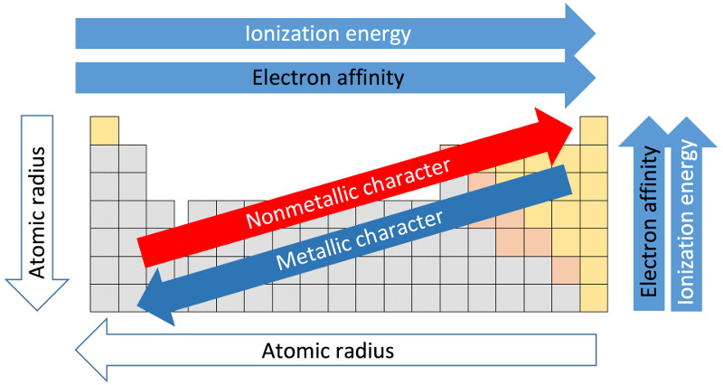
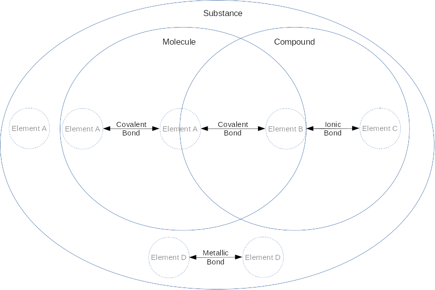

# Biology Basics

The purpose of this site is to explore biology and the things that make up biology. Feel free to [suggest corrections or additions][issues]. You may follow updates to this page using [this RSS feed](https://github.com/freeradical13/freeradical13.github.io/commits/master/index.md.atom) and [some RSS reader](https://download.cnet.com/browsers-newsreaders/).

# Big History

The [universe][] is at least 13.7 billion years old and more than 100 billion [light years][] in [diameter][].

We live on [Earth][] which is part of a [solar system][] with a [star][] called the [Sun][]. Earth and its star coalesced about [4.5 billion years ago][earth age]. Earth's solar system is part of the [Milky Way galaxy][], which is at least 12 billion years old, contains over 100 billion stars and 100 billion [planets][], and is over 100,000 light years in diameter (or about 0.0001% of the size of the universe).

There are over 100 billion [galaxies][] in the universe.

# Basics

This page assumes basic knowledge of [math][], [algebra][], [geometry][], and [scientific notation][].

# Matter

The universe is made of [matter][] which is something that has [mass][] (m) and takes up a position in [space][].

Examples of matter are [protons][], [neutrons][], and [electrons][]. Protons and neutrons each have a mass of about 1.6×10−27 [kilograms][] (kg), whereas electrons have a much smaller mass of about 9.1×10−31 kg. [Protons][proton radius] and [neutrons][neutron radius] each have a [radius][] of about 0.8×10−15 [meters][] (m), whereas electrons have a radius of less than [1.0×10−22][electron radius] m.

An [object][] (or [entity][]) is a collection of matter. An object has an [inertia][], meaning:

1. An object at rest will stay at rest unless a [force][] (F) is applied to push or pull it, and
2. An object in motion will stay in motion unless a force is applied to push or pull it.

The [speed][] of an object is a description of its movement and is the [rate][] at which its position in space changes over a [distance][] over a period of [time][] ([e.g.][for example] moving at 13 meters per [second][] (s), or 13 m/s).

The [velocity][] (v) of an object is a description of both its speed and its [direction][] in space (e.g. moving at 13 m/s _down_).

The [acceleration][] (a) of an object is the rate at which its velocity changes over a period of time (e.g. accelerating at 13 m/s over 1 second down, or 13 m/s2 down).

The [momentum][] (p) of an object, or its "quantity of motion", is its mass multiplied by its velocity (<code>p=m×v</code>).

If the mass of an object is constant, the force acting on it is the [rate of change][derivative] of its momentum over time (<code>F=dp/dt</code>); or, substituting momentum for acceleration and simplifying, its mass multiplied by its acceleration (<code>F=m×a</code>). The unit of force is the [newton][] (N).

When objects touch each other, the [perpendicular][] force their surfaces apply is called the [normal force][] (Fn), and any [parallel][] forces are called [frictional forces][] (Ff).

When an object A exerts a force on another object B, then object B exerts an [equal and opposite force][force third law] on object A.

# Electric Charge

[Electric charge][] is the property of some forms of matter to create an [electromagnetic field][] which applies a positive or negative force on other electrically charged matter, proportional to the distance between them. The magnitude of this force (named the electrostatic force) is calculated with [Coulomb's law][] (<code>F=ke×((q1×q2)/r2)</code>) which is [Coulomb's constant][] (ke) multiplied by the magnitudes of the two charges involved (q1 and q2) and divided by the square of the distance between the two objects (r2). This equation means that positive charges repel other positive charges, negative charges repel other negative charges, and positive charges attract negative charges (and vice versa). The unit of electric charge is the [Coulomb][] (C).

Examples of electrically charged matter are protons, which are positively charged, and electrons, which are negatively charged. Protons and electrons have the same magnitude [elementary electric charge][], denoted 1e and -1e, respectively. Neutrons have no charge (electrically neutral).

[Amperes][] (amps or A) are a measure of the flow of a certain number of elementary electric charges across a boundary in one second: <code>1 A = 1 C / 1 s</code>.

An electromagnetic field creates [electromagnetic radiation][] which is a [wave][] of its force traveling (radiating) through space. A wave represents something that repeats over time at a [frequency][] which is how often it repeats a cycle per unit time (e.g. one cycle per second). If the unit of time is one second, the unit of frequency is [Hertz][] (Hz). [Wavelength][] is the distance a wave covers over one cycle.

The [force carrier][] for electromagnetic radiation is a [photon][]. Photons are considered [particles][] (which may also refer to objects) even though photons are [massless][]. In a [vacuum][] (space without matter), photons travel at the [maximum speed of light][] (c), or approximately 3×108 m/s. [Light][] is simply electromagnetic radiation; although, colloquially, light usually refers to [visible light][] which is the subset of light that humans see (~390 to ~700nm wavelengths). [Fluorescent][] substances absorb ultraviolet radiation and emit visible light.

# Energy

[Energy][] (E) is the amount of work one object performs on, or transfers to, another object. Energy is often measured in [Joules][] (J). One joule may be defined as <code>J=N×m</code> or a force of one Newton acting on an object in the direction of its motion for one meter.

Energy is either [kinetic energy][] if an object is in motion (in most simple cases expressed as <code>(m×v2)/2</code>); or, [potential energy][], which may be thought of as stored energy.

Energy may [neither be created nor destroyed][conservation of energy], but only transformed. Mass may be converted to energy and vice versa through the [mass-energy equivalence][] equation (<code>E=m×c2</code>).

# Voltage

[Electric potential][] is the amount of energy needed to move a unit of positive charge in an electromagnetic field to another point without producing acceleration.

[Voltage][] (V) is the difference in electric potential between two points (i.e. the electric potential energy). Voltage is measured in Volts which are calculated using the potential energy divided by the charge, or <code>V = (N×m)/C</code>.

# Pressure and Temperature

[Pressure][] (P) is the normal force per unit area (A) applied to an object or <code>P=Fn/A</code>, often measured in [Pascals][] (Pa) (in N/m2). An object under pressure has potential energy.

[Atmospheric pressure][] is the pressure of a planet's atmosphere (e.g. the pressure of [air][]) on an object. The mass of air in the Earth's atmosphere [decreases expontentially with altitude][earth air pressure] so the atmospheric pressure decreases expontentially as an object rises above [sea level][].

Another unit of pressure is the [atmosphere][atm] (atm) which is the pressure on Earth at sea level and it's equivalent to 101,325 Pa.

[Heat][] (H) is a measure of the total quantity of kinetic energy. [Temperature][] is a measure of the average kinetic energy of a set of objects. [Absolute zero][] is the coldest state at which an object has minimal movement; however, practically, it may be assumed that all objects have some movement (or [vibration][]) and thus some non-zero temperature.

Temperature or heat is either measured in [degrees][] (°) of change on the scale of [Celsius][] (°C) or [Fahrenheit][] (°F), or in absolute terms on the scale of [Kelvin][] (K).

Roughly, the scale of celsius is defined with 0°C being when water freezes at 1 atm, 100°C when water boils at 1 atm, and absolute zero is -273.15°C. The scale of fahrenheit is defined with 32°F being when water freezes at 1 atm, 212°F when water boils at 1 atm, and absolute zero is -459.67°F. Originally, the Kelvin scale was defined relative to Celsius, but is now defined as pressure invariant, with 0 as absolute zero, and 273.16K when water reaches its [triple point][]. Kelvin was designed so that an increase of one Kelvin is equal to an increase of 1°C.

The [lowest recorded surface temperature][temperature comparison] on Earth is <code>184K / -89.2°C / -128.6°F</code>, the highest <code>331K / 58°C / 136.4°F</code>, and the average <code>288K / 15°C / 59°F</code>.

The [specific heat][] is the amount of heat that must be absorbed or lost for 1g to change its temperature by 1°C.

All matter above absolute zero temperature continuously emits some of its kinetic energy as photons of electromagnetic radiation called [thermal radiation][] or heat. The temperature determines the [emission spectrum][] of wavelengths of the electromagnetic radiation. Most matter may also absorb some of any incoming electromagnetic radiation.

If two objects touch with a path permeable to heat, then, all else being equal, the hotter object heats the cooler object through [thermal conduction][] (and [thermal convection][] in the case of fluids and gases) until they (or at least their touching surfaces) reach [thermal equilibrium][].

# Thermodynamics

There are four laws of thermodynamics (starting with the zeroth law):

<ol start="0">
  <li>If two systems A and B are in thermal equilibrium with a third system C, then A and B are in thermal equilibrium.</li>
  <li>Energy may be neither created nor destroyed, but only transformed.</li>
  <li>Energy transformation in a closed system increases [entropy][] (or disorder).</li>
  <li>Entropy approaches 0 as the temperature of a closed system approaches 0 Kelvin.</li>
</ol>

# Atoms

[Atoms][] are made of at least one proton and zero or more neutrons in the atom's [nucleus][] (both protons and neutrons may be called [nucleons][]), and zero or more [electrons][] orbiting the nucleus in [electron shells][]. Electron shells are also called [energy levels][energy level] because the shell number represents the relative potential energy of electrons in that shell. As electrons are in shells farther from the nuclear proton(s), their potential energies increase because of the additional potential electrostatic force. Therefore, an electron moving to a shell closer to the nucleus must lose energy (e.g. heat) and an electron moving to a shell farther away must absorb energy (e.g. light). Shells are subdivided into [subshells][electron subshells], and subshells are subdivided into [orbitals][] (discussed later).

The number of nucleons is considered the [atomic mass number][] (A) since an atom's electrons' masses are so much relatively lighter than the nucleons' masses.

The number of protons is considered the [atomic number][] (Z) and categorizes the atom in a class called a [chemical element][] (e.g. Carbon is the chemical element class for any atom which has 6 protons; an atom is an instance of the chemical element). The atomic number of a chemical element is sometimes placed in a subscript to the left of the element symbol; for example, 6C, although this is redundant because the symbol C implies Z. Chemical elements and their reactions are the basis of chemistry.

The number of neutrons defines the element's [isotope][] which is represented as the element name followed by its atomic mass number (e.g. Carbon-14), so the number of neutrons may be deduced from the isotope name by subtracting the number of protons. An isotope may be abbreviated with the atomic mass number in a superscript to the left of the element symbol; for example, 14C for Carbon-14.

[Atomic mass][] (mA) is measured in [unified atomic mass units][] (u or amu), also known as daltons (Da) and 1u is approximately the mass of a nucleon. For various reasons, 1u is defined more strictly as <code>1/12th</code> of the mass of a Carbon-12 atom. [Relative atomic mass][] (Ar) is the [weighted average mass][weighted arithmetic mean] of a set of atoms. [Standard atomic weight][] (Ar,std) is Ar on Earth, reflecting the weighted average of isotope masses of an element on Earth.

If an atom has an equal number of protons and electrons, then it is electrically neutral. If an atom has an unequal number of protons and electrons, then it is [ionized][ion]. If an atom has more protons than electrons, then it's positively electrically charged, called a cation, and symbolized as E+ (where E is the element symbol, discussed below). If an atom has more electrons than protons, then it's negatively electrically charged, called an anion, and symbolized as E-. If the ion is more than one electron away from the neutral element, then the + or - is preceded by that number, e.g. E2+.

# Chemistry

## The Periodic Table of Elements

There are 118 known chemical elements, 92 of which have been observed naturally, the rest synthesized, and only four elements (Carbon, Oxygen, Hydrogen, and Nitrogen) make up about 96% of a human's mass, with another 21 required in small amounts (mostly Calcium, Phosphorus, Potassium, Sulfur, Sodium, Chlorine, and Magnesium) ([Campbell & Reece, 2002, pg. 27][campbell & reece, 2002]).

The [periodic table][] is a way to organize and understand the chemical elements based on observed patterns. The elements are ordered by atomic number Z from left to right, and starting again at the left when going down.

Within each square, the atomic number is at the top, followed by the element's symbol, followed by the element name, followed by its standard atomic weight (Ar,std):

[][periodic table image]

<a href="https://en.wikipedia.org/wiki/File:32-column_periodic_table-a.png">Based on an image by Sandbh</a>

The main reason for describing elements in such a way has to do with [electron configuration][] patterns and the behaviors they may cause (described later).

Rows are called periods and describe a new electron shell which accumulates on top of any previous periods' shells. This outermost shell is known as the [valence shell][] which generally contains the [valence electrons][] that may be reactive (some ionized elements complicate this picture since they contain one less electron and effectively drop down a shell - for example, the Lithium cation - but the table is a conceptual starting point from neutral atoms).

Columns are called groups and generally group by the number of valence electrons, and thus generally group by similar behavior.

Each electron shell in an atom has a maximum number of electrons (<code>2×ShellNumber2</code>) before the next shell starts. Each shell has a distinct energy level and is broken down into subshells which have a maximum number of electrons before the next subshell starts. Each subshell is broken down into orbitals of [up to 2 electrons][orbitalmax2e] each. Additional electrons fill empty orbitals in a sub-shell before pairing up with an electron in an existing orbital. A full orbital is called an [electron pair][]. A [lone pair][] of electrons is a filled valence orbital of two electrons that are not shared with another atom (sometimes noted with a <code>:</code>). Electron configurations are represented by the accumulation of subshells up to the total number of electrons, with each subshell described by the shell number, followed by the subshell name, followed by the number of electrons in that subshell in a superscript. The subshell names are:

* s: For groups 1 and 2 (or group 18 for Helium) only, at most 2 electrons.
* p: Starting at period 2, for groups 13-18 only, at most 6 electrons.
* d: Starting at period 4, for groups 3-12 only, at most 10 electrons.
* f: Starting at period 6, in between groups 3 and 4 only, at most 14 electrons.
* [...]

Examples of electron configurations for the first 11 neutral elements:

<pre>
Hydrogen (1):  1s1
Helium (2):    1s2
Lithium (3):   1s2 2s1
Beryllium (4): 1s2 2s2
Boron (5):     1s2 2s2 2p1
Carbon (6):    1s2 2s2 2p2
Nitrogen (7):  1s2 2s2 2p3
Oxygen (8):    1s2 2s2 2p4
Florine (9):   1s2 2s2 2p5
Neon (10):     1s2 2s2 2p6
Sodium (11):   1s2 2s2 2p6 3s1
[...]
</pre>

Instead of writing the full details of long electron configurations, a common practice is to start with the previous group 18 element in [brackets] followed by the rest of the element's electron configuration. For example, Sodium (element #11) may be written as [Ne] 3s1.

When d and f orbitals are filled, they backfill the previous shell. For example, Scandium's (element #21) electron configuration is [Ar] 4s2 3d1.

The electrons that tend to cause an atom to chemically react are those electrons with the highest energies (the farthest distances from the nucleus) and are usually those in the valence shell. The exceptions are elements with d or f orbitals because even though those backfill the previous, non-valence shell, they may have higher energies than the s orbital electrons of the valence shell; however, these energies decrease moving right on a period, so the number of these valence electrons is limited.

Generally, atoms tend to be chemically reactive when their valence electrons do not complete their valence shell and thus the atom is unstable (high energy). All elements above period 1 generally want 8 electrons in their valance shell and this heuristic is called the [octet rule][]. Atoms tend to gain, shed, or share pairs of electrons as needed to reach a full and stable (low energy) set of valence electrons. This is one of the most important aspects of chemistry and means that groups have generally similar behaviors since they're generally grouped by the number of valence electrons. There are 18 numbered and 6 named groups for convenience:

* Group #1: [Alkali metals][] - Highly reactive because they want to lose an electron to drop to the previous period's full set of valence electrons.
* Group #2: [Alkaline earth metals][] - Somewhat reactive because they want to lose two electrons to drop to the previous period's full set of valence electrons.
* Group #15: [Pnictogens][]
* Group #16: [Chalcogens][] - Somewhat reactive because they want to gain two electrons or share pairs of electrons to fill their set of valance electrons.
* Group #17: [Halogens][] - Highly reactive because they want to gain an electron or share a pair of electrons to fill their set of of valence electrons.
* Group #18: [Noble gases][] - Generally not chemically reactive ([inert][]) because the set of valence electrons is full.

The radius of an atom increases from top to bottom as electron shells are added; however, moving left to right, the radius of an atom decreases as the additional protons draw in the additional electrons.

[Ionization energy][] (or cationization energy) is the amount of energy needed to remove an electron from an element (and form a cation). Energy is required to remove the electron because the electron is attracted to its element's proton(s). Following from the octet rule, ionization energy is lowest on the left of the table because those elements want to lose electron(s) to achieve a full set of valence electrons, and [ionization energy generally increases from left to right][ionization energy increases right] as additional protons add more pull to the electrons. Ionization energy decreases from top to bottom because valence electrons are farther from the protons (to which they're attracted) and thus the electrons are easier to peel off.

[Electron affinity][] (or anionization energy) is either:

1. The amount of energy released when an electron is added to an incomplete set of valence electrons. Energy is released because any time an electron drops into a new orbital, it causes the release of electromagnetic radiation energy in the form of a photon. Or,
1. The amount of energy spent adding an electron to create a new subshell or adding an electron to a subshell which only has a single electron in each of its orbital pairs (e.g. Nitrogen). Energy is needed to overcome the last subshell's stability.

Generally, electron affinity increases from left to right (except for those with stable last subshells) because right-most elements want additional electrons to achieve stability.

[Electronegativity][] is the tendency of an atom to attract electrons to its valence shell (closely related to electron affinity). It follows from the octet rule that atoms increase in electronegativity from left to right. Electronegativity decreases from top to bottom because the valence shell is farther away from the positively charged nucleus and thus there's less pull to bring in additional electrons. Electropositivity is the opposite of electronegativity.

Most elements are [metals][] (although there are only two named metal groups): they are toward the left side of the periodic table (with the exception of Hydrogen), have low ionization energies, low electron affinity, are highly [electrically conductive][], [ductile][], and generally solid at standard temperature.

[Nonmetals][] are the opposite of metals: they are toward the right side of the table, have high ionization energies, high electron affinities, are not very electrically conductive, and they are often gases (e.g. Hydrogen, Helium, etc.), although some may be solids (e.g. Carbon).

There are a handful of [Metalloids][] which have properties of both metals and nonmetals and run down a diagonal in the p-block (e.g. Boron, Silicon, etc.).

A [transition metal][] is any element with a partially filled d sub-shell (groups 3-11).

In summary, although with various exceptions, the broad trends of atomic size, ionization energy, electron affinity and metallic character may be visualized as:

[][periodic trends image]

# Big History (Continued)

After the [Big Bang][], the universe was mostly made of hydrogen, helium, and lithium (the first three elements), some of which combined into plasma stars held together by [gravity][]. At high enough temperatures inside stars, hydrogen atoms undergo [nuclear fusion][] where nuclei (and their protons and neutrons) combine to produce [helium][stellar nucleosynthesis]. As the hydrogen is used up to create helium, the star's temperature rises and allows for the fusion of [helium into carbon and oxygen][triple alpha process] and some neon and heavier elements. As the star temperature continues to increase, nuclear fusion produces elements [up to iron][heavy elements]. The remaining elements in the universe were produced by [certain stars' s-processes][s process] and [stars' explosions in a supernova or collapses into a black hole or neutron star][r process], although elements may be transformed from one element into another under certain conditions.

# Chemistry (Continued)

Two or more atoms may be held together by [chemical bond]. The major types of bonds are:

1. A [covalent bond][] defines a [molecule][] and occurs when atoms share one or more pairs of electrons in their valence shells. For example, Hydrogen wants to gain an electron and Oxygen wants to gain two electrons, so it's common for two Hydrogens to each share their electron with one of the valence electrons in the Oxygen to form an Oxygen bonded with two Hydrogens, or water. A molecule is considered a [chemical compound][] if it's made of more than one type of element. The strongest form of a covalent bond is a [sigma bond][] (σ bond). Another, weaker form of a covalent bond is a [pi bond][] (π bond).
1. A [coordinate covalent bond][] (or dative bond) defines a covalent bond in which one atom donates both electrons to the bond. Such bonds form a coordination complex. An example is a metal cation which has a coordinate covalent bond to an atom with a lone pair (also called a [ligand][]).
1. An [ionic bond][] defines an [ionic compound][] or [salt][] when one atom transfers electron(s) to another, creating a cation and anion, which then causes electrostatic attraction of the oppositely charged ions. For example, the alkali metal Sodium (Na) wants to lose an electron, and the halogen Chlorine (Cl) wants to gain an electron, so Na may give its electron to Cl, thus making Na+ and Cl- and then those two ions may bond due to the electrostatic force, forming NaCl (otherwise known as table salt).
1. A [metallic bond][] amongst positively charged metal cations in a sea of shared electrons.

A [chemical substance][] is a set of one or more elements, molecules or compounds of the same composition (i.e. "pure"). A substance cannot be separated through physical means other than breaking chemical bonds (interpret the [venn diagram][] by the location of the bond arrows):

A [mixture][] is a combination of different substances. A mixture is [homogenous][homogenous mixture] if its substances have the same proportions throughout (e.g. air), or otherwise [heterogeneous][heterogeneous mixture].

A [molecular entity][] is a single instance of a part or whole of a molecule, such as an atom, ion, or molecule. A set of identical molecular entities (in other words, a class of molecular entities) is a [chemical species][]. For example, a single water molecule is a molecular entity, but all the instances of a water molecule in some context is a chemical species. Relatedly, an [elementary entity][] is similar to a molecular entity but may also be an electron, particle, or group of particles.

A [free radical][] is a substance with at least one unpaired valence electron (e.g. a halogen), making it highly chemically reactive.

A substance may be described in many ways, all of which may represent either an entity or a species:

1. A [molecular formula][] describes the number of atoms of each element in each molecule in a subscript to the right of the element symbol (or 1 if the subscript is omitted). For example, the molecule H2O represents two Hydrogen atoms bonded with one Oxygen atom.
1. An [empirical formula][] is the molecular formula with the ratios of elements reduced to the simplest form. For example, a molecule of [Benzene][] has a molecular formula of C6H6, but the empirical formula is CH.
1. A [trivial][trivial name] or [retained name][]; for example, Water represents H2O (in the case of water, the molecular and empirical formulas are the same).
1. Various [structural formulas][] that describe the two-dimensional (2D) or three-dimensional (3D) structure of the molecule. For example, a covalent bond is represented with a long dash (–) such as <code>H–O–H</code> for H2O. As another example, a double covalent bond is represented with a double dash (=) such as <code>O=C=O</code> for CO2.
    1. [Wedge-hash diagrams][wedge-dash diagrams] (or wedge-dash diagrams or Natta projections): The filled wedge is projected toward the viewer (in front of the page). The dashed wedge is projected away from the viewer (behind the page).
    1. [Fischer projections][]
    1. [Unspecified stereochemistry][]: Wavy single bonds are unknown or unspecified stereochemistry. [Stereochemistry][] is the study of substances with the same formula but with different positions of atoms in space that cannot be rotated around a single bond to match each other (discussed in detail later).
    1. [Skeletal formulas][]
1. An ionic compound name with a set of element names with any cation first. The anion in such a salt takes the suffix [-ide][ide suffix]. For example, NaCl is Sodium Chloride.
    1. If the cation is a transition metal, then it may be followed by roman numerals in parentheses ([type-I compounds][], [type-II compounds][] or [type-III compounds][]) which represents the net positive charge of that cation; for example, Iron(III) Oxide is Fe2O3 because the III means that Iron is Fe3+ and gave 3 extra electrons, and since each Oxygen atom needs two electrons, there should be two Iron atoms, making 6 extra electrons, which means there are three Oxygen atoms, each taking 2 of those 6 extra electrons.
1. If a molecule is ionic and contains Oxygen, suffixes may be used to differeniate between the same compound but with a different number of Oxygens: The [-ate][ate suffix] suffix is used on the most common molecule, the [-ite][ite suffix] suffix is used with one less Oxygen than the -ate molecule, the [hypo-][hypo prefix] prefix along with the -ite suffix is used with two less Oxygens, and the [per-][per prefix] prefix is used with one more Oxygen. For example, Chlorate is ClO3-, Chlorite is ClO2-, Hypochlorite is ClO-, and Perchlorate is ClO4-.

When substances of different electronegativities are bonded, electrons will tend to be drawn closer to the atoms with higher electronegativities, thus leading to positive or negative [partial charges][chemical polarity] ([δ][greek delta]+ or δ-, respectively), creating a polarized (or polar) bond. For example, in the water molecule, Oxygen is more electronegative than the Hydrogens, so there's a partial negative charge at the end of the Oxygen away from the two Hydrogens, and partial positive charges on the opposite ends of the Hydrogens:

[][polar water molecule]

[Oxidation states][] are a conceptualizatized simplification of covalent bonds as ionic bonds. Oxidation states assume full hogging of electrons in a polar molecule. For example, in water, Oxygen would have an oxidation state of -2 since it hogs both Hydrogens' electrons, and each Hydrogen would have an oxidation state of +1.

Reduction is the process of gaining electrons. Oxidation is the process of losing electrons. The atom losing the electrons is said to be oxidized (even if by something other than Oxygen; the term originates from Oxygen's high electronegativity), i.e. losing electrons, and the atoms doing the oxidation are said to be reduced by the other elements, i.e. reducing the electrons of the oxidized atoms. This is called a [redox][] (reduction and oxidation) reaction because both occur. Oxidation frequently involves gaining an Oxygen or losing a Hydrogen. Reduction frequently involves losing an Oxygen or gaining a Hydrogen. A simple example of a redox reaction is Na and Cl creating Na+ and Cl-. An electron loses potential energy as part of reduction because it moves towards a more electronegative atom, and this energy is released and can be harvested by surroundings.

[Intermolecular forces][] describe attraction and repulsion forces between substances and are relatively weaker than intramolecular forces:

1. [Dipole-dipole forces][] occur when the opposite partial charges of the [dipoles][] of two polar molecules (or different parts of a large molecule) attract each other. For example, two water molecules have a dipole-dipole interaction between the partial negative end of the Oxygen of one molecule and the partial positives of the Hydrogens of the other molecule. When this interaction occurs with Hydrogren, this may be called Hydrogen bonding since it's the strongest form of dipole-dipole interaction.
1. [Van der Waals forces][]
    1. [London dispersion forces][] occur transiently at short distances as electrons happen to be in parts of their orbitals which create partial charges and create temporary dipole-dipole interactions.

## States of Matter

[Volume][] is a quantity of three-dimensional space measured in m3. [Density][] is mass per unit volume. [Relative density][] is a ratio of densities. [Specific gravity][] is a relative density which is relative to some reference substance such as water. 

In general, matter exists in one of [four states][state of matter]:

* [Solid][]: Matter which has fixed volume and fixed shape, with its components close together and fixed in place. In equations, solid substances may be suffixed with (s).
* [Liquid][]: Matter which has fixed volume and variable shape to fit its container, with its components close together but not fixed in place. In equations, liquid substances may be suffixed with (l).
* [Gas][]: Matter which has variable volume and variable shape, both to fit its container, and its components are neither close together nor fixed in place. In equations, gas substances may be suffixed with (g).
* [Plasma][]: Matter which has variable volume and variable shape, but also contains a large number of ions or electrons moving freely.

## Moles

A [mole][] (mol) is defined as the number of elementary entities in a substance as there are atoms in 12g of 12C. Moles are essentially a way to convert between amus and grams. There are ~6.022140857×1023 ([Avogadro constant][]) atoms in 12g of 12C. Therefore, <code>1 mol 12C = 12g</code>.

Since 1u is 1/12th the mass of one 12C atom, then <code>1 mol 1u = 1g</code>; therefore, <code>1 mol of isotope mAE ~= mA grams</code>. If a substance doesn't refer to a particular isotope, then standard atomic weight (Ar,std) is generally used instead of mA. [Molecular mass][] is simply the sum of atomic masses of a molecule.

For example, Ar,std of H is 1.008, and Ar,std of O is 15.999, so <code>1 mol H2O ~= (1.008×2)g + 15.999g ~= 18.015g</code>. The [molar mass][] (M) of a substance is simply this relationship in terms of g/mol, so M(H2O) ~= 18.015 g/mol.

## Chemical Reactions

A [chemical reaction][] occurs any time a chemical bond is created or broken. A [chemical equation][] describes a reaction with [reagents][] (or reactants) on the left-hand side of the equation which yields (→) the [product(s)][chemical reaction product] of the chemical reaction on the right-hand side of the equation (an [adduct][] is a type of product where there are no products other than the adduct product). For example, the chemical equation for the reaction of molecular hydrogen and molecular oxygen plus input energy (E) yields water and output energy E':

<code>2H2 + O2 + E → 2H2O + E'</code>

Enthalpy is the heat transferred during a constant pressure process. An [endothermic reaction][] occurs when the system absorbs heat energy (positive ΔH) from its surroundings. An [exothermic reaction][] occurs when the system releases energy (negative ΔH).

A reagent which is attracted to electrons is called an [electrophile][] (i.e. a lewis acid). A [nucleophile][] is a reagent which donates electrons (i.e. a lewis base) to an [electrophile][].

A chemical equation must be balanced using [stoichiometry][] because the total number of atoms of each element must be the same on both sides.  A stoichiometric coefficient to the left of a substance represents the number of substances or moles of that substance in the chemical reaction.

Chemical reactions may also be [reversible][reversible reaction] and go in both directions, signified by a double arrow (⇌), always tending towards reaching dynamic [chemical equilibrium][] where the rates of reactions in both directions are equal. For example:

<code>HCO3- + H+ ⇌ H2CO3</code>

In a reversible chemical reaction such as <code>aA + bB ⇌ cC + dD</code>, the [equilibrium constant][] (keq) measures the extent to which reagents are converted to products and equals ([C]c × [D]d) / ([A]a × [B]b), ignoring the solvent and any solids, where the a, b, c, and d coefficients are the mole ratios. Given that molarity depends on temperature, keq is a function of temperature. This constant describes the relative proportions of concentrations of reagents and products at equilibrium.

Gibbs free energy (G) measures the work that a system can do (<code>ΔG = ΔH - T×ΔS</code> where ΔS is the change in entropy). If the change in G (ΔG) for a chemical reaction at a temperature T is known, Keq can be calculated as <code>ΔG = -R×T×ln(Keq)</code>.

Reactions that don't require input energy are called [spontaneous][spontaneous reactions] or [exergonic][] (negative ΔG, meaning that the products store less energy than the reagents and thus the reaction favors the products spontaneously without input energy), although they don't necessarily occur rapidly.

Reactions that require input energy are [endergonic][] (positive ΔG):

<pre>
      Endergonic Reaction
   ⎪
 E ⎪
 n ⎪           ____
 e ⎪          /    \________ 
 r ⎪         /      products 
 g ⎪________/
 y ⎪reagents
   ⎪________________________ 

             Time
</pre>

A coupled reaction is when the energy released by an exergonic reaction drives an endergonic reaction.

Given a balanced chemical equation and the relationship of moles to atomic weights, and a mass of one substance, composition stoichiometry may be used to determine the mass of other substances in the equation. [For example][example composition stoichiometry], in the following equation:

<code>Fe2O3 + 2Al → Al2O3 + 2Fe</code>

If we know there are 85g of Fe2O3, since each of those molecules is about 160u, Fe2O3 is about 160g/mol, so first convert 85g to moles using [dimensional analysis][] by multiplying by 1mol/160g to cancel the g, and therefore, 85g divided by 160g/mol is 0.53 mols. Since there are two moles of Al for every 1 mole of Fe2O3, <code>2×0.53 = 1.06 mols</code> of Al would be needed to react with all of the Fe2O3. Given Al's atomic weight is about 27u, 1 mole is about 27g, so <code>1.06×27 = 28.62g</code> of Al would be needed to react with all of the Fe2O3.

[Le Chatelier's principle][] (or the equilibrium law) states that the reaction tends towards equilibrium even after any changes to concentration, temperature, volume, or pressure (thus why it's called dynamic equilibrium):

* If the temperature increases in an endothermic reaction, the system will favor the forward reaction.
* If the temperature decreases in an exothermic reation, the forward reaction will be favored to match the previous temperature.
* If the concentration of a substance increases, the reaction will favor the other side, decreasing the concentration of the subtance, and increasing the concentration(s) of the other side.
* If the concentration of a substance decreases, the reaction will favor the side of the decrease, increasing the concentration of the substance, and decreasing the concentration(s) of the other side.
* If volume decreases, concentrations will increase, so the reaction will favor the side that generates more total moles (i.e. creating more of the side that's more likely to react).
* If volume increases, concentrations will decrease, so the reaction will favor the side that has fewer total moles (i.e. creating more of the side that's less likely to react).

## Water

Liquid water is a particularly imporant molecule. Since it's a polar molecule, it has a tendency to create hydrogen bonds with nearby water molecules (or other ions or dipoles). This phenomenon is called [cohesion][]. Water also has a greater [surface tension][] (how difficult it is to stretch or break the surface of a liquid).

A [calorie][] (cal) is the amount of heat energy it takes to raise the temperature of 1g of water by 1°C (conversely, the amount of heat energy released when 1g of water is cooled by 1°C). 1 calorie also equals 4.184 J (conversely, <code>1 J = 0.239 cal</code>). Therefore, the specific heat of water is 1 cal per 1g per °C.

Relative to other substances, water has a high specific heat, meaning that it will change its temperature less when it absorbs or loses an amount of heat.

Substances that are ionic or polar are [hydrophilic][] meaning that they have a high affinity for water. Substances that are non-ionic and non-polar are [hydrophobic][] meaning that they have a low affinity for water. Substances that are [amphipathic][] have both hydrophobic and hydrophilic regions.

## Solutions

A [solution][] is a homogenous mixture with [solute(s)][solute] dissolved into a [solvent][] (the largest proportion substance). A solvent is often a liquid and if such a liquid is water, the solution is referred to as an [aqueous solution][] (in equations, sometimes denoted with <code>(aq)</code>). A [suspension][] is a heterogenous mixture where one substance eventually settles, whereas [colloids][] are heterogenous mixtures that don't settle ([emulsions][] are colloids of liquids).

A [litre][] (L) is a unit of volume equal to <code>1m3/1000</code>. [1 litre of water][water L kg] is approximately 1 kg under standard conditions (e.g. 25°C).

The amount of a substance is usually measured in mass, moles or volume (e.g. 1g of salt in water). The [concentration][] of substance A mixed into substance B is the amount of substance A divided by the total volume of substance B. [Molarity][] (or molar concentration) (M) is the number of moles of a solute per liter of solution, abbreviated with square brackets around the solute (e.g. [Cl-]). [Molality][] is the number of moles of solute per kg of solvent.

A [hypertonic][] solution has a higher concentration of a solute compared to another solution. A [hypotonic][] solution has a lower concentration of a solute compared to another solution. An [isotonic][] solution has the same concentration of a solute compared to another solution. Like a dynamic equilibrium in chemical reactions, even in an isotonic solution, solvent and solution may move back and forth, but the rates of movement are equalized.

In solution, molecules naturally diffuse from areas of higher concentration to areas of lower concentration if possible. This is called moving down or with the concentration gradient. [Osmosis][] is a particular type of diffusion which creates an osmotic gradient of a solvent from a hypotonic area to a hypertonic area because the concentration of the solvent is lower in the hypertonic area.

## Acids and Bases

[Protium][] is the most common isotope of Hydrogen on Earth with one proton and zero neutrons (1H). [Deuterium][] is an isotope of Hydrogen with one proton and one neutron (2H). A [hydron][] is a cationic Hydrogen with 0 electrons (1 or 2H+). A [hydride][] is an anionic Hydrogen. A protium hydron (1H+) is often just called a proton since it's just a proton with no neutrons nor electrons.

[Hydroxide][] is the anionic molecule OH-. [Hydronium][] is the cationic molecule H3O+.

There are multiple ways to define acids and bases:

1. A [Brønsted-Lowry acid][brønsted-lowry] is a substance capable of donating a proton. A [Brønsted-Lowry base][brønsted-lowry] is a substance with a lone pair of electrons capable of accepting a proton (or indirectly, a substance that dissociates into hydroxide ions which then accepts the protons). A [conjugate acid][] is the product that accepted protons (because it can then give that proton back in the reverse direction), and a conjugate base is the product that donated protons. For example, water is [amphoteric][] meaning it can be either an acid or a base.
1. A [Lewis acid][lewis acids and bases] is a substance that has an empty electron orbital and may accept an electron pair. For example, <code>H+</code> has an empty electron orbital. A [Lewis base][lewis acids and bases] is a substance that has a lone pair of electrons not involved in bonding that it may donate.
1. An [Arrhenius acid][arrhenius] is a substance that tends to react in an aqueous solution to increase the concentration of protons (which tend to create hydronium). For [example][example arrhenius acid], <code>HCl(aq) + H2O(l) ⇌ Cl-(aq) + H3O+(aq)</code>. An [Arrhenius base][arrhenius] is a substance that tends to react in an aqueous solution to increase the concentration of hydroxide. For [example][example arrhenius acid], <code>NaOH(aq) + H2O(l) → Na+(aq) + H3O+(aq)</code>.

The Arrhenius definition is limited to aqueous solutions whereas the Brønsted-Lowry and Lewis definitions are more general.

A substance that is basic is also sometimes referred to as [alkaline or an alkali][alkali].

A strong acid or base dissociates completely in aqueous solution (→), whereas a weak acid or base dissociates partially (⇌).

A substance that is acidic in a neutral solution will have an overall negative charge. A substance that is basic in a neutral solution will have an overall positive charge.

A small proportion of water molecules in liquid water will tend to [autoionize][water autoionization] and form hydronium and hydroxide ions (<code>H2O + H2O ⇌ H3O+ + OH−</code>). For pure water, at the equilibrium point under standard conditions (i.e. 25°C), [H+] = [H3O-] = 10-7 M.

The [pH scale][] is a way to describe how acidic or basic a mixture is without using exponents, and it's just the [cologarithm][] of molarity: <code>pX = -log [X]</code>. pH is the cologarithm of H+ and describes how acidic the mixture is. Conversely, pOH is the cologarithm of OH- and describes how basic the mixture is. When <code>pH = pOH</code> (in other words, <code>[H+] = [OH-]</code>), the mixture is described as neutral. Mixtures with <code>[H+] > [OH-]</code> are acidic. Mixtures with <code>[H+] < [OH-]</code> are basic. In any mixture, <code>[H+]×[OH-] = 10-14</code> (in other words, <code>pH + pOH = 14</code>). As the molarity of protons increases (e.g. stomach acid is between ~10-1.5 to ~10-3.5), the pH value decreases and thus acidity increases. Therefore, mixtures with a pH below 7 are acidic and basic above 7.

A [buffer][] is a substance that minimizes changes to pH by accepting protons when in excess and donating protons when in deficit. Generally, a buffer is a molecule with both an acid and a base, and its equilibrium constant controls its behavior in buffering the mixture. For example, carbonic acid yields a bicarbonate ion and a proton: <code>H2CO3 ⇌ HCO3- + H+</code>.

## Three-Dimensional Structure

The size and structure of a substance is key to the way it functions because of the implied likelihoods of chemical reactions with other substances. A commonly used phrase is that structure implies function.

Although substance structures are often described by molecular, empirical, or two-dimensional formulas for simplicity, actual substance structures are three-dimensional.

[Isomers][] are substances that have the some molecular formula but different structures.

[Structural isomers][] differ in their covalent arrangements. For example, [butane][] (C4H8) is:

<pre>
  H H H H
  | | | |
H–C–C–C–C–H
  | | | |
  H H H H
</pre>

Whereas isobutane (also C4H8) is:

<pre>
  H–C–H
  H ⎪ H
  | ⎪ |
H–C–C–C–H
  | | |
  H H H
</pre>

[Geometric isomers][] (or cis-trans isomers) have the same covalent arrangements but differ in spatial arrangements. For example, the following two molecules are geometric isomers of each other. If the Xs are on the same side, it's a cis isomer, and if they're on opposite sides, a trans isomer:

<pre>
H     H
 \   /
  C=C
 /   \
X     X

H     X
 \   /
  C=C
 /   \
X     H
</pre>

A [chiral][] substance may have one of two, mirror-image configurations, each of which is called an [enantiomer][] which are geometric isomers which cannot be superimposed on each other and this can have functional implications. The two forms are designated L and D isomers (L-form and D-form) from the Latin for left and right ([levo][levorotatory] and [dextro][dextrorotatory]). [R and S configurations][] can describe substances with multiple chiral carbons.

[Conformations][] are isomers in which the difference between molecules is rotation around a single bond and does not depend on different bonding.

## Common Molecules

[Ammonia][] is NH3. It has three covalent bonds with Hydrogen which leaves one lone electron pair (because there are 5 total valence electrons: 2s2 + 2s3). This lone electron pair makes it a base because it can accept protons. Ammonia is also polar because Nitrogen is much more electronegative than Hydrogen, but also because the shape of Ammonia is pyramidal. If it was planar, the dipoles would cancel out, but the lone pair pushes the other Hydrogens out into a pyramidal structure.

A [tetrahydride][] is a group 14 element (e.g. C, Si, Ge, Sn, Pb, etc.) which is saturated with hydrogens (e.g. CH4). Tetrahydrides are considered non-polar.

## Organic Chemistry

An [organic compound][] is an ambiguous term that describes a compound that contains Carbon and is related to [organisms][]. An organism is an object with the properties of [life][]. The definition of life is [controversial][definition of life]. The physicist [Erwin Schrödinger][] proposed that the key element of life is the [fight against entropy][].

The original definition of organic was loose because Carbon Dioxide (<code>CO2</code>) is considered inorganic even though it contains Carbon and is produced by some organisms. In addition, organic compounds may be synthesized outside of organisms. The modern definition of organic retains these ambiguities, but in general, most Carbon-based compounds are considered organic (with exceptions such as CO2 sustained for historical reasons). Carbon has four unpaired valence electrons and can create bonds in four different, equally spaced directions, allowing for a wide variety of compounds. Other elements can form 4 or more bonds but they are larger which limits their permutations.

[Hydrocarbons][] are organic molecules composed of Carbon and Hydrogen atoms. The electronegativities between Hydrogen and Carbon are close enough (2.2 and 2.55, respectively, on the [Pauling scale][]) that [hydrocarbons are generally considered non-polar][hydrocarbons non-polar] and therefore generally hydrophobic.

Hydrocarbons are either [aromatic][] (also known as arenes) or [aliphatic][] (also known as non-aromatic). Aromatics have cyclic (in alternating single and double covalent bonds), planar arrangements (such as Benzene) and thus are very stable and unreactive, whereas most aliphatics are [acyclic][] and less stable. Only some aromatic substances have pleasant smells.

A [saturated hydrocarbon][] has no double or triple bonds (i.e. it's saturated with the maximum number of Hydrogens). An [unsaturated hydrocarbon][] has double or triple bonds between Carbons.

It is common to omit Carbons and Hydrogens in structural formulas for simplicity. For example, the structural formula for Cyclohexane (C6H12) is a ring:

<pre>
  H   H
   \ /
H   C   H
 \ / \ /
  C   C
 /⎪   ⎪\
H ⎪   ⎪ H
H ⎪   ⎪ H
 \⎪   ⎪/
  C   C
 / \ / \
H   C   H
   / \
  H   H
</pre>

This can be simplified into a simple hexagon where each vertex is an implied Carbon atom with two Hydrogens:

<pre>
⬡
</pre>

Similarly for structures with double covalent bonds, the ring can be simplified with double lines. For example, the structural formula for Benzene (C6H6) is a ring:

<pre>
    H
    |
    C
   / ⑊
H–C   C–H
  ║   ⎪
H–C   C–H
   \ ⫽
    C
    |
    H
</pre>

This can be simplified into the following hexagon with three double bonds where each vertex is an implied Carbon atom with one Hydrogen:

<pre>
⌬
</pre>

### Naming Organic Compounds

[Greek letters][] are sometimes used in numbered names (in the same way that some numbered lists use <code>a, b, c, ...</code>). The first 10 Greek letters are (lower case followed by upper case):

1. Alpha: α Α
1. Beta: β Β
1. Gamma: γ Γ
1. Delta: δ Δ
1. Epsilon: ε Ε
1. Zeta: ζ Ζ
1. Eta: η Η
1. Theta: θ Θ
1. Iota: ι Ι

The longest linear covalently bonded chain ([carbon skeleton][]) of Hydrocarbons may be called a [backbone chain][] (or main chain) from which the rest of the molecule builds off of. Any other smaller branches (in place of Hydrogens for the branch points) are called [side chains][], [substituents][], or pendant chains.

Any part of a molecule may be omitted and represented with the letter R (or R', R'', etc. if there are multiple substitutable parts), meaning remainder.

A [moiety][] is a part of a molecule which is a common pattern of atoms that may be found in many other molecules.

The [-yl][radical suffix] suffix is used for free radicals or moieties (with an unpaired valence electron) that can be side chains substituting for a single Hydrogen on a backbone. The [-ylidene][radical suffix] suffix is the same but when substituting two Hydrogens on the backbone for a double bond. The [-ylidyne][radical suffix] is when substituting three Hydrogens on the backbone for a triple bond.

An [alkane][] is an acyclic, unbranched saturated hydrocarbon. An example is [Methane][] which is CH4 and is the main component of [natural gas][]. A straight-chain (non-branched) alkane has the suffix [-ane][alkane suffix].

An [alkene][] (or olefin) is an unsaturated alkane with at least one C=C double bond. An [alkyne][] is an unsaturated alkane with at least one C≡C triple bond. The [position of the double or triple bond][unsaturated hydrocarbon] is written at the start of the name or before the -ene or -yne suffix. If there are more than one such bonds, the positions are comma separated (e.g. 2,4-pentadiene). A substance that's both an alkene and alkyne has the suffix -enyne.

An [alkyl][] is an alkane without one Hydrogen.

The number of Carbons in a backbone chain may be thought of as the size of the alkane and gives it a [prefix][alkane prefixes]:

* 1: Meth-
* 2: Eth-
* 3: Prop-
* 4: But-
* 5: Pent-
* 6: Hex-
* 7: Hept-
* 8: Oct-
* 9: Non-
* 10: Dec-
* 11: Undec-
* 12: Dodec-
* 13: Tridec-
* 14: Tetradec-
* 15: Pentadec-
* 16: Hexadec-
* 17: Heptadec-
* 18: Octadec-
* 20: Eicos-
* 22: Docos-
* 23: Tricosa-
* 24: Tetracos-
* 26: Hexacos-
* 28: Octacos-
* 30: Triacont-
* 32: Dotriacont-
* 33: Tritriacont-
* 34: Tetratriacont-
* 35: Pentatriacont-
* 40: Tetracont-
* 50: Pentacont-
* 60: Hexacont-
* 70: Heptacont-
* 80: Octacont-
* 90: Nonacont-
* 100: Hect-

An [aryl][] is an aromatic hydrocarbon minus one Hydrogen such as a [phenyl][] (a Benzene minus one Hydrogen).

[Naming an organic compound][]:

* An alkane with branched groups is prefixed with the position of the Carbon where the branch occurs, followed by a prefix for the branched group, followed by the name of the alkane chain.
* If there are multiple branches, the number prefix is a comma-separated list and the branch prefix is prefixed with di-, tri-, tetra-, etc. for the number of groups.
* If the multiple branches are different types of groups, they're ordered in alphabetical order.
* For alkenes and alkynes, the position(s) of the double or triple bonds are a comma separated list infixed in the name, and a prefix of di-, tri- etcs before the final prefix.
* Prefix cis- or trans- if needing to describe the isomerism.

### Functional Groups

The moieties of an organic molecule that are most commonly involved in chemical reactions are called [functional groups][]. When discussing functional groups, a convention is sometimes used which describes their molecular formulas without internal bond symbols, and the group is prefixed or suffixed by a dash depending on where the functional group bonds to the rest of the compound. Common functional groups:

1. [Hydroxyl][] (<code>R–OH</code>): Oxygen covalently bonded to a Hydrogen (<code>O–H</code>) and the Oxygen is covalently bonded to the compound. The highly electronegative Oxygen causes that part of the compound to be hydrophilic. Compounds containing a hydroxyl group are called Alcohols and names are usually suffixed with [-ol][alcohol suffix]. This functional group is hydrophilic.

    For example, [Ethanol][] is the drug in alcoholic beverages:
    
    <pre>
      H H
      | |
    H–C–C–O–H
      | |
      H H</pre>
1. [Carbonyl][] (<code>R–CO</code>): Oxygen double-covalently bonded to a Carbon (<code>C=O</code>) which is covalently bonded to any two other atoms.
1. [Acyl][] (<code>R–CO</code>): A type of carbonyl in which R is an alkyl or aryl. If the carbonyl/acyl is at the end of a chain, the group is called an aldehyde; otherwise, it's called a ketone. This functional group is hydrophilic.
1. [Methyl][] (<code>R–CH3</code>): A Carbon single bonded to three Hydrogens. Adding such a functional group makes the molecule methylated.
1. [Acetyl][] (<code>R–CH3CO</code>): An acyl covalently bonded to a methyl and the remainder.
1. [Carboxyl][] (<code>R–COOH</code>): A Carbon acting (i.e. not part of the backbone) in both an Acyl and Hydroxyl. Also called Carboxylic Acids (or organic acids). The reason carboxyls tend to be acidic whereas hydroxyls tend not to be is because there are two highly electronegative Oxygens near the Hydrogen in a carboxyl. This functional group is hydrophilic.
1. [Amino][] (<code>R–NH2</code>): Two Hydrogens covalently bonded to a Nitrogen (<code>H–N–H</code>) which is covalently bonded to the compound. Also called [Amines][]. An amino group often acts as a base because the Nitrogen has one unpaired valence electron willing to be shared with a Hydrogen proton. Compounds that have both amino and carboxyl functional groups are called amino acids. This functional group is hydrophilic.
1. [Sulfhydryl][] (<code>R–SH</code>): A sulfhydride (Sulfer bonded to a Hydrogen) which is covalently bonded to the compound. Also called [thiols][]. This functional group is hydrophilic.
1. [Phosphate][] (<code>R–OPO32-</code>): A Phosphorus double-covalently bonded to an Oxygen and three Carbonyl side chains (<code>O=P–(OR)3</code>). Also called [Organophosphates][] (or organic phosphates). This functional group is hydrophilic and anionic. Confers the ability to react with water to release energy. Adding or removing a phosphate group are phosphorylation and dephosphorylation, respectively.
1. [Ester][] (<code>RCOOR′</code>): A product of a reaction between an acid (e.g. carboxylic acid) and an alcohol in which the ester bond forms where two hydroxyl groups (one from each) are replaced with a Carbonyl that bonds the two. Usually suffixed with [-oate][ester suffix].

The first Carbon to which a functional group is attached is called the [1-Carbon][] or the α-Carbon. If there are multiple functional groups, generally the 1-Carbon refers to the functional group responsible for the name of the molecule.

If functional groups are on the same side of the carbon chain, they are called [cis-][cis-trans isomerisms] (often represented as E), whereas [trans-][cis-trans isomerisms] are on opposed sides (often represented as Z). In general, such groups contain double bonds.

### Macromolecules

A [polymer][] is a chain-like molecule made of repeating parts called [monomers][] connected by covalent bonds. The process of creating polymers from monomers is called [polymerization][]. A monomer is simply an organic molecule that can undergo polymerization. A [homopolymer][] is created from just one type of monomer, whereas [copolymers][] may be created from more than one type of monomer. [Oligomers][] are polymers of a small, fixed number of monomers (e.g. [dimers][], [trimers][], [tetramers][], etc.).

Polymers (and some non-polymers) are assembled through a process called [dehydration synthesis][] (or [condensation reaction][] or Zimmer's hydrogenesis) in which a Hydrogen on one end of one monomer and a Hydroxyl on the other end of the other monomer combine to form water and break away, leaving the remaining monomers to covalently bond. Dehydration synthesis requires energy input. [Hydrolysis][] is the opposite reaction (lysis is Greak for the word break) and produces energy. The verb is to hydrolyze.

A [macromolecule][] is a large molecule, often a large polymer.

# Biology

Biology (or life science) is the [study of life][biology history].

A [biomolecule][] is generally an organic molecule that's related to some biological process, often a biomacromolecule but also small molecules.

General terms:

* [Facultative][]: optional.
* [Obligate][]: obligatory; necessary.
* [Ligands][biochemical ligand]: Not necessarily like the ligand in a coordinate covalent bond, biochemical ligands describe molecules that bind to larger biomolecules to help with a biological function (often through a change in conformation of the biomolecule).

## Carbohydrates

[Carbohydrates][] (or saccharides) are biomacromolecules made of a hydrocarbon backbone with a Carbonyl group and some number of Hydroxyl groups. Carbohydrates may also be called sugars (sacchar is Greek for sugar) although there is also a non-biochemistry term of table sugar which refers to Sucrose, a particular type of carbohydrate, which is different from the more general biochemistry term. Carbohydrates have the suffix [-ose][sugar suffix].

### Monosaccharides

[Monosaccharides][] are carbohydrates made of a single sugar molecule with a Carbonyl and multiple Hydroxyl groups (usually D-form isomers). Also called simple sugars. Sugars vary in the location of their Carbonyl group, the length of the backbone (3-7 Carbons) and their spatial arrangement. Trioses: 3 Carbon sugars. Pentoses: 5 Carbon sugars. Hexxoses: 6 Carbon sugars. If the Carbonyl is at the end of the backbone, it's an aldose; otherwise, a ketose.

One of the most common sugars used by organisms for energy is [Glucose][] which is a hexose aldose. It has the linear arrangement:

<pre>
 H   O
  \ ⫽
   C
   ⎪
 H–C–OH
   ⎪
HO–C–H
   ⎪
 H–C–OH
   ⎪
 H–C–OH
   ⎪
 H–C–OH
   ⎪
   H
</pre>

In aqueous solution, sugars tend to form rings called [pyranoses][] (or, more rarely, furanoses) when the carbonyl and hydroxyl in the sugar create a [hemiacetal][] or hemiketal group (if the carbonyl is an aldehyde or ketone, respectively). In Glucose, the Carbons are numbered starting with the top Carbon (with the Carbonyl) as 1. These numbers are used to describe where bonds occur between multiple monosaccharides. The emphasized edges indicate that we're looking at the ring edge-on, and the other non-ring bonds lie above or below the plane of the ring. There are two ring isomers of Glucose depending on where the Hydroxyl is. The α-Glucose ring is:

<pre>
    CH2OH
    ⎪     O
    /‾‾‾‾‾\
 H /⎪      \ H
 ⎪/ H       \⎪
 ⎪\         /⎪
HO \ OH  H / OH
    \⎪___⎪/
     ⎪   ⎪
     H   OH
</pre>

The β-Glucose ring is:

<pre>
    CH2OH
    ⎪     O
    /‾‾‾‾‾\
 H /⎪      \ OH
 ⎪/ H       \⎪
 ⎪\         /⎪
HO \ OH  H / H
    \⎪___⎪/
     ⎪   ⎪
     H   OH
</pre>

In the above Glucose ring structures, the convention is that the rightmost Carbon is the 1-Carbon and the numbering continues clockwise.

[Galactose][] is an isomer of Glucose with a change at the 4-Carbon:

<pre>
 H   O
  \ ⫽
   C
   ⎪
 H–C–OH
   ⎪
HO–C–H
   ⎪
HO–C–H
   ⎪
 H–C–OH
   ⎪
 H–C–OH
   ⎪
   H
</pre>

[Fructose][] is another monosaccharide often of the following isomer:

<pre>
CH2OH
⎪    O
⎪ /     \ OH
⎪/       \⎪
⎪\ H   OH/⎪
⎪ \⎪___⎪/ ⎪
⎪  ⎪   ⎪  CH2OH
H OH   H
</pre>

In the above Fructose ring structure, the convention is that the bottom-right most Carbon is the 1-Carbon followed by the Carbon above it, and then clockwise around the ring.

### Disaccharides

[Disaccharides][] are carbohydrates made of Two monosaccharides through a covalent bond called a glycosidic linkage. Also called double sugars.

Common disaccharides:

* [Maltose][] which is Glucose bonded to Glucose.
* [Sucrose][] (or table sugar) which is Glucose bonded to Fructose.

### Polysaccharides

[Polysaccharides][] are carbohydrate polymers made of multiple sugars with glycosidic linkages.

[Storage polysaccharides][] are used by organisms to store energy for future breakdown and use. [Starch][] is a storage polysaccharide made of α-Glucose monomers ([amylose][] being an unbranched starch, and [amylopectin][] being branched). [Glycogen][] is like amylopectin but even more branched.

[Structural polysaccharides][] are used by organisms to build strong structural material. [Cellulose][] and [Chitin][] (like Cellulose but with an Amino group) are structural polysaccharides made of β-Glucose monomers (and unbranched because of the β-Glucose glycosidic bonds). Parallel strands may hydrogen-bond between the Hydrogens and Hydroxyls with other strands to form [microfibrils][].

## Lipids

[Lipids][] are a broad category of biomolecules which are mostly hydrocarbons and are only soluble in non-polar solvents (i.e. hydrophobic). Lipids are not polymers because although they form with dehydration synthesis, any repeating subunits of lipids are not directly bonded in a chain.

### Glycerides

[Glycerides][] are lipids with an ester bond between Glycerol and one or more fatty acids. The ester bond is made with dehydration synthesis.

[Glycerol][] (or glycerine or glycerin) is an alcohol with a 3 Carbon backbone and 3 Hydroxyls:

<pre>
   H
   ⎪
 H–C–OH
   ⎪
 H–C–OH
   ⎪
 H–C–OH
   ⎪
   H
</pre>

A [fatty acid][] is an aliphatic hydrocarbon (either saturated or unsaturated) with a Carboxyl and with a (usually) 12- to 18 Carbon backbone:

<pre>
OH   O       OH   O
  \ ⫽          \ ⫽
   C            C
    \           ⎪
   H–C–H        C 
    /          ⫽ 
 H–C–H        C
 [...]      [...]
   ⎪         / \
   H        H   H
</pre>

A zigzag form suggests the actual tetrahydral (in the case of a saturated fatty acid) or double covalent bond kinks (in the case of an unsaturated fatty acid) 3D orientations of the bonds. Saturated fatty acids can pack more tightly because of the flexibility of the single bonds compared to double bonds in unsaturated fatty acids (and thus saturated fatty acids tend to be more solid at room temperature). An oil is mostly made of unsaturated fatty acids. A hydrogenated oil means that unsaturated fatty acids were converted to saturated fatty acids. Most double bonds in fatty acids are of the cis- isomeric form but trans fatty acids are of the trans- isomeric form.

Monounsaturated fatty acids have a single double bond whereas polyunsaturated fatty acids have two or more double bonds.

A [fat][] is a triglyceride (or triacylglyceride) with one Glycerol and three fatty acids.

### Phospholipids

[Phospholipids][] are lipids made of a [Diglyceride][] and the third Hydroxyl of the Glycerol is bonded to a Phosphate group which has a negative charge. Another polar molecule such as Choline is sometimes bonded to the Phosphate. This forms a molecule which has a hydrophobic "tail" made of the fatty acids and a hyrophilic "head" made of the Phosphate.

When added to water, phospholipids form a bilayer with two hydrophilic sides opposite each other and then hydrophilic fatty acids in between.

### Steroids

[Steroids][] are lipids made of four fused hydrocarbon rings and various functional groups.

<pre>
      /\ /\
     |  |__|
 /\ / \/
|  |  |
 \/ ⑊/
</pre>

[Cholesterol][] is a key steroid. Free cholesterol does not have fatty acids bonded. A cholesterol ester is a cholesterol with ester bonds to fatty acids.

Another steroid is [Vitamin D][] which is made from Cholesterol.

### Waxes

[Waxes][] are similar to Glycerides except that the Glycerol backbone is longer (usually 12 to 32 Carbons).

## Proteins

[Proteins][] are biomacromolecule polymers made of one or more polypeptides. A [polypeptide][] is an unbranched chain of [peptides][]. A peptide is a polymer of two or more amino acid monomers bonded through covalent bonds called peptide bonds (or amide bonds).

An [amino acid][] is a 1 Carbon backbone with an amino group, a carboxyl group, a Hydrogen, and one of 21 side chains. Amino acids are all of the L enantiomer form. Amino acids may be grouped by properties of their side chain (with single- and three-letter abbreviations):

Hydrophobic:

* Glycine (G/Gly)
* Alanine (A/Ala)
* Valine (V/Val)
* Leucine (L/Leu)
* Isoleucine (I/Iso)
* Methionine (M/Met)
* Phenylalanine (F/Phe)
* Tryptophan (W/Trp)
* Proline (P/Pro)

Hydrophilic:

* Serine (S/Ser)
* Threonine (T/Thr)
* Cysteine (C/Cys)
* Tyrosine (Y/Tyr)
* Asparagine (N/Asn)
* Glutamine (Q/Gln)
* Selenocysteine (U/Sec)

Hydrophilic + Acidic (negatively charged):

* Aspartic acid (D/Asp)
* Glutamic acid (E/Glu)

Hydrophilic + Basic (positively charged):

* Lysine (K/Lys)
* Arginine (R/Arg)
* Histidine (H/His)

Amino acids may bond when a Carboxyl group from one and an Amino group from another perform a dehydration synthesis to form a peptide bond. One end of the polypeptide has an amino group which is called the N-terminus and the other end has a Carboxyl group which is called the C-terminus. Generally, amino acids are written and read starting at the N-terminus. The polypeptide backbone is the bonded amino acids without taking into account the side chains.

Proteins are either globular (roughly spherical) or fibrous (long and thread-like). Globular proteins generally have polar side chains on the outside and are thus water soluable. Fibrous proteins are not water soluble.

Proteins may be bound to lipids to create lipoproteins, to sugars to create glycoproteins, etc.

The [primary structure][] of a protein is its linear sequence of amino acids.

The [secondary structure][] of a protein describes initial folding and coiling and is driven by Hydrogen bonding between the polypeptide backbone. Within the polypeptide backbone, the Oxygen in the Carbonyl has a partial negative charge and the Hydrogen in the Amino has a partial positive charge. One secondary structure is the [α helix][] which is a cylindrical coil backbone (with side chains projecting outwards) held together by Hydrogen bonding between every fourth amino acid. Another secondary structure is the planar [β pleated sheet][] in which segments (β strands) of the polypeptide are parallel and held together by Hydrogen bonding between parallel or antiparallel strands.

The [tertiary structure][] of a protein is driven by interactions between the amino acid side chains rather than the polypeptide backbone. As a polypeptide forms in water, amino acids with hydrophobic side chains tend to cluster in the core of the protein. [Disulfide bridges][] may form where the Sulfurs in two Cysteine amino acids covalently bond. Ionic bonds may form between the negatively charged Oxygen in the Carboxyl of one amino acid and the positively charged NH3+ of a Lysine.

If a protein is made of more than one polypeptide (dimer for two polypeptides, trimer for three, and tetramer for four), the [quaternary structure][] of a protein is driven by the interactions between the polypeptides.

A protein's shape depends on pH, salt concentration, temperature and other factors. Denaturation due to such factors breaks the weaker secondary, tertiary, and/or quaternary structures and may make the protein biologically inactive (i.e. unraveled). Excessively high fevers may be fatal because proteins may denature.

### Enzymes

Most [enzymes][] are proteins that increase the rate of (catalyze) certain chemical reactions by reducing [activation energy][] for a reaction. The target reagents are called [substrates][] which bind to the enzyme's [active sites][]. Non-active site portions of enzymes are called [allosteric sites][] where the products bind. Negative feedback is where products bind to an enzyme's allosteric sites to stop catalysis. Enzymes are often named for their substrate(s) along with the [-ase suffix][ase suffix].

There are 6 broad groups of enzymes (the first number in an enzyme's unique [Enzyme Commission Number][]):

1. [Oxidoreductases][]: Catalyze a redox reaction.
1. [Transferases][]: Transfer a functional group from one molecule to another.
1. [Hydrolases][]: Breaks down a molecule with hydrolysis.
1. [Lyases][]: Breaks down a molecule by means other than hydrolysis or oxidation.
1. [Isomerases][]: Converts a molecule from one isomer to another.
1. [Ligases][]: Joins two large molecules, often with hydrolysis.

A [cofactor][] is an inorganic metal ion or organic coenzyme which facilitates catalysis. [Coenzymes][] are organic molecules either covalently bound as prosthetic groups or loosely bound as cosubstrates. An [apoenzyme][] is an enzyme missing a required cofactor. A [holoenzyme][] is an active form of an enzyme with its cofactors.

The rate of enzyme-catalyzed reactions reaches a [maximum reaction rate][enzyme maximum rate] called Vmax when all enzymes are saturated with substrates.

The [Michaelis-Menten Equation][] describes the relationship between the reaction rate between substrate and enzyme (v [velocity]) and substrate concentration for many types of enzymes: <code>v = (Vmax×v0) / (v0 + Km)</code>, where v0 is the [initial velocity][] at the beginning of enzyme introduction. Km is the [Michaelis-Menten constant][] which is substrate concentration at which velocity is half of Vmax. Km is the affinity of an enzyme for its substrate: the smaller the Km, the higher the affinity. Vmax is dependent on enzyme concentration whereas Km is not.

A [Lineweaver-Burk Reciprocal Plot][] may be used to calculate Vmax by taking the reciprocals of all substrate concentration and reaction rate values and taking the reciprocal of the y-intercept, and calculate Km by taking the negative reciprocal of the x-intercept.

Enzyme inhibitors reduce catalysis. An [irreversible inhibitor][] covalently bonds to an active site. There are four types of reversible inhibitors:

1. [Competitive Inhibition][] (inhibitor competing to bind to the enzyme): molecules structurally similar to substrates bind at or near the active site, blocking substrates. Vmax stays constant because sufficient substrate could outcompete the inhibitor, but Km increases because affinity is lower. In [allosteric competitive inhibition][], the substrate and inhibitor compete to bind to the enzyme except that the inhibitor binds to an allosteric site, changing the conformation, and disallowing binding of the substrate.
1. [Non-competitive Inhibition][] (inhibitor not competing to bind to the enzyme): molecules that bind to allosteric sites which changes the active site conformations, or to enzyme-substrate complexes to reduce catalysis. Vmax decreases because the inhibitors will bind to the allosteric sites, effectively decreasing the number of available enzymes regardless of the amount of substrate, although Km stays the same because the rate of reaction between enzyme and substrate is the same.
1. [Uncompetitive Inhibition][] (inhibitor does not bind to the enzyme): molecules that bind to the enzyme-substrate complex to reduce catalysis. Vmax and Km decrease.
1. [Mixed inhibition][]: mix of competitive and uncompetitive. Vmax decreases, but Km increases or decreases.

A sequence of enzyme-mediated reactions contains a [rate-determining step][] which is the slowest step and which regulates the pathway.

[Regulatory enzymes][] have a quaternary structure which causes a [sigmoid][non-michaelis-menten kinetics] (s-shaped) kinetic behavior instead of the Michaelis-Menten curve. An [allosteric enzyme][] is a regulatory enzyme that has multiple active sites and the binding of a substrate in one active site increases the chances of binding other substrates at the other active sites.

In an [allosteric modulator][], a positive or negative modulator (or effector) non-covalently bonds to allosteric sites. In the concerted (or symmetry) model, all enzymes' polypeptide chains are either relaxed or tense together, whereas in the sequential model, chains may be in different states, altering the active site. A homotropic allosteric modulator is a substrate which binds to an active site which causes a change in another active site.

A [zymogen][] (or proenzyme) requires [proteolysis][] (often by protease enzymes) to become activated.

[Kinases][] catalyze [phosphorylation][]. [Phosphatases][] catalyze dephosphorylation using hydrolysis.

## Nucleic Acids

[Nucleic acids][] (or polynucleotides) are biomacromolecule polymers made of nucleotide monomers. A [nucleotide][] is made of a [nucleoside][] and one to three Phosphate groups. A [nucleoside][] is made of a Nitrogen-containing, [nitrogenous base][] and a five-Carbon pentose sugar. The Nitrogenous molecules are called bases because the Nitrogen atoms tend to take up H+ from solution, thus acting as bases. There are five Nitrogenous bases:

* Group: [Pyrimidines][] (one ring)
  * Cytosine (C)
  * Thymine (T)
  * Uracil (U)
* Group: [Purines][] (two fused rings)
  * Adenine (A)
  * Guanine (G)

The pentose sugar is either [Ribose][] or [Deoxyribose][] (a Ribose without an Oxygen at the 2'-Carbon). The Carbon numbers in the sugar have a [prime symbol][] (') as compared to the Carbons in the Nitrogenous base.

Nucleotides are linked with a dehydration synthesis between a Phosphate group and the 3' Hydroxyl of the sugar, creating a covalent bond called a [phosphodiester bond][]. These repeating linkages create the [sugar-phosphate backbone][] which is negatively charged. One end of the backbone has a Phosphate group attached to a 5'-Carbon of a sugar and the other end has a Hydroxyl group attached to a 3'-Carbon of a sugar, and these are referred to as the 5' and 3' ends, respectively.

[Deoxyribonucleic acid][] (DNA) is a nucleic acid that may only have A, C, T, or G Nitrogenous bases. [Ribonucleic acid][] (RNA) is a nucleic acid that may only have A, C, U, or G Nitrogenous bases. DNA and RNA are negatively charged because of the phosphate groups.

Adenine may only pair with Thymine (or Uracil in RNA), and Cytosine may only pair with Guanine. These are called complementary bases.

### RNA

RNA usually has a single polynucleotide strand; however, base pairing may still occur within the strand to create a particular geometric structure, and in some cases, double-stranded RNA ([dsRNA][]) may form.

RNA is less stable than DNA because it may undergo [base catalysis][] where the Hydrogen in the additional Hydroxyl group that RNA has at the 2' Carbon can cleave off to attach to another chemical base, leaving Oxygen which may bond with Phosphate in a neighboring phosphodiester bond and break the RNA backbone.

### DNA

DNA has two polynucleotide strands that together create a double helix structure. The two strands run in [antiparallel][] (opposite) directions: starting from one end of the molecule, one strand starts at 5' and the other strands starts at 3'. The sugar-phosphate backbones are on the outside of the helix, and the Nitrogenous bases are paired through Hydrogen bonds on the inside (2 for A-T and 3 for C-G).

A [plasmid][] is a (usually) circular form of double-stranded DNA.

#### DNA Replication

[DNA Polymerase][] reads a strand of DNA in the 3' to 5' direction to create a complementary strand of DNA by adding nucleotides to the 3' end of the new strand.

#### DNA Repair

There are mechanisms to repair various types of DNA damage.

Examples of damage:

* Ultraviolet light photons (UVB and UVC) may cause two consecutive pyrimidine bases (TT [most common] or CC) to create an unneeded covalent bond called a [pyrimidine dimer][] because of the less stable single ring bases than purines. The additional covalent bond can disrupt replication.

Types of repair:

* In some organisms, light-activated [Photolyases][] break pyrimidine dimer bonds.
* [Nucleotide Excision Repair][] fixes damage in one strand such as pyrimidine dimers by removing the damaged bases and then using DNA polymerase to recreate the removed portion from the complementary strand.
* [Base Excision Repair][] fixes damage to single bases such as oxidation by removing the bases and then using DNA polymerase to recreate them.
* [DNA Mismatch Repair][] fixes wrongly inserted, deleted or mismatched bases created during DNA replication.

### Genes

A [gene][] is a sequence of Nitrogenous bases in a DNA or RNA molecule which provides the instructions for creating a sequence of amino acids and ultimately proteins. A [genome][] is the set of all genes in an organism.

A genome may be made up of one or more DNA or RNA molecules called [chromosomes][] (either linear or circular), and zero or more double-stranded DNA molecules called plasmids. Chromosomes contain the genes necessary for life under normal conditions and replicate together, whereas plasmids contain additional genes besides those of the required chromosomes and replicate independently from chromosomal DNA.

Chromosomes are coiled into a condensed area using [histone][] proteins. Each part of the chromosome that wraps twice around eight histones is called a [nucleosome][].

A chromosome and any histones is called [Chromatin][].

Genes are [heritable][] if they are passed from one organism to another.

## Organisms

An organism is an object with the properties of life.

A [species][] is a somewhat ambiguous term that describes a group of closely related organisms.

An [autotroph][] (or producer) is a self-feeding organism and produces its own organic compounds needed for survival (also called nutrition or food) from simple elementary entities and chemicals from its environment. A [heterotroph][] (or consumer) cannot produce its own food so it must consume autotrophs or their products.

A character is a feature (e.g. color) of an organism. If a character has multiple variants across a group of organisms, a particular variant (e.g. blue color) is called a [trait][].

A [phenotype][] is the set of all traits of an organism. A trait is based on the underlying gene(s) (the [genotype][]) and environmental factors that produced it. Different genotypes may produce the same phenotype, and equivalent genotypes may produce different phenotypes.

The phenotype for a trait most commonly observed in a species is called the [wild type][].

### Phylogeny

[Phylogeny][] is the study of the historical relationships between organisms and placement into a [taxonomy][]. A taxonomy is broken down into a tree of groups called [taxa][] (singular taxon). The top-most taxa (called [domains][]) are Prokaryotes and Euykaryotes. Prokaryotes are subdivided into Archaea and Bacteria. Eukaryotes include a membrane-bound nucleus containing their chromosomes and have membrane-bound organelles, whereas prokaryotes have free-floating chromosomes.

Below the domain is the [kingdom][]. One common split of the Eukarya domain is into the kingoms: Animals, Plants, Fungi, and Protista. Kingdoms are divided into [Phyla][] (singular phylum) based on features such as common traits.

Since all organisms have common descent, this top-down organization is called the [tree of life][]. A [monophyletic group][] (or clade) includes all the descendants of a common ancestor. A [paraphyletic group][] is a monophyletic group that excludes some subsets of the total monophyletic group. A [polyphyletic group][] shares traits but does not share a common ancestor.

Both prokaryotes and eukaryotes are made of cells.

### Cells

A [cell][] is a set of atoms encapsulated in a phospholipid bilayer [cell membrane][] (or plasma membrane or cytoplasmic membrane) that surrounds the [cytoplasm][] which is everything inside the membrane (excluding any cellular nucleus) and includes a negatively charged aqueous solution called [cytosol][]. The area inside the membrane is called intracellular and the area outside is extracellular.

A cell includes a [cytoskeleton][] which is a network of microfilament and microtubule proteins which provide scaffolding for the cell structure and other functions. [Microfilaments][] are long chains of [actin][] proteins of about 7nm in diameter. [Microtubules][] are tubular structures made of [tubulin][] protein of about 25nm in diameter. Some cells contain [intermediate filament][] (IF) which are long chains of proteins of about 10nm in diameter (thus intermediate between microfilaments and microtubules). The outer cytoplasmic layer of a cell is called the [cortex][].

Cell motility is the ability of cell parts to move or for the whole cell to change location. Cell motility is accomplished through the interaction of the cytoskeleton and [motor proteins][] such as [dyneins][] or extensions called [pseudopodia][].

For examples, a medium-sized E. coli cell has about [35 billion atoms][atoms in e coli] and a human body has about [1027 atoms][atoms in human body].

#### Ribosomes

[Ribosomes][] are structures in the cytoplasm involved in protein synthesis. Ribosomes are made of various proteins and RNA called ribosomal RNA ([rRNA][]).

#### Metabolism

[Metabolism][] is the sum of all chemical reactions that take place in an organism. [Catabolism][] breaks down bonds in organic molecules to harvest energy. [Anabolism][] synthesizes organic molecules using energy (substances are bonded and heat is released). [Homeostasis][] is a mechanism that uses metabolism to keep certain factors in particular ranges if possible, such as temperature, pH, etc.

[Adenosine Triphosphate][] (ATP) is a coenzyme that powers endergonic reactions and thus most cellular work. ATP is often called the currency of energy in cells. ATP is a ribose nucleotide, an Adenine base, and three phosphates. The phosphate chain is linked with phosphoanhydride bonds which have a large -ΔG with hydrolysis and are therefore "high energy" bonds. The three phosphates are negatively charged and repel each other, so the terminal phosphate may be easily transferred to another molecule (leaving Adenosine Diphosphate or ADP). This hydrolysis releases about 7.3 kcal/mol which can drive endergonic reactions. An average cell produces (and recycles) about [109 ATP/s][atp per second].

[Guanosine Triphosphate][] (GTP) is similar to ATP and may either be used directly like ATP, or phosphorylated into ATP using [Nucleoside-diphosphate Kinases][] (NDPKs).

[Nicotinamide adenine dinucleotide][] (NAD) is one of the major electron carriers in cells. NAD is two ribose nucleotides (one with an adenine base and one with a nicotinamide base) bonded at their phosphates. Oxidized NAD is NAD+ and reduced NAD is NADH. In other pahways, NAD may also be phosphorylated to NADP+ and reduced to NADPH.

[Flavin adenine dinucleotide][] (FAD) is another major electron carrier in cells. FAD is two nucleotides (one with an adenine base and one with a flavin base) bonded at their phosphates. Oxidized FAD is FAD and reduced FAD is FADH2.

#### Membranes

[Membranes][] are selectively permeable, generally only allowing small or nonpolar molecules through. This is due to the hydrophobic fatty acids on the inside of the membrane. An area enclosed by a membrane may be called a [lumen][]. The voltage across a membrane (called the [membrane potential][]) is typically about -50 to -200 mV, with the negative meaning that the inside of the cell is negatively charged.

Membranes usually have carbohydrates bonded to the outside for various functions (called the [glycocalyx][]), either bonded to lipids ([glycolipids][]) or proteins ([glycoproteins][]).

A [vesicle][] is a small sac with a membrane used for functions such as transportation.

[Transport proteins][] (or channel proteins) span the membrane to allow in certain substances in a process called [facilitated diffusion][] (or passive transport). For example, [aquaporins][] allow water to across the membrane.

[Active transport][] is the movement of molecules up their concentration gradient using energy such as ATP:

* [Ion channels][] (or [ion transporters][] or ion pumps) create electrochemical gradients that let in cations since otherwise they cannot get in due to the negatively charged cytoplasm. Many ion channels are [ligand gated channels][] which open or close in response to bound ligands on the extracellular side.
    * A [sodium-potassium pump][] exchanges 3 Na+ from the inside of the cell for 2 K+ from the outside of the cell, thus pumping a net one positive charge out of the cytoplasm and decreasing the membrane potentil. This type of pump is called an [electrogenic pump][].
    * A [proton pump][] is an electrogenic pump which pumps H+ out of a cell.

The decreased membrane potential created by an electrogenic pump creates potential energy which is used by transport proteins called [cotransports][] to perform various functions when the ions flow back down their concentration gradient.

[Endocytosis][] occurs when the membrane invaginates, creating a pocket into which extracellular material falls into and then the membrane forms around that material, allowing it to be brought inside as a vesicle.

[Exocytosis][] occurs when a vesicle merges with the membrane (such as a [porosome][]) and then the material is pushed into the extracellular space.

A cell in a hypertonic solution will lose water which may lead to the membrane breaking down in a process called [plasmolysis][].

#### Flagella

[Flagella][] are protrusions from a membrane that act to move a cell. Flagella are anchored into the membrane with a [basal body][] made out of microtubules.

#### Electron Transport Chain

An [Electron Transport Chain][] uses redox reactions to pass electrons through a series of carriers (mostly proteins) that are progressively more electronegative. Carriers include [cytochromes][] which are heme-containing proteins. A [heme][] is a coordination complex with an Iron atom. An electron transport chain breaks the transfer of electrons into a series of smaller steps to harness energy in a controller way, creating molecules such as ATP, and heat.

#### Chemiosmosis

[Chemiosmosis][] is the diffusion of ions across a membrane. A key example of chemiosmosis is the generation of ATP:

1. An electron transport chain pumps H+ cations across a membrane against the ions' concentration gradients.
1. The H+ cations want to move back across the membrane down their concentration gradient. This potential energy is called the proton motive force.
1. The enzymatic complex ATP synthase in the membrane uses the diffusion of H+ cations through it to drive phosphorylation of ADP into ATP. ATP synthase:
    1. H+ cations enter a channel called the [Stator][].
    1. H+ cations enter binding sites within a rotor which spins in the membrane.
    1. After one turn, the H+ cations pass through another channel in the Stator and through the membrane.
    1. Spinning of the rotor causes a rod attached to the rotor to spin.
    1. The rod is attached to a Knob which is also connected to the Stator.
    1. Catalytic sites in the Knob produce ATP from ADP + P.

#### Cellular Respiration

[Cellular respiration][] is the process of catabolizing chemical bonds in food (such as carbohydrates, lipids, and proteins) using enzymes and transferring the energy to ATP (and heat) through redox reactions. Aerobic respiration uses Oxygen as the oxidizing reagent, and Anaerobic respiration uses another chemical.

#### Glycolysis

[Glycolysis][] is an exergonic reaction in the cytosol that uses enzymes to break down Glucose using 2NAD+ and 2ATP into two molecules of 3-Carbon Pyruvate, two additional molecules of ATP, two molecules of NADH, 2H2 and 2H+. Glycolysis occurs as part of both aerobic and anaerobic respiration.

Steps of glycolysis:

1. [Hexokinase][] uses ATP to phosphorylate Glucose into Glucose 6-Phosphate, with ADP as a byproduct.
1. Phosphoglucoisomerase converts Glucose 6-Phosphate to [Fructose 6-Phosphate][].
1. Phosphofructokinase uses ATP to phosphorylate Fructose 6-Phosphate into [Fructose 1,6-Biphosphate][].
1. [Aldolase][] cleaves Fructose 1,6-biphosphate into two 3-Carbon sugars: Glyceraldehyde 3-Phosphate (G3P or GA3P) and Dihydroxyacetone Phosphate (DHAP).
1. Triose Phosphate Dehydrogenase removes two Hydrogens from two G3Ps, transferring one electron and one H onto NAD+ to make NADH, and an H+ is released into the cytosol. The energy from this redox reaction is also used to phosphorylate G3P to form [1,3-Biphosphoglycerate][].
1. Phosphoglycerokinase dephosphorylates 1,3-Biphosphogylcerate to 3-Phosphoglycerate and creates ATP. This is called [substrate-level phosphorylation][].
1. Phosphoglyceromutase relocates the P to create [2-Phosphoglycerate][].
1. Enolase removes water from 2-Phosphoglycerate, leaving Phosphoenolpyruvate ([PEP][]).
1. Pyruvate kinase dephosphorylates PEP into Pyruvate and creates ATP through substrate-level phosphorylation.

In summary:

1. Enzymes convert Glucose into ATP, NADH, and G3P.
1. NADH runs an electron transport chain which converts G3P to PEP and water.
1. PEP is converted into Pyruvate and ATP.

The basic formula is: <code>Glucose (C6H12O6) + 2ATP + 2NAD+ → 2 Pyruvate + 2H2O + 4ATP + 2NADH + 2H+</code>.

One glucose molecule creates a net 2 ATP molecules.

Next, respiration may continue into either Aerobic respiration with Oxygen (Krebs cycle) or Anaerobic respiration without Oxygen (Fermentation).

#### Citric Acid Cycle

The Citric Acid Cycle (or Krebs cycle or Tricarboxylic Acid [TCA] Cycle) is a part of aerobic respiration which uses Acetyl CoA to produce GTP or ATP, NADH, FADH2, and CO2.

First, [Pyruvate Oxidation][] occurs when Pyruvate is oxidized into Acetyl CoA:

1. Pyruvate's carboxyl group is oxidized and converted into CO2.
1. The remaining 2-Carbon molecule is oxidized to create NADH.
1. The Sulfer-containing Coenzyme A ([CoA][]) is attached to the 2-Carbon molecule forming Acetyl Coenzyme A ([Acetyl CoA][]).

Next, the [Citric Acid Cycle][] starts which generates ATP, 2NADH, FADH2, and 2CO2 per cycle:

1. The 2-Carbon acetyl group is removed from Acetyl CoA (leaving CoA-SH) and transferred to Oxaloacetate to form [Citrate][] which is an ionized form of citric acid (thus the name of the cycle).
1. Citrate is converted into [Isocitrate][] while removing one water molecule and adding another.
1. Isocitrate is oxidized to reduce NAD+ into NADH, and broken into [α-Ketoglutarate][] and CO2.
1. α-Ketoglutarate is broken into [Succinyl CoA][] and CO2 and Succinyl CoA is oxidized to reduce NAD+ into NADH.
1. The CoA is replaced with a Phosphate group which then phosphorylates GDP to GTP (and sometimes transformed into ATP), and leaving [Succinate][].
1. Succinate is oxidized of two H to produce [Fumarate][] and reduce FAD into FADH2.
1. Water is added to Fumarate to create [Malate][].
1. Malate is oxidized to reduce NAD+ into NADH and leaving [Oxaloacetate][].

In summary:

1. Pyruvate is converted into Acetyl CoA.
1. Acetyl CoA combines with Oxaloacetate to create the citric acid Citrate.
1. The citric acid cycle turns the Citrate into 3NADH, FADH2, GTP (or ATP), 2CO2, and back to Oxaloacetate for the next cycle.

The basic formula is: <code>Pyruvate + CoA → Acetyl CoA + CO2 + NADH</code> and <code>Acetyl CoA + Oxaloacetate → 3NADH + FADH2 + GTP (or ATP) + 2CO2 + Oxaloacetate + CoA-SH</code>.

One glucose molecule creates a net 2 ATP molecules.

Next, the NADH and FADH2 drive ATP production in the Respiratory Chain.

#### Respiratory Chain

The [Respiratory Chain][] uses the electron carriers NADH and FADH2 produced by Glycolysis and the Citric Acid Cycle to drive an electron transport chain that generates ATP. The electron transport chain is made of Complexes I through IV in the membrane, each of which are made of various proteins and prosthetic groups made of cofactors and coenzymes.

Steps of the Respiratory Chain:

1. NADH transfers electrons to [Complex I][]: flavoprotein [FMN][] (named because of its flavin mononucleotide) followed by an iron-sulfur protein FeS. Complex I also accepts a surrounding H+ and pumps it across the membrane up its concentration gradient using part of the energy of passing on an electron.
1. FeS transfer electrons to the non-protein Ubiquinone (Q or [Coenzyme Q10][coenzyme q10] or CoQ).
    1. In addition, FADH2 transfers electrons to [Complex II][] into FeS which also feeds Q. Complex II does not span the membrane, so H+ cations are not pumped across the membrane.
1. Q transfers electrons into [Complex III][] into the protein Cytochrome b (Cyt b), followed by FeS, followed by Cyt c1. Complex III also accepts a surrounding H+ and pumps it across the membrane up its concentration gradient using part of the energy of passing on an electron.
1. Cyt c1 transfers electrons into Cyt c, and then into [Complex IV][] into Cyt a, and then Cyt a3. Complex IV also accepts a surrounding H+ and pumps it across the membrane up its concentration gradient using part of the energy of passing on an electron.
1. Cyt a3 transfers electrons into a highly negative electron acceptor. In [Oxidative Phosphorylation][] during aerobic respiration, molecular Oxygen O2 is split into O, accepts the electrons, and bonds with H+ to form water. In anaerobic respiration, examples of an electron acceptor is Sulfate ions (SO42-) which do the same but instead of water produce Hydrogen Sulfide (H2S).

In summary:

1. NADH and FADH2 drive an electron transport chain across four membrane complexes.
1. Complexes I, III, and IV pump H+ cations from their surroundings across the membrane as part of passing on electrons.
1. The electron transport chain ends by depositing electrons into electronegative species such as Oxygen (in the case of aerobic respiration) which then forms water, or Sulfate (in the case of anaerobic respiration) which then forms Hydrogen Sulfide.
1. ATP synthase uses chemiosmosis to generate ATP.

One glucose molecule creates a net 26 to 28 ATP molecules.

#### Fermentation

[Fermentation][] is the process of reducing Pyruvate and oxidizing NADH to form NAD+ which allows for another round of Glycolysis to produce 2 more ATP and NADH. Fermentation may occur in place of aerobic respiration when there is insufficient Oxygen.

[Lactic acid fermentation][] produces two molecules of Lactate (or Lactic acid). The middle Carbonyl in Pyruvate is reduced to a Hydroxyl (from an NADH) to form Lactate and NAD+ (catalyzed by Lactate Dehydrogenase).

[Alcoholic fermentation][] also reduces Pyruvate and produces two Ethanol and two CO2 molecules as waste products. First, two Pyruvate molecules are converted into two molecules of Acetylaldehyde (catalyzed by Pyruvate Decarboxylase) and CO2. Then the two Acetylaldehydes are converted into two Ethanol (catalyzed by Alcoholic Dehydrogenase).

#### Photosynthesis

[Photosynthesis][] uses light energy, water, and CO2 to synthesize organic compounds such as sugars. The reaction is endergonic and light provides the needed energy.

The basic formula for photosynthesis is: <code>6CO2 + 12H2O + Light energy → C6H12O6 + 6O2 + 6H2O</code>

Steps of photosynthesis:

1. Light reactions:
    1. In the membrane of the [thylakoids][], substances that absorb certain wavelengths of light (photons) are called pigments, and unabsorbed wavelengths are reflected giving the mesophyll a color to observers (a black pigment means all wavelengths were absorbed; a white pigment means none were absorbed). Most chlorophyll pigments absorb everything except for green, giving photosynthetic organisms their green color to observers. The main pigments in chlrophyll are chlorophyll a (blue green pigment), chlorophyll b (olive green pigment), and carotenoids (yellow or orange pigment), which absorb different wavelengths.
    1. Chlorophyll and proteins combine in the thylakoid membrane into [photosystems][]. A photon strikes a chlorophyll molecule and this energy is passed through multiple chlorophyll molecules in the light-harvesting complex until reaching a pair of chlorophyll molecules in the [reaction-center complex][] where the electron is delivered to an electron acceptor in a redox reaction. The two different kinds of photosystems are [Photosystem II][] (or P680 for the 680nm red pigment at which absorption is best) and Photosystem I (or P700), named in order of discovery, although Photosystem II functions first in light reactions.
        1. As the electron acceptor is reduced, an enzyme catalyzes the splitting of H2O inside the thylakoid matrix, recharging the electrons in the pair of chlorophyll molecules that gave their electrons to the electron acceptor, H+ protons accumulate in the thylakoid matrix, and O bonds with another O and releases as O2.
    1. The electron acceptor passes its electron through an electron transport chain to Photosystem I using Plastoquinone ([Pq][]), a cytochrome complex, and the protein Plastgocyanin (Pc). This energy is used to pump H+ into the stroma, creating a proton gradient which is used to make ATP in the stroma through chemiosmosis ([photophosphorylation][]).
    1. The electrons continue to [Photosystem I][] and excite its reaction-center complex chlorophyll pair to reduce its electron acceptor. Photosystem I also absorbs light to energize its chlorophyll electrons.
    1. The electron acceptor passes its electron through an electron transport chain into the protein Ferredoxin ([Fd][]).
    1. The enzyme [NADP+ reductase][nadp reductase] catalyzes the transfer of electrons from Fd to NADP+, along with an H+ from the stroma to create NADPH.
1. The [Calvin Cycle][] (or dark reactions or light-independent reactions, although the cycle needs the products of light reactions, so it occurs during the day) is an anabolic process using energy that builds carbohydrates from smaller molecules.
    1. The [carbon fixation][] step is when three molecules of CO2 are brought into the stroma and attached to 5-Carbon sugars called Ribulose Biphosphate ([RuBP][]). The enzyme catalyzing these reactions is RuBP Carboxylase-Oxygenase ([RuBisCO][]). These reactions create 6-Carbon molecules which quickly break up into two molecules of 3-Phosphogylcerate for each CO2. This process is called [C3 Carbon fixation][c3 carbon fixation] because of these initial, 3-Carbon products.
    1. The [3-Phosphogylcerate][] molecules are phosphorylated by ATP, becoming 1,3-Biphosphoglycerate.
    1. NADPH reduces and dephosphorylates 1,3-Biphosphogylcerate to become Glyceraldehyde 3-Phosphate ([G3P][]) which is a 3-Carbon sugar.
    1. ATP is used to convert five molecules of G3P into three molecules of RuBP, and one molecule of G3P leaves the cycle. Two molecules of G3P combine to form Glucose.

An alternative method of Carbon fixation is [C4 Carbon fixation][c4 carbon fixation] which creates 4-Carbon products (instead of 3-Carbon products) in the Calvin Cycle using [PEP Carboxylase][].

#### Gluconeogenesis

[Gluconeogenesis][] is the process of anabolizing Glucose from non-Carbohydrate substances such as Pyruvate, Glycerol, Lactate, and some Amino Acids. It is effectively the opposite of Glycolysis. The whole process uses 2 ATP, 2 GTP, and 1 NADH. Glucose may also be formed by catabolizing polysaccharides such as Starch and Glycogen.

#### Lipogenesis

[Lipogenesis][] is the process of converting excess carbohydrates into fat.

If there is excess Citrate that can't be processed in the Citric Acid Cycle, then Citrate is converted back into Acetyl-CoA and ultimately into the fatty acid [Palmitic Acid][]:

1. Citrate is converted back into Acetyl-CoA.
1. Acetyl-CoA is converted into Malonyl-CoA.
1. Malonyl-CoA is converted into Malonyl-ACP.
1. Malonyl-ACP is converted into Acetoacetyl-ACP.
1. Acetoacetyl-ACP is converted into D-3-Hydroxybutyryl-ACP.
1. D-3-Hydroxybutyryl-ACP is converted into Trans-2-Butenoyl-ACP.
1. Trans-2-Butenoyl-ACP is converted into Butyryl-ACP.
1. Butyryl-ACP is converted into Palmitoyl-ACP.
1. Palmitoyl-ACP is converted into Palmitic Acid.

The Palmitic Acid is released into the cytosol where it is esterified to Glycerol. 

#### Cell Division

Both prokyarotes and eukaryotes perform [cell division][] to replicate themselves under the right conditions. The combination of [Mitosis][] - which duplicates DNA - and [Cytokinesis][] (or creating a [cell plate][] in plants) - which divides the cytoplasm into two cells - is cell division that produces a copy of a cell (also called asexual reproduction).

Some cells cycle through one of a few states called a [cell cycle][]:

1. Interphase:
    1. [G1 phase][g1]: Cell grows.
    1. [S phase][] (synthesis): Cell grows. The chromatin is duplicated into a lightly packed arrangement ([euchromatin][]).
    1. [G2phase ][g2]: Cell grows. The [centrosome][] organelle (sometimes including two [centrioles][] inside) duplicates outside of the nucleus.
1. [M phase][] (mitosis): Cell divides
    1. [Prophase][]: Chromatin becomes more tightly coiled ([heterochromatin][]). Each matching pair of duplicated chromosomes attach to their clone at a [centromere][] which is a set of matching bases that bond to each other using [cohesin][] proteins. These paired chromosomes are called a [chromatid][] or sister chromatid pair. A [mitotic spindle][], made of microtubule fibers, begins to form from each [centrosome][], with shorter microtubules called [asters][], and the two centrosomes move away from each other.
    1. [Prometaphase][]: The nuclear envelope fragments and centrosome microtubules connect to [kinetochores][] which are protein structures connected to centromeres.
    1. [Metaphase][]: Centrosomes arrange at the opposite ends of the cell and the chromosomes arrange in the middle in between the centrosomes.
    1. [Anaphase][]: The chromatid separate into individual chromatin and each chromatin is pulled towards one centrosome as its kinetochore shrinks.
    1. [Telophase][]: Nuclei form around the separated chromatin, microtubules are broken down, and chromatin become less tightly coiled. Mitosis is complete. Cytokinesis begins (or a cell plate is formed in plants).

In some cases, cells may perform many rounds of DNA replication in Interphase without entering M phase and thus creating large [Polytene chromosomes][] of many duplicated chromatids which can allow for increased gene expression.

Movement between states in the cell cycle maybe inhibited at particular [cell cycle checkpoints][]. The cell cycle is driven by [cyclin-dependent kinases][] (CDKs) when attached to a protein called [cyclin][]. An example of a cyclin-CDK complex is [maturation-promoting factor][] (MPF).

If a cell does not receive a signal at the G1 checkpoint to continue, it exits the cell cycle into the [G0 phase][g0 phase]. A [growth factor][] is a protein that stimulates cells to exit the G0 phase.

Growth factor may be inhibited in [density-dependent inhibition][] when cell-surface proteins bind to each other in a crowded space. Growth factor may be released when bound to a stabilizing substance ([anchorage dependence][]).

##### Meiosis

[Meiosis][] occurs through two rounds of cell division (meiosis I and meiosis II) to create haploid cells called [gametes][]. Gametes combine into one cell called a [zygote][] through a process called [fertilization][] (or sexual reproduction). When an organism contains both gamete and non-gamete cells, the gamete cells are part of the [germline][] whereas the non-gamete cells are called [somatic][] cells.

In some organisms, a diploid organism called a [sporophyte][] creates haploid [spores][] (instead of gametes) which divide mitotically into a multicellular haploid organism called a [gametophyte][]. Two haploid cells of the gametophyte fertilize to create a diploid zygote which forms the next sporophyte.

In some organisms, the organism is usually in a haploid state and the only diploid is the unicellular zygote.

###### Meiosis I

After nonsister chromatids are duplicated, the DNA molecules of two out of four nonsister chromatids are broken at particular loci, and the two homolog pairs are joined together at the points of broken DNA called [chiasmata][] into a [synaptonemal complex][] during the process of [synapsis][]. When the chiasmata are broken down to split the chromatids, chromosomal crossover of genes may occur to produce [recombinant chromosomes][].

### Genetics

[Genetics][] is the study of genes and heredity.

An [allele][] is one variant of a gene which may create a different phenotype.

A cell is [haploid][] if it has one instance of each chromosome (such as prokaryotes or gametes). A cell is [diploid][] if it has two instances of each chromosome (such as most eukaryotic cells formed through sexual reproduction). A cell is polyploid if it has two or more instances of each chromosome. In polyploids, matching chromosomes with the same number of genes are called [homologs][] (or homologous chromosomes). The number and appearance of chromosomes is called a cell's [karyotype][].

Some sets of chromosomes have a differing set of genes such as [allosomes][] (or sex chromosomes) and are only partly homologous. Allosomes differentiate male from female [sexes][]. [Males][] (♂) produce small gametes ([sperm][] or [pollen][]), and [females][] (♀) produce large gametes ([ova][] or egg cells or [oocytes][]). The male and female gametes are combined in sexual reproduction. Organisms that produce both are [hermaphrodites][]. All chromosomes other than allosomes are called [autosomes][].

When one organism asexually reproduces or multiple organisms sexually reproduce, the original organisms are called parents and the new organism(s) are called [offspring][] (or children or brood or progeny).

A [locus][] is a fixed position of a gene on homologs. If the alleles at a locus are the same, the locus is [homozygous][]; otherwise, [heterozygous][]. In a heterozygous locus, one allele may be [dominant][] over the other [recessive][] allele meaning that it masks the expression of the recessive allele in the phenotype. [Complete dominance][] masks a recessive allele completely in the phenotype. [Incomplete dominance][] may create an intermediate phenotype expressing both alleles. [Co-dominance][] occurs when both alleles are distinctly expressed in the phenotype. A dominant allele is denoted with an uppercase letter and a recessive allele with a lowercase letter.

In [pleiotropy][], one gene has more than one phenotypic effect.

In [epistasis][], one gene's phenotype expression effects (e.g. masks) another gene's phenotype expression.

In [polygenic inheritance][], multiple genes have some additive phenotypic effect.

A [true-breeding][] organism (or purebreed) is homozygous for certain genes. The sexual mating of two different purebreeds is called [hybridization][] (or crossbreeding) in which case the parents are called the P generation (parental), the hybrid children are the [F1 generation][f1 generation] (first filial), and the children of those children are the [F2 generation][f2 generation]. A [test cross][] is an organism with a homozygous recessive trait which may be crossbred with another organism with a different trait in its phenotypte to see if that other organism is homozygous or heterozygous for the dominant trait.

When crossbreeding two purebreeds (one with the dominant alleles and one with the recessive alleles) to analyze one trait, the children are called [monohybrids][]. When crossbreeding purebreeds to analyze two different traits, the children are called [dihybrids][]. The [law of independent assortment][] states that each pair of alleles on different chromosomes segregates independently amonst children.

Given a frequency of two alleles in a diploid population, the [Hardy-Weinberg Principle][] may be used to predict the corresponding genotypes under random sexual reproduction in the absence of non-genetic pressures.

### Proteomics

[Proteomics][] is the study of proteins. The entire set of proteins expressed by a genome is called a [proteome][].

### Prokaryotes

[Prokaryotes][] are composed of a phospholipid bilayer cell membrane. In most prokaryotes, this membrane is surrounded by a stronger, [peptidoglycan cell wall][]. The cytoplasm includes an area called the [nucleoid][] which contains the DNA, generally arranged into plasmids. Prokaryotes may have flagella used for locomotion and sensing.

Prokaryotes may have [pili][] or [fimbriae][] which are shorter than flagella and also help with locomotion.

#### Bacteria

[Bacteria][] are prokaryotes with both a cell wall and an inner membrane. Bacteria have one or more DNA chromosomes (e.g. [Vibrio][] has two, although with some [debate][debate multiple bacteria chromosomes]). Some bacteria have additional DNA plasmids.

[Chemotaxis][] occurs when bacteria move based on a chemical stimulus.

Bacteria asexually reproduce through [binary fission][] where the child cell has the same genes plus any mutations. Binary fission is similar to mitosis although there's no mitotic spindle. Binary fission may be initiated when DNA begins to replicate at a special region called the [origin of replication][].

One bacterium may transfer some genes to another bacterium through various types of horizontal gene transfer:

1. [Transformation][]: When one bacterium dies, pieces of DNA may be released for uptake by other living bacteria in a state which is ready to take up new genes (this can be simulated by shocking bacteria with certain chemicals, electrical pulses, or heat shock followed by an ice bath).
1. [Transduction][]: A virus infects a bacterium and when copies of that phage end up in another bacterium, they may take with them some of the original bacterium's DNA.
1. [Conjugation][]: Transfer of genes between a bacterium with F-factor (fertility factor) and another bacterium through direct contact through a pilus.
1. [Transposition][]: Movement of DNA segments (transposons) between chromosomes and plasmids within a cell.

[Quorum sensing][] occurs when one bacterium releases a signal molecule to communicate with other bacteria to detect and respond to bacteria population density.

[Cyanobacteria][] are bacteria that obtain energy through photosynthesis.

#### Archaea

[Archaea][] are prokaryotes without a peptidoglycan cell wall and have genetic similarities to eukaryotes which distinguishes them from bacteria. Archaea include [extremophiles][] that exist in conditions which hurt most other organisms.

### Eukaryotes

[Eukaryotes][] are single or multi-cellular organisms that have a nucleus containing chromosomes. Some have an additional cell wall like prokaryotes.

Eukaryotic cells include [organelles][] floating in the cytoplasm which provide various functions and are themselves contained in phospholipid bilayers. All of the organelles together are called the [endomembrane system][].

#### Cell Nucleus

The [cell nucleus][] is the largest organelle and contains the DNA. The cell nucleus is surrounded by the nuclear envelope which has a double membrane and nuclear pores for communication with the rest of the cell.

The [nuclear lamina][] is an array of protein filaments that maintain the shape of the nucleus.

The [nucleolus][] within the nucleus is made of fibers and DNA and where Ribosomes and rRNA are made.

Eukaryotic have repetitive nucleotide sequences of TTAGGG on each end of each chromosome called [telomeres][].

#### Endoplasmic Reticulum

The [endoplasmic reticulum][] (ER) is a network of membrane-enclosed spaces. The area inside the membrane is called the lumen. The rough endoplasmic reticulum has ribosomes on the outside of its membrane and is involved in protein synthesis. The smooth endoplasmic reticulum does not have ribosomes on the outside of its membrane and is involved in lipid synthesis and detoxification.

If a protein is planned to be [secreted][protein secretion] through the cell membrane, a [signal recognition particle][] (or SRP), which is a protein-RNA complex, binds to a short chain of amino acids at the N-terminus of the protein called the [signal peptide][] as it is being generated by the ribosome. The SRP binding pauses translation and allows for translation to move to and finish at the endoplasmic reticulum.

#### Golgi Apparatus

The [golgi apparatus][] is a stack of membrane-enclosed sacs called [cisternae][]. Stacks closer to the ER are called the cis cisternae, and stacks closer to the cell membrane are called trans cisternae. When the ER synthesizes a protein, it's placed in a [transport vesicle][] which exits from the outside of the ER. These vesicles pass to and fuse with the cis cisternae. The cis cisternae then modifies and repackages the proteins and passes them on through the next layers of the golgi apparatus. Once the protein reaches the trans cisternae, proteins are sorted for their final destination.

#### Lysosomes

[Lysosomes][] use hydrolytic enzymes to break down proteins, carbohydrates, and nucleic acids. Lysosomes have an acidic pH of 5.

Material is first sorted inside [endosomes][] before being processed by the lysosomes.

#### Peroxisomes

[Peroxisomes][] use oxidative enzymes that catalyze reactions in which Hydrogen Peroxide is produced or degraded. Peroxisomes also break fats down into molecules for fuel.

#### Vacuoles

[Vacuoles][] are membrane-enclosed sacs used to store waste products and help maintain structure.

#### Cilia

[Cilia][] are protrusions from a cell membrane that participate in sensing stimuli.

#### Tissues

A [tissue][] is the smallest collections of similar cells that carry out a particular function, along with an [extracellular matrix][] that provides support for the tissue. The extracellular matrix is created by [fibroblast cells][]. [Integrin][] proteins on cell membranes bind to glycoproteins such as [fibronectin][] in the extracellular matrix.

An [organ][] is a collection of tissues with similar function.

A tract is a series of connected organs.

A [lobe][] is a clearly visible division or extension of an organ.

[Connective tissues][] (or fibrous tissues) are found between other tissue types and provide various functions such as structural support. Connective tissues are made of fibers, a gel-like substance called [ground substance][], and various cells. The fibers include elastic fibers and collagen. [Elastic fibers][] are bundles of [Elastin][] and [Microfibril][] proteins. [Collagen][] is a structural protein embedded in a network of [proteoglycans][] made of proteins and carbohydrates.

[Keratin][] is a strong protein like Chitin that creates various structures in organisms.

#### Energy Generation

Mitochondria and chloroplasts are organelles that generate the majority of usable energy in eukaryotes. The [endosymbiotic theory][] (or symbiogenesis) is the idea that prokaryotic cells that resembled mitochondria and chloroplasts [fused][mitochondrial symbiogenesis] with protoeukaryotes to provide energy and received nutrients and protection in return. Both mitochondria and chloroplasts have their own DNA plasmid and ribosomes, although most of their proteins are created by the enclosing cell and imported.

#### Mitochondria

[Mitochondria][] are the site of aerobic respiration. Mitochondria have an outer and inner phospholipid bilayer membrane with the space in between called the intermembrane space. The area inside the inner membrane is called the [mitochondrial matrix][]. The inner membrane is heavily folded to increase surface area into structures called [cristae][].

Mitochondria have their own DNA called [mtDNA][] which is passed down from the mother in the case of sexual reproduction.

#### Plants

[Plants][] are a kingdom of eukaryotic autotrophs that generate their own chemical energy from sunlight through the process of photosynthesis. They have a cell wall made of cellulose.

Plant organelles are called [plastids][].

[Phototropism][] is the directional growth of plants towards light.

##### Chloroplasts

[Chloroplasts][] are plastids that act as the site of photosynthesis. Like mitochondria, chloroplasts have their own DNA and two outer phospholipid bilayers (although the outer two membranes are not used for ATP synthesis like in mitochondria, but are just a relic of endosymbiosis).

Within the inner membrane, in the fluid called the [stroma][], chloroplasts are further divided into membraned sacs called thylakoids which are arranged into stacks called [grana][] (a single stack being a granum). [Chlorophyll][] molecules in the thylakoid membranes absorb light and the Calvin Cycle uses that energy to synthesize organic compounds.

Plants have leaves which include [mesophyll cells][] that contain chloroplasts. CO2 enters the leaf through pores called stomata (singular stoma).

C4 plants use [bundle-sheath cells][] to perform C4 Carbon fixation.

Plants in arid conditions use [Crassulacean Acid Metabolism][] (CAM) in which stomata open during the night and fix Carbon into vacuoles which are used during the day in the Calvin Cycle.

##### Vascular Plants

[Vascular plants][] (tracheophytes) have vascular tissues (xylem and thinner-walled phloem) which propagate resources to the entire organism, allowing for very large plants. Such plants usually have leaves, roots, and branches.

[Angiosperms][] have flowering seeds whereas [gymnosperms][] have naked seeds. Most angiosperms are hermaphrodites and some may self-pollinate.

[Monocot][] leaves are narrow with veins that run parallel to the length of the leaf. [Dicot][] leaves are broad with veins arranged in a net, although such broad leaves tend to increase evaporation. The upper surface facing sunlight is called the upper epidermis and the lower surface is called the lower epidermis.

[Roots][] provide support in soil and uptake of water and minerals. Taproots have a single root extension into the soil while others are branched. Some roots have root hairs to increase surface area to acquire resources. Others without root hairs have a symbiotic relationship with attached bacteria (such as legumes and Rhizobium) to increase surface area to acquire resources. Rooted plants help an area avoid erosion.

[Branches][] hold leaves to the light and transport water and nutrients between the roots and leaves.

##### Terrestrial Plants

[Terrestrial plants][] are related to the land, although they may be partly in water. Their leaves have a waxy covering called a cuticle which reduces evaporation because of its hydrophibicity.

The lower epidermis includes stomata which are openings that allow diffusion of Carbon Dioxide, Oxygen, and water vapor. [Guard cells][] open stomata during the day to allow in Carbon Dioxide for photosynthesis and close at night to limit transpiration which is the process of water evaporation in plants. Water in a leaf exerts pressure called turgor pressure causing the swelling or clamping down of the stomata to regulate their size. The guard cell includes blue-light receptors which open Potassium ion channels when exposed to blue-light in the day and let in Potassium ions and thus water flows into the guard cells to follow its osmotic gradient. Transpiration creates negative pressure which drives additional water uptake and movement (through water cohesion) through the vascular system. Areas with a lot of nutrients create an osmotic pressure for water to enter and thus allow for the "long-range" diffusion of nutrients.

[Meristems][] are self-renewing cells that replicate to increase the height of the plant (primary growth) or the girth of the trunk (secondary growth).

#### Algae

[Algae][] is a polyphyletic group of eukaryotic organisms that use photosynthesis but lack roots, stems or leaves, so they're not considered plants.

#### Protein Synthesis

[Protein synthesis][] in eukaryotes:

1. At a sequence of nucleotides called the [promoter][] (sequence TATA), [RNA polymerase II][] and other transcription factors split double-stranded DNA and perform transcription downstream from the 5' end.
1. [Transcription][]: RNA polymerase goes from the 3' to the 5' end of one DNA strand and creates a 5' to 3' RNA molecule called [pre-messenger RNA][] (pre-mRNA). The name of the DNA strand is the [template strand][], or [antisense strand][dna sense], or negative strand. Since the pre-mRNA nucleotides are complementary to the template strand, they effectively represent the complementary DNA strand which is called the [coding strand][], or [sense strand][dna sense], or positive strand. This is because the "sense" of the new pre-mRNA molecule reflects the sequence of bases in the sense or coding strand.
1. Once RNA polymerase II transcribes the [polyadenylation signal sequence][] (AAUAAA), proteins bind and cut the transcript to finish the pre-mRNA.
1. An enzyme adds a Guanine nucleotide to the 5' end of the pre-mRNA, bound through a triphosphate, called the [5' cap][]. An enzyme adds 50-250 additional adenine nucleotides to the 3' end of the pre-mRNA, called the [poly-A tail][].
1. The pre-mRNA is made of sets of nucleotides called [exons][] which are needed for translation, and [introns][] which are not. A complex called a [spliceosome][] made out of proteins and enzymatic RNA ([ribozymes][]) cuts out the introns and connects the exons together, creating the final mRNA. [Untranslated regions][] (UTRs) after the 5' cap and before the poly-A tail are also left in the mRNA.
1. [Translation][]: mRNA arrives at a ribosome in the cytosol. A set of three nucleotides defines a [codon][] which translates to an amino acid. Translation begins at an AUG codon. As the mRNA molecule moves through the ribosome, a transfer RNA ([tRNA][]) with a matching codon (called an [anticodon][]) attaches its matching amino acid to the polypeptide chain using rRNA.

#### DNA Self-Modification

DNA may modify itself (e.g. cut-and-paste or copy-and-paste) through transposable elements: retrotransposons and DNA transposons.

[Reverse Transcription][] is the use of [Reverse Transcriptase][] to create double-stranded DNA from RNA.

[Retrotransposons][] are DNA sequences that use reverse transcription to copy-and-paste themselves in DNA.

[DNA Transposons][] are DNA sequences that use [Transposase][] to cut-and-paste themselves in DNA.

#### Other DNA Behaviors

[Restriction enzymes][] detect particular sequences and cut the DNA mixture into pieces at any such sequences (called [restriction sites][]). 

#### Gene Expression

[Gene Expression][] describes when and why genes are used to create gene products such as proteins.

A [constitutive gene][] is transcribed continually. A facultative gene is only transcribed when needed.

A [transcription factor][] is a protein that controls the rate of gene transcription.

#### Cell Communication

[Tight junctions][] connect two cells together using various proteins to create a seal.

[Desmosomes][] connect two cells together using intermediate filaments made of keratin.

[Gap junctions][] directly connect cytoplasms of two cells to allow exchange of some substances.

In plants, [Plasmodesmata][] directly connect cytoplasms of two cells in a way like gap junctions, but allowing even more through. Actin protein contribute to a circular flow or cytoplasm called [cytoplasmic streaming][]. The remaining area between plant cells is called the [middle lamella][] made of polysaccharides called [pectins][].

##### Hormones

[Hormones][] are chemical signals that are part of the [endocrine system][] which are synthesized by special cells and help coordinate an organismic response by traveling through a fluid to receptor cells.

Hormones include steroids such as the sex hormones [testosterone][] (predominant in males) and progesterone (predominant in females).

##### Paracrine Signals

[Paracrine Signals][] are intracellular communication over shorter distances than hormones.

##### Signaling Pathways

A [signaling pathway][] (or signaling cascade, or biochemical cascade) is a series of chemical reactions initiated by a hydrophobic external stimulus (or first messenger) such as a non-steroid hormone or other ligand which cannot cross the cell membrane but binds to a membrane receptor. The first messenger bound to the membrane receptor signals second mesengers which start the process of [signal transduction][] which triggers effectors to take action inside the cell. [Cytokines][] are proteins that are first messengers.

Common transmembrane receptors:

* [G Protein-Coupled Receptors][] (GPCRs) couple with a signaling molecule that binds to the GPCR on the outside of the cell, and a G protein in the cytoplasm (activated with GTP), after which the G protein and GTP complex unbinds from the GPCR and binds to a transmembrane enzyme to activate it and signal a second messenger.
* [Receptor Tyrosine Kinases][] (RTKs) couple with a signaling molecule that binds to the RTK on the outside of the cell which leads to coupling with neighboring RTKs which activates tyrosine kinases in the cytoplasm (with ATP) that signal second messengers that bind to the phosphorylated receptors.

Second messengers are either proteins or:

* [Cyclic AMP][] (or cAMP) which activates the effector [Protein Kinase A][] (PKA). [Adenylyl Cyclase][] transmits a signal by converting ATP to cAMP.
* [1,2-diacylglycerol][] (or DAG) activates the effector [Protein Kinase C][] (PKC).
* [Inositol trisphosphate][] (or inositol 1,4,5-trisphosphate or IP3) which can travel through the cytoplasm to the endoplasmic reticulum to stimulate the release of Ca2+ inside the cytosol.
* [Ca2+ ions][calcium second messenger] which can cause muscle contraction.

[Scaffolding proteins][] bind to a transmembrane receptor and multiple relay proteins together to increase the speed of signal transduction.

#### Neurons

[Neurons][] (or nerve cells) are electrically excitable cells that receive, process, and transmit information through electrical and chemical signals. [Axons][] are protrusions from neurons which transmit signals. [Dendrites][] are protrusions from neurons which receive signals.

[Nervous tissue][] is a tissue of neurons along with [glial cells][] (or neuroglia) which assist signal propagation and provide nutrients to neurons.

Nervous tissue is the main component of the [central nervous system][] which is made of a brain and spinal cord. A [brain][] is an organ composed of nervous tissue that controls the rest of the organism. A [spinal cord][] is a tubular bundle of nervous tissue used to send and receive information to and from the brain.

The [peripheral nervous system][] includes nervous tissue besides the brain and spinal cord. [Nerves][] are bundles of axons.

#### Epithelial Tissue

[Epithelial tissue][] lines the surface of organs, blood vessels, some inner cavities in organs, and the epidermis (or skin). The main type of cell in epithelium is the epithelial cell.

#### Muscle Tissue

[Muscle tissue][] is composed of muscle which contracts to produce force and motion. [Muscle][] is made of [myocyte cells][] which contain the proteins actin and [myosin][] that slide past each other to produce contraction.

#### Animals

[Animals][] are a kingdom of multicellular eukaryotic heterotrophs that breathe oxygen, are able to move and reproduce sexually.

##### Vertebrates

[Vertebrates][] are animals with a [backbone][] (or vertebral column or spine) made of bone which houses the spinal cord.

###### Vertebrate Brain

The vertebrate brain is made of two large collections of neurons called the cerebrum and the cerebellum, with the cerebrum usually being much larger.

The [cerebrum][] (partly the source of voluntary thoughts and memories) is made of two parts called the left and right [cerebral hemispheres][] which are connected by a bundle of nerves called the [corpus callosum][]. Each hemisphere is composed of outer layers of [grey matter][] called a [cerebral cortex][] and inner layers of [white matter][]. The upper surface of the cerebrum is called the [pallium][] and some organisms have a more advanced pallium called the [neocortex][] (e.g. language).

Grey matter is different from white matter in that grey matter contains more cell bodies and fewer myelinated axons (which causes the whiteness).

Each cerebral hemisphere is made of parts called the [frontal lobe][] (partly for dopamine processing), [parietal lobe][] (partly for integrating sensory information), [occipital lobe][] (partly for visual processing), [temporal lobe][] (partly for visual memory), limbic lobe, and insular cortex (partly for consciousness). The [sulci][] are the grooves in the brain that increase surface area.

The cerebrum is attached to the [brainstem][] which connects to the spinal cord and is made of three parts: the [midbrain][], [pons][], and the [medulla oblongata][] (partly regulating breathing, heart rate, and blood pressure).

Underneath the cerebrum and connected to the brainstem are other structures such as the [cerebellum][] (partly for [motor control][]), [thalamus][] (partly for relaying signals), [pineal gland][] (partly to produce melatonin for sleep regulation), [pituitary gland][] (partly to produce various hormones), and the limbic system.

The [limbic system][] (partly the source of emotions) is made of structures such as the [hypothalamus][] (partly to link the nervous and endocrine systems), [amygdala][] (partly for emotional responses), [hippocampus][] (partly for memory), [olfactory bulbs][] (partly for smell processing), and [basal ganglia][] (partly for voluntary motor control).

##### Mammals

[Mammals][] are animals that have [mammary glands][] that produce milk, a neocortex, and hair.

Mammals use the [XY sex determination system][] where the two allosomal chromosomes in females are the same (two chromosomes called X) and the allosomal chromosomes of males are different (one X chromosome and one chromosome called Y). In females, one of the X chromosomes deactivates into an object called a [Barr body][].

##### Humans

About 2% of the human genome encodes for proteins.

Most human enzymes act optimally at a temperature of ~37 °C / ~98.6 °F.

#### Fungi

[Fungi][] (singular fungus) are a kingdom of uni- or multi-cellular eukaryotic organisms which are similar to animals in that they are heterotrophs (no photosynthesis) but different in that they have cell walls made of chitin. Fungi includes yeasts, molds, and mushrooms.

#### Protists

[Protists][] are something of a catch-all kingdom of mostly unicellular (and some multi-cellular) eukaryotic organisms which don't fit into other kingdoms.

### Cell Death

Cell death is either caused by necrosis or a process of programmed cell death.

[Necrosis][] is a cell injury caused by extracellular factors (e.g. trauma, toxins, etc.) which leads to [autolysis][] (or self-digestion).

[Programmed cell death][] is the regulated death of a cell proximately using intracellular mechanisms such as apoptosis, autophagy, and necroptosis.

[Apoptosis][] is a form of programmed cell death in which processes such as signal transduction instruct the cell to commit suicide.

[Autophagy][] is a form of programmed cell death in which certain signals lead to the creation of [autophagosomes][] which are double-layered vesicles that consume parts of a cell and which are ultimately fused with lysosomes for degradation.

[Necroptosis][] is a programmed form of necrosis and may be an alternative or backup to apoptosis.

## Viruses

[Viruses][] (singular viron) have DNA or RNA but do not have a nucleus or other organelles. Instead, viruses surround their genome with a protein shell called a [capsid][]. Viruses may have an additional [viral envelope][] around the capsid. Viruses reproduce by injecting their genes into an existing cell. Viral RNA may be called vRNA.

Glycoproteins on the capsid or viral envelope help to bind with surface proteins on a target cell.

Viruses that infect bacteria are called [bacteriophages][] (or phages). The capsid on a phage is connected to a tail structure that helps to attach to a target cell, after which enzymes digest part of the membrane to allow the phage to insert its genes.

A [lytic virus][] causes a cell to ultimately burst and die, whereas a [lysogenic virus][] is integrated permanently without killing the cell.

Different viruses have different structures and behaviors:

* [Influenza virus][] (causes the flu): Lytic virus that uses [Hemagglutinin][] glycoproteins on the viral envelope to bind to [Sialic Acid][] sugars on the surface of epithelial cells. [Negative-sense][] (3' to 5') vRNA and proteins such as [RNA replicase][] are injected into a target cell and transported into the cell nucleus. RNA replicase transcribes the vRNA into [positive-sense][] (5' to 3') viral mRNA which starts the normal protein creation process. Other viral proteins degrade cellular mRNA and produce additional negative-sense vRNA for additional virons that exit through exocytosis.

## Adipose Tissue

[Adipose Tissue][] (or body fat) stores triglycerides, cushions an organism, produces heat, and produces hormones. Adipose tissue is composed mostly of [adipocyte cells][] along with some other cell types. [White adipose tissue][] stores triglycerides. [Brown adipose tissue][] generates heat.

### Fatty acid degradation

[Fatty Acid Degradation][] is the process of converting stored fat into Acetyl-CoA which enters the Citric Acid Cycle to produce energy.

When Glucose levels are low, [Lipolysis][] breaks down triglycerides in adipose cells into fatty acids and glycerol. 

1. Hormones such as Epinephrine and Glucagon are released which bind to receptors on adipocytes that activate [perilipin][] proteins on the surface of lipids.
1. Phosphorylation of perilipins causes phosphorylated [hormone-sensitive lipase][] to hydrolyze triglycerides in the lipid droplets which produces glycerol and fatty acids.
1. The fatty acids exit the adipocyte, bind to the plasma protein [serum albumin][], and enter the blood. Glycerol also enters the blood and travels to the liver.
1. Fatty acids then enter cells and are attached to CoA to create [Acyl-CoA][].
1. A [Carnitine][] is added to Acyl-CoA to create Acyl-Carnitine.
1. [Acyl-Carnitine][] enters the mitochondria and is broken down into Acetyl-CoA through a process called [beta oxidation][] (or β-oxidation).
1. Acetyl-CoA enters the Citric Acid Cycle.

## Circulatory System

The [Circulatory System][] (or cardiovascular system) transports nutrients, Oxygen, CO2, hormones, waste and more throughout an organism using blood through tubes called blood vessels. Blood is pumped through blood vessels by an organ called the heart. 

### Blood

[Blood][] is a liquid that includes blood plasma, glucose, proteins, clotting cators, electrolytes, hormones, O2, CO2, hormones, waste, and more. [Blood plasma][] includes blood cells. [Blood serum][] is everything in blood except for blood cells and clotting factors.

#### Blood Cells

Blood cells are creted in the bone marrow and may be red blood cells, white blood cells or platelets.

[Red Blood Cells][] (or erythrocytes, or RBCs) lack a nucleus and most organelles and deliver O2 from lungs to tissues using [Hemoglobin][] which binds to Oxygen.

[Platelets][] (or thrombocytes) lack a nucleus and help with forming blood clots in response to injury.

[White Blood Cells][] (or leukocytes, or WBCs) have a nucleus and are the cells of the immune system.

#### Blood Vessels

[Blood vessels][] are either arteries, capillaries, or veins. The inner walls of blood vessels are lined with [Endothelial Cells][].

[Arteries][] carry blood away from the heart.

[Capillaries][] are small blood vessels that perform the exchange of chemicals blood and tissues.

[Veins][] carry blood from the capillaries back to the heart.

### Lymphatic System

All the fluid outside of cells is called [extracellular fluid][]. The majority of exracellular fluid is called [interstitial fluid][], and the rest is blood plasma, and some other fluids.

The [Lymphatic System][] is a part of the Circulatory System which has an alternative set of vessels called [lymphatic vessels][] which transport a fluid called lymph, although lymph is not circulated by pumping of the heart.

[Lymph][] is interstitial fluid collected by the lymphatic vessels so that it may be transported to [lymph nodes][] where it is cleaned and mixed back into the blood.

## Immune System

The [immune system][] in an organism is a defense system against [pathogens][] (or germs) which are organisms that may cause damage. Some organisms include an [adaptive immune system][] (or acquired immune system or specific immune system) which is a subset of the immune system that uses specialized cells to save memories of its response to a pathogen for similar future pathogens. The [innate immune system][] (or non-specific immune system) is the remainder of the immune system.

### Innate Immune System

[Phagocytosis][] is the process a phagocytic cell uses to ingest and destroy a pathogen:

1. [Toll-like receptors][] (TLRs) in phagocytic membranes bind to pathogens, including bringing them inside the cell into vacuoles through endocytosis.
    1. TLR3 recognizes double-stranded RNA produced by some viruses.
    1. TLR4 recognizes lipopolysaccharides on the surface of some bacteria.
    1. TLR5 recognizes the flagellin protein on bacterial flagella.
1. Vacuoles fuse with lysosomes where enzymes break down the pathogens.
1. The broken down products are released through exocytosis.

Types of phagocytic cells:

* [Macrophages][] are leukocytes which either patrol by circulating throughout the blood or stay in one tissue to monitor for pathogens.
* [Neutrophils][] are leukocytes attracted by signals from infected tissues.
* [Eosinophils][] are leukocytes which target multicellular invaders.

Leukocytes found predominantly in lymph are called [lymphocytes][].

[Natural Killer Cells][] are leukocytes that circulate throughout the blood and lymph patrolling for virus-infected and cancerous cells. Instead of phagocytosis, natural killer cells release chemicals that cause cell death.

[Dendritic cells][] populate tissues such as skin and migrate to lymph nodes after interacting with pathogens to stimulate the adaptive immune system.

[Interferons][] are proteins that interfere with virus-infected cells. Virus-infected cells themselves secrete interferons that inhibit viral replication. Some white blood cells secrete interferons that help activate macrophages.

The [complement system][] describes various proteins that circulate in the blood which may cause lysis of some pathogens.

### Inflammatory Response

An [inflammatory response][] is a cascade in response to injury or infection. Macrophages release cytokines which attract neutrophils. Leukocyte [mast cells][] in surrounding connective tissue release signaling molecules called [histamines][] which stimulate surrounding blood vessels to dilate to increase blood supply and become more permeable to neutrophils.

### Adaptive Immune System

[Antigens][] are molecules on pathogens or released by pathogens that cause a response by B or T cells which are both lymphocytes. B or T cells bind to an antigen with proteins called [paratopes][] (or antigen receptors). A single B or T cell presents a single type of antigen receptor. Antigens are made of one or more [epitopes][] which are the parts of an antigen that bind to the corresponding paratopes.

[B cells][] are lymphocytes which mature in the bone marrow and bind to antigens on non-host cells or which are free floating in blood. Each B cell paratope is a Y-shaped protein made of four polypeptide chains linked with disulfide bridges, two of which called heavy chains are anchored into the B cell membrane. Each chain has a constant region which is an amino acid sequence that is common across B cells, and a variable region which is an amino acid sequence that varies for a particular epitope. The two pairs of chains may bind to up to two epitopes.

Once a B cell's paratope binds to an antigen, B cells become activated and lead to formation of cells that secrete a soluble form of the paratope proteins called [antibodies][] (or immunoglobulins) which are free floating in blood and lymph and bind to antigens and interfere with pathogens or their excreted toxins, or mark pathogens for destruction by macrophages or neutrophils ([opsonization][]), or mark pathogens for destruction by the complement system through lysis or through recognition by natural killer cells.

There are five types of B cell antibodies (with Ig an abbreviation for immunoglobulin): IgM, IgG, IgD, IgE, and IgA.

[T cells][] are lymphocytes which mature in the lymphatic system organ called the [thymus][] and bind to antigens on host cells called [antigen-presenting cells][] that present antigens connected to [Major Histocompatibility Complex][] (MHC) molecules. Each T cell paratope is a protein made of two polypeptide chains (called the α chain and β chain) anchored into the T cell membrane and linked with a disulfide bridge. Each chain also has a constant region and variable region and the pair of chains are the paratope.

B and T cell antigen receptors are encoded in immature lymphocyte DNA through [V(D)J recombination][] by V (variable) and J (joining) peptide sequences which are combined in random pre-mRNA combinations by [recombinase][].

As B and T cells mature in the bone marrow or thymus, respectively, antigen receptors are tested for self-reactivity and destroyed through apoptosis if they would attack host cells.

Once B or T cells bind to antigens, they start to rapidly reproduce into a group of identical cells called a [clone][] that can match such antigens. Clones are [monoclonal][] is a single clone reacts to an antigen, and [polyclonal][] if different clones react to the same antigen (i.e. different epitopes). This process is called [clonal selection][] which is part of the [primary immune response][campbell urry et al 11th pg 961] and peaks about two weeks after initial antigen recognition. A subset of the clone become effector cells which are immediately able to act against antigens. Such B cells are called [plasma cells][] and such T cells are called Helper T cells or Cytotoxic T cells. The remaining, non-effector cells are called [memory cells][].

If an antigen matching memory cells is seen after initial exposure, the memory cells act as part of the stronger [secondary immune response][campbell urry et al 11th pg 961] and typically peak a few days after infection.

A response to pathogens in the blood and lymph is called a [humoral immune response][]. A response to pathogens which doesn't involve antiboies is called a [cell-mediated immune response][] which uses specialized T cells to destroy infected host cells.

[Helper T cells][] work with antigen-presenting cells such as dendritic cells, macrophages, and B cells. Most body cells only have a single [class I MHC][] molecule, whereas these specialized antigen-presenting cells have a second [class II MHC][] molecule. The helper T cell binds to the antigen and class II MHC molecule molecule using its antigen receptor and a protein called [CD4][] on the helper T cell surface. This binding releases cytokines which activates the T cell and stimulates cloning. In the case of B cells, cytokines from T cells stimulate cloning of B cells.

[Cytotoxic T cells][] detect class I MHC molecules along with an antigen on infected cells and a protein called [CD8][] on the helper T cell surface. After binding, the cytotoxic T cell secretes proteins such as [Perforin][] and [Granzymes][] that stimulate apoptosis.

[Vaccines][] are injections of antigens (often without an activated pathogen) which stimulate the primary immune response and confer active immunity.

[Passive immunity][] is the transfer (or injection, e.g. [antiserums][] such as [antivenoms][] and [antitoxins][]) of antibodies which last temporarily.

### Heart

The [heart][] is an organ that pumps blood through the circulatory system.

[Arteriosclerosis][] is the thickening, hardening and loss of elasticity of the walls of arteries.

[Atherosclerosis][] is a type of arteriosclerosis where the thickening of the cell wall is caused by a build up of a fatty plaque.

### Lipoproteins

[Lipoproteins][] are used to transport hydrophobic lipids (such as Cholesterol) through the circulatory system. A lipoprotein is a set of lipids wrapped with a phospholipid bilayer and wrapped with proteins called Apoproteins.

Lipoproteins are categorized by their relative densities of lipids to proteins from lowest to highest: Chylomicron, Very Low-Density Lipoprotein (VLDL), Low-Density Lipoprotein (LDL), and High-Density Lipoprotein (HDL).

Endothelial cells in the walls of the capillaries of adipose and muscle tissue have an enzyme called [Lipoprotein Lipase][] (LPL) which interacts with [Apoprotein C-II][] on chylomicrons to hydrolyze the packaged triglycerides into glycerol and fatty acids and send them into adipose and muscle cells. The remaining chylomicrons are transported to the liver and cleaned up in a process mediated by [Apoprotein E][].

## Liver

The [liver][] (hepat in Greek) is an organ with hundreds of functions such as detoxification, regulating Glucose and Glycogen, producing hormones, decomposing red blood cells, and producing bile. The liver is made mostly of [Hepatocyte cells][].

The liver may synthesize lipoproteins such as LDL and VLDL which carry cholesterol and triglycerides to tissues.

[HDL][] transports cholesterol from tissues to the liver.

## Pancreas

The [pancreas][] is an organ that releases various hormones into the blood and various digestive enzymes into the small intestine.

## Digestion

[Digestion][] is the breakdown of food into small, water-soluable molecules in the blood.

Digestion occurs in the [Gastrointestinal Tract][] (or GI tract) which includes the mouth, esophagus, stomach, small intestine, large intestine, and anus. Material moves through the GI tract with the process of [peristalsis][] which is a wave of muscle contraction and relaxation.

The [mouth][] ingests food.

The [esophagus][] passes food from the mouth to the stomach using contractions.

The [stomach][] secretes enzymes and gastric acid to begin food digestion. The partly digested collection called [Chyme][] is passed on to the small intestine.

The [small intestine][] completes most food digestion. The Duodenum is the first part of the small intestine which completes the breakdown of the chyme. The [Jejunum][] is the second part of the small intestine which absorbs nutrients into the blood stream through projections called [villi][] on [enterocyte cells][]. The [Ileum][] is the third part of the small intestine which absorbs mostly Vitamin B12 and bile acids.

The [large intestine][] (or colon) absorbs remaining water and stores waste as [feces][].

The [anus][] expels feces.

### Bile Acid

[Bile acid][] is created in the liver, stored in the gallbladder, and secreted in the duodenum, and it's used for digestion and absorption of fat from food.

### Lipid Digestion

A [lipase][] is an enzyme that hydrolyzes fats.

Dietary triglycerides and cholesterol are hydrolyzed by lipases in the stomach and duodenum into monoglycerides and [free fatty acids][] (fatty acids bound to an [albumin][] protein) which are absorbed by enterocytes, packaged into chylomicrons, and sent through the lymphatic system into the blood.

### Carbohydrate Digestion

[α-Amylase][] in a fluid called [saliva][] in the mouth breaks down starch into maltose (and other small carbohydrates).

### Protein Digestion

[Proteases][] are enzymes that break down proteins into amino acids:

* [Pepsin][] is produced in and acts in the stomach.
* [Chymotrypsin][] is produced in the pancreas and acts in the duodenum.
* [Trypsin][] is produced in and acts in the small intestine.
* [Carboxypeptidase][] is produced in the pancreas.

## Glands

[Glands][] are groups of cells that release chemicals either into the blood ([endocrine gland][]) or from epithelial cells on the inside or outside of the body ([exocrine gland][]).

## Birth

[Birth][] is the process of one organism bearing a separate child.

[Gestation][] is a process some organisms use to incubate a new organism inside the body of the parent before giving birth.

After fertilization between sperm and egg creates a zygote, the zygote starts to perform mitosis to create the [embryo][] within the outer membrane of the egg called the [zona pellucida][]. This initial mitosis is called [cleavage][] in which the number of cells (called [blastomeres][]) increases but the amount of cytoplasm stays the same, thus each blastomere is smaller than its parent cell.

Once cleavage creates 16 cells which are grouped into a solid ball, the collection of cells is called a [morula][]. Cells on the outer part of the morula become [trophoblast cells][] and compact together with gap junctions and desmosomes. The remaining cells on the inside are called the [embryoblast][inner cell mass] (or [Inner Cell Mass][]).

The zygote and blastomeres are a type of cell called a [stem cell][] which can [differentiate][] into various types of different cells for different functions. Stem cells have different levels of [potency][stem cell potency] which describes the types of cells they may differentiate into. The zygote and blastomeres are totipotent because they can differentiate into the cells of the body and the cells outside the body (e.g. trophoblasts). The cells of the embryoblast are called [embryonic stem cells][] and they're [pluripotent][] meaning that they may differentiate into the cells of the body.

Trophoblast cells induce the creation of a fluid-filled cavity (using Na+ ions and osmosis) called the [blastocoel][] inside the morula which contains the embryoblast and the collection of cells is now called the [blastula][] (or blastocyst). In mammals, the trophoblasts of the blastocyst [implant into the endometrium][] which is the inner epithelial layer of the mother's [uterus][] (or womb), and this implantation creates the [placenta][] organ which allows for growth, nutrient exchange, waste disposal, etc.

The cells of the blastula differentiate into multiple different layers and the total collection of cells is called the [gastrula][]. The layers include the [ectoderm][] (outermost) and [endoderm][] (innermost) and may include the [mesoderm][] (middle layer). There is also an opening called the blastospore which becomes the mouth or anus, and intestinal lining.

The differentiation of the gastrula continues into [organogenesis][] in which the layers of cells differentiate to start to create various organs.

The embryo is called a [fetus][] when all majory body organs are present.

A sac forms around the fetus called the [amniotic sac][] which contains the fetus and [amniotic fluid][] and is connected to the placenta. The membrane of the amniotic sac is called the [amnion][].

The amniotic sac is further enclosed by a membrane called the [chorion][] which have cells called [chorionic villi][] on the outside the interact with the uterus for nutrient exchange.

[Amniocentesis][] uses a needle to extract amniotic fluid which contains fetal cells that may be sequenced.

[Chorionic Villus Sampling][] extracts some chorionic villi cells which were made by the fetus and which may be sequenced.

### Morphogenesis

[Morphogenesis][] is the process that causes an organism to develop its shape, most commonly the organized spatial distribution of cells during embryonic development.

A [homeobox][] is a DNA sequence found within genes that encodes transcription factors related to morphogenesis. [Homeosis][] is the transformation of one organ into another from mutation or misexpression of homeotic genes (genes with a homeobox).

## History of Life

Oceans formed on Earth about [4.4 billion years ago][history of oceans]. The first prokaryotes existed at least [2 to 3.5 billion years ago][origins of life]. The first eukaryotes existed at least [2 billion years ago][origins of life]. The first multi-cellular eukaryotes existed at least [1.2 billion years ago][kaplan ap biology 2017]. The first land-based eukaryotes existed at least [1.3 billion years ago][history of life]. The split of plants and animals occurred at least [1 billion years ago][origins of life].

## Evolution

[Evolution][] is the change of gene frequencies in a population over time. These changes may occur due to gene mutation, sexual reproduction, gene duplication, etc.

The process of [natural selection][] states that organisms that have characteristics best adapted for an environment (where the environment includes predators, selection by mates called sexual selection, artifical selection by other species such as humans, etc.) are more likely to gather resources, survive, and reproduce, passing on their genotypes to offspring. Evolutionary fitness is specifically reproductive success.

[Homology][] is the existence of shared ancestry between a pair of structures, or genes, in different taxa due to descent with modification from a common ancestor.

[Stabilizing selection][] eliminates phenotypes at the extremes of a population characteristic. [Directional selection][] favors one extreme of a population characteristic. [Disruptive selection][] (or diversifying selection) favors both extremes of a population characteristic while selecting against the average.

## Laboratory Techniques

[In vitro][] describes an experiment run in or on glass and outside an organism's normal environment, whereas [in vivo][] describes an experiment run on an organism in its normal environment.

[Gel electrophoresis][] determines the size of DNA, RNA, or proteins by moving them through a gel and buffer using electricity. A solid but porous gel (e.g. [Agarose][] or [Polyacrylamide][]) is hardened in a container with a comb that is removed after solidification and leaves small wells in a row where the target substances will begin. The gel is submerged in a liquid buffer (e.g. [TAE][] or [TBE][]) which can carry electrical current. A negative electrode (cathode) is placed on one side of the container and a positive electrode (anode) on the other side. Target substances are injected into the wells, each defining a lane. A reference substance called a ladder is placed in the first lane which will present known sizes as reference for the other lanes. When an electrical current is turned on for a period of time, target substances will travel towards their opposite charge through the gel (e.g. negatively charged DNA and RNA travel toward the anode). Target substances are dyed for visualization with a UV light. The location of the substances in each lane, and relative to the ladder, allow for estimation of the length of the substances (e.g. number of base pairs for DNA). Larger molecules move more slowly through the gel than smaller molecules. Double stranded DNA tends to be linear and simple to analyze whereas single-stranded nucleic acids or proteins need to be denatured with substances such as NaOH for single stranded RNA or DNA, and [SDS][] (or SLS) for proteins (which also gives a predictable negative charge).

Double stranded DNA may be split into two, single-stranded DNA molecules often by increasing temperature. The process of complementary strands of DNA or RNA combining together under proper conditions (e.g. temperature) is called [nucleic acid hybridization][] or annealing.

A [Southern blot][] is used to detect if a mixture of DNA contains a specific DNA sequence. Restriction enzymes are used to break the DNA into pieces. The DNA mixture is separated by size using gel electrophoresis. The gel is combined with a sheet of positively charged [Nylon][] or [Nitrocellulose][] using pressure and baked. A [hybridization probe][] is a complementary DNA strand that is used to search for the specific sequence. It is made fluorescent or radioactive for detection. The hybridization probe is applied to the gel and Nitrocellulose plate and time is given for any potential annealing. The plate is then washed and if the probe is detected, then annealing occurred and the sequence was present in the original sample.

A [Northern blot][] is similar to a Southern blot, but it's for RNA.

A [Western blot][] is similar to a Southern or Northern blot, but it's for proteins, and antibodies are used as the hybridization probe.

[Polymerase chain reaction][] (PCR) exponentially replicates DNA sequences using heat cycles. Synthesized DNA primers target the beginning and end sequences of the desired DNA for replication. Heat is increased until double-stranded DNA is split into single strands. Heat is lowered and the primers anneal to the 3' ends of the single strands. DNA polymerase (such as [Taq][]) duplicates the two primed strands. Heat is increased to start the cycle again, and given enough nucleotide materials, the sequences keep doubling through each cycle.

An [electrophoretic mobility shift assay][] determines if certain proteins can bind to certain DNA or RNA molecules. This uses gel electrophoresis with a control sample without proteins as the ladder, and in the other lanes, if proteins bind to the nucleic acids, then the substance will be large and move more slowly through the gel.

A [light microscope][] focuses light through a substance which refracts through a glass lense so that it's magnified. Light microscopes cannot resolve substances less than ~200nm.

An [electron microscope][] (EM) focuses a beam of electrons through a substance onto a surface. Electron microscopes cannot resolve substances less than ~2nm.

A [scanning electron microscope][] (SEM) focuses a beam of electrons on a substance and detects the interaction of atoms of the substance with the electron beam to create a 3D view.

A [transmission electron microscope][] (TEM) focuses a beam of electrons through a thin substance and onto a surface to understand the internal structure of a substance.

[X-Ray Crystallography][] focuses an X-ray beam through a substance on a detector that creates a 3D structures from the defraction of the X-ray beams by the atoms of the substance.

## Cancer

A [neoplasm][] (or tumor) is an excessive and abnormal growth of a tissue that forms a large mass, often proximately due to excessive cell division or abnormal cell death. If a tumor spreads to another part of the body ([metastasizes][]), then it's called a [cancer][] (or malignant tumor). If a tumor does not spread, it's called a [benign tumor][], although some benign tumors may not be benign in effect and may cause damage such as benign brain tumors. An example of a common benign tumor is a [mole][mole tumor].

An [proto-oncogene][] is a gene that has the potential to cause cancer through mutation or over-expression. Once a proto-oncogene leads to cancer, it becomes an [oncogene][].

Examples of oncogenes:

* [Src][] (or c-Src or sarc): Tyrosine kinase. [Over-expression of the SRC gene][src cancer] may cause cancer by activating other signaling proteins.

## Biosphere

The [Biosphere][] consists of all life on a planet and is made of ecosystems. An [ecosystem][] consists of all life and the things life interacts with in a particular area.

# Feedback

[Ask a Question or Contribute][issues]

# Methodology/Meta

* Every time I "context switch" into this after some time away, I re-read the entire page before re-starting. Along with the process of writing itself, this seems to maximize retention.

[1,2-diacylglycerol]: https://en.wikipedia.org/wiki/Diglyceride#Protein_kinase_C_activation
[1,3-biphosphoglycerate]: https://en.wikipedia.org/wiki/1,3-Bisphosphoglyceric_acid
[1-carbon]: https://en.wikipedia.org/wiki/Alpha_and_beta_carbon
[2-phosphoglycerate]: https://en.wikipedia.org/wiki/2-Phosphoglyceric_acid
[3-phosphogylcerate]: https://en.wikipedia.org/wiki/3-Phosphoglyceric_acid
[5' cap]: https://en.wikipedia.org/wiki/Five-prime_cap
[α-amylase]: https://en.wikipedia.org/wiki/Amylase#%CE%B1-amylase
[α-ketoglutarate]: https://en.wikipedia.org/wiki/Alpha-Ketoglutaric_acid
[α helix]: https://en.wikipedia.org/wiki/Alpha_helix
[absolute zero]: https://en.wikipedia.org/wiki/Absolute_zero
[acceleration]: https://en.wikipedia.org/wiki/Acceleration
[acetyl]: https://en.wikipedia.org/wiki/Acetyl_group
[acetyl coa]: https://en.wikipedia.org/wiki/Acetyl-CoA
[actin]: https://en.wikipedia.org/wiki/Actin
[activation energy]: https://en.wikipedia.org/wiki/Activation_energy
[active sites]: https://en.wikipedia.org/wiki/Active_site
[active transport]: https://en.wikipedia.org/wiki/Active_transport
[acyclic]: https://en.wikipedia.org/wiki/Open-chain_compound
[acyl]: https://en.wikipedia.org/wiki/Acyl_group
[acyl-carnitine]: https://en.wikipedia.org/wiki/Acetylcarnitine
[acyl-coa]: https://en.wikipedia.org/wiki/Acyl-CoA
[adaptive immune system]: https://en.wikipedia.org/wiki/Adaptive_immune_system
[adduct]: https://en.wikipedia.org/wiki/Adduct
[adenosine triphosphate]: https://en.wikipedia.org/wiki/Adenosine_triphosphate
[adenylyl cyclase]: https://en.wikipedia.org/wiki/Adenylyl_cyclase
[adipocyte cells]: https://en.wikipedia.org/wiki/Adipocyte
[adipose tissue]: https://en.wikipedia.org/wiki/Adipose_tissue
[agarose]: https://en.wikipedia.org/wiki/Agarose
[air]: https://en.wikipedia.org/wiki/Atmosphere_of_Earth
[albumin]: https://en.wikipedia.org/wiki/Albumin
[alcohol suffix]: https://en.wikipedia.org/wiki/-ol
[alcoholic fermentation]: https://en.wikipedia.org/wiki/Ethanol_fermentation
[aldolase]: https://en.wikipedia.org/wiki/Fructose-bisphosphate_aldolase
[algae]: https://en.wikipedia.org/wiki/Algae
[algebra]: https://www.khanacademy.org/math/algebra
[aliphatic]: https://en.wikipedia.org/wiki/Aliphatic_compound
[alkali]: https://en.wikipedia.org/wiki/Alkali
[alkali metals]: https://en.wikipedia.org/wiki/Alkali_metal
[alkaline earth metals]: https://en.wikipedia.org/wiki/Alkaline_earth_metal
[alkane]: https://en.wikipedia.org/wiki/Carbon%E2%80%93hydrogen_bond
[alkane prefixes]: https://en.wikipedia.org/wiki/IUPAC_nomenclature_of_organic_chemistry#Alkanes
[alkane suffix]: https://en.wikipedia.org/wiki/-ane
[alkene]: https://en.wikipedia.org/wiki/Alkene
[alkyl]: https://en.wikipedia.org/wiki/Alkyl
[alkyne]: https://en.wikipedia.org/wiki/Alkynes
[allele]: https://en.wikipedia.org/wiki/Allele
[allosomes]: https://en.wikipedia.org/wiki/Sex_chromosome
[allosteric competitive inhibition]: https://www.khanacademy.org/science/biology/energy-and-enzymes/enzyme-regulation/v/competitive-inhibition
[allosteric enzyme]: https://www.khanacademy.org/science/biology/energy-and-enzymes/enzyme-regulation/a/enzyme-regulation
[allosteric modulator]: https://en.wikipedia.org/wiki/Allosteric_regulation#Allosteric_modulation
[allosteric sites]: https://en.wikipedia.org/wiki/Allosteric_regulation
[altitude]: https://en.wikipedia.org/wiki/Altitude
[amines]: https://en.wikipedia.org/wiki/Amine
[amino]: https://en.wikipedia.org/wiki/Amino
[amino acid]: https://en.wikipedia.org/wiki/Amino_acid
[ammonia]: https://en.wikipedia.org/wiki/Ammonia
[amniocentesis]: https://en.wikipedia.org/wiki/Amniocentesis
[amnion]: https://en.wikipedia.org/wiki/Amnion
[amniotic fluid]: https://en.wikipedia.org/wiki/Amniotic_fluid
[amniotic sac]: https://en.wikipedia.org/wiki/Amniotic_sac
[amperes]: https://en.wikipedia.org/wiki/Ampere
[amphipathic]: https://en.wikipedia.org/wiki/Amphiphile
[amphoteric]: https://en.wikipedia.org/wiki/Amphoterism
[amygdala]: https://en.wikipedia.org/wiki/Amygdala
[amylopectin]: https://en.wikipedia.org/wiki/Amylopectin
[amylose]: https://en.wikipedia.org/wiki/Amylose
[anabolism]: https://en.wikipedia.org/wiki/Anabolism
[anaphase]: https://en.wikipedia.org/wiki/Anaphase
[anchorage dependence]: https://en.wikipedia.org/wiki/Plating_efficiency
[angiosperms]: https://en.wikipedia.org/wiki/Flowering_plant
[animals]: https://en.wikipedia.org/wiki/Animal
[antibodies]: https://en.wikipedia.org/wiki/Antibody
[anticodon]: https://en.wikipedia.org/wiki/Transfer_RNA#Anticodon
[antigen-presenting cells]: https://en.wikipedia.org/wiki/Antigen-presenting_cell
[antigens]: https://en.wikipedia.org/wiki/Antigen
[antiparallel]: https://en.wikipedia.org/wiki/Antiparallel_(biochemistry)
[antiserums]: https://en.wikipedia.org/wiki/Antiserum
[antitoxins]: https://en.wikipedia.org/wiki/Antitoxin
[antivenoms]: https://en.wikipedia.org/wiki/Antivenom
[anus]: https://en.wikipedia.org/wiki/Anus
[apoenzyme]: https://en.wikipedia.org/wiki/Enzyme#Cofactors
[apoprotein c-II]: https://en.wikipedia.org/wiki/Apolipoprotein_C2
[apoprotein e]: https://en.wikipedia.org/wiki/Apolipoprotein_E
[apoptosis]: https://en.wikipedia.org/wiki/Apoptosis
[aquaporins]: https://en.wikipedia.org/wiki/Aquaporin
[aqueous solution]: https://en.wikipedia.org/wiki/Aqueous_solution
[archaea]: https://en.wikipedia.org/wiki/Archaea
[aromatic]: https://en.wikipedia.org/wiki/Aromaticity
[arrhenius]: https://www.khanacademy.org/science/chemistry/acids-and-bases-topic/acids-and-bases/a/arrhenius-acids-and-bases
[arteries]: https://en.wikipedia.org/wiki/Artery
[arteriosclerosis]: https://en.wikipedia.org/wiki/Arteriosclerosis
[aryl]: https://en.wikipedia.org/wiki/Aryl
[ase suffix]: https://en.wikipedia.org/wiki/-ase
[asters]: https://en.wikipedia.org/wiki/Aster_(cell_biology)
[ate suffix]: https://en.wikibooks.org/wiki/General_Chemistry/Naming_Substances
[atherosclerosis]: https://en.wikipedia.org/wiki/Atherosclerosis
[atm]: https://en.wikipedia.org/wiki/Atmosphere_(unit)
[atmospheric pressure]: https://en.wikipedia.org/wiki/Atmospheric_pressure
[atomic mass]: https://en.wikipedia.org/wiki/Atomic_mass
[atomic mass number]: https://en.wikipedia.org/wiki/Mass_number
[atomic number]: https://en.wikipedia.org/wiki/Atomic_number
[atoms]: https://en.wikipedia.org/wiki/Atoms
[atoms in e coli]: http://book.bionumbers.org/what-is-the-elemental-composition-of-a-cell/
[atoms in human body]: http://book.bionumbers.org/what-is-the-elemental-composition-of-a-cell/
[atp per second]: http://book.bionumbers.org/what-is-the-power-consumption-of-a-cell/
[autolysis]: https://en.wikipedia.org/wiki/Autolysis_(biology)
[autophagosomes]: https://en.wikipedia.org/wiki/Autophagosome
[autophagy]: https://en.wikipedia.org/wiki/Autophagy#Programmed_cell_death
[autosomes]: https://en.wikipedia.org/wiki/Autosome
[autotroph]: https://en.wikipedia.org/wiki/Autotroph
[avogadro constant]: https://en.wikipedia.org/wiki/Avogadro_constant
[axons]: https://en.wikipedia.org/wiki/Axon
[b cells]: https://en.wikipedia.org/wiki/B_cell
[β pleated sheet]: https://en.wikipedia.org/wiki/Beta_sheet
[backbone]: https://en.wikipedia.org/wiki/Vertebral_column
[backbone chain]: https://en.wikipedia.org/wiki/Backbone_chain
[bacteria]: https://en.wikipedia.org/wiki/Bacteria
[bacteriophages]: https://en.wikipedia.org/wiki/Bacteriophage
[barr body]: https://en.wikipedia.org/wiki/Barr_body
[basal body]: https://en.wikipedia.org/wiki/Basal_body
[basal ganglia]: https://en.wikipedia.org/wiki/Basal_ganglia
[base catalysis]: https://en.wikipedia.org/wiki/Acid_catalysis
[base excision repair]: https://en.wikipedia.org/wiki/Base_excision_repair
[benign tumor]: https://en.wikipedia.org/wiki/Benign_tumor
[benzene]: https://en.wikipedia.org/wiki/Benzene
[beta oxidation]: https://en.wikipedia.org/wiki/Beta_oxidation
[big bang]: https://en.wikipedia.org/wiki/Big_Bang
[bile acid]: https://en.wikipedia.org/wiki/Bile_acid
[binary fission]: https://en.wikipedia.org/wiki/Fission_(biology)
[biochemical ligand]: https://en.wikipedia.org/wiki/Ligand_(biochemistry)
[biology history]: https://en.wikipedia.org/wiki/Biology#History
[biology numbers]: http://bionumbers.hms.harvard.edu/
[biomolecule]: https://en.wikipedia.org/wiki/Biomolecule
[biosphere]: https://en.wikipedia.org/wiki/Biosphere
[birth]: https://en.wikipedia.org/wiki/Birth
[black-body radiation]: https://en.wikipedia.org/wiki/Black-body_radiation
[blastocoel]: https://en.wikipedia.org/wiki/Blastocoel
[blastomeres]: https://en.wikipedia.org/wiki/Blastomere
[blastula]: https://en.wikipedia.org/wiki/Blastula
[blood]: https://en.wikipedia.org/wiki/Blood
[blood plasma]: https://en.wikipedia.org/wiki/Blood_plasma
[blood serum]: https://en.wikipedia.org/wiki/Serum_(blood)
[blood vessels]: https://en.wikipedia.org/wiki/Blood_vessel
[brain]: https://en.wikipedia.org/wiki/Brain
[brainstem]: https://en.wikipedia.org/wiki/Brainstem
[branches]: https://en.wikipedia.org/wiki/Branch
[brønsted-lowry]: https://www.khanacademy.org/science/chemistry/acids-and-bases-topic/acids-and-bases/a/bronsted-lowry-acid-base-theory
[brown adipose tissue]: https://en.wikipedia.org/wiki/Brown_adipose_tissue
[buffer]: https://en.wikipedia.org/wiki/Buffer_solution
[bundle-sheath cells]: https://en.wikipedia.org/wiki/Vascular_bundle
[butane]: https://en.wikipedia.org/wiki/Butane
[c3 carbon fixation]: https://en.wikipedia.org/wiki/C3_carbon_fixation
[c4 carbon fixation]: https://en.wikipedia.org/wiki/C4_carbon_fixation
[calorie]: https://en.wikipedia.org/wiki/Calorie
[cancer]: https://en.wikipedia.org/wiki/Cancer
[capillaries]: https://en.wikipedia.org/wiki/Capillary
[capsid]: https://en.wikipedia.org/wiki/Capsid
[carbohydrates]: https://en.wikipedia.org/wiki/Carbohydrate
[carbon fixation]: https://en.wikipedia.org/wiki/Carbon_fixation
[carbon skeleton]: https://en.wikipedia.org/wiki/Skeletal_formula
[carbonyl]: https://en.wikipedia.org/wiki/Carbonyl
[carboxyl]: https://en.wikipedia.org/wiki/Carboxyl
[carboxypeptidase]: https://en.wikipedia.org/wiki/Carboxypeptidase
[carnitine]: https://en.wikipedia.org/wiki/Carnitine
[calcium second messenger]: https://en.wikipedia.org/wiki/Calcium_signaling#Calcium_as_a_second_messenger
[calvin cycle]: https://en.wikipedia.org/wiki/Light-independent_reactions
[campbell & reece, 2002]: https://duckduckgo.com/?q=Biology%2C%20Sixth%20Edition%2C%20Campbell%20%26%20Reece%2C%20ISBN%200805366245%2C%202002
[campbell urry et al 11th pg 961]: https://duckduckgo.com/?q=campbell+biology+11th+edition+pg+961
[catabolism]: https://en.wikipedia.org/wiki/Catabolism
[cd4]: https://en.wikipedia.org/wiki/CD4
[cd8]: https://en.wikipedia.org/wiki/CD8
[cell]: https://en.wikipedia.org/wiki/Cell_(biology)
[cell-mediated immune response]: https://en.wikipedia.org/wiki/Cell-mediated_immunity
[cell cycle]: https://en.wikipedia.org/wiki/Cell_cycle
[cell cycle checkpoints]: https://en.wikipedia.org/wiki/Cell_cycle_checkpoint
[cell division]: https://en.wikipedia.org/wiki/Cell_division
[cell membrane]: https://en.wikipedia.org/wiki/Cell_membrane
[cell nucleus]: https://en.wikipedia.org/wiki/Cell_nucleus
[cell plate]: https://en.wikipedia.org/wiki/Cell_plate
[cellular respiration]: https://en.wikipedia.org/wiki/Cellular_respiration
[cellulose]: https://en.wikipedia.org/wiki/Cellulose
[celsius]: https://en.wikipedia.org/wiki/Celsius
[central nervous system]: https://en.wikipedia.org/wiki/Central_nervous_system
[centrioles]: https://en.wikipedia.org/wiki/Centriole
[centromere]: https://en.wikipedia.org/wiki/Centromere
[centrosome]: https://en.wikipedia.org/wiki/Centrosome
[cerebellum]: https://en.wikipedia.org/wiki/Cerebellum
[cerebral cortex]: https://en.wikipedia.org/wiki/Cerebral_cortex
[cerebral hemispheres]: https://en.wikipedia.org/wiki/Cerebral_hemisphere
[cerebrum]: https://en.wikipedia.org/wiki/Cerebrum
[chalcogens]: https://en.wikipedia.org/wiki/Chalcogen
[chemical bond]: https://en.wikipedia.org/wiki/Chemical_bond
[chemical compound]: https://en.wikipedia.org/wiki/Chemical_compound
[chemical element]: https://en.wikipedia.org/wiki/Chemical_element
[chemical equation]: https://en.wikipedia.org/wiki/Chemical_equation
[chemical equilibrium]: https://www.khanacademy.org/science/chemistry/chemical-equilibrium/equilibrium-constant/v/reactions-in-equilibrium
[chemical polarity]: https://en.wikipedia.org/wiki/Chemical_polarity
[chemical reaction]: https://en.wikipedia.org/wiki/Chemical_reaction
[chemical reaction product]: https://en.wikipedia.org/wiki/Product_(chemistry)
[chemical species]: http://goldbook.iupac.org/html/C/CT01038.html
[chemical substance]: https://en.wikipedia.org/wiki/Chemical_substance
[chemiosmosis]: https://en.wikipedia.org/wiki/Chemiosmosis
[chemotaxis]: https://en.wikipedia.org/wiki/Chemotaxis
[chiasmata]: https://en.wikipedia.org/wiki/Chiasma_(genetics)
[chiral]: https://en.wikipedia.org/wiki/Chirality_%28chemistry%29
[chitin]: https://en.wikipedia.org/wiki/Chitin
[chlorophyll]: https://en.wikipedia.org/wiki/Chlorophyll
[chloroplasts]: https://en.wikipedia.org/wiki/Chloroplast
[cholesterol]: https://en.wikipedia.org/wiki/Cholesterol
[chorion]: https://en.wikipedia.org/wiki/Chorion
[chorionic villi]: https://en.wikipedia.org/wiki/Chorionic_villi
[chorionic villus sampling]: https://en.wikipedia.org/wiki/Chorionic_villus_sampling
[chromatid]: https://en.wikipedia.org/wiki/Chromatid
[chromatin]: https://en.wikipedia.org/wiki/Chromatin
[chromosomes]: https://en.wikipedia.org/wiki/Chromosome
[chyme]: https://en.wikipedia.org/wiki/Chyme
[chymotrypsin]: https://en.wikipedia.org/wiki/Chymotrypsin
[cilia]: https://en.wikipedia.org/wiki/Cilium
[circulatory system]: https://en.wikipedia.org/wiki/Circulatory_system
[cis-trans isomerisms]: https://en.wikipedia.org/wiki/Cis%E2%80%93trans_isomerism
[cisternae]: https://en.wikipedia.org/wiki/Cisterna
[citrate]: https://en.wikipedia.org/wiki/Citric_acid
[citric acid cycle]: https://en.wikipedia.org/wiki/Citric_acid_cycle
[class i mhc]: https://en.wikipedia.org/wiki/Major_histocompatibility_complex#Class_I
[class ii mhc]: https://en.wikipedia.org/wiki/Major_histocompatibility_complex#Class_II
[cleavage]: https://en.wikipedia.org/wiki/Cleavage_(embryo)
[clonal selection]: https://en.wikipedia.org/wiki/Clonal_selection
[clone]: https://en.wikipedia.org/wiki/Clone_(cell_biology)
[co-dominance]: https://en.wikipedia.org/wiki/Dominance_(genetics)#Co-dominance
[coa]: https://en.wikipedia.org/wiki/Coenzyme_A
[coding strand]: https://en.wikipedia.org/wiki/Coding_strand
[codon]: https://en.wikipedia.org/wiki/Genetic_code
[coenzyme q10]: https://en.wikipedia.org/wiki/Coenzyme_Q10
[coenzymes]: https://en.wikipedia.org/wiki/Enzyme#Coenzymes
[cofactor]: https://www.khanacademy.org/science/biology/energy-and-enzymes/enzyme-regulation/v/enzyme-cofactors-and-coenzymes
[cohesin]: https://en.wikipedia.org/wiki/Cohesin
[cohesion]: https://en.wikipedia.org/wiki/Cohesion_(chemistry)
[collagen]: https://en.wikipedia.org/wiki/Collagen
[colloids]: https://en.wikipedia.org/wiki/Colloid
[cologarithm]: https://en.wikipedia.org/wiki/Cologarithm
[competitive inhibition]: https://en.wikipedia.org/wiki/Competitive_inhibition
[complement system]: https://en.wikipedia.org/wiki/Complement_system
[complete dominance]: https://en.wikipedia.org/wiki/Dominance_(genetics)#Complete_dominance
[complex i]: https://en.wikipedia.org/wiki/Respiratory_complex_I
[complex ii]: https://en.wikipedia.org/wiki/Succinate_dehydrogenase
[complex iii]: https://en.wikipedia.org/wiki/Coenzyme_Q_%E2%80%93_cytochrome_c_reductase
[complex iv]: https://en.wikipedia.org/wiki/Cytochrome_c_oxidase
[concentration]: https://en.wikipedia.org/wiki/Concentration
[condensation reaction]: https://en.wikipedia.org/wiki/Condensation_reaction
[conformations]: https://en.wikipedia.org/wiki/Conformational_isomerism
[conjugate acid]: https://www.khanacademy.org/science/chemistry/acids-and-bases-topic/copy-of-acid-base-equilibria/v/conjugate-acid-base-pairs-acids-and-bases-chemistry-khan-academy
[conjugation]: https://en.wikipedia.org/wiki/Bacterial_conjugation
[connective tissues]: https://en.wikipedia.org/wiki/Connective_tissue
[conservation of energy]: https://en.wikipedia.org/wiki/Conservation_of_energy
[constitutive gene]: https://en.wikipedia.org/wiki/Gene_expression#Regulation_of_gene_expression
[coordinate covalent bond]: https://en.wikipedia.org/wiki/Coordinate_covalent_bond
[coordination complex]: https://en.wikipedia.org/wiki/Coordination_complex
[copolymers]: https://en.wikipedia.org/wiki/Copolymer
[corpus callosum]: https://en.wikipedia.org/wiki/Corpus_callosum
[cortex]: https://en.wikipedia.org/wiki/Cortex_(anatomy)
[cotransports]: https://en.wikipedia.org/wiki/Active_transport#Secondary_active_transport
[coulomb]: https://en.wikipedia.org/wiki/Coulomb
[coulomb's constant]: https://en.wikipedia.org/wiki/Coulomb%27s_constant
[coulomb's law]: https://en.wikipedia.org/wiki/Coulomb%27s_law
[covalent bond]: https://en.wikipedia.org/wiki/Covalent_bond
[crassulacean acid metabolism]: https://en.wikipedia.org/wiki/Crassulacean_acid_metabolism
[cristae]: https://en.wikipedia.org/wiki/Crista
[cyanobacteria]: https://en.wikipedia.org/wiki/Cyanobacteria
[cyclic amp]: https://en.wikipedia.org/wiki/Cyclic_adenosine_monophosphate
[cyclin]: https://en.wikipedia.org/wiki/Cyclin
[cyclin-dependent kinases]: https://en.wikipedia.org/wiki/Cyclin-dependent_kinase
[cytochromes]: https://en.wikipedia.org/wiki/Cytochrome
[cytokines]: https://en.wikipedia.org/wiki/Cytokine
[cytokinesis]: https://en.wikipedia.org/wiki/Cytokinesis
[cytoplasm]: https://en.wikipedia.org/wiki/Cytoplasm
[cytoplasmic streaming]: https://en.wikipedia.org/wiki/Cytoplasmic_streaming
[cytoskeleton]: https://en.wikipedia.org/wiki/Cytoskeleton
[cytosol]: https://en.wikipedia.org/wiki/Cytosol
[cytotoxic t cells]: https://en.wikipedia.org/wiki/Cytotoxic_T_cell
[debate multiple bacteria chromosomes]: https://www.ncbi.nlm.nih.gov/pubmed/20080407
[definition of life]: https://en.wikipedia.org/wiki/Life
[degrees]: https://en.wikipedia.org/wiki/Degree_(temperature)
[dehydration synthesis]: https://en.wikipedia.org/wiki/Dehydration_reaction
[dendrites]: https://en.wikipedia.org/wiki/Dendrite
[dendritic cells]: https://en.wikipedia.org/wiki/Dendritic_cell
[density]: https://en.wikipedia.org/wiki/Density
[density-dependent inhibition]: https://en.wikipedia.org/wiki/Density_dependence
[deoxyribonucleic acid]: https://en.wikipedia.org/wiki/DNA
[deoxyribose]: https://en.wikipedia.org/wiki/Deoxyribose
[derivative]: https://en.wikipedia.org/wiki/Leibniz%27s_notation
[desmosomes]: https://en.wikipedia.org/wiki/Desmosome
[deuterium]: https://en.wikipedia.org/wiki/Deuterium
[dextrorotatory]: https://en.wikipedia.org/wiki/Dextrorotation_and_levorotation
[diameter]: https://en.wikipedia.org/wiki/Diameter
[dicot]: https://en.wikipedia.org/wiki/Dicotyledon
[differentiate]: https://en.wikipedia.org/wiki/Cellular_differentiation
[digestion]: https://en.wikipedia.org/wiki/Digestion
[diglyceride]: https://en.wikipedia.org/wiki/Diglyceride
[dihybrids]: https://en.wikipedia.org/wiki/Dihybrid_cross
[dimensional analysis]: https://www.khanacademy.org/math/algebra/units-in-modeling/rate-conversion/v/dimensional-analysis-units-algebraically
[dimers]: https://en.wikipedia.org/wiki/Dimer_(chemistry)
[diploid]: https://en.wikipedia.org/wiki/Ploidy#Diploid
[dipole-dipole forces]: https://www.chem.purdue.edu/gchelp/liquids/dipdip.html
[dipoles]: https://en.wikipedia.org/wiki/Electric_dipole_moment
[direction]: https://en.wikipedia.org/wiki/Relative_direction
[directional selection]: https://en.wikipedia.org/wiki/Directional_selection
[disaccharides]: https://en.wikipedia.org/wiki/Disaccharide
[disruptive selection]: https://en.wikipedia.org/wiki/Disruptive_selection
[distance]: https://en.wikipedia.org/wiki/Distance
[disulfide bridges]: https://en.wikipedia.org/wiki/Disulfide
[dna polymerase]: https://en.wikipedia.org/wiki/DNA_polymerase
[domains]: https://en.wikipedia.org/wiki/Domain_(biology)
[dominant]: https://en.wikipedia.org/wiki/Dominance_(genetics)
[dna mismatch repair]: https://en.wikipedia.org/wiki/DNA_mismatch_repair
[dna sense]: https://en.wikipedia.org/wiki/Sense_(molecular_biology)#DNA_sense
[dna transposons]: https://en.wikipedia.org/wiki/DNA_transposon
[dsrna]: https://en.wikipedia.org/wiki/RNA#Double-stranded_RNA
[ductile]: https://en.wikipedia.org/wiki/Ductility
[dyneins]: https://en.wikipedia.org/wiki/Dynein
[earth]: https://en.wikipedia.org/wiki/Earth
[earth age]: https://doi.org/10.1016/0012-821X(80)90024-2
[earth air pressure]: https://en.wikipedia.org/wiki/Atmosphere_of_Earth#Pressure_and_thickness
[ecosystem]: https://en.wikipedia.org/wiki/Ecosystem
[ectoderm]: https://en.wikipedia.org/wiki/Ectoderm
[elastic fibers]: https://en.wikipedia.org/wiki/Elastic_fiber
[elastin]: https://en.wikipedia.org/wiki/Elastin
[electric charge]: https://en.wikipedia.org/wiki/Electric_charge
[electric potential]: https://en.wikipedia.org/wiki/Electric_potential
[electrically conductive]: https://en.wikipedia.org/wiki/Electrical_conductor
[electrogenic pump]: https://en.wikipedia.org/wiki/Bioelectrogenesis
[electromagnetic field]: https://en.wikipedia.org/wiki/Electromagnetic_field
[electromagnetic radiation]: https://en.wikipedia.org/wiki/Electromagnetic_radiation
[electron affinity]: https://www.khanacademy.org/v/electron-affinity
[electron configuration]: https://en.wikipedia.org/wiki/Electron_configuration
[electron microscope]: https://en.wikipedia.org/wiki/Electron_microscope
[electron pair]: https://en.wikipedia.org/wiki/Electron_pair
[electron radius]: https://en.wikipedia.org/wiki/Electron#Fundamental_properties
[electron shells]: https://en.wikipedia.org/wiki/Electron_configuration
[electron subshells]: https://en.wikipedia.org/wiki/Electron_shell#Subshells
[electron transport chain]: https://en.wikipedia.org/wiki/Electron_transport_chain
[electronegativity]: https://en.wikipedia.org/wiki/Electronegativity
[electrons]: https://en.wikipedia.org/wiki/Electron
[electrophile]: https://en.wikipedia.org/wiki/Electrophile
[electrophoretic mobility shift assay]: https://en.wikipedia.org/wiki/Electrophoretic_mobility_shift_assay
[electrovalent bond]: https://en.wikipedia.org/wiki/Ionic_bonding
[elementary electric charge]: https://en.wikipedia.org/wiki/Elementary_charge
[elementary entity]: https://www.bipm.org/utils/common/pdf/si_brochure_8_en.pdf#page=23
[elevation]: https://en.wikipedia.org/wiki/Elevation
[embryo]: https://en.wikipedia.org/wiki/Embryo
[embryonic stem cells]: https://en.wikipedia.org/wiki/Embryonic_stem_cell
[emission spectrum]: https://en.wikipedia.org/wiki/Emission_spectrum
[empirical formula]: https://en.wikipedia.org/wiki/Empirical_formula
[emulsions]: https://en.wikipedia.org/wiki/Emulsion
[enantiomer]: https://en.wikipedia.org/wiki/Enantiomer
[endergonic]: https://en.wikipedia.org/wiki/Endergonic_reaction
[endocrine gland]: https://en.wikipedia.org/wiki/Endocrine_gland
[endocrine system]: https://en.wikipedia.org/wiki/Endocrine_system
[endocytosis]: https://en.wikipedia.org/wiki/Endocytosis
[endoderm]: https://en.wikipedia.org/wiki/Endoderm
[endomembrane system]: https://en.wikipedia.org/wiki/Endomembrane_system
[endometrium]: https://en.wikipedia.org/wiki/Endometrium
[endoplasmic reticulum]: https://en.wikipedia.org/wiki/Endoplasmic_reticulum
[endosomes]: https://en.wikipedia.org/wiki/Endosome
[endosymbiotic theory]: https://en.wikipedia.org/wiki/Symbiogenesis
[endothelial cells]: https://en.wikipedia.org/wiki/Endothelium
[endothermic reaction]: https://en.wikipedia.org/wiki/Endothermic_process
[energy]: https://en.wikipedia.org/wiki/Energy
[energy level]: https://en.wikipedia.org/wiki/Energy_level
[enterocyte cells]: https://en.wikipedia.org/wiki/Enterocyte
[entity]: https://en.wikipedia.org/wiki/Entity
[entropy]: https://en.wikipedia.org/wiki/Introduction_to_entropy
[enzyme commission number]: https://en.wikipedia.org/wiki/Enzyme_Commission_number
[enzyme maximum rate]: https://en.wikipedia.org/wiki/Enzyme_kinetics#Michaelis%E2%80%93Menten_kinetics
[enzymes]: https://en.wikipedia.org/wiki/Enzyme
[eosinophils]: https://en.wikipedia.org/wiki/Eosinophil
[epistasis]: https://en.wikipedia.org/wiki/Epistasis
[epithelial tissue]: https://en.wikipedia.org/wiki/Epithelium
[epitopes]: https://en.wikipedia.org/wiki/Epitope
[equilibrium constant]: https://www.khanacademy.org/science/chemistry/chemical-equilibrium/equilibrium-constant/v/reactions-in-equilibrium
[erwin schrödinger]: https://en.wikipedia.org/wiki/Erwin_Schr%C3%B6dinger
[esophagus]: https://en.wikipedia.org/wiki/Esophagus
[ester]: https://en.wikipedia.org/wiki/Ester
[ester suffix]: https://en.wikipedia.org/wiki/-oate
[ethanol]: https://en.wikipedia.org/wiki/Ethanol
[euchromatin]: https://en.wikipedia.org/wiki/Euchromatin
[eukaryotes]: https://en.wikipedia.org/wiki/Eukaryote
[evolution]: https://en.wikipedia.org/wiki/Evolution
[example composition stoichiometry]: https://www.khanacademy.org/science/chemistry/chemical-reactions-stoichiome/stoichiometry-ideal/v/stoichiometry
[example arrhenius acid]: https://www.khanacademy.org/science/chemistry/acids-and-bases-topic/acids-and-bases/v/arrhenius-definition-of-acids-and-bases
[exergonic]: https://en.wikipedia.org/wiki/Exergonic_reaction
[exocrine gland]: https://en.wikipedia.org/wiki/Exocrine_gland
[exocytosis]: https://en.wikipedia.org/wiki/Exocytosis
[exons]: https://en.wikipedia.org/wiki/Exon
[exothermic reaction]: https://en.wikipedia.org/wiki/Exothermic_process
[extracellular fluid]: https://en.wikipedia.org/wiki/Extracellular_fluid
[extracellular matrix]: https://en.wikipedia.org/wiki/Extracellular_matrix
[extremophiles]: https://en.wikipedia.org/wiki/Extremophile
[f1 generation]: https://en.wikipedia.org/wiki/F1_hybrid
[f2 generation]: https://en.wikipedia.org/wiki/F1_hybrid
[facilitated diffusion]: https://en.wikipedia.org/wiki/Facilitated_diffusion
[facultative]: https://en.wikipedia.org/wiki/Facultative
[fahrenheit]: https://en.wikipedia.org/wiki/Fahrenheit
[fat]: https://en.wikipedia.org/wiki/Fat
[fatty acid]: https://en.wikipedia.org/wiki/Fatty_acid
[fatty acid degradation]: https://en.wikipedia.org/wiki/Fatty_acid_degradation
[fd]: https://en.wikipedia.org/wiki/Ferredoxin
[feces]: https://en.wikipedia.org/wiki/Feces
[females]: https://en.wikipedia.org/wiki/Female
[fermentation]: https://en.wikipedia.org/wiki/Fermentation
[fertilization]: https://en.wikipedia.org/wiki/Fertilisation
[fetus]: https://en.wikipedia.org/wiki/Fetus
[fibroblast cells]: https://en.wikipedia.org/wiki/Fibroblast
[fibronectin]: https://en.wikipedia.org/wiki/Fibronectin
[fight against entropy]: https://www.ncbi.nlm.nih.gov/pmc/articles/PMC5255588/
[fimbriae]: https://en.wikipedia.org/wiki/Fimbria_(bacteriology)
[fischer projections]: https://www.khanacademy.org/test-prep/mcat/chemical-processes/nucleic-acids-lipids-and-carbohydrates/v/fischer-projections
[flagella]: https://en.wikipedia.org/wiki/Flagella
[flavin adenine dinucleotide]: https://en.wikipedia.org/wiki/Flavin_adenine_dinucleotide
[fmn]: https://en.wikipedia.org/wiki/Flavin_mononucleotide
[for example]: https://en.wikipedia.org/wiki/List_of_Latin_phrases_(E)#exempli_gratia
[force]: https://en.wikipedia.org/wiki/Force
[force carrier]: https://en.wikipedia.org/wiki/Force_carrier
[force third law]: https://en.wikipedia.org/wiki/Force#Third_law
[fluorescent]: https://en.wikipedia.org/wiki/Fluorescent
[free fatty acids]: https://en.wikipedia.org/wiki/Fatty_acid#Free_fatty_acids
[free radical]: https://en.wikipedia.org/wiki/Radical_(chemistry)
[frequency]: https://en.wikipedia.org/wiki/Frequency
[frictional forces]: https://en.wikipedia.org/wiki/Friction
[frontal lobe]: https://en.wikipedia.org/wiki/Frontal_lobe
[fructose]: https://en.wikipedia.org/wiki/Fructose
[fructose 1,6-biphosphate]: https://en.wikipedia.org/wiki/Fructose_1,6-bisphosphate
[fructose 6-phosphate]: https://en.wikipedia.org/wiki/Fructose_6-phosphate
[fumarate]: https://en.wikipedia.org/wiki/Fumaric_acid
[functional groups]: https://en.wikipedia.org/wiki/Functional_group
[fungi]: https://en.wikipedia.org/wiki/Fungus
[g protein-coupled receptors]: https://en.wikipedia.org/wiki/G_protein
[g0 phase]: https://en.wikipedia.org/wiki/G0_phase
[g1]: https://en.wikipedia.org/wiki/G1_phase
[g2]: https://en.wikipedia.org/wiki/G2_phase
[g3p]: https://en.wikipedia.org/wiki/Glyceraldehyde_3-phosphate
[galactose]: https://en.wikipedia.org/wiki/Galactose
[galaxies]: https://en.wikipedia.org/wiki/Galaxy
[gametes]: https://en.wikipedia.org/wiki/Gamete
[gametophyte]: https://en.wikipedia.org/wiki/Gametophyte
[gap junctions]: https://en.wikipedia.org/wiki/Gap_junction
[gas]: https://en.wikipedia.org/wiki/Gas
[gastrointestinal tract]: https://en.wikipedia.org/wiki/Gastrointestinal_tract
[gastrula]: https://en.wikipedia.org/wiki/Gastrulation
[gel electrophoresis]: https://en.wikipedia.org/wiki/Gel_electrophoresis
[gene]: https://en.wikipedia.org/wiki/Gene
[gene expression]: https://en.wikipedia.org/wiki/Gene_expression
[genetics]: https://en.wikipedia.org/wiki/Genetics
[genome]: https://en.wikipedia.org/wiki/Genome
[genotype]: https://en.wikipedia.org/wiki/Genotype
[geometric isomers]: https://en.wikipedia.org/wiki/Geometric_isomers
[geometry]: https://www.khanacademy.org/math/geometry
[germline]: https://en.wikipedia.org/wiki/Germline
[gestation]: https://en.wikipedia.org/wiki/Gestation
[glands]: https://en.wikipedia.org/wiki/Gland
[glial cells]: https://en.wikipedia.org/wiki/Neuroglia
[gluconeogenesis]: https://en.wikipedia.org/wiki/Gluconeogenesis
[glucose]: https://en.wikipedia.org/wiki/Glucose
[glycerides]: https://en.wikipedia.org/wiki/Glyceride
[glycerol]: https://en.wikipedia.org/wiki/Glycerol
[glycocalyx]: https://en.wikipedia.org/wiki/Glycocalyx
[glycogen]: https://en.wikipedia.org/wiki/Glycogen
[glycolipids]: https://en.wikipedia.org/wiki/Glycolipid
[glycolysis]: https://en.wikipedia.org/wiki/Glycolysis
[glycoproteins]: https://en.wikipedia.org/wiki/Glycoprotein
[golgi apparatus]: https://en.wikipedia.org/wiki/Golgi_apparatus
[grana]: https://en.wikipedia.org/wiki/Thylakoid#Granum_and_stroma_lamellae
[granzymes]: https://en.wikipedia.org/wiki/Granzyme
[gravity]: https://en.wikipedia.org/wiki/Gravity
[greek delta]: https://en.wikipedia.org/wiki/Delta_%28letter%29
[greek letters]: https://en.wikipedia.org/wiki/Greek_letters_used_in_mathematics,_science,_and_engineering
[grey matter]: https://en.wikipedia.org/wiki/Grey_matter
[ground substance]: https://en.wikipedia.org/wiki/Ground_substance
[growth factor]: https://en.wikipedia.org/wiki/Growth_factor
[guanosine triphosphate]: https://en.wikipedia.org/wiki/Guanosine_triphosphate
[guard cells]: https://en.wikipedia.org/wiki/Guard_cell
[gymnosperms]: https://en.wikipedia.org/wiki/Gymnosperm
[halogens]: https://en.wikipedia.org/wiki/Halogen
[haploid]: https://en.wikipedia.org/wiki/Ploidy#Haploid_and_monoploid
[hardy-weinberg principle]: https://en.wikipedia.org/wiki/Hardy%E2%80%93Weinberg_principle
[hdl]: https://en.wikipedia.org/wiki/High-density_lipoprotein
[heart]: https://en.wikipedia.org/wiki/Heart
[heat]: https://en.wikipedia.org/wiki/Heat
[heavy elements]: https://en.wikipedia.org/wiki/Triple-alpha_process#Nucleosynthesis_of_heavy_elements
[helper t cells]: https://en.wikipedia.org/wiki/T_helper_cell
[hemagglutinin]: https://en.wikipedia.org/wiki/Hemagglutinin
[heme]: https://en.wikipedia.org/wiki/Heme
[hemiacetal]: https://en.wikipedia.org/wiki/Hemiacetal
[hemoglobin]: https://en.wikipedia.org/wiki/Hemoglobin
[hepatocyte cells]: https://en.wikipedia.org/wiki/Hepatocyte
[heritable]: https://en.wikipedia.org/wiki/Heredity
[hermaphrodites]: https://en.wikipedia.org/wiki/Hermaphrodite
[hertz]: https://en.wikipedia.org/wiki/Hertz
[heterochromatin]: https://en.wikipedia.org/wiki/Heterochromatin
[heterogeneous mixture]: https://en.wikipedia.org/wiki/Homogeneous_and_heterogeneous_mixtures
[heterotroph]: https://en.wikipedia.org/wiki/Heterotroph
[heterozygous]: https://en.wikipedia.org/wiki/Zygosity#Heterozygous
[hexokinase]: https://en.wikipedia.org/wiki/Hexokinase
[hippocampus]: https://en.wikipedia.org/wiki/Hippocampus
[histamines]: https://en.wikipedia.org/wiki/Histamine
[histone]: https://en.wikipedia.org/wiki/Histone
[history of life]: https://en.wikipedia.org/wiki/Timeline_of_the_evolutionary_history_of_life
[history of oceans]: https://en.wikipedia.org/wiki/Origin_of_water_on_Earth#Water_in_the_development_of_Earth
[holoenzyme]: https://en.wikipedia.org/wiki/Enzyme#Cofactors
[homeobox]: https://en.wikipedia.org/wiki/Homeobox
[homeosis]: https://en.wikipedia.org/wiki/Homeosis
[homeostasis]: https://en.wikipedia.org/wiki/Homeostasis
[homogenous mixture]: https://en.wikipedia.org/wiki/Homogeneous_and_heterogeneous_mixtures
[homologs]: https://en.wikipedia.org/wiki/Homologous_chromosome
[homology]: https://en.wikipedia.org/wiki/Homology_(biology)
[homopolymer]: https://en.wikipedia.org/wiki/Homopolymer
[homozygous]: https://en.wikipedia.org/wiki/Zygosity#Homozygous
[hormone-sensitive lipase]: https://en.wikipedia.org/wiki/Hormone-sensitive_lipase
[hormones]: https://en.wikipedia.org/wiki/Hormone
[humoral immune response]: https://en.wikipedia.org/wiki/Humoral_immunity
[hybridization]: https://en.wikipedia.org/wiki/Hybrid_(biology)
[hybridization probe]: https://en.wikipedia.org/wiki/Hybridization_probe
[hydride]: https://en.wikipedia.org/wiki/Hydride
[hydrocarbons]: https://en.wikipedia.org/wiki/Hydrocarbon
[hydrocarbons non-polar]: http://goldbook.iupac.org/html/F/F02555.html
[hydrolysis]: https://en.wikipedia.org/wiki/Hydrolysis
[hydron]: https://en.wikipedia.org/wiki/Hydron_(chemistry)
[hydronium]: https://en.wikipedia.org/wiki/Hydronium
[hydrophilic]: https://en.wikipedia.org/wiki/Hydrophilic
[hydrophobic]: https://en.wikipedia.org/wiki/Hydrophobic
[hydroxide]: https://en.wikipedia.org/wiki/Hydroxide
[hydroxyl]: https://en.wikipedia.org/wiki/Hydroxyl
[hypertonic]: https://en.wikipedia.org/wiki/Tonicity#Hypertonicity
[hypo prefix]: https://en.wikibooks.org/wiki/General_Chemistry/Naming_Substances
[hydrolases]: https://en.wikipedia.org/wiki/Hydrolase
[hypothalamus]: https://en.wikipedia.org/wiki/Hypothalamus
[hypotonic]: https://en.wikipedia.org/wiki/Tonicity#Hypotonicity
[id est]: https://en.wikipedia.org/wiki/List_of_Latin_phrases_(I)#id_est
[ide suffix]: https://en.wikibooks.org/wiki/General_Chemistry/Naming_Substances
[ileum]: https://en.wikipedia.org/wiki/Small_intestine
[immune system]: https://en.wikipedia.org/wiki/Immune_system
[implant into the endometrium]: https://en.wikipedia.org/wiki/Blastocyst#Implantation
[in vitro]: https://en.wikipedia.org/wiki/In_vitro
[in vivo]: https://en.wikipedia.org/wiki/In_vivo
[incomplete dominance]: https://en.wikipedia.org/wiki/Dominance_(genetics)#Incomplete_dominance
[inert]: https://en.wikipedia.org/wiki/Chemically_inert
[inertia]: https://en.wikipedia.org/wiki/Inertia
[inflammatory response]: https://en.wikipedia.org/wiki/Inflammation
[influenza virus]: https://en.wikipedia.org/wiki/Influenza
[initial velocity]: https://www.khanacademy.org/science/biology/energy-and-enzymes/enzyme-regulation/a/basics-of-enzyme-kinetics-graphs
[innate immune system]: https://en.wikipedia.org/wiki/Innate_immune_system
[inner cell mass]: https://en.wikipedia.org/wiki/Inner_cell_mass
[inositol trisphosphate]: https://en.wikipedia.org/wiki/Inositol_trisphosphate
[integrin]: https://en.wikipedia.org/wiki/Integrin
[interferons]: https://en.wikipedia.org/wiki/Interferons
[intermediate filament]: https://en.wikipedia.org/wiki/Intermediate_filament
[intermetallic compound]: https://en.wikipedia.org/wiki/Intermetallic_compounds
[intermolecular forces]: https://en.wikipedia.org/wiki/Intermolecular_force
[interstitial fluid]: https://en.wikipedia.org/wiki/Extracellular_fluid#Components
[intramolecular forces]: https://en.wikipedia.org/wiki/Intramolecular_force
[introns]: https://en.wikipedia.org/wiki/Intron
[inversely proportional]: https://en.wikipedia.org/wiki/Proportionality_(mathematics)#Inverse_proportionality
[ion]: https://en.wikipedia.org/wiki/Ion
[ion channels]: https://en.wikipedia.org/wiki/Ion_channel
[ion transporters]: https://en.wikipedia.org/wiki/Ion_transporter
[ionic bond]: https://en.wikipedia.org/wiki/Ionic_bond
[ionic compound]: https://en.wikipedia.org/wiki/Ionic_compound
[ionization energy]: https://www.khanacademy.org/v/ionization-energy-trends
[ionization energy increases right]: https://www.khanacademy.org/v/period-trend-for-ionization-energy
[irreversible inhibitor]: https://en.wikipedia.org/wiki/Enzyme_inhibitor#Irreversible_inhibitors
[isocitrate]: https://en.wikipedia.org/wiki/Isocitric_acid
[isomerases]: https://en.wikipedia.org/wiki/Isomerase
[isomers]: https://en.wikipedia.org/wiki/Isomer
[isotonic]: https://en.wikipedia.org/wiki/Tonicity#Isotonicity
[isotope]: https://en.wikipedia.org/wiki/Isotope
[issues]: https://github.com/freeradical13/freeradical13.github.io/issues
[ite suffix]: https://en.wikibooks.org/wiki/General_Chemistry/Naming_Substances
[jejunum]: https://en.wikipedia.org/wiki/Jejunum
[joules]: https://en.wikipedia.org/wiki/Joule
[kaplan ap biology 2017]: https://duckduckgo.com/?q=isbn+9781506203331
[karyotype]: https://en.wikipedia.org/wiki/Karyotype
[kelvin]: https://en.wikipedia.org/wiki/Kelvin
[kilograms]: https://en.wikipedia.org/wiki/Kilogram
[kinases]: https://en.wikipedia.org/wiki/Kinase
[kinetic energy]: https://en.wikipedia.org/wiki/Kinetic_energy
[kinetochores]: https://en.wikipedia.org/wiki/Kinetochore
[kingdom]: https://en.wikipedia.org/wiki/Kingdom_(biology)
[lactic acid fermentation]: https://en.wikipedia.org/wiki/Lactic_acid_fermentation
[large intestine]: https://en.wikipedia.org/wiki/Large_intestine
[law of independent assortment]: https://en.wikipedia.org/wiki/Mendelian_inheritance#Law_of_Independent_Assortment
[ldl]: https://en.wikipedia.org/wiki/Low-density_lipoprotein
[le chatelier's principle]: https://www.khanacademy.org/science/chemistry/chemical-equilibrium/factors-that-affect-chemical-equilibrium/v/le-chatelier-s-principle
[levorotatory]: https://en.wikipedia.org/wiki/Dextrorotation_and_levorotation
[lewis acids and bases]: https://en.wikipedia.org/wiki/Lewis_acids_and_bases
[life]: https://en.wikipedia.org/wiki/Life
[ligand gated channels]: https://en.wikipedia.org/wiki/Ligand-gated_ion_channel
[ligand]: https://en.wikipedia.org/wiki/Ligand
[ligases]: https://en.wikipedia.org/wiki/Ligase
[light]: https://en.wikipedia.org/wiki/Light
[light microscope]: https://en.wikipedia.org/wiki/Optical_microscope
[light years]: https://en.wikipedia.org/wiki/Light-year
[limbic system]: https://en.wikipedia.org/wiki/Limbic_system
[lineweaver-burk reciprocal plot]: https://en.wikipedia.org/wiki/Lineweaver%E2%80%93Burk_plot
[lipase]: https://en.wikipedia.org/wiki/Lipase
[lipids]: http://goldbook.iupac.org/html/L/L03571.html
[lipogenesis]: https://en.wikipedia.org/wiki/Lipogenesis
[lipolysis]: https://en.wikipedia.org/wiki/Lipolysis
[lipoprotein lipase]: https://en.wikipedia.org/wiki/Lipoprotein_lipase
[lipoproteins]: https://en.wikipedia.org/wiki/Lipoprotein
[liquid]: https://en.wikipedia.org/wiki/Liquid
[litre]: https://en.wikipedia.org/wiki/Litre
[liver]: https://en.wikipedia.org/wiki/Liver
[lobe]: https://en.wikipedia.org/wiki/Lobe_(anatomy)
[locus]: https://en.wikipedia.org/wiki/Locus_(genetics)
[london dispersion forces]: https://en.wikipedia.org/wiki/London_dispersion_force
[lone pair]: https://en.wikipedia.org/wiki/Lone_pair
[lumen]: https://en.wikipedia.org/wiki/Lumen_(anatomy)
[lyases]: https://en.wikipedia.org/wiki/Lyase
[lymph]: https://en.wikipedia.org/wiki/Lymph
[lymph nodes]: https://en.wikipedia.org/wiki/Lymph_node
[lymphatic system]: https://en.wikipedia.org/wiki/Lymphatic_system
[lymphatic vessels]: https://en.wikipedia.org/wiki/Lymphatic_vessel
[lymphocytes]: https://en.wikipedia.org/wiki/Lymphocyte
[lysogenic virus]: https://en.wikipedia.org/wiki/Lysogenic_cycle
[lysosomes]: https://en.wikipedia.org/wiki/Lysosome
[lytic virus]: https://en.wikipedia.org/wiki/Lytic_cycle
[m phase]: https://en.wikipedia.org/wiki/Cell_cycle#Mitotic_phase_(chromosome_separation)
[macromolecule]: https://en.wikipedia.org/wiki/Macromolecule
[macrophages]: https://en.wikipedia.org/wiki/Macrophage
[magnitude]: https://en.wikipedia.org/wiki/Relative_direction
[major histocompatibility complex]: https://en.wikipedia.org/wiki/Major_histocompatibility_complex
[malate]: https://en.wikipedia.org/wiki/Malic_acid
[males]: https://en.wikipedia.org/wiki/Male
[maltose]: https://en.wikipedia.org/wiki/Maltose
[mammals]: https://en.wikipedia.org/wiki/Mammal
[mammary glands]: https://en.wikipedia.org/wiki/Mammary_gland
[mass]: https://en.wikipedia.org/wiki/Mass
[mass-energy equivalence]: https://en.wikipedia.org/wiki/Mass%E2%80%93energy_equivalence
[massless]: https://en.wikipedia.org/wiki/Massless_particle
[mast cells]: https://en.wikipedia.org/wiki/Mast_cell
[math]: https://www.khanacademy.org/math
[matter]: https://en.wikipedia.org/wiki/Matter
[maturation-promoting factor]: https://en.wikipedia.org/wiki/Maturation_promoting_factor
[maximum speed of light]: https://en.wikipedia.org/wiki/Speed_of_light
[medulla oblongata]: https://en.wikipedia.org/wiki/Medulla_oblongata
[meiosis]: https://en.wikipedia.org/wiki/Meiosis
[membrane potential]: https://en.wikipedia.org/wiki/Membrane_potential
[membranes]: https://en.wikipedia.org/wiki/Biological_membrane
[memory cells]: https://en.wikipedia.org/wiki/Immune_system#Immunological_memory
[meristems]: https://en.wikipedia.org/wiki/Meristem
[mesoderm]: https://en.wikipedia.org/wiki/Mesoderm
[mesophyll cells]: https://en.wikipedia.org/wiki/Leaf#Mesophyll
[metabolism]: https://en.wikipedia.org/wiki/Metabolism
[metallic bond]: https://en.wikipedia.org/wiki/Metallic_bond
[metals]: https://en.wikipedia.org/wiki/Metal
[metalloids]: https://en.wikipedia.org/wiki/Metalloid
[metaphase]: https://en.wikipedia.org/wiki/Metaphase
[metastasizes]: https://en.wikipedia.org/wiki/Metastasis
[meters]: https://en.wikipedia.org/wiki/Metre
[methane]: https://en.wikipedia.org/wiki/Methane
[methyl]: https://en.wikipedia.org/wiki/Methyl_group
[michaelis-menten constant]: https://en.wikipedia.org/wiki/Michaelis%E2%80%93Menten_kinetics
[michaelis-menten equation]: https://en.wikipedia.org/wiki/Michaelis%E2%80%93Menten_kinetics
[microfibrils]: https://en.wikipedia.org/wiki/Microfibril
[microfilaments]: https://en.wikipedia.org/wiki/Microfilament
[microtubules]: https://en.wikipedia.org/wiki/Microtubule
[midbrain]: https://en.wikipedia.org/wiki/Midbrain
[middle lamella]: https://en.wikipedia.org/wiki/Middle_lamella
[milky way galaxy]: https://en.wikipedia.org/wiki/Milky_Way
[mitochondria]: https://en.wikipedia.org/wiki/Mitochondrion
[mitochondrial matrix]: https://en.wikipedia.org/wiki/Mitochondrial_matrix
[mitochondrial symbiogenesis]: https://www.nature.com/scitable/topicpage/the-origin-of-mitochondria-14232356
[mitosis]: https://en.wikipedia.org/wiki/Mitosis
[mitotic spindle]: https://en.wikipedia.org/wiki/Spindle_apparatus
[mixed inhibition]: https://en.wikipedia.org/wiki/Mixed_inhibition
[mixture]: https://en.wikipedia.org/wiki/Mixture
[moiety]: https://en.wikipedia.org/wiki/Moiety_(chemistry)
[molality]: https://www.khanacademy.org/science/health-and-medicine/lab-values/v/molarity-vs-molality
[molar mass]: https://en.wikipedia.org/wiki/Molar_mass
[molarity]: https://www.khanacademy.org/science/chemistry/states-of-matter-and-intermolecular-forces/mixtures-and-solutions/a/molarity
[mole]: https://en.wikipedia.org/wiki/Mole_(unit)
[mole tumor]: https://en.wikipedia.org/wiki/Melanocytic_nevus
[mole definition]: https://www.bipm.org/utils/common/pdf/si_brochure_8_en.pdf#page=23
[molecular entity]: http://goldbook.iupac.org/html/M/M03986.html
[molecular formula]: https://en.wikipedia.org/wiki/Chemical_formula#Molecular_formula
[molecular mass]: https://en.wikipedia.org/wiki/Molecular_mass
[molecule]: https://en.wikipedia.org/wiki/Molecule
[molecule stability]: https://en.wikipedia.org/wiki/Energy_level#Molecules
[momentum]: https://en.wikipedia.org/wiki/Momentum
[monoclonal]: https://en.wikipedia.org/wiki/Monoclonal_antibody
[monocot]: https://en.wikipedia.org/wiki/Monocotyledon
[monohybrids]: https://en.wikipedia.org/wiki/Monohybrid_cross
[monomers]: https://en.wikipedia.org/wiki/Monomer
[monophyletic group]: https://en.wikipedia.org/wiki/Monophyly
[monosaccharides]: https://en.wikipedia.org/wiki/Monosaccharide
[morphogenesis]: https://en.wikipedia.org/wiki/Morphogenesis
[morula]: https://en.wikipedia.org/wiki/Morula
[motor control]: https://en.wikipedia.org/wiki/Motor_control
[motor proteins]: https://en.wikipedia.org/wiki/Motor_protein
[mouth]: https://en.wikipedia.org/wiki/Mouth
[mtdna]: https://en.wikipedia.org/wiki/Mitochondrial_DNA
[muscle]: https://en.wikipedia.org/wiki/Muscle
[muscle tissue]: https://en.wikipedia.org/wiki/Muscle_tissue
[myocyte cells]: https://en.wikipedia.org/wiki/Myocyte
[myosin]: https://en.wikipedia.org/wiki/Myosin
[nadp reductase]: https://en.wikipedia.org/wiki/Ferredoxin%E2%80%94NADP(%2B)_reductase
[naming an organic compound]: https://en.wikipedia.org/wiki/IUPAC_nomenclature_of_organic_chemistry#Alkanes
[natural gas]: https://en.wikipedia.org/wiki/Natural_gas
[natural killer cells]: https://en.wikipedia.org/wiki/Natural_killer_cell
[natural selection]: https://en.wikipedia.org/wiki/Natural_selection
[necroptosis]: https://www.nature.com/articles/nchembio711
[necrosis]: https://en.wikipedia.org/wiki/Necrosis
[negative-sense]: https://en.wikipedia.org/wiki/Sense_(molecular_biology)#Negative-sense
[neocortex]: https://en.wikipedia.org/wiki/Neocortex
[neoplasm]: https://en.wikipedia.org/wiki/Neoplasm
[nerves]: https://en.wikipedia.org/wiki/Nerve
[nervous tissue]: https://en.wikipedia.org/wiki/Nervous_tissue
[neural crest]: https://en.wikipedia.org/wiki/Neural_crest
[neurons]: https://en.wikipedia.org/wiki/Neuron
[neutron radius]: https://en.wikipedia.org/wiki/Neutron#Description
[neutrons]: https://en.wikipedia.org/wiki/Neutron
[neutrophils]: https://en.wikipedia.org/wiki/Neutrophil
[newton]: https://en.wikipedia.org/wiki/Newton_(unit)
[nicotinamide adenine dinucleotide]: https://en.wikipedia.org/wiki/Nicotinamide_adenine_dinucleotide
[nitrocellulose]: https://en.wikipedia.org/wiki/Nitrocellulose
[nitrogenous base]: https://en.wikipedia.org/wiki/Nitrogenous_base
[noble gases]: https://en.wikipedia.org/wiki/Noble_gas
[non-competitive inhibition]: https://www.khanacademy.org/science/biology/energy-and-enzymes/enzyme-regulation/v/noncompetitive-inhibition
[non-michaelis-menten kinetics]: https://en.wikipedia.org/wiki/Enzyme_kinetics#Non-Michaelis%E2%80%93Menten_kinetics
[nonmetals]: https://en.wikipedia.org/wiki/Nonmetal
[normal force]: https://en.wikipedia.org/wiki/Normal_force
[northern blot]: https://en.wikipedia.org/wiki/Northern_blot
[nuclear fusion]: https://en.wikipedia.org/wiki/Thermonuclear_fusion
[nuclear lamina]: https://en.wikipedia.org/wiki/Nuclear_lamina
[nucleic acid hybridization]: https://en.wikipedia.org/wiki/Nucleic_acid_hybridization
[nucleic acids]: https://en.wikipedia.org/wiki/Nucleic_acid
[nucleoid]: https://en.wikipedia.org/wiki/Nucleoid
[nucleolus]: https://en.wikipedia.org/wiki/Nucleolus
[nucleons]: https://en.wikipedia.org/wiki/Nucleon
[nucleophile]: https://en.wikipedia.org/wiki/Nucleophile
[nucleoside]: https://en.wikipedia.org/wiki/Nucleoside
[nucleoside-diphosphate kinases]: https://en.wikipedia.org/wiki/Nucleoside-diphosphate_kinase
[nucleosome]: https://en.wikipedia.org/wiki/Nucleosome
[nucleotide]: https://en.wikipedia.org/wiki/Nucleotide
[nucleotide excision repair]: https://en.wikipedia.org/wiki/Nucleotide_excision_repair
[nucleus]: https://en.wikipedia.org/wiki/Atomic_nucleus
[nylon]: https://en.wikipedia.org/wiki/Nylon
[object]: https://en.wikipedia.org/wiki/Physical_body
[obligate]: https://en.wikipedia.org/wiki/Obligate
[occipital lobe]: https://en.wikipedia.org/wiki/Occipital_lobe
[octet rule]: https://en.wikipedia.org/wiki/Octet_rule
[offspring]: https://en.wikipedia.org/wiki/Offspring
[olfactory bulbs]: https://en.wikipedia.org/wiki/Olfactory_bulb
[oligomers]: https://en.wikipedia.org/wiki/Oligomer
[oligosaccharides]: https://en.wikipedia.org/wiki/Oligosaccharide
[oncogene]: https://en.wikipedia.org/wiki/Oncogene
[oocytes]: https://en.wikipedia.org/wiki/Oocyte
[opsonization]: https://en.wikipedia.org/wiki/Opsonin
[orbitalmax2e]: https://en.wikipedia.org/wiki/Electron_configuration#Shells_and_subshells
[orbitals]: https://en.wikipedia.org/wiki/Atomic_orbital
[organelles]: https://en.wikipedia.org/wiki/Organelle
[organic compound]: https://en.wikipedia.org/wiki/Organic_compound
[organisms]: https://en.wikipedia.org/wiki/Organism
[organogenesis]: https://en.wikipedia.org/wiki/Organogenesis
[organophosphates]: https://en.wikipedia.org/wiki/Organophosphate
[origin of replication]: https://en.wikipedia.org/wiki/Origin_of_replication
[origins of life]: https://www.scientificamerican.com/article/when-did-eukaryotic-cells/
[organ]: https://en.wikipedia.org/wiki/Organ_(anatomy)
[osmosis]: https://en.wikipedia.org/wiki/Osmosis
[ova]: https://en.wikipedia.org/wiki/Ovum
[oxaloacetate]: https://en.wikipedia.org/wiki/Oxaloacetic_acid
[oxidation states]: https://www.khanacademy.org/science/chemistry/oxidation-reduction/redox-oxidation-reduction/v/introduction-to-oxidation-and-reduction
[oxidative phosphorylation]: https://en.wikipedia.org/wiki/Oxidative_phosphorylation
[oxidoreductases]: https://en.wikipedia.org/wiki/Oxidoreductase
[pallium]: https://en.wikipedia.org/wiki/Pallium_(neuroanatomy)
[palmitic acid]: https://en.wikipedia.org/wiki/Palmitic_acid
[pancreas]: https://en.wikipedia.org/wiki/Pancreas
[paracrine signals]: https://en.wikipedia.org/wiki/Paracrine_signalling
[parallel]: https://en.wikipedia.org/wiki/Parallel_(geometry)
[paraphyletic group]: https://en.wikipedia.org/wiki/Paraphyly
[paratopes]: https://en.wikipedia.org/wiki/Paratope
[parietal lobe]: https://en.wikipedia.org/wiki/Parietal_lobe#Function
[particles]: https://en.wikipedia.org/wiki/Particle
[pascals]: https://en.wikipedia.org/wiki/Parallel_(geometry)
[passive immunity]: https://en.wikipedia.org/wiki/Passive_immunity
[pathogens]: https://en.wikipedia.org/wiki/Pathogen
[pauling scale]: https://en.wikipedia.org/wiki/Pauling_scale
[pectins]: https://en.wikipedia.org/wiki/Pectin
[pep]: https://en.wikipedia.org/wiki/Phosphoenolpyruvic_acid
[pep carboxylase]: https://en.wikipedia.org/wiki/Phosphoenolpyruvate_carboxylase
[pepsin]: https://en.wikipedia.org/wiki/Pepsin
[peptides]: https://en.wikipedia.org/wiki/Peptide
[peptidoglycan cell wall]: https://en.wikipedia.org/wiki/Peptidoglycan
[per prefix]: https://en.wikibooks.org/wiki/General_Chemistry/Naming_Substances
[perforin]: https://en.wikipedia.org/wiki/Perforin
[perilipin]: https://en.wikipedia.org/wiki/Perilipin-1
[periodic table]: https://en.wikipedia.org/wiki/Periodic_table
[periodic table image]: images/32-column_periodic_table-a_modified.png
[periodic trends image]: https://commons.wikimedia.org/wiki/File:Periodic_trends.png
[peripheral nervous system]: https://en.wikipedia.org/wiki/Peripheral_nervous_system
[peristalsis]: https://en.wikipedia.org/wiki/Peristalsis
[peroxisomes]: https://en.wikipedia.org/wiki/Peroxisome
[perpendicular]: https://en.wikipedia.org/wiki/Perpendicular
[ph scale]: https://www.khanacademy.org/science/chemistry/acids-and-bases-topic/acids-and-bases/v/introduction-to-definition-of-ph
[phagocytosis]: https://en.wikipedia.org/wiki/Phagocytosis
[phenotype]: https://en.wikipedia.org/wiki/Phenotype
[phenyl]: https://en.wikipedia.org/wiki/Phenyl_group
[phosphate]: https://en.wikipedia.org/wiki/Phosphate
[phosphodiester bond]: https://en.wikipedia.org/wiki/Phosphodiester_bond
[phospholipids]: https://en.wikipedia.org/wiki/Phospholipid
[phosphorylation]: https://en.wikipedia.org/wiki/Phosphorylation
[phosphatases]: https://en.wikipedia.org/wiki/Phosphatase
[photolyases]: https://en.wikipedia.org/wiki/Photolyase
[photon]: https://en.wikipedia.org/wiki/Photon
[photophosphorylation]: https://en.wikipedia.org/wiki/Photophosphorylation
[photosynthesis]: https://en.wikipedia.org/wiki/Photosynthesis
[photosystem i]: https://en.wikipedia.org/wiki/Photosystem_I
[photosystem ii]: https://en.wikipedia.org/wiki/Photosystem_II
[photosystems]: https://en.wikipedia.org/wiki/Photosystem
[phototropism]: https://en.wikipedia.org/wiki/Phototropism
[phyla]: https://en.wikipedia.org/wiki/Phylum
[phylogeny]: https://en.wikipedia.org/wiki/Phylogenetic_tree
[pi bond]: https://en.wikipedia.org/wiki/Pi_bond
[pili]: https://en.wikipedia.org/wiki/Pilus
[pineal gland]: https://en.wikipedia.org/wiki/Pineal_gland
[pituitary gland]: https://en.wikipedia.org/wiki/Pituitary_gland
[placenta]: https://en.wikipedia.org/wiki/Placenta
[planets]: https://en.wikipedia.org/wiki/Planet
[plants]: https://en.wikipedia.org/wiki/Plant
[plasma]: https://en.wikipedia.org/wiki/Plasma_(physics)
[plasma cells]: https://en.wikipedia.org/wiki/Plasma_cell
[plasmid]: https://en.wikipedia.org/wiki/Plasmid
[plasmodesmata]: https://en.wikipedia.org/wiki/Plasmodesma
[plasmolysis]: https://en.wikipedia.org/wiki/Plasmolysis
[plastids]: https://en.wikipedia.org/wiki/Plastid
[platelets]: https://en.wikipedia.org/wiki/Platelet
[pleiotropy]: https://en.wikipedia.org/wiki/Pleiotropy
[pluripotent]: https://en.wikipedia.org/wiki/Cell_potency#Pluripotency
[pnictogens]: https://en.wikipedia.org/wiki/Pnictogen
[polar water molecule]: https://commons.wikimedia.org/wiki/File:Dipoli_acqua.png
[pollen]: https://en.wikipedia.org/wiki/Pollen
[poly-a tail]: https://en.wikipedia.org/wiki/Polyadenylation
[polyacrylamide]: https://en.wikipedia.org/wiki/Polyacrylamide
[polyadenylation signal sequence]: https://en.wikipedia.org/wiki/Polyadenylation#Mechanism
[polyclonal]: https://en.wikipedia.org/wiki/Polyclonal_B_cell_response#Basis_of_polyclonality
[polygenic inheritance]: https://en.wikipedia.org/wiki/Quantitative_trait_locus
[polymer]: https://en.wikipedia.org/wiki/Polymer
[polymerase chain reaction]: https://en.wikipedia.org/wiki/Polymerase_chain_reaction
[polymerization]: https://en.wikipedia.org/wiki/Polymerization
[polypeptide]: https://en.wikipedia.org/wiki/Peptide
[polyphyletic group]: https://en.wikipedia.org/wiki/Polyphyly
[polysaccharides]: https://en.wikipedia.org/wiki/Polysaccharide
[polytene chromosomes]: https://onlinelibrary.wiley.com/doi/pdf/10.1002/9780470015902.a0001183.pub2
[pons]: https://en.wikipedia.org/wiki/Pons
[porosome]: https://en.wikipedia.org/wiki/Porosome
[positive-sense]: https://en.wikipedia.org/wiki/Sense_(molecular_biology)#Positive-sense
[potential energy]: https://en.wikipedia.org/wiki/Potential_energy
[pq]: https://en.wikipedia.org/wiki/Plastoquinone
[pre-messenger rna]: https://en.wikipedia.org/wiki/Primary_transcript
[pressure]: https://en.wikipedia.org/wiki/Pressure
[primary structure]: https://en.wikipedia.org/wiki/Biomolecular_structure#Primary_structure
[prime symbol]: https://en.wikipedia.org/wiki/Prime_(symbol)
[progesterone]: https://en.wikipedia.org/wiki/Progesterone
[programmed cell death]: https://en.wikipedia.org/wiki/Programmed_cell_death
[prokaryotes]: https://en.wikipedia.org/wiki/Prokaryote
[prometaphase]: https://en.wikipedia.org/wiki/Prometaphase
[promoter]: https://en.wikipedia.org/wiki/Promoter_(genetics)
[prophase]: https://en.wikipedia.org/wiki/Prophase
[proteases]: https://en.wikipedia.org/wiki/Protease
[protein kinase a]: https://en.wikipedia.org/wiki/Protein_kinase_A
[protein kinase c]: https://en.wikipedia.org/wiki/Protein_kinase_C
[protein secretion]: https://en.wikipedia.org/wiki/Secretion#Mechanism
[protein synthesis]: https://en.wikipedia.org/wiki/Protein_biosynthesis
[proteins]: https://en.wikipedia.org/wiki/Protein
[proteoglycans]: https://en.wikipedia.org/wiki/Proteoglycan
[proteolysis]: https://en.wikipedia.org/wiki/Proteolysis
[proteome]: https://en.wikipedia.org/wiki/Proteome
[proteomics]: https://en.wikipedia.org/wiki/Proteomics
[protium]: https://en.wikipedia.org/wiki/Isotopes_of_hydrogen#Hydrogen-1_(protium)
[protists]: https://en.wikipedia.org/wiki/Protist
[proto-oncogene]: https://en.wikipedia.org/wiki/Oncogene#Proto-oncogene
[proton pump]: https://en.wikipedia.org/wiki/Proton_pump
[proton radius]: https://en.wikipedia.org/wiki/Proton_radius_puzzle
[protons]: https://en.wikipedia.org/wiki/Proton
[pseudopodia]: https://en.wikipedia.org/wiki/Pseudopodia
[purines]: https://en.wikipedia.org/wiki/Purine
[pyranoses]: https://en.wikipedia.org/wiki/Pyranose
[pyrimidine dimer]: https://en.wikipedia.org/wiki/Pyrimidine_dimer
[pyrimidines]: https://en.wikipedia.org/wiki/Pyrimidine
[pyruvate oxidation]: https://en.wikipedia.org/wiki/Pyruvate_decarboxylation
[quaternary structure]: https://en.wikipedia.org/wiki/Biomolecular_structure#Quaternary_structure
[quorum sensing]: https://en.wikipedia.org/wiki/Quorum_sensing
[r and s configurations]: https://en.wikipedia.org/wiki/Absolute_configuration#By_absolute_configuration:_R-_and_S-
[r process]: https://en.wikipedia.org/wiki/R-process
[radical suffix]: https://en.wikipedia.org/wiki/Substituent#Nomenclature
[radius]: https://en.wikipedia.org/wiki/Radius
[rate]: https://en.wikipedia.org/wiki/Rate_(mathematics)
[rate-determining step]: https://en.wikipedia.org/wiki/Rate-determining_step
[reaction-center complex]: https://en.wikipedia.org/wiki/Photosynthetic_reaction_centre
[reagents]: https://en.wikipedia.org/wiki/Reagent
[receptor tyrosine kinases]: https://en.wikipedia.org/wiki/Receptor_tyrosine_kinase
[recessive]: https://en.wikipedia.org/wiki/Dominance_(genetics)
[recombinant chromosomes]: https://en.wikipedia.org/wiki/Chromosomal_crossover
[recombinase]: https://en.wikipedia.org/wiki/Recombinase
[red blood cells]: https://en.wikipedia.org/wiki/Red_blood_cell
[redox]: https://en.wikipedia.org/wiki/Redox
[regulatory enzymes]: https://en.wikipedia.org/wiki/Regulatory_enzyme
[relative atomic mass]: https://en.wikipedia.org/wiki/Relative_atomic_mass
[relative density]: https://en.wikipedia.org/wiki/Relative_density
[respiratory chain]: https://en.wikipedia.org/wiki/Electron_transport_chain
[restriction enzymes]: https://en.wikipedia.org/wiki/Restriction_enzyme
[restriction sites]: https://en.wikipedia.org/wiki/Restriction_site
[retained name]: https://en.wikipedia.org/wiki/Retained_name
[retrotransposons]: https://en.wikipedia.org/wiki/Retrotransposon
[reverse transcriptase]: https://en.wikipedia.org/wiki/Reverse_transcriptase
[reverse transcription]: https://en.wikipedia.org/wiki/Reverse_transcriptase#Process_of_reverse_transcription
[reversible reaction]: https://en.wikipedia.org/wiki/Reversible_reaction
[ribonucleic acid]: https://en.wikipedia.org/wiki/RNA
[ribose]: https://en.wikipedia.org/wiki/Ribose
[ribosomes]: https://en.wikipedia.org/wiki/Ribosome
[ribozymes]: https://en.wikipedia.org/wiki/Ribozyme
[rna replicase]: https://en.wikipedia.org/wiki/RNA-dependent_RNA_polymerase
[rna polymerase II]: https://en.wikipedia.org/wiki/RNA_polymerase_II
[roots]: https://en.wikipedia.org/wiki/Root
[rrna]: https://en.wikipedia.org/wiki/Ribosomal_RNA
[rubisco]: https://en.wikipedia.org/wiki/RuBisCO
[rubp]: https://en.wikipedia.org/wiki/Ribulose_1,5-bisphosphate
[s phase]: https://en.wikipedia.org/wiki/S_phase
[s process]: https://en.wikipedia.org/wiki/S-process
[saliva]: https://en.wikipedia.org/wiki/Saliva
[salt]: http://goldbook.iupac.org/html/S/S05447.html
[saturated hydrocarbon]: https://en.wikipedia.org/wiki/Saturation_(chemistry)#Hydrocarbons
[scaffolding proteins]: https://en.wikipedia.org/wiki/Scaffold_protein
[scanning electron microscope]: https://en.wikipedia.org/wiki/Scanning_electron_microscope
[scientific notation]: https://www.khanacademy.org/math/pre-algebra/pre-algebra-exponents-radicals/pre-algebra-scientific-notation/v/scientific-notation-old
[sds]: https://en.wikipedia.org/wiki/Sodium_dodecyl_sulfate
[sea level]: https://en.wikipedia.org/wiki/Sea_level
[second]: https://en.wikipedia.org/wiki/Second
[secondary structure]: https://en.wikipedia.org/wiki/Biomolecular_structure#Secondary_structure
[serum albumin]: https://en.wikipedia.org/wiki/Serum_albumin
[sexes]: https://en.wikipedia.org/wiki/Sex
[sialic acid]: https://en.wikipedia.org/wiki/Sialic_acid
[side chains]: https://en.wikipedia.org/wiki/Side_chain
[sigma bond]: https://en.wikipedia.org/wiki/Sigma_bond
[signal peptide]: https://en.wikipedia.org/wiki/Signal_peptide
[signal recognition particle]: https://en.wikipedia.org/wiki/Signal_recognition_particle
[signal transduction]: https://en.wikipedia.org/wiki/Signal_transduction
[signaling pathway]: https://en.wikipedia.org/wiki/Biochemical_cascade
[skeletal formulas]: https://en.wikipedia.org/wiki/Skeletal_formula
[small intestine]: https://en.wikipedia.org/wiki/Small_intestine
[sodium-potassium pump]: https://en.wikipedia.org/wiki/Na%2B/K%2B-ATPase
[solar system]: https://en.wikipedia.org/wiki/Solar_System
[solid]: https://en.wikipedia.org/wiki/Solid
[solubility]: https://en.wikipedia.org/wiki/Solubility
[solute]: https://en.wikipedia.org/wiki/Solution
[solution]: https://en.wikipedia.org/wiki/Solution
[solvent]: https://en.wikipedia.org/wiki/Solvent
[somatic]: https://en.wikipedia.org/wiki/Somatic_(biology)
[southern blot]: https://en.wikipedia.org/wiki/Restriction_enzyme
[space]: https://en.wikipedia.org/wiki/Space
[species]: https://en.wikipedia.org/wiki/Species
[specific gravity]: https://en.wikipedia.org/wiki/Specific_gravity
[specific heat]: https://en.wikipedia.org/wiki/Specific_Heat
[speed]: https://en.wikipedia.org/wiki/Speed
[sperm]: https://en.wikipedia.org/wiki/Sperm
[spinal cord]: https://en.wikipedia.org/wiki/Spinal_cord
[spliceosome]: https://en.wikipedia.org/wiki/Spliceosome
[spontaneous reactions]: https://en.wikipedia.org/wiki/Spontaneous_process
[spores]: https://en.wikipedia.org/wiki/Spore
[sporophyte]: https://en.wikipedia.org/wiki/Sporophyte
[src]: https://en.wikipedia.org/wiki/Proto-oncogene_tyrosine-protein_kinase_Src
[src cancer]: https://www.ncbi.nlm.nih.gov/pmc/articles/PMC3303596/pdf/nihms359269.pdf
[stabilizing selection]: https://en.wikipedia.org/wiki/Stabilizing_selection
[star]: https://en.wikipedia.org/wiki/Star
[starch]: https://en.wikipedia.org/wiki/Starch
[standard atomic weight]: https://en.wikipedia.org/wiki/Standard_atomic_weight
[state of matter]: https://en.wikipedia.org/wiki/State_of_matter
[stator]: https://en.wikipedia.org/wiki/Stator
[stellar nucleosynthesis]: https://en.wikipedia.org/wiki/Stellar_nucleosynthesis
[stem cell]: https://en.wikipedia.org/wiki/Stem_cell
[stem cell potency]: https://en.wikipedia.org/wiki/Stem_cell#Potency_meaning
[stereochemistry]: https://en.wikipedia.org/wiki/Stereochemistry
[steroids]: https://en.wikipedia.org/wiki/Steroids
[stoichiometry]: https://en.wikipedia.org/wiki/Stoichiometry
[stomach]: https://en.wikipedia.org/wiki/Stomach
[storage polysaccharides]: https://en.wikipedia.org/wiki/Polysaccharide#Storage_polysaccharides
[stroma]: https://en.wikipedia.org/wiki/Stroma_(fluid)
[structural formulas]: https://en.wikipedia.org/wiki/Structural_formula
[structural isomers]: https://en.wikipedia.org/wiki/Structural_isomers
[structural polysaccharides]: https://en.wikipedia.org/wiki/Polysaccharide#Structural_polysaccharides
[substituents]: https://en.wikipedia.org/wiki/Substituent
[substrate-level phosphorylation]: https://en.wikipedia.org/wiki/Substrate-level_phosphorylation
[substrates]: https://en.wikipedia.org/wiki/Substrate_(chemistry)
[succinate]: https://en.wikipedia.org/wiki/Succinic_acid
[succinyl coa]: https://en.wikipedia.org/wiki/Succinyl-CoA
[sucrose]: https://en.wikipedia.org/wiki/Sucrose
[sugar-phosphate backbone]: https://en.wikipedia.org/wiki/Sugar_phosphates
[sugar suffix]: https://en.wikipedia.org/wiki/-ose
[sulci]: https://en.wikipedia.org/wiki/Sulcus_(neuroanatomy)
[sulfhydryl]: https://en.wikipedia.org/wiki/Sulfhydryl
[surface tension]: https://en.wikipedia.org/wiki/Surface_tension
[sun]: https://en.wikipedia.org/wiki/Sun
[suspension]: https://en.wikipedia.org/wiki/Suspension_(chemistry)
[synapsis]: https://en.wikipedia.org/wiki/Synapsis
[synaptonemal complex]: https://en.wikipedia.org/wiki/Synaptonemal_complex
[t cells]: https://en.wikipedia.org/wiki/T_cell
[tae]: https://en.wikipedia.org/wiki/TAE_buffer
[taq]: https://en.wikipedia.org/wiki/Taq_polymerase
[taxa]: https://en.wikipedia.org/wiki/Taxon
[taxonomy]: https://en.wikipedia.org/wiki/Taxonomy_(biology)
[tbe]: https://en.wikipedia.org/wiki/TBE_buffer
[telomeres]: https://en.wikipedia.org/wiki/Telomere
[telophase]: https://en.wikipedia.org/wiki/Telophase
[temperature]: https://en.wikipedia.org/wiki/Temperature
[temperature comparison]: https://en.wikipedia.org/wiki/Conversion_of_units_of_temperature
[template strand]: https://en.wikipedia.org/wiki/Transcription_(biology)#Elongation
[temporal lobe]: https://en.wikipedia.org/wiki/Temporal_lobe
[terrestrial plants]: https://en.wikipedia.org/wiki/Terrestrial_plant
[tertiary structure]: https://en.wikipedia.org/wiki/Biomolecular_structure#Tertiary_structure
[test cross]: https://en.wikipedia.org/wiki/Test_cross
[testosterone]: https://en.wikipedia.org/wiki/Testosterone
[tetramers]: https://en.wikipedia.org/wiki/Tetramer
[tetrahydride]: https://en.wikipedia.org/wiki/Group_14_hydride
[thalamus]: https://en.wikipedia.org/wiki/Thalamus
[thermal conduction]: https://en.wikipedia.org/wiki/Thermal_conduction
[thermal convection]: https://en.wikipedia.org/wiki/Convective_heat_transfer
[thermal equilibrium]: https://en.wikipedia.org/wiki/Thermal_equilibrium
[thermal radiation]: https://en.wikipedia.org/wiki/Thermal_radiation
[thiols]: https://en.wikipedia.org/wiki/Thiol
[thylakoids]: https://en.wikipedia.org/wiki/Thylakoid
[thymus]: https://en.wikipedia.org/wiki/Thymus
[tight junctions]: https://en.wikipedia.org/wiki/Tight_junction
[time]: https://en.wikipedia.org/wiki/Time
[tissue]: https://en.wikipedia.org/wiki/Tissue_(biology)
[toll-like receptors]: https://en.wikipedia.org/wiki/Toll-like_receptor
[trait]: https://en.wikipedia.org/wiki/Phenotypic_trait
[transcription]: https://en.wikipedia.org/wiki/Transcription_(biology)
[transcription factor]: https://en.wikipedia.org/wiki/Transcription_factor
[transduction]: https://en.wikipedia.org/wiki/Transduction_(genetics)
[transferases]: https://en.wikipedia.org/wiki/Transferase
[transformation]: https://en.wikipedia.org/wiki/Transformation_%28genetics%29
[transition metal]: https://en.wikipedia.org/wiki/Transition_metal
[translation]: https://en.wikipedia.org/wiki/Translation_(biology)
[transmission electron microscope]: https://en.wikipedia.org/wiki/Transmission_electron_microscopy
[transport proteins]: https://en.wikipedia.org/wiki/Transport_protein
[transport vesicle]: https://en.wikipedia.org/wiki/Golgi_apparatus#Vesicular_transport
[transposition]: https://en.wikipedia.org/wiki/Horizontal_gene_transfer
[tree of life]: https://en.wikipedia.org/wiki/Tree_of_life_(biology)
[transposase]: https://en.wikipedia.org/wiki/Transposase
[triglyceride]: https://en.wikipedia.org/wiki/Triglyceride
[trimers]: https://en.wikipedia.org/wiki/Trimer_(chemistry)
[triple alpha process]: https://en.wikipedia.org/wiki/Triple-alpha_process
[triple point]: https://en.wikipedia.org/wiki/Triple_point
[trivial name]: https://en.wikipedia.org/wiki/Trivial_name
[trna]: https://en.wikipedia.org/wiki/Transfer_RNA
[trophoblast cells]: https://en.wikipedia.org/wiki/Trophoblast
[true-breeding]: https://en.wikipedia.org/wiki/True-breeding_organism
[trypsin]: https://en.wikipedia.org/wiki/Trypsin
[tubulin]: https://en.wikipedia.org/wiki/Tubulin
[type-I compounds]: https://en.wikipedia.org/wiki/Chemical_nomenclature#Type-I_ionic_binary_compounds
[type-II compounds]: https://en.wikipedia.org/wiki/Chemical_nomenclature#Type-II_ionic_binary_compounds
[type-III compounds]: https://en.wikipedia.org/wiki/Chemical_nomenclature#Type-III_binary_compounds
[uncompetitive inhibition]: https://en.wikipedia.org/wiki/Uncompetitive_inhibitor
[unified atomic mass units]: https://en.wikipedia.org/wiki/Unified_atomic_mass_unit
[unit of measurement]: https://en.wikipedia.org/wiki/Units_of_measurement
[universe]: https://en.wikipedia.org/wiki/Universe
[unsaturated hydrocarbon]: https://en.wikipedia.org/wiki/Unsaturated_hydrocarbon
[unspecified stereochemistry]: https://en.wikipedia.org/wiki/Structural_formula#Unspecified_stereochemistry
[untranslated regions]: https://en.wikipedia.org/wiki/Untranslated_region
[uterus]: https://en.wikipedia.org/wiki/Uterus
[v(d)j recombination]: https://en.wikipedia.org/wiki/V(D)J_recombination
[vaccines]: https://en.wikipedia.org/wiki/Vaccines
[vacuoles]: https://en.wikipedia.org/wiki/Vacuole
[vacuum]: https://en.wikipedia.org/wiki/Vacuum
[valence electrons]: https://en.wikipedia.org/wiki/Valence_electrons
[valence shell]: https://en.wikipedia.org/wiki/Electron_shell#Valence_shell
[van der waals forces]: https://en.wikipedia.org/wiki/Van_der_Waals_force
[vascular plants]: https://en.wikipedia.org/wiki/Vascular_plant
[veins]: https://en.wikipedia.org/wiki/Vein
[velocity]: https://en.wikipedia.org/wiki/Velocity
[venn diagram]: https://en.wikipedia.org/wiki/Venn_diagram
[vertebrates]: https://en.wikipedia.org/wiki/Vertebrate
[vesicle]: https://en.wikipedia.org/wiki/Vesicle_(biology_and_chemistry)
[vibration]: https://en.wikipedia.org/wiki/Vibration
[vibrio]: https://en.wikipedia.org/wiki/Vibrio
[villi]: https://en.wikipedia.org/wiki/Intestinal_villus
[viral envelope]: https://en.wikipedia.org/wiki/Viral_envelope
[viruses]: https://en.wikipedia.org/wiki/Virus
[visible light]: https://en.wikipedia.org/wiki/Visible_spectrum
[vitamin d]: https://en.wikipedia.org/wiki/Vitamin_D
[voltage]: https://en.wikipedia.org/wiki/Voltage
[volume]: https://en.wikipedia.org/wiki/Volume
[water autoionization]: https://www.khanacademy.org/science/chemistry/acids-and-bases-topic/acids-and-bases/v/bronsted-lowry-definition-of-acids-and-bases
[water equilibrium constant]: https://www.khanacademy.org/science/chemistry/acids-and-bases-topic/copy-of-acid-base-equilibria/v/pka-and-pkb-relationship
[water L kg]: https://en.wikipedia.org/wiki/Litre#Explanation
[wavelength]: https://en.wikipedia.org/wiki/Wavelength
[wave]: https://en.wikipedia.org/wiki/Wave
[waxes]: https://en.wikipedia.org/wiki/Wax
[wedge-dash diagrams]: https://en.wikipedia.org/wiki/Natta_projection
[weighted arithmetic mean]: https://en.wikipedia.org/wiki/Weighted_arithmetic_mean
[western blot]: https://en.wikipedia.org/wiki/Western_blot
[white adipose tissue]: https://en.wikipedia.org/wiki/White_adipose_tissue
[white blood cells]: https://en.wikipedia.org/wiki/White_blood_cell
[white matter]: https://en.wikipedia.org/wiki/White_matter
[wild type]: https://en.wikipedia.org/wiki/Wild_type
[x-ray crystallography]: https://en.wikipedia.org/wiki/X-ray_crystallography
[xy sex determination system]: https://en.wikipedia.org/wiki/XY_sex-determination_system
[zona pellucida]: https://en.wikipedia.org/wiki/Zona_pellucida
[zygote]: https://en.wikipedia.org/wiki/Zygote
[zymogen]: https://en.wikipedia.org/wiki/Zymogen
