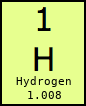

# Biology Basics

The purpose of this site is to explore biology and the things that make up biology. Feel free to [suggest corrections or additions][issues]. You may follow updates to this page using [this RSS feed](https://github.com/freeradical13/freeradical13.github.io/commits/master/index.md.atom) and [some RSS reader](https://download.cnet.com/browsers-newsreaders/).

# Big History

The [universe][] is at least 13.7 billion years old and more than 100 billion [light years][] in [diameter][].

We live on [Earth][] which is part of a [solar system][] with a [star][] called the [Sun][]. Earth and its star coalesced about [4.5 billion years ago][earth age]. Earth's solar system is part of the [Milky Way galaxy][], which is at least 12 billion years old, contains over 100 billion stars and 100 billion [planets][], and is over 100,000 light years in diameter (or about 0.0001% of the size of the universe).

There are over 100 billion [galaxies][] in the universe.

# Basics

This page assumes basic knowledge of [math][], [algebra][], [geometry][], and [scientific notation][].

# Matter

The universe is made of [matter][] which is something that has [mass][] (m) and takes up a position in [space][].

Examples of matter are [protons][], [neutrons][], and [electrons][]. Protons and neutrons each have a mass of about 1.6×10−27 [kilograms][] (kg), whereas electrons have a much smaller mass of about 9.1×10−31 kg. [Protons][proton radius] and [neutrons][neutron radius] each have a [radius][] of about 0.8×10−15 [meters][] (m), whereas electrons have a radius of less than [1.0×10−22][electron radius] m.

An [object][] (or [entity][]) is a collection of matter. An object has an [inertia][], meaning:

1. An object at rest will stay at rest unless a [force][] (F) is applied to push or pull it, and
2. An object in motion will stay in motion unless a force is applied to push or pull it.

The [speed][] of an object is a description of its movement and is the [rate][] at which its position in space changes over a [distance][] over a period of [time][] ([e.g.][for example] moving at 13 meters per [second][] (s), or 13 m/s).

The [velocity][] (v) of an object is a description of both its speed and its [direction][] in space (e.g. moving at 13 m/s _down_).

The [acceleration][] (a) of an object is the rate at which its velocity changes over a period of time (e.g. accelerating at 13 m/s over 1 second down, or 13 m/s2 down).

The [momentum][] (p) of an object, or its "quantity of motion", is its mass multiplied by its velocity (<code>p=m×v</code>).

If the mass of an object is constant, the force acting on it is the [rate of change][derivative] of its momentum over time (<code>F=dp/dt</code>); or, substituting momentum for acceleration and simplifying, its mass multiplied by its acceleration (<code>F=m×a</code>). The unit of force is the [newton][] (N).

When objects touch each other, the [perpendicular][] force their surfaces apply is called the [normal force][] (Fn), and any [parallel][] forces are called [frictional forces][] (Ff).

When an object A exerts a force on another object B, then object B exerts an [equal and opposite force][force third law] on object A.

# Electric Charge

[Electric charge][] is the property of some forms of matter to create an [electromagnetic field][] which applies a positive or negative force on other electrically charged matter, proportional to the distance between them. The magnitude of this force (named the electrostatic force) is calculated with [Coulomb's law][] (<code>F=ke×((q1×q2)/r2)</code>) which is [Coulomb's constant][] (ke) multiplied by the magnitudes of the two charges involved (q1 and q2) and divided by the square of the distance between the two objects (r2). This equation means that positive charges repel other positive charges, negative charges repel other negative charges, and positive charges attract negative charges (and vice versa).

Examples of electrically charged matter are protons, which are positively charged, and electrons, which are negatively charged. Protons and electrons have the same magnitude [elementary electric charge][], denoted 1e and -1e, respectively. Neutrons have no charge (electrically neutral).

An electromagnetic field creates [electromagnetic radiation][] which is a [wave][] of its force traveling (radiating) through space. A wave represents something that repeats over time at a [frequency][] which is how often it repeats a cycle per unit time (e.g. one cycle per second). If the unit of time is one second, the unit of frequency is [Hertz][] (Hz). [Wavelength][] is the distance a wave covers over one cycle.

The [force carrier][] for electromagnetic radiation is a [photon][]. Photons are considered [particles][] (which may also refer to objects) even though photons are [massless][]. In a [vacuum][] (space without matter), photons travel at the [maximum speed of light][] (c), or approximately 3×108 m/s. [Light][] is simply electromagnetic radiation; although, colloquially, light usually refers to [visible light][] which is the subset of light that humans see.

# Energy

[Energy][] (E) is the amount of work one object performs on, or transfers to, another object. Energy is often measured in [Joules][] (J). One joule may be defined as <code>J=N×m</code> or a force of one Newton acting on an object in the direction of its motion for one meter.

Energy is either [kinetic energy][] if an object is in motion (in most simple cases expressed as <code>(m×v2)/2</code>); or, [potential energy][], which may be thought of as stored energy.

Energy may [neither be created nor destroyed][conservation of energy], but only transformed. Mass may be converted to energy and vice versa through the [mass-energy equivalence][] equation (<code>E=m×c2</code>).

# Pressure and Temperature

[Pressure][] (P) is the normal force per unit area (A) applied to an object or <code>P=Fn/A</code>, often measured in [Pascals][] (Pa) (in N/m2). An object under pressure has potential energy.

[Atmospheric pressure][] is the pressure of a planet's atmosphere (e.g. the pressure of [air][]) on an object. The mass of air in the Earth's atmosphere [decreases expontentially with altitude][earth air pressure] so the atmospheric pressure decreases expontentially as an object rises above [sea level][].

Another unit of pressure is the [atmosphere][atm] (atm) which is the pressure on Earth at sea level and it's equivalent to 101,325 Pa.

[Heat][] is a measure of the total quantity of kinetic energy. [Temperature][] is a measure of the average kinetic energy of a set of objects. [Absolute zero][] is the coldest state at which an object has minimal movement; however, practically, it may be assumed that all objects have some movement (or [vibration][]) and thus some non-zero temperature.

Temperature or heat is either measured in [degrees][] (°) of change on the scale of [Celsius][] (°C) or [Fahrenheit][] (°F), or in absolute terms on the scale of [Kelvin][] (K).

Roughly, the scale of celsius is defined with 0°C being when water freezes at 1 atm, 100°C when water boils at 1 atm, and absolute zero is -273.15°C. The scale of fahrenheit is defined with 32°F being when water freezes at 1 atm, 212°F when water boils at 1 atm, and absolute zero is -459.67°F. Originally, the Kelvin scale was defined relative to Celsius, but is now defined as pressure invariant, with 0 as absolute zero, and 273.16K when water reaches its [triple point][]. Kelvin was designed so that an increase of one Kelvin is equal to an increase of 1°C.

The [lowest recorded surface temperature][temperature comparison] on Earth is <code>184K / -89.2°C / -128.6°F</code>, the highest <code>331K / 58°C / 136.4°F</code>, and the average <code>288K / 15°C / 59°F</code>.

The [specific heat][] is the amount of heat that must be absorbed or lost for 1g to change its temperature by 1°C.

All matter above absolute zero temperature continuously emits some of its kinetic energy as photons of electromagnetic radiation called [thermal radiation][] or heat. The temperature determines the [emission spectrum][] of wavelengths of the electromagnetic radiation. Most matter may also absorb some of any incoming electromagnetic radiation.

If two objects touch with a path permeable to heat, then, all else being equal, the hotter object heats the cooler object through [thermal conduction][] (and [thermal convection][] in the case of fluids and gases) until they (or at least their touching surfaces) reach [thermal equilibrium][].

# Atoms

[Atoms][] are made of at least one proton and zero or more neutrons in the atom's [nucleus][] (both protons and neutrons may be called [nucleons][]), and zero or more [electrons][] orbiting the nucleus in [electron shells][]. Electron shells are also called [energy levels][energy level] because the shell number represents the relative potential energy of electrons in that shell. As electrons are in shells farther from the nuclear proton(s), their potential energies increase because of the additional potential electrostatic force. Therefore, an electron moving to a shell closer to the nucleus must lose energy (e.g. heat) and an electron moving to a shell farther away must absorb energy (e.g. light). Shells are subdivided into [subshells][electron subshells], and subshells are subdivided into [orbitals][] (discussed later).

The number of nucleons is considered the [atomic mass number][] (A) since an atom's electrons' masses are so much relatively lighter than the nucleons' masses.

The number of protons is considered the [atomic number][] (Z) and categorizes the atom in a class called a [chemical element][] (e.g. Carbon is the chemical element class for any atom which has 6 protons; an atom is an instance of the chemical element). The atomic number of a chemical element is sometimes placed in a subscript to the left of the element symbol; for example, 6C, although this is redundant because the symbol C implies Z. Chemical elements and their reactions are the basis of chemistry.

The number of neutrons defines the element's [isotope][] which is represented as the element name followed by its atomic mass number (e.g. Carbon-14), so the number of neutrons may be deduced from the isotope name by subtracting the number of protons. An isotope may be abbreviated with the atomic mass number in a superscript to the left of the element symbol; for example, 14C for Carbon-14.

[Atomic mass][] (mA) is measured in [unified atomic mass units][] (u or amu), also known as daltons (Da) and 1u is approximately the mass of a nucleon. For various reasons, 1u is defined more strictly as <code>1/12th</code> of the mass of a Carbon-12 atom. [Relative atomic mass][] (Ar) is the [weighted average mass][weighted arithmetic mean] of a set of atoms. [Standard atomic weight][] (Ar,std) is Ar on Earth, reflecting the weighted average of isotope masses of an element on Earth.

If an atom has an equal number of protons and electrons, then it is electrically neutral. If an atom has an unequal number of protons and electrons, then it is [ionized][ion]. If an atom has more protons than electrons, then it's positively electrically charged, called a cation, and symbolized as E+ (where E is the element symbol, discussed below). If an atom has more electrons than protons, then it's negatively electrically charged, called an anion, and symbolized as E-. If the ion is more than one electron away from the neutral element, then the + or - is preceded by that number, e.g. E2+.

# Chemistry

## The Periodic Table of Elements

There are 118 known chemical elements, 92 of which have been observed naturally, the rest synthesized, and only four elements (Carbon, Oxygen, Hydrogen, and Nitrogen) make up about 96% of a human's mass, with another 21 required in small amounts (mostly Calcium, Phosphorus, Potassium, Sulfur, Sodium, Chlorine, and Magnesium) ([Campbell & Reece, 2002, pg. 27][campbell & reece, 2002]).

The [periodic table][] is a way to organize and understand the chemical elements based on observed patterns. The elements are ordered by atomic number Z from left to right, and starting again at the left when going down.

Within each square, the atomic number is at the top, followed by the element's symbol, followed by the element name, followed by its standard atomic weight (Ar,std):

[][periodic table image]

<a href="https://en.wikipedia.org/wiki/File:32-column_periodic_table-a.png">Based on an image by Sandbh</a>

The main reason for describing elements in such a way has to do with [electron configuration][] patterns and the behaviors they may cause (described later).

Rows are called periods and describe a new electron shell which accumulates on top of any previous periods' shells. This outermost shell is known as the [valence shell][] which generally contains the [valence electrons][] that may be reactive (some ionized elements complicate this picture since they contain one less electron and effectively drop down a shell - for example, the Lithium cation - but the table is a conceptual starting point from neutral atoms).

Columns are called groups and generally group by the number of valence electrons, and thus generally group by similar behavior.

Each electron shell in an atom has a maximum number of electrons (<code>2×ShellNumber2</code>) before the next shell starts. Each shell has a distinct energy level and is broken down into subshells which have a maximum number of electrons before the next subshell starts. Each subshell is broken down into orbitals of [up to 2 electrons][orbitalmax2e] each. Additional electrons fill empty orbitals in a sub-shell before pairing up with an electron in an existing orbital. A full orbital is called an [electron pair][]. A [lone pair][] of electrons is a filled valence orbital of two electrons that are not shared with another atom (sometimes noted with a <code>:</code>). Electron configurations are represented by the accumulation of subshells up to the total number of electrons, with each subshell described by the shell number, followed by the subshell name, followed by the number of electrons in that subshell in a superscript. The subshell names are:

* s: For groups 1 and 2 (or group 18 for Helium) only, at most 2 electrons.
* p: Starting at period 2, for groups 13-18 only, at most 6 electrons.
* d: Starting at period 4, for groups 3-12 only, at most 10 electrons.
* f: Starting at period 6, in between groups 3 and 4 only, at most 14 electrons.
* [...]

Examples of electron configurations for the first 11 neutral elements:

<pre>
Hydrogen (1):  1s1
Helium (2):    1s2
Lithium (3):   1s2 2s1
Beryllium (4): 1s2 2s2
Boron (5):     1s2 2s2 2p1
Carbon (6):    1s2 2s2 2p2
Nitrogen (7):  1s2 2s2 2p3
Oxygen (8):    1s2 2s2 2p4
Florine (9):   1s2 2s2 2p5
Neon (10):     1s2 2s2 2p6
Sodium (11):   1s2 2s2 2p6 3s1
[...]
</pre>

Instead of writing the full details of long electron configurations, a common practice is to start with the previous group 18 element in [brackets] followed by the rest of the element's electron configuration. For example, Sodium (element #11) may be written as [Ne] 3s1.

When d and f orbitals are filled, they backfill the previous shell. For example, Scandium's (element #21) electron configuration is [Ar] 4s2 3d1.

The electrons that tend to cause an atom to chemically react are those electrons with the highest energies (the farthest distances from the nucleus) and are usually those in the valence shell. The exceptions are elements with d or f orbitals because even though those backfill the previous, non-valence shell, they may have higher energies than the s orbital electrons of the valence shell; however, these energies decrease moving right on a period, so the number of these valence electrons is limited.

Generally, atoms tend to be chemically reactive when their valence electrons do not complete their valence shell and thus the atom is unstable (high energy). For example, Hydrogen is unstable because it wants one more electron to complete its valence shell. All elements above period 1 generally want 8 electrons in their valance shell and this heuristic is called the [octet rule][]. Atoms tend to gain, shed, or share pairs of electrons as needed to reach a full and stable (low energy) set of valence electrons. This is one of the most important aspects of chemistry and means that groups have generally similar behaviors since they're generally grouped by the number of valence electrons. There are 18 numbered and 6 named groups for convenience:

* Group #1: [Alkali metals][] - Highly reactive because they want to lose an electron to drop to the previous period's full set of valence electrons.
* Group #2: [Alkaline earth metals][] - Somewhat reactive because they want to lose two electrons to drop to the previous period's full set of valence electrons.
* Group #15: [Pnictogens][]
* Group #16: [Chalcogens][] - Somewhat reactive because they want to gain two electrons or share pairs of electrons to fill their set of valance electrons.
* Group #17: [Halogens][] - Highly reactive because they want to gain an electron or share a pair of electrons to fill their set of of valence electrons.
* Group #18: [Noble gases][] - Generally not chemically reactive ([inert][]) because the set of valence electrons is full.

The radius of an atom increases from top to bottom as electron shells are added; however, moving left to right, the radius of an atom decreases as the additional protons draw in the additional electrons.

[Ionization energy][] (or cationization energy) is the amount of energy needed to remove an electron from an element (and form a cation). Energy is required to remove the electron because the electron is attracted to its element's proton(s). Following from the octet rule, ionization energy is lowest on the left of the table because those elements want to lose electron(s) to achieve a full set of valence electrons, and [ionization energy generally increases from left to right][ionization energy increases right] as additional protons add more pull to the electrons. Ionization energy decreases from top to bottom because valence electrons are farther from the protons (to which they're attracted) and thus the electrons are easier to peel off.

[Electron affinity][] (or anionization energy) is either:

1. The amount of energy released when an electron is added to an incomplete set of valence electrons. Energy is released because any time an electron drops into a new orbital, it causes the release of electromagnetic radiation energy in the form of a photon. Or,
1. The amount of energy spent adding an electron to create a new subshell or adding an electron to a subshell which only has a single electron in each of its orbital pairs (e.g. Nitrogen). Energy is needed to overcome the last subshell's stability.

Generally, electron affinity increases from left to right (except for those with stable last subshells) because right-most elements want additional electrons to achieve stability.

[Electronegativity][] is the tendency of an atom to attract electrons to its valence shell (closely related to electron affinity). It follows from the octet rule that atoms increase in electronegativity from left to right. Electronegativity decreases from top to bottom because the valence shell is farther away from the positively charged nucleus and thus there's less pull to bring in additional electrons. Electropositivity is the opposite of electronegativity.

Most elements are [metals][] (although there are only two named metal groups): they are toward the left side of the periodic table (with the exception of Hydrogen), have low ionization energies, low electron affinity, are highly [electrically conductive][], [ductile][], and generally solid at standard temperature.

[Nonmetals][] are the opposite of metals: they are toward the right side of the table, have high ionization energies, high electron affinities, are not very electrically conductive, and they are often gases (e.g. Hydrogen, Helium, etc.), although some are brittle solids (e.g. Carbon).

There are a handful of [Metalloids][] which have properties of both metals and nonmetals and run down a diagonal in the p-block (e.g. Boron, Silicon, etc.).

A [transition metal][] is any element with a partially filled d sub-shell (groups 3-11).

In summary, although with various exceptions, the broad trends of atomic size, ionization energy, electron affinity and metallic character may be visualized as:

[][periodic trends image]

# Big History (Continued)

After the [Big Bang][], the universe was mostly made of hydrogen, helium, and lithium (the first three elements), some of which combined into plasma stars held together by [gravity][]. At high enough temperatures inside stars, hydrogen atoms undergo [nuclear fusion][] where nuclei (and their protons and neutrons) combine to produce [helium][stellar nucleosynthesis]. As the hydrogen is used up to create helium, the star's temperature rises and allows for the fusion of [helium into carbon and oxygen][triple alpha process] and some neon and heavier elements. As the star temperature continues to increase, nuclear fusion produces elements [up to iron][heavy elements]. The remaining elements in the universe are produced by [certain stars' s-processes][s process] and [stars' explosions in a supernova or collapses into a black hole or neutron star][r process].

# Chemistry (Continued)

Two or more atoms may be held together by [chemical bond]. The major types of bonds are:

1. A [covalent bond][] defines a [molecule][] and occurs when atoms share one or more pairs of electrons in their valence shells. For example, Hydrogen wants to gain an electron and Oxygen wants to gain two electrons, so it's common for two Hydrogens to each share their electron with one of the valence electrons in the Oxygen to form an Oxygen bonded with two Hydrogens, or water. A molecule is considered a [chemical compound][] if it's made of more than one type of element. The strongest form of a covalent bond is a [sigma bond][] (σ bond). Another, weaker form of a covalent bond is a [pi bond][] (π bond).
1. An [ionic bond][] defines an [ionic compound][] or [salt][] when one atom transfers electron(s) to another, creating a cation and anion, which may then cause electrostatic attraction of the oppositely charged ions. For example, the alkali metal Sodium (Na) wants to lose an electron, and the halogen Chlorine (Cl) wants to gain an electron, so Na may give its electron to Cl, thus making Na+ and Cl- and then those two ions may bond due to the electrostatic force, forming NaCl (otherwise known as table salt).
1. A [metallic bond][] amongst positively charged metal cations in a sea of shared electrons.

A [chemical substance][] is a set of one or more elements, molecules or compounds of the same composition (i.e. "pure"). A substance cannot be separated through physical means other than breaking chemical bonds (interpret the [venn diagram][] by the location of the bond arrows):

A [mixture][] is a combination of different substances which cannot be separated through physical means. Therefore, an object is either a substance or a mixture. A mixture is [homogenous][homogenous mixture] if its substances have the same proportions throughout (e.g. air), or otherwise [heterogeneous][heterogeneous mixture].

A [molecular entity][] is a single instance of a part or whole of a molecule, such as an atom, ion, or molecule. A set of identical molecular entities (in other words, a class of molecular entities) is a [chemical species][]. For example, a single water molecule is a molecular entity, but all the instances of a water molecule in some context is a chemical species. Relatedly, an [elementary entity][] is similar to a molecular entity but may also be an electron, particle, or group of particles.

A substance may be described in many ways, all of which may represent either an entity or a species:

1. A [molecular formula][] describes the number of atoms of each element in each molecule in a subscript to the right of the element symbol (or 1 if the subscript is omitted). For example, the molecule H2O represents two Hydrogen atoms bonded with one Oxygen atom.
1. An [empirical formula][] is the molecular formula with the ratios of elements reduced to the simplest form. For example, a molecule of [Benzene][] has a molecular formula of C6H6, but the empirical formula is CH.
1. A [trivial][trivial name] or [retained name][]; for example, Water represents H2O (in the case of water, the molecular and empirical formulas are the same).
1. Various [structural formulas][] that describe the two-dimensional (2D) or three-dimensional (3D) structure of the molecule. For example, a covalent bond is represented with a long dash (–) such as <code>H–O–H</code> for H2O. As another example, a double covalent bond is represented with a double dash (=) such as <code>O=C=O</code> for CO2.
    1. [Wedge-hash diagrams][wedge-dash diagrams] (or wedge-dash diagrams or Natta projections): The filled wedge is projected toward the viewer (in front of the page). The dashed wedge is projected away from the viewer (behind the page).
    1. [Fischer projections][]
    1. [Unspecified stereochemistry][]: Wavy single bonds are unknown or unspecified stereochemistry. [Stereochemistry][] is the study of substances with the same formula but with different positions of atoms in space that cannot be rotated around a single bond to match each other (discussed in detail later).
    1. [Skeletal formulas][]
1. An ionic compound name (or systematic name) with a set of element names with any cation first; for example, Sodium Chloride. If the cation is a transition metal, then it may be followed by roman numerals in parentheses ([type-I compounds][], [type-II compounds][] or [type-III compounds][]) which represents the net positive charge of that cation; for example, Iron(III) Oxide is Fe2O3 because the III means that Iron is Fe3+ and gave 3 extra electrons, and since each Oxygen atom needs two electrons, there should be two Iron atoms, making 6 extra electrons, which means there are three Oxygen atoms, each taking 2 of those 6 extra electrons.

When substances of different electronegativities are bonded, electrons will tend to be drawn closer to the atoms with higher electronegativities, thus leading to positive or negative [partial charges][chemical polarity] ([δ][greek delta]+ or δ-, respectively), creating a polarized (or polar) bond. For example, in the water molecule, Oxygen is more electronegative than the Hydrogens, so there's a partial negative charge at the end of the Oxygen away from the two Hydrogens, and partial positive charges on the opposite ends of the Hydrogens:

[][polar water molecule]

[Oxidation states][] are a conceptualizatized simplification of covalent bonds as ionic bonds. Oxidation states assume full hogging of electrons in a polar molecule. For example, in water, Oxygen would have an oxidation state of -2 since it hogs both Hydrogens' electrons, and each Hydrogen would have an oxidation state of +1. The atom losing the electrons are said to be oxidized (even if by something other than Oxygen!), i.e. losing electrons, and the atoms doing the oxidation are said to be reduced by the other elements, i.e. reducing the electrons of the oxidized atoms.

[Intermolecular forces][] describe attraction and repulsion forces between substances and are relatively weaker than intramolecular forces:

1. [Dipole-dipole forces][] occur when the opposite partial charges of the [dipoles][] of two polar molecules (or different parts of a large molecule) attract each other. For example, two water molecules have a dipole-dipole interaction between the partial negative end of the Oxygen of one molecule and the partial positives of the Hydrogens of the other molecule. When this interaction occurs with Hydrogren, this may be called Hydrogen bonding since it's the strongest form of dipole-dipole interaction.
1. [Van der Waals forces][]
    1. [London dispersion forces][] occur transiently at short distances as electrons happen to be in parts of their orbitals which create partial charges and create temporary dipole-dipole interactions.

When an element is anionized with one additional electron, the suffix of its name changes to -ide. The suffix -ate means more, and -ite means fewer. The prefix per- means one more, and hypo- means one fewer.

In general, matter exists in one of [four states][state of matter]:

* [Solid][]: Matter which has fixed [volume][] and fixed shape, with its components close together and fixed in place. In equations, solid substances may be suffixed with (s).
* [Liquid][]: Matter which has fixed volume and variable shape to fit its container, with its components close together but not fixed in place. In equations, liquid substances may be suffixed with (l).
* [Gas][]: Matter which has variable volume and variable shape, both to fit its container, and its components are neither close together nor fixed in place. In equations, gas substances may be suffixed with (g).
* [Plasma][]: Matter which has variable volume and variable shape, but also contains a large number of ions or electrons moving freely.

## Moles

A [mole][] (mol) is defined as the number of elementary entities in a substance as there are atoms in 12g of 12C. There are ~6.022140857×1023 ([Avogadro constant][]) atoms in 12g of 12C. Therefore, <code>1 mol 12C = 12g</code>.

Since 1u is 1/12th the mass of one 12C atom, then <code>1 mol 1u = 1g</code>; therefore, <code>1 mol of isotope mAE ~= mA grams</code>. If a substance doesn't refer to a particular isotope, then standard atomic weight (Ar,std) is generally used instead of mA. [Molecular mass][] is simply the sum of atomic masses of a molecule.

For example, Ar,std of H is 1.008, and Ar,std of O is 15.999, so <code>1 mol H2O ~= (1.008×2)g + 15.999g ~= 18.015g</code>. The [molar mass][] (M) of a substance is simply this relationship in terms of g/mol, so M(H2O) ~= 18.015 g/mol.

## Chemical Reactions

A [chemical reaction][] occurs any time a chemical bond is created or broken. A [chemical equation][] describes a reaction with [reagents][] (or reactants) on the left-hand side of the equation which yields (→) the [product(s)][chemical reaction product] of the chemical reaction on the right-hand side of the equation. For example, the chemical equation for the reaction of molecular hydrogen and molecular oxygen plus input energy (E) yields water and output energy E':

<code>2H2 + O2 + E → 2H2O + E'</code>

Reactions that don't require input energy are called [spontaneous][spontaneous reactions].

A chemical equation must be balanced using [stoichiometry][] because the total number of atoms of each element must be the same on both sides.  A stoichiometric coefficient to the left of a substance represents the number of substances or moles of that substance in the chemical reaction.

Chemical reactions may also be [reversible][reversible reaction] and go in both directions, signified by a double arrow (⇌), always tending towards reaching dynamic [chemical equilibrium][] where the rates of reactions in both directions are equal. For example:

<code>HCO3- + H+ ⇌ H2CO3</code>

Given a balanced chemical equation and the relationship of moles to atomic weights, and a mass of one substance, composition stoichiometry may be used to determine the mass of other substances in the equation. [For example][example composition stoichiometry], in the following equation:

<code>Fe2O3 + 2Al → Al2O3 + 2Fe</code>

If we know there are 85g of Fe2O3, since each of those molecules is about 160u, Fe2O3 is about 160g/mol, so first convert 85g to moles using [dimensional analysis][] by multiplying by 1mol/160g to cancel the g, and therefore, 85g divided by 160g/mol is 0.53 mols. Since there are two moles of Al for every 1 mole of Fe2O3, <code>2×0.53 = 1.06 mols</code> of Al would be needed to react with all of the Fe2O3. Given Al's atomic weight is about 27u, 1 mole is about 27g, so <code>1.06×27 = 28.62g</code> of Al would be needed to react with all of the Fe2O3.

An [endothermic reaction][] occurs when the system absorbs heat energy from its surroundings (often represented as an additional heat, light, electricity, sound, etc. reagent). An [exothermic reaction][] occurs when the system releases energy (often represented as an additional heat, light, electricity, sound, etc. product).

[Le Chatelier's principle][] asserts that the reaction tends towards equilibrium even after any changes to concentration, temperature, volume, or pressure (thus why it's called dynamic). If the temperature increases in an endothermic reaction, the system will favor the forward reaction. If the temperature decreases in an exothermic reation, the forward reaction will be favored to match the previous temperature. If the concentration of a substance increases, the reaction will favor that side of the reaction; otherwise, it will favor the other side. If volume decreases, concentrations will increase, so the reaction will favor the side that generates more total moles (i.e. creating more of the side that's more likely to react). Conversely, if volume increases, concentrations will decrease, so the reaction will favor the side that has fewer total moles (i.e. creating more of the side that's less likely to react).

## Water

Liquid water is a particularly imporant molecule. Since it's a polar molecule, it has a tendency to create hydrogen bonds with nearby water molecules. This phenomenon is called [cohesion][]. Water also has a greater [surface tension][] (how difficult it is to stretch or break the surface of a liquid).

A [calorie][] (cal) is the amount of heat energy it takes to raise the temperature of 1g of water by 1°C (conversely, the amount of heat energy released when 1g of water is cooled by 1°C). 1 calorie also equals 4.184 J (conversely, <code>1 J = 0.239 cal</code>). Therefore, the specific heat of water is 1 cal per 1g per °C.

Relative to other substances, water has a high specific heat, meaning that it will change its temperature less when it absorbs or loses an amount of heat.

Water's polarity makes it a common solvent.

Substances that are ionic or polar are [hydrophilic][] meaning that they have a high affinity for water and thus increase their [solubility][] in water. Substances that are non-ionic and non-polar are [hydrophobic][] meaning that they have a low affinity for water and thus decrease their solubility in water.

## Acids and Bases

[Protium][] is the most common isotope of Hydrogen on Earth with one proton and zero neutrons (1H). [Deuterium][] is an isotope of Hydrogen with one proton and one neutron (2H). A [hydron][] is a cationic Hydrogen with 0 electrons (1 or 2H+). A protium hydron (1H+) is often just called a proton since it's just a proton with no neutrons nor electrons.

A [solution][] is a homogenous mixture with [solute(s)][solute] dissolved into a [solvent][] (the largest proportion substance). A solvent is often a liquid and if such a liquid is water, the solution is referred to as an [aqueous solution][] (in equations, sometimes denoted with <code>(aq)</code>). A [suspension][] is a heterogenous mixture where one substance eventually settles, whereas [colloids][] are heterogenous mixtures that don't settle ([emulsions][] which are colloids of liquids).

A [litre][] (L) is a unit of volume equal to <code>1m3/1000</code>. [1 litre of water][water L kg] is approximately 1 kg under standard conditions (e.g. 25°C).

The amount of a substance is usually measured in mass, moles or volume (e.g. 1g of salt in water). The [concentration][] of substance A mixed into substance B is the amount of substance A divided by the total volume of substance B. [Molarity][] (or molar concentration) (M) is the number of moles of a solute per liter of solution, abbreviated with square brackets around the solute (e.g. [Cl-]). [Molality][] is the number of moles of solute per kg of solvent.

In a reversible chemical reaction such as <code>aA + bB ⇌ cC + dD</code>, the [equilibrium constant][] (keq [or kc for concentration]) equals ([C]c × [D]d) / ([A]a × [B]b), ignoring the solvent and any solids, where the a, b, c, and d coefficients are the mole ratios. Given that molarity depends on temperature, keq is a function of temperature. This constant describes the relative proportions of concentrations of reagents and products at equilibrium.

[Hydroxide][] is the anionic molecule OH-. [Hydronium][] is the cationic molecule H3O+.

There are multiple ways to define acids and bases:

1. A [Brønsted-Lowry acid][brønsted-lowry] is a substance capable of donating a proton. A [Brønsted-Lowry base][brønsted-lowry] is a substance with a lone pair of electrons capable of accepting a proton (or indirectly, a substance that dissociates into hydroxide ions which then accepts the protons). A [conjugate acid][] is the product that accepted protons (because it can then give that proton back in the reverse direction), and a conjugate base is the product that donated protons. For example, water is [amphoteric][] meaning it can be either an acid or a base.
1. An [Arrhenius acid][arrhenius] is a substance that tends to react in an aqueous solution to increase the concentration of protons, or, more commonly, hydronium. For [example][example arrhenius acid], <code>HCl(aq) + H2O(l) ⇌ Cl-(aq) + H3O+(aq)</code>. An [Arrhenius base][arrhenius] is a substance that tends to react in an aqueous solution to increase the concentration of hydroxide. For [example][example arrhenius acid], <code>NaOH(aq) + H2O(l) → Na+(aq) + H3O+(aq)</code>.
1. A [Lewis acid][lewis acids and bases] is a substance that has an empty electron orbital. A [Lewis base][lewis acids and bases] is a substance that has a lone pair of electrons.

The Arrhenius definition is limited to aqueous solutions whereas the Brønsted-Lowry and Lewis definitions are more general. Unless otherwise noted, "acid" generally refers to the Brønsted-Lowry definition.

A substance that is basic is also sometimes referred to as [alkaline or an alkali][alkali].

A strong acid or base dissociates completely in aqueous solution (→), whereas a weak acid or base dissociates partially (⇌).

A small proportion of water molecules in liquid water will tend to [autoionize][water autoionization] and form hydronium and hydroxide ions (<code>H2O + H2O ⇌ H3O+ + OH−</code>). For pure water, at the equilibrium point under standard conditions (e.g. 25°C), [H+] = [H3O-] = 10-7 M.

The [pH scale][] is a way to describe how acidic or basic a mixture is, and it's just the [cologarithm][] of molarity: <code>pX = -log [X]</code>. pH is the cologarithm of H+ and describes how acidic the mixture is. Conversely, pOH is the cologarithm of OH- and describes how basic the mixture is. When <code>pH = pOH</code> (in other words, <code>[H+] = [OH-]</code>), the mixture is described as neutral. Mixtures with <code>[H+] > [OH-]</code> are acidic. Mixtures with <code>[H+] < [OH-]</code> are basic. In any mixture, <code>[H+]×[OH-] = 10-14</code> (in other words, <code>pH + pOH = 14</code>). As the molarity of protons increases (e.g. stomach acid is between ~10-1.5 to ~10-3.5), the pH value decreases and thus acidity increases. Therefore, mixtures with a pH below 7 are acidic and basic above 7.

A [buffer][] is a substance that minimizes changes to pH by accepting protons when in excess and donating protons when in deficit. Generally, a buffer is a molecule with both an acid and a base, and its equilibrium constant controls its behavior in buffering the mixture. For example, carbonic acid yields a bicarbonate ion and a proton: <code>H2CO3 ⇌ HCO3- + H+</code>.

## Three-Dimensional Structure

The size and structure of a substance is key to the way it functions because of the implied likelihoods of the structure on chemical reactions with other substances. A commonly used phrase is that structure implies function.

Although substance structures are often described by molecular, empirical, or two-dimensional formulas for simplicity, actual substance structures are three-dimensional.

[Isomers][] are substances that have the some molecular formula but different structures.

[Structural isomers][] differ in their covalent arrangements. For example, butane (C4H8) is:

<pre>
  H H H H
  | | | |
H–C–C–C–C–H
  | | | |
  H H H H
</pre>

Whereas isobutane (also C4H8) is:

<pre>
  H–C–H
  H ⎪ H
  | ⎪ |
H–C–C–C–H
  | | |
  H H H
</pre>

[Geometric isomers][] have the same covalent arrangements but differ in spatial arrangements.

A [chiral][] substance may have one of two, mirror-image configurations, each of which is called an [enantiomer][] which are geometric isomers and this can have functional implications. One form is prefixed with l- or (-) ([levorotatory][] or left-handed), and the other is prefixed with d- or (+) ([dextrorotatory][] or right-handed). [R and S configurations][] can describe substances with multiple chiral carbons.

## Organic Chemistry

An [organic compound][] is a compound that has Carbon and organic chemistry is the study of Carbon-based compounds. Historically, organic meant produced by [lifeforms][life], although it's now known that some Carbon-based molecules may be produced outside of lifeforms, but this ambiguous term "organic" has persisted. Carbon-based compounds that are considered to be lifeforms are called [organisms][].

[Hydrocarbons][] are organic molecules composed of Carbon and Hydrogen atoms. The electronegativities between Hydrogen and Carbon are close enough (2.2 and 2.55, respectively, on the [Pauling scale][]) that [hydrocarbons are generally considered non-polar][hydrocarbons non-polar] and therefore generally hydrophobic.

Hydrocarbons are either [aliphatic][] (also known as non-aromatic), or [aromatic][] (also known as arenes). Only aromatics have stable cyclic arrangements, so most aliphatics are [acyclic][].

A [saturated hydrocarbon][] has no double or triple bonds (i.e. it's saturated with the maximum number of Hydrogens). An [unsaturated hydrocarbon][] has double or triple bonds between Carbons.

It is common to omit Carbons and Hydrogens in structural formulas for simplicity. For example, the structural formula for Cyclohexane (C6H12) is a ring:

<pre>
  H   H
   \ /
H   C   H
 \ / \ /
  C   C
 /⎪   ⎪\
H ⎪   ⎪ H
H ⎪   ⎪ H
 \⎪   ⎪/
  C   C
 / \ / \
H   C   H
   / \
  H   H
</pre>

This can be simplified into a simple hexagon where each vertex is an implied Carbon atom with two Hydrogens:

⬡

Similarly for structures with double covalent bonds, the ring can be simplified with double lines. For example, the structural formula for Benzene (C6H6) is a ring:

<pre>
    H
    |
    C
   / ⑊
H–C   C–H
  ║   ⎪
H–C   C–H
   \ ⫽
    C
    |
    H
</pre>

This can be simplified into the following hexagon with three double bonds where each vertex is an implied Carbon atom with one Hydrogen:

⌬

The longest linear covalently bonded chain of Hydrocarbons may be called a [backbone chain][] (or main chain or [carbon skeleton][]) from which the rest of the molecule builds off of. These other parts are called [side chains][] (or pendant chains or branches) and may be represented with the letter R (meaning root or remainder).

## Naming Organic Compounds

An [alkane][] is an acyclic saturated hydrocarbon. An example is [Methane][] which is CH4 and is the main component of [natural gas][]. A straight-chain alkane has the suffix [-ane][alkane suffix].

An [alkyl][] is an alkane without one Hydrogen and has the suffix -yl.

An [alkene][] (or olefin) is an unsaturated alkane with at least one C=C double bond. An [alkyne][] is an unsaturated alkane with at least one C≡C triple bond. The [position of the double or triple bond][unsaturated hydrocarbon] is written at the start of the name or before the -ene or -yne suffix. If there are more than one such bonds, the positions are comma separated (e.g. 2,4-pentadiene). A substance that's both an alkene and alkyne has the suffix -enyne.

The number of Carbons in a backbone chain may be thought of as the size of the alkane and gives it a [prefix][alkane prefixes]:

* 1: Meth-
* 2: Eth-
* 3: Prop-
* 4: But-
* 5: Pent-
* 6: Hex-
* 7: Hept-
* 8: Oct-
* 9: Non-
* 10: Dec-
* 11: Undec-
* 12: Dodec-
* 13: Tridec-
* 14: Tetradec-
* 15: Pentadec-
* 16: Hexadec-
* 17: Heptadec-
* 18: Octadec-
* 20: Eicos-
* 22: Docos-
* 23: Tricosa-
* 24: Tetracos-
* 26: Hexacos-
* 28: Octacos-
* 30: Triacont-
* 32: Dotriacont-
* 33: Tritriacont-
* 34: Tetratriacont-
* 35: Pentatriacont-
* 40: Tetracont-
* 50: Pentacont-
* 60: Hexacont-
* 70: Heptacont-
* 80: Octacont-
* 90: Nonacont-
* 100: Hect-

An [aryl][] is an aromatic hydrocarbon minus one Hydrogen such as a [phenyl][] (a Benzene minus one Hydrogen).

[Naming an organic compound][]:

* An alkane with branched groups is prefixed with the position of the Carbon where the branch occurs, followed by a prefix for the branched group, followed by the name of the alkane chain.
* If there are multiple branches, the number prefix is a comma-separated list and the branch prefix is prefixed with di-, tri-, tetra-, etc. for the number of groups.
* If the multiple branches are different types of groups, they're ordered in alphabetical order.
* For alkenes and alkynes, the position(s) of the double or triple bonds are a comma separated list infixed in the name, and a prefix of di-, tri- etcs before the final prefix.
* Prefix cis- or trans- if needing to describe the isomerism.

## Functional Groups

The parts of an organic molecule that are most commonly involved in chemical reactions are called [functional groups][] (or [substituents][]). When discussing functional groups, a convention is sometimes used which describes their molecular formulas without internal bond symbols, and the group is prefixed or suffixed by a dash depending on where the functional group bonds to the rest of the compound. Common functional groups:

1. [Hydroxyl][] (<code>R–COH</code>): Oxygen covalently bonded to a Hydrogen (<code>O–H</code>) and the Oxygen is covalently bonded to the compound. The highly electronegative Oxygen causes that part of the compound to be hydrophilic. Compounds containing a hydroxyl group are called Alcohols and names are usually suffixed with -ol. This functional group is hydrophilic.

    For example, [Ethanol][] is the drug in alcoholic beverages:
    
    <pre>
      H H
      | |
    H–C–C–O–H
      | |
      H H</pre>
1. [Carbonyl][] (<code>R–CO</code>): Oxygen double-covalently bonded to a Carbon (<code>C=O</code>) which is covalently bonded to any two other atoms.
1. [Acyl][] (<code>R–CO</code>): A type of carbonyl in which R is an alkyl or aryl. If the acyl is at the end of a chain, the group is called an aldehyde; otherwise, it's called a ketone. This functional group is hydrophilic.
1. [Carboxyl][] (<code>R–COOH</code>): A Carbon acting in both a Carbonyl and Hydroxyl. Also called Carboxylic Acids. The reason carboxyls tend to be acidic whereas hydroxyls tend not to be is because there are two highly electronegative Oxygens near the Hydrogen in a carboxyl. This functional group is hydrophilic.
1. [Amino][] (<code>R–CNH2</code>): Two Hydrogens covalently bonded to a Nitrogen (<code>H–N–H</code>) which is covalently bonded to the compound. Also called Amines. An amino group often acts as a base because the Nitrogen has one unpaired valence electron willing to be shared with a Hydrogen proton. Compounds that have both amino and carboxyl functional groups are called amino acids. This functional group is hydrophilic.
1. [Sulfhydryl][] (<code>R–SH</code>): A sulfhydride (Sulfer bonded to a Hydrogen) which is covalently bonded to the compound. Also called [thiols][]. This functional group is hydrophilic.
1. [Phosphate][]: A Phosphorus double-covalently bonded to an Oxygen and three carbonyl side chains (<code>O=P–(OR)3</code>). Also called [Organophosphates][]. This functional group is hydrophilic.
1. [Acetyl][] (<code>R–CH3CO</code>): A methyl group (<code>CH3</code>) covalently bonded to a Carbon which is double-covalently bonded to an Oxygen and covalently bonded to the remainder.

# Biology

Biology is the [study of life][biology history]. The definition of life is [controversial][definition of life].

# History of Life

Oceans formed on Earth about [4.4 billion years ago][history of oceans].

# Cells

A [cell][] is a set of atoms encapsulated in a [membrane][], mostly filled with water. For example, a medium-sized E. coli cell has about [35 billion atoms][atoms in e coli] and a human body has about [1027 atoms][atoms in human body].

An organism is a set of one or more cells.

# Feedback

[Ask a Question or Contribute][issues]

# Methodology/Meta

* Every time I "context switch" into this after some time away, I re-read the entire page before re-starting. Along with the process of writing itself, this seems to maximize retention.

[absolute zero]: https://en.wikipedia.org/wiki/Absolute_zero
[acceleration]: https://en.wikipedia.org/wiki/Acceleration
[acetyl]: https://en.wikipedia.org/wiki/Acetyl_group
[acyclic]: https://en.wikipedia.org/wiki/Open-chain_compound
[acyl]: https://en.wikipedia.org/wiki/Acyl_group
[air]: https://en.wikipedia.org/wiki/Atmosphere_of_Earth
[algebra]: https://www.khanacademy.org/math/algebra
[aliphatic]: https://en.wikipedia.org/wiki/Aliphatic_compound
[alkali]: https://en.wikipedia.org/wiki/Alkali
[alkali metals]: https://en.wikipedia.org/wiki/Alkali_metal
[alkaline earth metals]: https://en.wikipedia.org/wiki/Alkaline_earth_metal
[alkane]: https://en.wikipedia.org/wiki/Carbon%E2%80%93hydrogen_bond
[alkane prefixes]: https://en.wikipedia.org/wiki/IUPAC_nomenclature_of_organic_chemistry#Alkanes
[alkane suffix]: https://en.wikipedia.org/wiki/-ane
[alkene]: https://en.wikipedia.org/wiki/Alkene
[alkyl]: https://en.wikipedia.org/wiki/Alkyl
[alkyne]: https://en.wikipedia.org/wiki/Alkynes
[altitude]: https://en.wikipedia.org/wiki/Altitude
[amino]: https://en.wikipedia.org/wiki/Amino
[amphoteric]: https://en.wikipedia.org/wiki/Amphoterism
[aqueous solution]: https://en.wikipedia.org/wiki/Aqueous_solution
[aromatic]: https://en.wikipedia.org/wiki/Aromatic_hydrocarbon
[arrhenius]: https://www.khanacademy.org/science/chemistry/acids-and-bases-topic/acids-and-bases/a/arrhenius-acids-and-bases
[aryl]: https://en.wikipedia.org/wiki/Aryl
[atm]: https://en.wikipedia.org/wiki/Atmosphere_(unit)
[atmospheric pressure]: https://en.wikipedia.org/wiki/Atmospheric_pressure
[atomic mass]: https://en.wikipedia.org/wiki/Atomic_mass
[atomic mass number]: https://en.wikipedia.org/wiki/Mass_number
[atomic number]: https://en.wikipedia.org/wiki/Atomic_number
[atoms]: https://en.wikipedia.org/wiki/Atoms
[atoms in e coli]: http://book.bionumbers.org/what-is-the-elemental-composition-of-a-cell/
[atoms in human body]: http://book.bionumbers.org/what-is-the-elemental-composition-of-a-cell/
[avogadro constant]: https://en.wikipedia.org/wiki/Avogadro_constant
[backbone chain]: https://en.wikipedia.org/wiki/Backbone_chain
[benzene]: https://en.wikipedia.org/wiki/Benzene
[big bang]: https://en.wikipedia.org/wiki/Big_Bang
[biology history]: https://en.wikipedia.org/wiki/Biology#History
[biology numbers]: http://bionumbers.hms.harvard.edu/
[black-body radiation]: https://en.wikipedia.org/wiki/Black-body_radiation
[brønsted-lowry]: https://www.khanacademy.org/science/chemistry/acids-and-bases-topic/acids-and-bases/a/bronsted-lowry-acid-base-theory
[buffer]: https://en.wikipedia.org/wiki/Buffer_solution
[calorie]: https://en.wikipedia.org/wiki/Calorie
[carbon skeleton]: https://en.wikipedia.org/wiki/Skeletal_formula
[carbonyl]: https://en.wikipedia.org/wiki/Carbonyl
[carboxyl]: https://en.wikipedia.org/wiki/Carboxyl
[campbell & reece, 2002]: https://duckduckgo.com/?q=Biology%2C%20Sixth%20Edition%2C%20Campbell%20%26%20Reece%2C%20ISBN%200805366245%2C%202002
[cell]: https://en.wikipedia.org/wiki/Cell_(biology)
[celsius]: https://en.wikipedia.org/wiki/Celsius
[chalcogens]: https://en.wikipedia.org/wiki/Chalcogen
[chemical bond]: https://en.wikipedia.org/wiki/Chemical_bond
[chemical compound]: https://en.wikipedia.org/wiki/Chemical_compound
[chemical element]: https://en.wikipedia.org/wiki/Chemical_element
[chemical equation]: https://en.wikipedia.org/wiki/Chemical_equation
[chemical equilibrium]: https://www.khanacademy.org/science/chemistry/chemical-equilibrium/equilibrium-constant/v/reactions-in-equilibrium
[chemical polarity]: https://en.wikipedia.org/wiki/Chemical_polarity
[chemical reaction]: https://en.wikipedia.org/wiki/Chemical_reaction
[chemical reaction product]: https://en.wikipedia.org/wiki/Product_(chemistry)
[chemical species]: http://goldbook.iupac.org/html/C/CT01038.html
[chemical substance]: https://en.wikipedia.org/wiki/Chemical_substance
[chiral]: https://en.wikipedia.org/wiki/Chirality_%28chemistry%29
[cohesion]: https://en.wikipedia.org/wiki/Cohesion_(chemistry)
[colloids]: https://en.wikipedia.org/wiki/Colloid
[cologarithm]: https://en.wikipedia.org/wiki/Cologarithm
[concentration]: https://en.wikipedia.org/wiki/Concentration
[conjugate acid]: https://www.khanacademy.org/science/chemistry/acids-and-bases-topic/copy-of-acid-base-equilibria/v/conjugate-acid-base-pairs-acids-and-bases-chemistry-khan-academy
[conservation of energy]: https://en.wikipedia.org/wiki/Conservation_of_energy
[coulomb's constant]: https://en.wikipedia.org/wiki/Coulomb%27s_constant
[coulomb's law]: https://en.wikipedia.org/wiki/Coulomb%27s_law
[covalent bond]: https://en.wikipedia.org/wiki/Covalent_bond
[definition of life]: https://en.wikipedia.org/wiki/Life
[degrees]: https://en.wikipedia.org/wiki/Degree_(temperature)
[derivative]: https://en.wikipedia.org/wiki/Leibniz%27s_notation
[deuterium]: https://en.wikipedia.org/wiki/Deuterium
[dextrorotatory]: https://en.wikipedia.org/wiki/Dextrorotation_and_levorotation
[diameter]: https://en.wikipedia.org/wiki/Diameter
[dimensional analysis]: https://www.khanacademy.org/math/algebra/units-in-modeling/rate-conversion/v/dimensional-analysis-units-algebraically
[dipole-dipole forces]: https://www.chem.purdue.edu/gchelp/liquids/dipdip.html
[dipoles]: https://en.wikipedia.org/wiki/Electric_dipole_moment
[direction]: https://en.wikipedia.org/wiki/Relative_direction
[distance]: https://en.wikipedia.org/wiki/Distance
[ductile]: https://en.wikipedia.org/wiki/Ductility
[earth]: https://en.wikipedia.org/wiki/Earth
[earth age]: https://doi.org/10.1016/0012-821X(80)90024-2
[earth air pressure]: https://en.wikipedia.org/wiki/Atmosphere_of_Earth#Pressure_and_thickness
[electric charge]: https://en.wikipedia.org/wiki/Electric_charge
[electrically conductive]: https://en.wikipedia.org/wiki/Electrical_conductor
[electromagnetic field]: https://en.wikipedia.org/wiki/Electromagnetic_field
[electromagnetic radiation]: https://en.wikipedia.org/wiki/Electromagnetic_radiation
[electron affinity]: https://www.khanacademy.org/v/electron-affinity
[electron configuration]: https://en.wikipedia.org/wiki/Electron_configuration
[electron pair]: https://en.wikipedia.org/wiki/Electron_pair
[electron radius]: https://en.wikipedia.org/wiki/Electron#Fundamental_properties
[electron shells]: https://en.wikipedia.org/wiki/Electron_configuration
[electron subshells]: https://en.wikipedia.org/wiki/Electron_shell#Subshells
[electronegativity]: https://en.wikipedia.org/wiki/Electronegativity
[electrons]: https://en.wikipedia.org/wiki/Electron
[electrovalent bond]: https://en.wikipedia.org/wiki/Ionic_bonding
[elementary electric charge]: https://en.wikipedia.org/wiki/Elementary_charge
[elementary entity]: https://www.bipm.org/utils/common/pdf/si_brochure_8_en.pdf#page=23
[elevation]: https://en.wikipedia.org/wiki/Elevation
[emission spectrum]: https://en.wikipedia.org/wiki/Emission_spectrum
[empirical formula]: https://en.wikipedia.org/wiki/Empirical_formula
[emulsions]: https://en.wikipedia.org/wiki/Emulsion
[enantiomer]: https://en.wikipedia.org/wiki/Enantiomer
[endothermic reaction]: https://en.wikipedia.org/wiki/Endothermic_process
[energy]: https://en.wikipedia.org/wiki/Energy
[energy level]: https://en.wikipedia.org/wiki/Energy_level
[entity]: https://en.wikipedia.org/wiki/Entity
[entropy]: https://en.wikipedia.org/wiki/Introduction_to_entropy
[equilibrium constant]: https://www.khanacademy.org/science/chemistry/chemical-equilibrium/equilibrium-constant/v/reactions-in-equilibrium
[ethanol]: https://en.wikipedia.org/wiki/Ethanol
[example composition stoichiometry]: https://www.khanacademy.org/science/chemistry/chemical-reactions-stoichiome/stoichiometry-ideal/v/stoichiometry
[example arrhenius acid]: https://www.khanacademy.org/science/chemistry/acids-and-bases-topic/acids-and-bases/v/arrhenius-definition-of-acids-and-bases
[exothermic reaction]: https://en.wikipedia.org/wiki/Exothermic_process
[fahrenheit]: https://en.wikipedia.org/wiki/Fahrenheit
[fischer projections]: https://www.khanacademy.org/test-prep/mcat/chemical-processes/nucleic-acids-lipids-and-carbohydrates/v/fischer-projections
[for example]: https://en.wikipedia.org/wiki/List_of_Latin_phrases_(E)#exempli_gratia
[force]: https://en.wikipedia.org/wiki/Force
[force carrier]: https://en.wikipedia.org/wiki/Force_carrier
[force third law]: https://en.wikipedia.org/wiki/Force#Third_law
[frequency]: https://en.wikipedia.org/wiki/Frequency
[frictional forces]: https://en.wikipedia.org/wiki/Friction
[functional groups]: https://en.wikipedia.org/wiki/Functional_group
[galaxies]: https://en.wikipedia.org/wiki/Galaxy
[gas]: https://en.wikipedia.org/wiki/Gas
[geometric isomers]: https://en.wikipedia.org/wiki/Geometric_isomers
[geometry]: https://www.khanacademy.org/math/geometry
[gravity]: https://en.wikipedia.org/wiki/Gravity
[greek delta]: https://en.wikipedia.org/wiki/Delta_%28letter%29
[halogens]: https://en.wikipedia.org/wiki/Halogen
[heat]: https://en.wikipedia.org/wiki/Heat
[heavy elements]: https://en.wikipedia.org/wiki/Triple-alpha_process#Nucleosynthesis_of_heavy_elements
[hertz]: https://en.wikipedia.org/wiki/Hertz
[heterogeneous mixture]: https://en.wikipedia.org/wiki/Homogeneous_and_heterogeneous_mixtures
[history of oceans]: https://en.wikipedia.org/wiki/Origin_of_water_on_Earth#Water_in_the_development_of_Earth
[homogenous mixture]: https://en.wikipedia.org/wiki/Homogeneous_and_heterogeneous_mixtures
[hydrocarbons]: https://en.wikipedia.org/wiki/Hydrocarbon
[hydrocarbons non-polar]: http://goldbook.iupac.org/html/F/F02555.html
[hydron]: https://en.wikipedia.org/wiki/Hydron_(chemistry)
[hydronium]: https://en.wikipedia.org/wiki/Hydronium
[hydrophilic]: https://en.wikipedia.org/wiki/Hydrophilic
[hydrophobic]: https://en.wikipedia.org/wiki/Hydrophobic
[hydroxide]: https://en.wikipedia.org/wiki/Hydroxide
[hydroxyl]: https://en.wikipedia.org/wiki/Hydroxyl
[id est]: https://en.wikipedia.org/wiki/List_of_Latin_phrases_(I)#id_est
[inert]: https://en.wikipedia.org/wiki/Chemically_inert
[inertia]: https://en.wikipedia.org/wiki/Inertia
[intermetallic compound]: https://en.wikipedia.org/wiki/Intermetallic_compounds
[intermolecular forces]: https://en.wikipedia.org/wiki/Intermolecular_force
[intramolecular forces]: https://en.wikipedia.org/wiki/Intramolecular_force
[inversely proportional]: https://en.wikipedia.org/wiki/Proportionality_(mathematics)#Inverse_proportionality
[ion]: https://en.wikipedia.org/wiki/Ion
[ionic bond]: https://en.wikipedia.org/wiki/Ionic_bond
[ionic compound]: https://en.wikipedia.org/wiki/Ionic_compound
[ionization energy]: https://www.khanacademy.org/v/ionization-energy-trends
[ionization energy increases right]: https://www.khanacademy.org/v/period-trend-for-ionization-energy
[isomers]: https://en.wikipedia.org/wiki/Isomer
[isotope]: https://en.wikipedia.org/wiki/Isotope
[issues]: https://github.com/freeradical13/freeradical13.github.io/issues
[joules]: https://en.wikipedia.org/wiki/Joule
[kelvin]: https://en.wikipedia.org/wiki/Kelvin
[kilograms]: https://en.wikipedia.org/wiki/Kilogram
[kinetic energy]: https://en.wikipedia.org/wiki/Kinetic_energy
[le chatelier's principle]: https://www.khanacademy.org/science/chemistry/chemical-equilibrium/factors-that-affect-chemical-equilibrium/v/le-chatelier-s-principle
[levorotatory]: https://en.wikipedia.org/wiki/Dextrorotation_and_levorotation
[lewis acids and bases]: https://en.wikipedia.org/wiki/Lewis_acids_and_bases
[life]: https://en.wikipedia.org/wiki/Life
[light]: https://en.wikipedia.org/wiki/Light
[light years]: https://en.wikipedia.org/wiki/Light-year
[liquid]: https://en.wikipedia.org/wiki/Liquid
[litre]: https://en.wikipedia.org/wiki/Litre
[london dispersion forces]: https://en.wikipedia.org/wiki/London_dispersion_force
[lone pair]: https://en.wikipedia.org/wiki/Lone_pair
[magnitude]: https://en.wikipedia.org/wiki/Relative_direction
[mass]: https://en.wikipedia.org/wiki/Mass
[mass-energy equivalence]: https://en.wikipedia.org/wiki/Mass%E2%80%93energy_equivalence
[massless]: https://en.wikipedia.org/wiki/Massless_particle
[math]: https://www.khanacademy.org/math
[matter]: https://en.wikipedia.org/wiki/Matter
[maximum speed of light]: https://en.wikipedia.org/wiki/Speed_of_light
[membrane]: https://en.wikipedia.org/wiki/Cell_membrane
[metallic bond]: https://en.wikipedia.org/wiki/Metallic_bond
[metals]: https://en.wikipedia.org/wiki/Metal
[metalloids]: https://en.wikipedia.org/wiki/Metalloid
[meters]: https://en.wikipedia.org/wiki/Metre
[methane]: https://en.wikipedia.org/wiki/Methane
[mixture]: https://en.wikipedia.org/wiki/Mixture
[molality]: https://www.khanacademy.org/science/health-and-medicine/lab-values/v/molarity-vs-molality
[molar mass]: https://en.wikipedia.org/wiki/Molar_mass
[molarity]: https://www.khanacademy.org/science/chemistry/states-of-matter-and-intermolecular-forces/mixtures-and-solutions/a/molarity
[mole]: https://en.wikipedia.org/wiki/Mole_(unit)
[mole definition]: https://www.bipm.org/utils/common/pdf/si_brochure_8_en.pdf#page=23
[molecular entity]: http://goldbook.iupac.org/html/M/M03986.html
[molecular formula]: https://en.wikipedia.org/wiki/Chemical_formula#Molecular_formula
[molecular mass]: https://en.wikipedia.org/wiki/Molecular_mass
[molecule]: https://en.wikipedia.org/wiki/Molecule
[molecule stability]: https://en.wikipedia.org/wiki/Energy_level#Molecules
[momentum]: https://en.wikipedia.org/wiki/Momentum
[milky way galaxy]: https://en.wikipedia.org/wiki/Milky_Way
[naming an organic compound]: https://en.wikipedia.org/wiki/IUPAC_nomenclature_of_organic_chemistry#Alkanes
[natural gas]: https://en.wikipedia.org/wiki/Natural_gas
[neutron radius]: https://en.wikipedia.org/wiki/Neutron#Description
[neutrons]: https://en.wikipedia.org/wiki/Neutron
[newton]: https://en.wikipedia.org/wiki/Newton_(unit)
[noble gases]: https://en.wikipedia.org/wiki/Noble_gas
[nonmetals]: https://en.wikipedia.org/wiki/Nonmetal
[normal force]: https://en.wikipedia.org/wiki/Normal_force
[nuclear fusion]: https://en.wikipedia.org/wiki/Thermonuclear_fusion
[nucleons]: https://en.wikipedia.org/wiki/Nucleon
[nucleus]: https://en.wikipedia.org/wiki/Atomic_nucleus
[object]: https://en.wikipedia.org/wiki/Physical_body
[octet rule]: https://en.wikipedia.org/wiki/Octet_rule
[orbitalmax2e]: https://en.wikipedia.org/wiki/Electron_configuration#Shells_and_subshells
[orbitals]: https://en.wikipedia.org/wiki/Atomic_orbital
[organic compound]: https://en.wikipedia.org/wiki/Organic_compound
[organisms]: https://en.wikipedia.org/wiki/Organism
[organophosphates]: https://en.wikipedia.org/wiki/Organophosphate
[oxidation states]: https://www.khanacademy.org/science/chemistry/oxidation-reduction/redox-oxidation-reduction/v/introduction-to-oxidation-and-reduction
[parallel]: https://en.wikipedia.org/wiki/Parallel_(geometry)
[particles]: https://en.wikipedia.org/wiki/Particle
[pascals]: https://en.wikipedia.org/wiki/Parallel_(geometry)
[pauling scale]: https://en.wikipedia.org/wiki/Pauling_scale
[periodic table]: https://en.wikipedia.org/wiki/Periodic_table
[periodic table image]: images/32-column_periodic_table-a_modified.png
[periodic trends image]: https://commons.wikimedia.org/wiki/File:Periodic_trends.png
[perpendicular]: https://en.wikipedia.org/wiki/Perpendicular
[ph scale]: https://www.khanacademy.org/science/chemistry/acids-and-bases-topic/acids-and-bases/v/introduction-to-definition-of-ph
[phenyl]: https://en.wikipedia.org/wiki/Phenyl_group
[phosphate]: https://en.wikipedia.org/wiki/
[photon]: https://en.wikipedia.org/wiki/Photon
[pi bond]: https://en.wikipedia.org/wiki/Pi_bond
[planets]: https://en.wikipedia.org/wiki/Planet
[plants]: https://en.wikipedia.org/wiki/Plant
[plasma]: https://en.wikipedia.org/wiki/Plasma_(physics)
[pnictogens]: https://en.wikipedia.org/wiki/Pnictogen
[polar water molecule]: https://commons.wikimedia.org/wiki/File:Dipoli_acqua.png
[potential energy]: https://en.wikipedia.org/wiki/Potential_energy
[pressure]: https://en.wikipedia.org/wiki/Pressure
[protium]: https://en.wikipedia.org/wiki/Isotopes_of_hydrogen#Hydrogen-1_(protium)
[proton radius]: https://en.wikipedia.org/wiki/Proton_radius_puzzle
[protons]: https://en.wikipedia.org/wiki/Proton
[r and s configurations]: https://en.wikipedia.org/wiki/Absolute_configuration#By_absolute_configuration:_R-_and_S-
[r process]: https://en.wikipedia.org/wiki/R-process
[radius]: https://en.wikipedia.org/wiki/Radius
[rate]: https://en.wikipedia.org/wiki/Rate_(mathematics)
[reagents]: https://en.wikipedia.org/wiki/Reagent
[relative atomic mass]: https://en.wikipedia.org/wiki/Relative_atomic_mass
[retained name]: https://en.wikipedia.org/wiki/Retained_name
[reversible reaction]: https://en.wikipedia.org/wiki/Reversible_reaction
[s process]: https://en.wikipedia.org/wiki/S-process
[salt]: http://goldbook.iupac.org/html/S/S05447.html
[saturated hydrocarbon]: https://en.wikipedia.org/wiki/Saturation_(chemistry)#Hydrocarbons
[scientific notation]: https://www.khanacademy.org/math/pre-algebra/pre-algebra-exponents-radicals/pre-algebra-scientific-notation/v/scientific-notation-old
[sea level]: https://en.wikipedia.org/wiki/Sea_level
[second]: https://en.wikipedia.org/wiki/Second
[side chains]: https://en.wikipedia.org/wiki/Side_chain
[sigma bond]: https://en.wikipedia.org/wiki/Sigma_bond
[skeletal formulas]: https://en.wikipedia.org/wiki/Skeletal_formula
[solar system]: https://en.wikipedia.org/wiki/Solar_System
[solid]: https://en.wikipedia.org/wiki/Solid
[solubility]: https://en.wikipedia.org/wiki/Solubility
[solute]: https://en.wikipedia.org/wiki/Solution
[solution]: https://en.wikipedia.org/wiki/Solution
[solvent]: https://en.wikipedia.org/wiki/Solvent
[space]: https://en.wikipedia.org/wiki/Space
[specific heat]: https://en.wikipedia.org/wiki/Specific_Heat
[speed]: https://en.wikipedia.org/wiki/Speed
[spontaneous reactions]: https://en.wikipedia.org/wiki/Spontaneous_process
[star]: https://en.wikipedia.org/wiki/Star
[standard atomic weight]: https://en.wikipedia.org/wiki/Standard_atomic_weight
[state of matter]: https://en.wikipedia.org/wiki/State_of_matter
[stellar nucleosynthesis]: https://en.wikipedia.org/wiki/Stellar_nucleosynthesis
[stereochemistry]: https://en.wikipedia.org/wiki/Stereochemistry
[stoichiometry]: https://en.wikipedia.org/wiki/Stoichiometry
[structural formulas]: https://en.wikipedia.org/wiki/Structural_formula
[structural isomers]: https://en.wikipedia.org/wiki/Structural_isomers
[substituents]: https://en.wikipedia.org/wiki/Substituent
[sulfhydryl]: https://en.wikipedia.org/wiki/Sulfhydryl
[surface tension]: https://en.wikipedia.org/wiki/Surface_tension
[sun]: https://en.wikipedia.org/wiki/Sun
[suspension]: https://en.wikipedia.org/wiki/Suspension_(chemistry)
[temperature]: https://en.wikipedia.org/wiki/Temperature
[temperature comparison]: https://en.wikipedia.org/wiki/Conversion_of_units_of_temperature
[thermal conduction]: https://en.wikipedia.org/wiki/Thermal_conduction
[thermal convection]: https://en.wikipedia.org/wiki/Convective_heat_transfer
[thermal equilibrium]: https://en.wikipedia.org/wiki/Thermal_equilibrium
[thermal radiation]: https://en.wikipedia.org/wiki/Thermal_radiation
[thiols]: https://en.wikipedia.org/wiki/Thiol
[time]: https://en.wikipedia.org/wiki/Time
[transition metal]: https://en.wikipedia.org/wiki/Transition_metal
[triple alpha process]: https://en.wikipedia.org/wiki/Triple-alpha_process
[triple point]: https://en.wikipedia.org/wiki/Triple_point
[trivial name]: https://en.wikipedia.org/wiki/Trivial_name
[type-I compounds]: https://en.wikipedia.org/wiki/Chemical_nomenclature#Type-I_ionic_binary_compounds
[type-II compounds]: https://en.wikipedia.org/wiki/Chemical_nomenclature#Type-II_ionic_binary_compounds
[type-III compounds]: https://en.wikipedia.org/wiki/Chemical_nomenclature#Type-III_binary_compounds
[unified atomic mass units]: https://en.wikipedia.org/wiki/Unified_atomic_mass_unit
[unit of measurement]: https://en.wikipedia.org/wiki/Units_of_measurement
[universe]: https://en.wikipedia.org/wiki/Universe
[unsaturated hydrocarbon]: https://en.wikipedia.org/wiki/Unsaturated_hydrocarbon
[unspecified stereochemistry]: https://en.wikipedia.org/wiki/Structural_formula#Unspecified_stereochemistry
[vacuum]: https://en.wikipedia.org/wiki/Vacuum
[valence electrons]: https://en.wikipedia.org/wiki/Valence_electrons
[valence shell]: https://en.wikipedia.org/wiki/Electron_shell#Valence_shell
[van der waals forces]: https://en.wikipedia.org/wiki/Van_der_Waals_force
[velocity]: https://en.wikipedia.org/wiki/Velocity
[venn diagram]: https://en.wikipedia.org/wiki/Venn_diagram
[vibration]: https://en.wikipedia.org/wiki/Vibration
[visible light]: https://en.wikipedia.org/wiki/Visible_spectrum
[volume]: https://en.wikipedia.org/wiki/Volume
[water autoionization]: https://www.khanacademy.org/science/chemistry/acids-and-bases-topic/acids-and-bases/v/bronsted-lowry-definition-of-acids-and-bases
[water equilibrium constant]: https://www.khanacademy.org/science/chemistry/acids-and-bases-topic/copy-of-acid-base-equilibria/v/pka-and-pkb-relationship
[water L kg]: https://en.wikipedia.org/wiki/Litre#Explanation
[wavelength]: https://en.wikipedia.org/wiki/Wavelength
[wave]: https://en.wikipedia.org/wiki/Wave
[wedge-dash diagrams]: https://en.wikipedia.org/wiki/Natta_projection
[weighted arithmetic mean]: https://en.wikipedia.org/wiki/Weighted_arithmetic_mean
